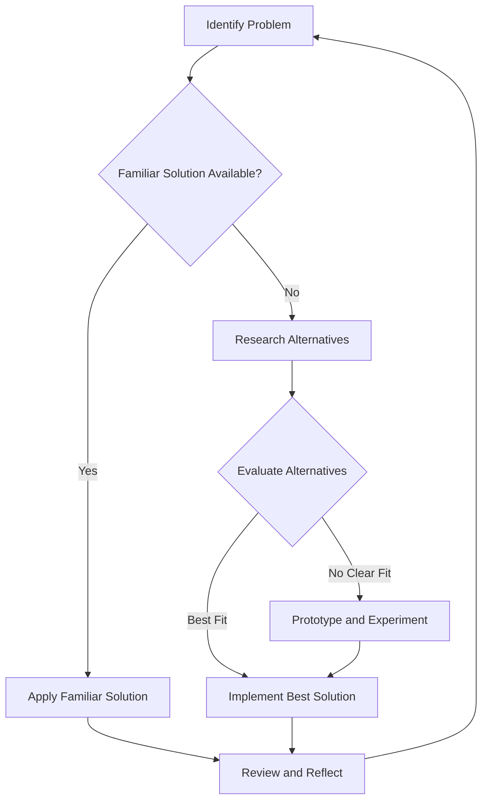

## 12.2.2 Golden Hammer

In the realm of software engineering, the "Golden Hammer" anti-pattern is a common pitfall that developers, including those working with TypeScript, often encounter. This section delves into the concept of the Golden Hammer, its implications in TypeScript development, and strategies to avoid falling into this trap.

### Understanding the Golden Hammer Anti-Pattern

The term "Golden Hammer" originates from the adage, "If all you have is a hammer, everything looks like a nail." This metaphor highlights the tendency of individuals to rely on a familiar tool or solution for every problem they encounter, regardless of its suitability. In software development, this translates to the over-reliance on a particular technology, tool, or design pattern, often due to familiarity or past success.

#### The Concept and Origin

The Golden Hammer is not just about using a tool excessively; it’s about the mindset that a single tool can solve all problems. This mindset can stem from:

- **Comfort and Familiarity**: Developers often gravitate towards solutions they are comfortable with, especially under time constraints.
- **Past Successes**: A tool or pattern that has worked well in the past may be perceived as universally applicable.
- **Lack of Awareness**: Sometimes, developers are not aware of alternative solutions that might be more suitable.

### Implications in TypeScript Development

In the context of TypeScript, the Golden Hammer can manifest in various ways. TypeScript developers might overuse certain patterns, libraries, or frameworks, leading to inefficiencies and increased complexity.

#### Overusing Frameworks and Libraries

A common scenario is the overuse of complex frameworks for simple tasks. For instance, using a full-fledged state management library like Redux for a small application with minimal state can be overkill. While Redux is powerful, its complexity and boilerplate can outweigh its benefits in smaller projects.

```typescript
// Example of overusing Redux for simple state management
import { createStore } from 'redux';

// Initial state
const initialState = { count: 0 };

// Reducer function
function counterReducer(state = initialState, action: any) {
  switch (action.type) {
    case 'INCREMENT':
      return { count: state.count + 1 };
    case 'DECREMENT':
      return { count: state.count - 1 };
    default:
      return state;
  }
}

// Create Redux store
const store = createStore(counterReducer);

// Dispatching actions
store.dispatch({ type: 'INCREMENT' });
console.log(store.getState()); // { count: 1 }
```

In this example, a simple counter could be managed with local component state or a simpler state management solution, avoiding the overhead of Redux.

#### Over-Applying Design Patterns

Design patterns are powerful tools, but they can also be misapplied. For example, using the Singleton pattern excessively can lead to tightly coupled code and difficulties in testing.

```typescript
// Example of overusing Singleton pattern
class Logger {
  private static instance: Logger;

  private constructor() {}

  static getInstance(): Logger {
    if (!Logger.instance) {
      Logger.instance = new Logger();
    }
    return Logger.instance;
  }

  log(message: string) {
    console.log(message);
  }
}

// Usage
const logger1 = Logger.getInstance();
const logger2 = Logger.getInstance();
console.log(logger1 === logger2); // true
```

While singletons ensure a single instance, they can become a bottleneck if overused, especially in scenarios where multiple instances could be beneficial.

### Negative Consequences of the Golden Hammer

The Golden Hammer can lead to several negative consequences, including inefficient solutions, increased complexity, and rigidity.

#### Inefficient Solutions

Using a heavy framework or pattern when a simpler solution would suffice can lead to inefficiencies. This can manifest as:

- **Increased Load Times**: Larger libraries can increase the size of the application bundle, leading to slower load times.
- **Unnecessary Complexity**: Over-engineering a solution can make the codebase harder to understand and maintain.

#### Increased Complexity and Rigidity

Relying on a single tool or pattern can make the codebase rigid, making it difficult to adapt to new requirements or technologies. This rigidity can stifle innovation and slow down development.

#### Risk of Not Exploring Modern Solutions

By sticking to familiar tools, developers might miss out on more modern or efficient solutions. This can lead to a competitive disadvantage, especially in fast-evolving fields like web development.

### Examples of the Golden Hammer in Action

Let's explore some scenarios where the Golden Hammer anti-pattern might manifest in TypeScript development.

#### Scenario 1: Overusing a State Management Library

Imagine a developer building a small to-do list application. They decide to use Redux for state management, even though the application only needs to manage a few pieces of state.

```typescript
// Simple state management without Redux
class TodoList {
  private todos: string[] = [];

  add(todo: string) {
    this.todos.push(todo);
  }

  remove(index: number) {
    this.todos.splice(index, 1);
  }

  getTodos() {
    return this.todos;
  }
}

const myTodoList = new TodoList();
myTodoList.add('Learn TypeScript');
console.log(myTodoList.getTodos()); // ['Learn TypeScript']
```

In this case, using a simple class to manage state is more efficient and easier to maintain.

#### Scenario 2: Over-Applying a Design Pattern

Consider a developer who uses the Observer pattern for every event-driven interaction, even when a simple callback function would suffice.

```typescript
// Using a simple callback instead of Observer pattern
function fetchData(callback: (data: string) => void) {
  setTimeout(() => {
    callback('Data fetched');
  }, 1000);
}

fetchData((data) => {
  console.log(data); // 'Data fetched'
});
```

While the Observer pattern is powerful, it can add unnecessary complexity when a straightforward callback would do the job.

### Strategies to Avoid the Golden Hammer

Avoiding the Golden Hammer requires a conscious effort to evaluate tools and solutions critically. Here are some strategies to help avoid this anti-pattern.

#### Awareness and Continuous Learning

Staying updated with new technologies and best practices is crucial. This involves:

- **Reading Blogs and Articles**: Follow reputable sources like [MDN Web Docs](https://developer.mozilla.org/) and [TypeScript Handbook](https://www.typescriptlang.org/docs/).
- **Attending Conferences and Meetups**: Engage with the community to learn about new trends and tools.
- **Taking Online Courses**: Platforms like [Coursera](https://www.coursera.org/) and [Udemy](https://www.udemy.com/) offer courses on the latest technologies.

#### Problem-Solving Approach

Before deciding on a solution, thoroughly analyze the problem. Consider:

- **Requirements**: What are the specific needs of the project?
- **Constraints**: Are there any limitations, such as time or budget?
- **Alternatives**: What other solutions are available, and how do they compare?

#### Flexibility

Be open to using different tools or approaches. This involves:

- **Prototyping**: Build small prototypes to test different solutions.
- **Experimentation**: Don’t be afraid to try new tools or patterns, even if they are unfamiliar.

#### Team Collaboration

Discuss solutions with team members to gain different perspectives. This can lead to:

- **Better Decision-Making**: Diverse viewpoints can highlight potential issues or benefits.
- **Shared Knowledge**: Team discussions can help spread knowledge about different tools and patterns.

### Best Practices for Avoiding the Golden Hammer

To avoid the Golden Hammer, consider these best practices:

- **Evaluate Suitability**: Assess the suitability of tools and patterns for each specific project.
- **Prototype and Experiment**: Build prototypes to test different solutions before committing to one.
- **Stay Informed**: Keep up with the latest developments in the TypeScript ecosystem.
- **Seek Feedback**: Regularly seek feedback from peers to ensure the chosen solution is appropriate.

### Visualizing the Golden Hammer

To better understand the Golden Hammer, let's visualize the decision-making process that can lead to this anti-pattern.



**Diagram Description**: This flowchart illustrates the decision-making process that can lead to the Golden Hammer. It highlights the importance of evaluating alternatives and prototyping to avoid defaulting to a familiar solution.

### Try It Yourself

To better understand the Golden Hammer, try modifying the provided code examples. For instance:

- **Simplify the Redux Example**: Try managing the state using local component state or a simpler library.
- **Replace the Observer Pattern**: Use a callback function instead of the Observer pattern in the event-driven example.

Experimenting with these modifications can help you recognize when a simpler solution might be more appropriate.

### Knowledge Check

Before moving on, consider these questions to reinforce your understanding:

- What is the Golden Hammer anti-pattern, and why is it problematic?
- How can overusing a familiar tool or pattern lead to inefficiencies?
- What strategies can help avoid the Golden Hammer in TypeScript development?

### Embrace the Journey

Remember, avoiding the Golden Hammer is a journey of continuous learning and adaptation. As you progress in your TypeScript development, stay curious, keep experimenting, and embrace new tools and patterns. This mindset will help you build more efficient and maintainable applications.

## Quiz Time!



### What is the Golden Hammer anti-pattern?

- [x] Over-reliance on a familiar tool or solution for all problems
- [ ] Using multiple tools for a single problem
- [ ] Avoiding the use of design patterns
- [ ] Relying on outdated technologies

> **Explanation:** The Golden Hammer anti-pattern refers to the tendency to use a familiar tool or solution indiscriminately, regardless of its suitability for the problem at hand.


### Which of the following is a consequence of the Golden Hammer?

- [x] Increased complexity
- [ ] Simplified codebase
- [ ] Enhanced flexibility
- [ ] Reduced load times

> **Explanation:** The Golden Hammer can lead to increased complexity as developers might use overly complex solutions for simple problems.


### How can TypeScript developers avoid the Golden Hammer?

- [x] By evaluating the suitability of tools for each project
- [ ] By using the same tools for all projects
- [ ] By avoiding new technologies
- [ ] By ignoring team feedback

> **Explanation:** Evaluating the suitability of tools and patterns for each specific project helps avoid the Golden Hammer.


### What is a common manifestation of the Golden Hammer in TypeScript?

- [x] Overusing complex frameworks for simple tasks
- [ ] Using TypeScript's type system effectively
- [ ] Implementing design patterns appropriately
- [ ] Writing clean and maintainable code

> **Explanation:** A common manifestation of the Golden Hammer is using complex frameworks or libraries for tasks that could be handled more simply.


### Which strategy helps in avoiding the Golden Hammer?

- [x] Continuous learning and staying updated
- [ ] Relying solely on past experiences
- [ ] Using a single tool for all problems
- [ ] Ignoring alternative solutions

> **Explanation:** Continuous learning and staying updated with new technologies and best practices help in avoiding the Golden Hammer.


### What should developers do before deciding on a solution?

- [x] Analyze the problem thoroughly
- [ ] Choose the most familiar tool
- [ ] Avoid discussing with the team
- [ ] Implement the first solution that comes to mind

> **Explanation:** Analyzing the problem thoroughly before deciding on a solution ensures that the chosen approach is suitable.


### Why is team collaboration important in avoiding the Golden Hammer?

- [x] It provides diverse perspectives
- [ ] It limits creativity
- [ ] It enforces the use of a single tool
- [ ] It discourages experimentation

> **Explanation:** Team collaboration provides diverse perspectives, which can highlight potential issues or benefits of different solutions.


### What is a potential risk of the Golden Hammer?

- [x] Not exploring more appropriate solutions
- [ ] Improved efficiency
- [ ] Enhanced code readability
- [ ] Better performance

> **Explanation:** The Golden Hammer can lead to not exploring more appropriate or modern solutions, which can be a significant risk.


### How can prototyping help in avoiding the Golden Hammer?

- [x] By testing different solutions before committing
- [ ] By enforcing the use of a single tool
- [ ] By avoiding experimentation
- [ ] By limiting creativity

> **Explanation:** Prototyping allows developers to test different solutions before committing to one, helping avoid the Golden Hammer.


### Is the Golden Hammer anti-pattern specific to TypeScript?

- [x] False
- [ ] True

> **Explanation:** The Golden Hammer anti-pattern is not specific to TypeScript; it can occur in any programming language or technology.


