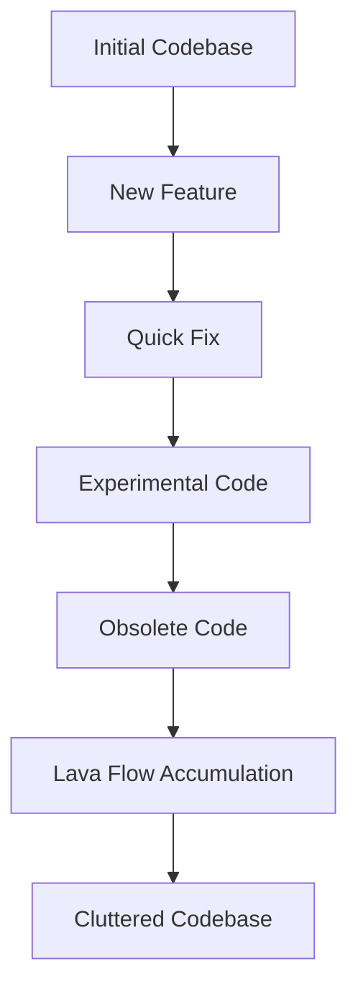

## 12.2.3 Lava Flow

In the world of software development, maintaining a clean and efficient codebase is crucial for long-term success. However, one common anti-pattern that can hinder this goal is known as "Lava Flow." This term metaphorically compares certain types of code to hardened lava—difficult to remove once solidified. In this section, we will delve into the Lava Flow anti-pattern, its consequences, examples in TypeScript, reasons for its occurrence, and strategies to address it effectively.

### Defining the Lava Flow Anti-Pattern

The Lava Flow anti-pattern refers to the accumulation of redundant or obsolete code that remains in the codebase without a clear purpose. This code often originates from previous implementations, experimental features, or quick fixes that were never fully integrated or removed. Just like hardened lava, this code becomes difficult to remove, as developers fear that it might still be in use or necessary for the system's functionality.

#### Characteristics of Lava Flow Code

- **Redundant Implementations**: Code that duplicates functionality already present elsewhere in the system.
- **Obsolete Features**: Features that were once necessary but are no longer relevant due to changes in requirements or architecture.
- **Experimental Code**: Code that was added for testing or prototyping purposes but never fully integrated or removed.
- **Quick Fixes**: Temporary solutions that were never revisited or properly refactored.

### Consequences of Lava Flow

The presence of Lava Flow code in a codebase can lead to several negative consequences:

1. **Cluttered Codebase**: Lava Flow code adds unnecessary complexity, making the codebase harder to navigate and understand.
2. **Increased Maintenance Effort**: Developers spend more time deciphering and maintaining code that may not even be in use.
3. **Potential for Bugs**: Obsolete or redundant code can introduce unexpected behavior, leading to bugs that are difficult to trace.
4. **Confusion and Miscommunication**: Team members may be unsure about the purpose of certain code segments, leading to confusion and miscommunication.
5. **Hindered Refactoring**: The presence of Lava Flow code can make refactoring efforts more challenging, as developers must carefully consider the impact of removing or modifying such code.

### Examples in TypeScript

Let's explore some examples of Lava Flow code in TypeScript projects, including dead code, unused variables, and outdated modules.

#### Example 1: Dead Code

```typescript
// Function that is no longer used in the application
function oldFunction() {
  console.log("This is an old function that is no longer called.");
}

// New implementation
function newFunction() {
  console.log("This is the new implementation.");
}

newFunction();
```

In this example, `oldFunction` is a piece of dead code that remains in the codebase despite being unused. It serves no purpose and should be removed to reduce clutter.

#### Example 2: Unused Variables

```typescript
const unusedVariable = "I am not used anywhere in the code.";

function processData(data: string) {
  console.log(`Processing data: ${data}`);
}

processData("Sample data");
```

Here, `unusedVariable` is declared but never used. Such variables can accumulate over time, leading to confusion and unnecessary memory usage.

#### Example 3: Outdated Modules

```typescript
// Old module that has been replaced by a new implementation
import { oldModuleFunction } from './oldModule';

// New module
import { newModuleFunction } from './newModule';

newModuleFunction();
```

The `oldModule` is imported but not used, indicating that it may be an outdated module that should be removed from the project.

### Reasons for Occurrence

Understanding why Lava Flow code occurs is essential for addressing it effectively. Here are some common reasons:

1. **Lack of Proper Documentation**: Without clear documentation, developers may be hesitant to remove code for fear of breaking functionality.
2. **Inadequate Version Control Practices**: Poor version control practices can lead to uncertainty about whether old code is safe to remove.
3. **Fear of Deleting Code**: Developers may be reluctant to delete code that might be needed in the future, leading to a "just in case" mentality.
4. **Time Constraints**: Under tight deadlines, developers may implement quick fixes rather than proper solutions, leaving behind temporary code.
5. **Lack of Ownership**: When no one feels responsible for maintaining a particular piece of code, it can become neglected and turn into Lava Flow.

### Strategies to Address Lava Flow

To mitigate the impact of Lava Flow, consider implementing the following strategies:

#### Code Reviews

- **Thorough Code Reviews**: Conduct regular code reviews to identify and discuss obsolete or redundant code. Encourage team members to question the necessity of each code segment.
- **Pair Programming**: Pair programming can help catch Lava Flow code early, as two sets of eyes are more likely to spot unnecessary code.

#### Refactoring

- **Regular Refactoring Sessions**: Schedule regular refactoring sessions focused on cleaning up the codebase. Use these sessions to remove dead code, consolidate redundant implementations, and update outdated modules.
- **Incremental Refactoring**: Break down refactoring tasks into smaller, manageable chunks to avoid overwhelming the team and ensure steady progress.

#### Documentation

- **Maintain Up-to-Date Documentation**: Keep documentation current to track code usage and dependencies. This helps developers understand the purpose of each code segment and make informed decisions about its removal.
- **Document Code Changes**: Document any changes made during refactoring sessions to provide context for future developers.

#### Version Control Systems

- **Effective Use of Version Control**: Use version control systems like Git to track changes and maintain a history of the codebase. This allows developers to safely remove old code, knowing it can be retrieved if needed.
- **Branching and Merging**: Use branching and merging strategies to isolate experimental code and prevent it from polluting the main codebase.

### Best Practices

In addition to the strategies mentioned above, consider adopting the following best practices to prevent Lava Flow:

- **Automated Tools and Linters**: Implement automated tools and linters that can detect unused code, variables, and imports. These tools can provide valuable insights into areas of the codebase that require attention.
- **Coding Standards**: Establish coding standards that discourage leaving dead code in the codebase. Encourage developers to remove unused code during regular development activities.
- **Promote a Culture of Clean Code**: Foster a culture where deleting unnecessary code is valued and encouraged. Recognize and reward efforts to maintain a clean and efficient codebase.

### Visualizing Lava Flow

To better understand the concept of Lava Flow, let's visualize how it can accumulate in a codebase over time.



**Figure 1: Visualization of Lava Flow Accumulation**

This flowchart illustrates how various types of code—such as new features, quick fixes, experimental code, and obsolete code—can contribute to Lava Flow accumulation, ultimately leading to a cluttered codebase.

### Try It Yourself

To better understand how Lava Flow can impact a TypeScript project, try the following exercises:

1. **Identify Dead Code**: Review a TypeScript project you're working on and identify any dead code, unused variables, or outdated modules. Document your findings and consider removing or refactoring them.

2. **Conduct a Code Review**: Pair up with a colleague and conduct a code review focused on identifying Lava Flow code. Discuss the purpose of each code segment and determine whether it should be retained or removed.

3. **Implement Automated Tools**: Set up automated tools or linters in your TypeScript project to detect unused code and variables. Experiment with different configurations to see how they can help maintain a clean codebase.

### Knowledge Check

Before we wrap up, let's reinforce what we've learned about the Lava Flow anti-pattern:

- **What is Lava Flow?**: It's the accumulation of redundant or obsolete code that remains in the codebase without a clear purpose.
- **Why is it problematic?**: It clutters the codebase, increases maintenance effort, and can introduce bugs.
- **How can we address it?**: Through code reviews, regular refactoring, maintaining documentation, and using version control effectively.

### Embrace the Journey

Remember, maintaining a clean codebase is an ongoing journey. As you progress in your software development career, you'll encounter various challenges, including Lava Flow. By implementing the strategies and best practices discussed in this section, you can mitigate its impact and contribute to a more efficient and maintainable codebase. Keep experimenting, stay curious, and enjoy the journey!

## Quiz Time!



### What is the Lava Flow anti-pattern?

- [x] Accumulation of redundant or obsolete code in the codebase.
- [ ] A pattern for optimizing code performance.
- [ ] A method for managing code dependencies.
- [ ] A strategy for improving code readability.

> **Explanation:** The Lava Flow anti-pattern refers to the accumulation of redundant or obsolete code that remains in the codebase without a clear purpose.

### What is a common consequence of Lava Flow code?

- [x] Increased maintenance effort.
- [ ] Improved code readability.
- [ ] Enhanced performance.
- [ ] Reduced code complexity.

> **Explanation:** Lava Flow code increases maintenance effort as developers spend more time deciphering and maintaining code that may not be in use.

### Which of the following is an example of Lava Flow code?

- [x] Unused variables.
- [ ] Well-documented functions.
- [ ] Efficient algorithms.
- [ ] Optimized data structures.

> **Explanation:** Unused variables are an example of Lava Flow code, as they add unnecessary clutter to the codebase.

### What is a strategy to address Lava Flow?

- [x] Conducting regular code reviews.
- [ ] Ignoring unused code.
- [ ] Adding more features.
- [ ] Increasing code complexity.

> **Explanation:** Conducting regular code reviews helps identify and discuss obsolete or redundant code, addressing Lava Flow.

### Why might developers hesitate to remove Lava Flow code?

- [x] Fear of deleting code that might be needed.
- [ ] Confidence in code documentation.
- [x] Lack of proper documentation.
- [ ] Clear understanding of code dependencies.

> **Explanation:** Developers may hesitate to remove Lava Flow code due to fear of deleting code that might be needed and lack of proper documentation.

### How can version control help address Lava Flow?

- [x] By tracking changes and maintaining a history of the codebase.
- [ ] By increasing code complexity.
- [ ] By ignoring unused code.
- [ ] By adding more features.

> **Explanation:** Version control helps track changes and maintain a history of the codebase, allowing developers to safely remove old code.

### What is a best practice to prevent Lava Flow?

- [x] Implementing automated tools and linters.
- [ ] Ignoring unused code.
- [x] Establishing coding standards.
- [ ] Adding more features.

> **Explanation:** Implementing automated tools and linters and establishing coding standards help prevent Lava Flow by detecting unused code and discouraging dead code.

### What does the flowchart in Figure 1 illustrate?

- [x] How various types of code contribute to Lava Flow accumulation.
- [ ] The process of optimizing code performance.
- [ ] The steps for improving code readability.
- [ ] The method for managing code dependencies.

> **Explanation:** The flowchart in Figure 1 illustrates how various types of code contribute to Lava Flow accumulation, leading to a cluttered codebase.

### What is a common reason for the occurrence of Lava Flow?

- [x] Time constraints leading to quick fixes.
- [ ] Efficient code documentation.
- [ ] Clear understanding of code dependencies.
- [ ] Well-organized codebase.

> **Explanation:** Time constraints leading to quick fixes are a common reason for the occurrence of Lava Flow, as temporary solutions are often left behind.

### True or False: Lava Flow code can introduce unexpected behavior and lead to bugs.

- [x] True
- [ ] False

> **Explanation:** True. Lava Flow code can introduce unexpected behavior and lead to bugs, as obsolete or redundant code may cause conflicts or errors.


