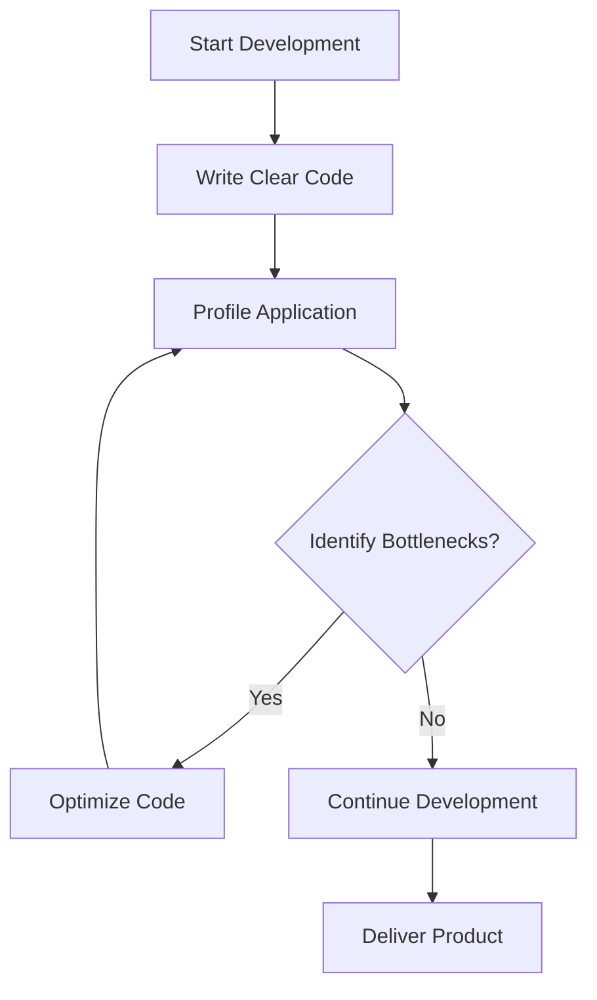

## 12.2.5 Premature Optimization

In the realm of software engineering, the pursuit of performance can sometimes lead us astray. Premature optimization, a term famously highlighted by Donald Knuth, is often cited as a significant pitfall in software development. In this section, we will explore the concept of premature optimization, its origins, the problems it causes, and how to effectively manage optimization efforts in TypeScript development.

### Defining Premature Optimization

Premature optimization refers to the practice of trying to improve the performance of a program before it is necessary. The phrase "Premature optimization is the root of all evil" was popularized by Donald Knuth, a renowned computer scientist, in his 1974 paper "Structured Programming with go to Statements." This quote underscores the idea that focusing on optimization too early in the development process can lead to more harm than good, often at the expense of code clarity and maintainability.

The essence of premature optimization lies in attempting to solve performance issues that may not exist or are not critical at the current stage of development. This can result in complex, unreadable code that is difficult to maintain and extend.

### Problems Caused by Premature Optimization

#### Complex and Unreadable Code

One of the primary issues with premature optimization is that it often leads to complex and convoluted code. Developers may introduce intricate algorithms or data structures in an attempt to squeeze out minor performance gains. This complexity can make the codebase harder to understand, maintain, and debug.

#### Solving Non-Existent Performance Problems

Premature optimization often addresses performance issues that are not actual bottlenecks. Developers may spend significant time optimizing parts of the code that do not impact the overall performance of the application. This misallocation of resources can detract from more critical development tasks.

#### Opportunity Cost

The time and effort spent on premature optimization could be better utilized in other areas, such as adding new features, improving user experience, or fixing bugs. By focusing on optimization too early, developers may miss opportunities to deliver more value to users.

### Examples of Premature Optimization in TypeScript

Let's explore some scenarios where premature optimization might manifest in TypeScript development.

#### Overcomplicating Code for Minor Gains

Consider a scenario where a developer attempts to optimize a loop by using a less readable but slightly faster algorithm:

```typescript
// Original, clear code
const numbers = [1, 2, 3, 4, 5];
let sum = 0;
for (const number of numbers) {
  sum += number;
}

// Prematurely optimized, less readable code
let sumOptimized = 0;
let i = numbers.length;
while (i--) {
  sumOptimized += numbers[i];
}
```

In this example, the original code is clear and easy to understand. The optimized version may be slightly faster in certain contexts, but it sacrifices readability for negligible performance gains.

#### Avoiding Language Features Due to Perceived Overhead

TypeScript offers various language features that enhance code readability and maintainability, such as classes and interfaces. However, some developers might avoid these features due to perceived performance overhead:

```typescript
// Using TypeScript class
class Rectangle {
  constructor(public width: number, public height: number) {}

  area(): number {
    return this.width * this.height;
  }
}

// Avoiding classes for perceived performance
function createRectangle(width: number, height: number) {
  return {
    width,
    height,
    area: function() {
      return width * height;
    }
  };
}
```

While the function-based approach may seem more performant, the class-based approach provides better structure and scalability, which is crucial for larger applications.

### When Optimization is Necessary

Optimization should be driven by data and real-world performance needs. Here are some guidelines for determining when optimization is necessary:

#### Profiling and Identifying Real Bottlenecks

Before embarking on optimization efforts, use profiling tools to identify actual performance bottlenecks in your application. Profiling provides insights into which parts of the code are consuming the most resources, allowing you to focus your efforts where they will have the most impact.

#### Data-Driven Optimization

Optimization should be based on empirical data rather than assumptions. Gather performance metrics and analyze them to understand where improvements are needed. This approach ensures that your optimization efforts are targeted and effective.

### Strategies to Avoid Premature Optimization

#### Write Clear Code First

Prioritize writing clear, maintainable code that is functionally correct. Focus on delivering a working solution before considering optimization. Clear code is easier to profile and optimize later if necessary.

#### Use Profiling Tools

Leverage profiling tools to analyze the performance of your TypeScript applications. Tools like Chrome DevTools, Node.js Profiler, and WebPageTest can help you identify performance bottlenecks and guide your optimization efforts.

#### Performance Budgeting

Establish performance budgets to set acceptable thresholds for various performance metrics, such as load time, memory usage, and CPU utilization. These budgets can guide your optimization efforts and help you prioritize areas that need improvement.

#### Iterative Development

Adopt an iterative development approach, focusing on optimization during later stages of development after functionality is solid. This approach allows you to gather real-world performance data and make informed optimization decisions.

### Best Practices for Balancing Performance and Code Quality

#### Balance Performance and Code Quality

Strive for a balance between performance and code quality. While performance is important, it should not come at the expense of maintainability and readability. Consider the long-term impact of your optimization efforts on the codebase.

#### Encourage Team Discussions

Before undertaking significant optimization efforts, engage in team discussions to evaluate the necessity and potential impact of the optimization. Collaborative decision-making can help ensure that optimization efforts are aligned with project goals.

### Code Examples and Try It Yourself

Let's explore a practical example of premature optimization and how to avoid it.

#### Example: Premature Optimization in a Sorting Function

Consider a scenario where a developer attempts to optimize a sorting function by implementing a custom algorithm:

```typescript
// Clear and maintainable code using built-in sort
const numbers = [5, 3, 8, 1, 2];
numbers.sort((a, b) => a - b);

// Prematurely optimized custom sort
function customSort(arr: number[]): number[] {
  // Custom sorting logic
  return arr; // Placeholder for custom logic
}
const sortedNumbers = customSort(numbers);
```

In this example, the built-in `sort` function is clear and efficient for most use cases. Implementing a custom sorting algorithm without profiling data to justify the need can lead to unnecessary complexity.

#### Try It Yourself

Experiment with the code examples by modifying the sorting logic or loop structures. Use profiling tools to measure the impact of your changes on performance. This hands-on approach will help you understand the trade-offs between optimization and code clarity.

### Visualizing the Impact of Premature Optimization

To better understand the impact of premature optimization, let's visualize the process of identifying and addressing performance bottlenecks.



**Diagram Description:** This flowchart illustrates the recommended process for handling optimization in software development. Start by writing clear code, then profile the application to identify bottlenecks. If bottlenecks are found, optimize the code and re-profile. If not, continue development and deliver the product.

### References and Further Reading

- [MDN Web Docs: Performance](https://developer.mozilla.org/en-US/docs/Web/Performance)
- [Chrome DevTools: Performance Analysis](https://developer.chrome.com/docs/devtools/evaluate-performance/)
- [Node.js Profiling Guide](https://nodejs.org/en/docs/guides/simple-profiling/)

### Knowledge Check

To reinforce your understanding of premature optimization, consider the following questions and challenges:

- What is premature optimization, and why is it considered a problem in software development?
- How can profiling tools help identify real performance bottlenecks?
- Why is it important to balance performance and code quality?
- Experiment with the provided code examples and measure the impact of different optimization strategies.

### Embrace the Journey

Remember, premature optimization is a common pitfall, but with the right strategies and mindset, you can avoid it. Focus on writing clear, maintainable code and use data-driven approaches to guide your optimization efforts. As you progress in your TypeScript development journey, you'll gain the skills to balance performance and code quality effectively. Keep experimenting, stay curious, and enjoy the journey!

## Quiz Time!



### What is premature optimization?

- [x] Attempting to optimize code before identifying actual performance bottlenecks.
- [ ] Optimizing code after profiling and identifying bottlenecks.
- [ ] Writing clear and maintainable code.
- [ ] Using built-in functions for performance.

> **Explanation:** Premature optimization refers to the practice of optimizing code before it's necessary, often without identifying real performance issues.

### Why is premature optimization considered a problem?

- [x] It can lead to complex, unreadable code.
- [ ] It always improves performance.
- [ ] It simplifies code maintenance.
- [ ] It is necessary for all projects.

> **Explanation:** Premature optimization can result in complex code that is difficult to maintain and may not address actual performance issues.

### Which tool can help identify performance bottlenecks in TypeScript applications?

- [x] Chrome DevTools
- [ ] TypeScript Compiler
- [ ] Visual Studio Code
- [ ] Git

> **Explanation:** Chrome DevTools is a powerful tool for profiling and identifying performance bottlenecks in web applications.

### What should drive optimization efforts?

- [x] Data and empirical analysis
- [ ] Assumptions about performance
- [ ] Code complexity
- [ ] Developer preferences

> **Explanation:** Optimization should be driven by data and empirical analysis to ensure efforts are targeted and effective.

### What is a recommended approach to avoid premature optimization?

- [x] Write clear code first and optimize later.
- [ ] Optimize code before writing it.
- [ ] Avoid using any built-in functions.
- [ ] Focus only on optimization.

> **Explanation:** Writing clear, maintainable code first and optimizing later based on profiling data is a recommended approach.

### What is performance budgeting?

- [x] Setting acceptable thresholds for performance metrics.
- [ ] Spending all resources on optimization.
- [ ] Ignoring performance issues.
- [ ] Using only custom algorithms.

> **Explanation:** Performance budgeting involves setting acceptable thresholds for performance metrics to guide optimization efforts.

### How can team discussions help in optimization efforts?

- [x] By evaluating the necessity and impact of optimization.
- [ ] By avoiding any optimization discussions.
- [ ] By focusing only on individual preferences.
- [ ] By ignoring performance metrics.

> **Explanation:** Team discussions can help evaluate the necessity and potential impact of optimization efforts, ensuring alignment with project goals.

### What is the primary focus during the initial stages of development?

- [x] Writing clear and maintainable code.
- [ ] Optimizing every line of code.
- [ ] Avoiding any built-in functions.
- [ ] Using complex algorithms.

> **Explanation:** The primary focus during the initial stages of development should be on writing clear and maintainable code.

### What is the benefit of using TypeScript classes and interfaces?

- [x] They provide better structure and scalability.
- [ ] They always improve performance.
- [ ] They are unnecessary for small projects.
- [ ] They make code less readable.

> **Explanation:** TypeScript classes and interfaces provide better structure and scalability, which is crucial for larger applications.

### True or False: Premature optimization is always necessary for successful software development.

- [ ] True
- [x] False

> **Explanation:** Premature optimization is not always necessary and can lead to complex, unreadable code without addressing real performance issues.


