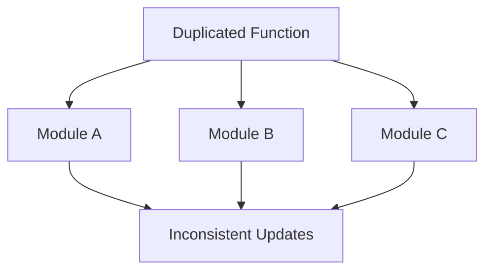

## 12.2.6 Copy-Paste Programming

In the fast-paced world of software development, the temptation to quickly implement solutions can often lead developers down the path of copy-paste programming. While it might seem like an efficient shortcut, this practice can introduce significant challenges in the long run. In this section, we'll delve into the intricacies of copy-paste programming, its consequences, and strategies to avoid it in TypeScript.

### Understanding Copy-Paste Programming

**Copy-paste programming** refers to the practice of duplicating code across different parts of a codebase instead of creating reusable components. This approach is often tempting for developers who are under tight deadlines or looking for quick fixes. By copying existing code, developers can rapidly implement functionality without having to write new code from scratch. However, this can lead to several issues:

- **Code Duplication**: Copying code leads to multiple instances of the same logic scattered across the codebase. This redundancy can make the codebase larger and more difficult to manage.
- **Inconsistencies**: When changes are made to one instance of duplicated code, other instances may be overlooked, leading to inconsistencies and potential bugs.

### Consequences of Copy-Paste Programming

The practice of copy-paste programming can have several negative consequences:

#### Increased Maintenance Burden

When code is duplicated, any change or bug fix must be applied to every instance of the duplicated code. This increases the maintenance burden significantly, as developers must track down and update each instance. Over time, this can lead to a bloated codebase that is difficult to manage.

#### Bug Introduction

Duplicated code can lead to bugs due to inconsistent updates. If a bug is fixed in one instance of the code but not in others, it can lead to unpredictable behavior across the application. This inconsistency can be particularly problematic in large codebases where tracking all instances of duplicated code is challenging.

#### Negative Impact on Code Size and Readability

Copy-paste programming can lead to a larger codebase, making it more difficult to navigate and understand. This can hinder readability and make it challenging for new developers to get up to speed with the codebase. Additionally, a larger codebase can slow down development processes, as developers spend more time searching for the right pieces of code to modify.

### Examples in TypeScript

Let's look at some examples of copy-paste programming in TypeScript to illustrate how it manifests in real-world scenarios.

#### Example 1: Duplicated Functions

Consider a scenario where a developer needs to implement a function to calculate the area of a rectangle. Instead of creating a reusable function, they might copy and paste the logic into different parts of the codebase:

```typescript
// Module A
function calculateRectangleAreaA(width: number, height: number): number {
    return width * height;
}

// Module B
function calculateRectangleAreaB(width: number, height: number): number {
    return width * height;
}
```

In this example, the same logic is duplicated across two modules. If the calculation logic needs to change, both functions must be updated, increasing the risk of inconsistencies.

#### Example 2: Similar Code Blocks Across Components

In a TypeScript-based web application, developers might copy similar code blocks across different components:

```typescript
// Component 1
class UserComponent {
    displayUserInfo(userId: number): void {
        // Fetch user data
        console.log(`Displaying user info for user ID: ${userId}`);
    }
}

// Component 2
class AdminComponent {
    displayUserInfo(userId: number): void {
        // Fetch user data
        console.log(`Displaying user info for user ID: ${userId}`);
    }
}
```

Here, the `displayUserInfo` method is duplicated across two components. This duplication can lead to maintenance challenges if the method's logic needs to be updated.

### Strategies to Avoid Copy-Paste Programming

To mitigate the issues associated with copy-paste programming, developers can adopt several strategies:

#### Abstraction and Reusability

Encourage the creation of reusable functions, classes, or modules. By abstracting common logic into reusable components, developers can reduce code duplication and improve maintainability.

**Example: Refactoring Duplicated Functions**

```typescript
// Utility Module
function calculateRectangleArea(width: number, height: number): number {
    return width * height;
}

// Module A
import { calculateRectangleArea } from './utilityModule';
const areaA = calculateRectangleArea(5, 10);

// Module B
import { calculateRectangleArea } from './utilityModule';
const areaB = calculateRectangleArea(7, 8);
```

By moving the `calculateRectangleArea` function to a utility module, we create a single source of truth that can be reused across different modules.

#### DRY Principle (Don't Repeat Yourself)

The **DRY principle** is a fundamental concept in software development that emphasizes avoiding code duplication. By adhering to this principle, developers can create more maintainable and scalable codebases.

**Example: Applying the DRY Principle**

```typescript
// Base Component
class BaseComponent {
    displayUserInfo(userId: number): void {
        console.log(`Displaying user info for user ID: ${userId}`);
    }
}

// User Component
class UserComponent extends BaseComponent {}

// Admin Component
class AdminComponent extends BaseComponent {}
```

In this example, the `displayUserInfo` method is moved to a base component, which is then extended by both `UserComponent` and `AdminComponent`. This approach eliminates code duplication and adheres to the DRY principle.

#### Refactoring Tools

Introduce tools that can help identify duplicated code. Tools like SonarQube and ESLint can analyze codebases to detect instances of code duplication and suggest refactoring opportunities.

#### Use of Generics and Parameterization

TypeScript's generics can be leveraged to create flexible and reusable components. By parameterizing types, developers can create functions and classes that work with various data types, reducing the need for code duplication.

**Example: Using Generics for Reusability**

```typescript
function logInfo<T>(info: T): void {
    console.log(`Information: ${info}`);
}

// Usage
logInfo<number>(123);
logInfo<string>('Hello, world!');
```

In this example, the `logInfo` function uses generics to accept any data type, making it reusable across different contexts.

### Refactoring Examples

Let's explore examples where duplicated code is refactored into a single, reusable component.

#### Refactoring Duplicated Logic

Consider the following duplicated logic for fetching user data:

```typescript
// Component A
function fetchUserDataA(userId: number): Promise<User> {
    return fetch(`/api/users/${userId}`).then(response => response.json());
}

// Component B
function fetchUserDataB(userId: number): Promise<User> {
    return fetch(`/api/users/${userId}`).then(response => response.json());
}
```

To refactor this code, we can create a utility function:

```typescript
// Utility Module
function fetchUserData(userId: number): Promise<User> {
    return fetch(`/api/users/${userId}`).then(response => response.json());
}

// Component A
import { fetchUserData } from './utilityModule';
fetchUserData(1).then(user => console.log(user));

// Component B
import { fetchUserData } from './utilityModule';
fetchUserData(2).then(user => console.log(user));
```

By extracting the logic into a utility function, we eliminate duplication and improve maintainability.

### Best Practices

To prevent copy-paste programming, developers should adopt the following best practices:

#### Code Reviews

Promote code reviews to catch instances of copy-paste programming. Code reviews provide an opportunity for team members to identify duplicated code and suggest refactoring opportunities.

#### Documentation and Sharing

Encourage documentation and sharing of existing utilities within the team. By maintaining a well-documented library of reusable components, developers can avoid unnecessary duplication.

#### Continuous Learning

Stay informed about best practices and new tools that can help identify and eliminate code duplication. Continuous learning ensures that developers are equipped with the knowledge and skills to write efficient and maintainable code.

### Visualizing Code Duplication

To better understand the impact of copy-paste programming, let's visualize how code duplication can spread across a codebase.



In this diagram, a duplicated function is spread across multiple modules, leading to inconsistent updates and maintenance challenges.

### Try It Yourself

To reinforce your understanding of avoiding copy-paste programming, try refactoring the following duplicated code:

```typescript
// Task 1
function calculateCircleAreaA(radius: number): number {
    return Math.PI * radius * radius;
}

function calculateCircleAreaB(radius: number): number {
    return Math.PI * radius * radius;
}

// Task 2
class ProductComponent {
    displayProductInfo(productId: number): void {
        console.log(`Displaying product info for product ID: ${productId}`);
    }
}

class OrderComponent {
    displayProductInfo(productId: number): void {
        console.log(`Displaying product info for product ID: ${productId}`);
    }
}
```

Refactor the code to eliminate duplication and create reusable components.

### Knowledge Check

- What are the consequences of copy-paste programming?
- How can the DRY principle help prevent code duplication?
- What tools can be used to identify duplicated code?
- How can TypeScript generics be used to create reusable components?

### Embrace the Journey

Remember, avoiding copy-paste programming is a journey towards writing cleaner, more maintainable code. By embracing best practices and continuously learning, you'll be better equipped to tackle complex software development challenges. Keep experimenting, stay curious, and enjoy the journey!

## Quiz Time!



### What is copy-paste programming?

- [x] Duplicating code instead of creating reusable components
- [ ] Writing new code from scratch
- [ ] Using third-party libraries
- [ ] Refactoring code for optimization

> **Explanation:** Copy-paste programming involves duplicating code across a codebase, leading to redundancy and maintenance challenges.


### Which principle emphasizes avoiding code duplication?

- [x] DRY (Don't Repeat Yourself)
- [ ] KISS (Keep It Simple, Stupid)
- [ ] YAGNI (You Aren't Gonna Need It)
- [ ] SOLID

> **Explanation:** The DRY principle focuses on reducing code duplication by promoting the use of reusable components.


### What is a consequence of copy-paste programming?

- [x] Increased maintenance burden
- [ ] Improved code readability
- [ ] Reduced code size
- [ ] Enhanced performance

> **Explanation:** Copy-paste programming increases the maintenance burden as changes must be applied to all instances of duplicated code.


### How can TypeScript generics help in avoiding copy-paste programming?

- [x] By creating flexible and reusable components
- [ ] By increasing code duplication
- [ ] By reducing code readability
- [ ] By complicating code logic

> **Explanation:** TypeScript generics allow developers to create components that work with various data types, reducing the need for code duplication.


### What tool can help identify duplicated code?

- [x] SonarQube
- [ ] Webpack
- [ ] Babel
- [ ] TypeScript Compiler

> **Explanation:** SonarQube is a tool that can analyze codebases to detect instances of code duplication.


### What is a benefit of adhering to the DRY principle?

- [x] Improved maintainability
- [ ] Increased code duplication
- [ ] Reduced code readability
- [ ] Enhanced performance

> **Explanation:** The DRY principle improves maintainability by reducing code duplication and promoting reusable components.


### What is a strategy to avoid copy-paste programming?

- [x] Abstraction and reusability
- [ ] Copying code across modules
- [ ] Ignoring code reviews
- [ ] Hard coding values

> **Explanation:** Abstraction and reusability involve creating reusable components to avoid code duplication.


### What is a negative impact of copy-paste programming on code size?

- [x] It leads to a larger codebase
- [ ] It reduces code complexity
- [ ] It improves code readability
- [ ] It enhances performance

> **Explanation:** Copy-paste programming results in a larger codebase due to duplicated code, making it harder to manage.


### How can code reviews help in avoiding copy-paste programming?

- [x] By identifying duplicated code and suggesting refactoring
- [ ] By increasing code duplication
- [ ] By reducing code readability
- [ ] By complicating code logic

> **Explanation:** Code reviews provide an opportunity to identify duplicated code and suggest refactoring to improve maintainability.


### True or False: Copy-paste programming can lead to bugs due to inconsistent updates.

- [x] True
- [ ] False

> **Explanation:** Copy-paste programming can lead to bugs if changes are made to one instance of duplicated code but not others, resulting in inconsistencies.


