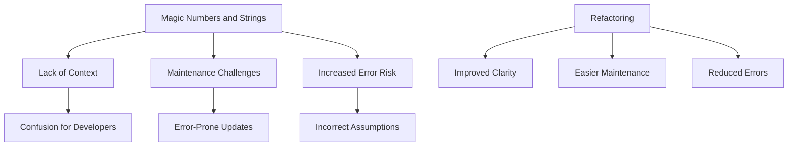

## 12.2.7 Magic Numbers and Strings

In the realm of software development, particularly when working with TypeScript, maintaining clear and understandable code is paramount. One common anti-pattern that can obscure code clarity is the use of magic numbers and strings. These are unexplained numeric or string literals embedded directly in the code, which can hinder understanding and complicate maintenance. In this section, we'll delve into what magic numbers and strings are, why they are problematic, and how to effectively eliminate them from your TypeScript codebase.

### Defining Magic Numbers and Strings

Magic numbers and strings are literal values that appear in code without explanation or context. They are often hard-coded directly into the logic, making it difficult for developers to understand their purpose or significance.

#### What Constitutes a Magic Number or String?

- **Magic Numbers**: These are numeric literals used in code without any descriptive identifiers. For example, using `3.14` directly in a calculation without explaining that it represents the mathematical constant π (pi).
- **Magic Strings**: These are string literals used without context. For instance, using `"admin"` in a role-checking function without clarifying its significance.

#### Why Are They Problematic?

Magic numbers and strings pose several challenges:

1. **Lack of Context**: Without context, it's unclear why a particular value is used, making the code difficult to read and understand.
2. **Maintenance Difficulty**: When a value needs to change, identifying all occurrences of the magic number or string can be error-prone, especially in large codebases.
3. **Increased Risk of Errors**: The lack of descriptive identifiers can lead to incorrect assumptions about the value's purpose, increasing the risk of bugs.

### Problems Associated with Magic Numbers and Strings

#### Readability and Understanding

Magic numbers and strings obscure the intent of the code. Consider the following example:

```typescript
function calculateCircleArea(radius: number): number {
    return 3.14 * radius * radius; // What does 3.14 represent?
}
```

In this snippet, the number `3.14` is a magic number. Without additional context, a developer unfamiliar with the code might not immediately recognize it as an approximation of π.

#### Maintenance Challenges

When values change, magic numbers and strings can lead to maintenance headaches. Suppose the value of π needs to be updated for more precision:

```typescript
function calculateCircleArea(radius: number): number {
    return 3.14159 * radius * radius; // Updated value, but are there other occurrences?
}
```

If `3.14` appears multiple times across the codebase, updating each instance manually is error-prone and time-consuming.

### Examples in TypeScript

Let's explore some examples of magic numbers and strings in TypeScript to illustrate their impact.

#### Simple Example

```typescript
function getDiscountedPrice(price: number): number {
    return price * 0.9; // What does 0.9 represent?
}
```

In this example, `0.9` is a magic number representing a 10% discount. Without context, the significance of `0.9` is unclear.

#### Complex Scenario

Consider a more complex scenario involving user roles:

```typescript
function checkUserRole(user: { role: string }): boolean {
    return user.role === "admin"; // What other roles exist?
}
```

Here, `"admin"` is a magic string. Without documentation or context, it's challenging to know what other roles might be valid or how they should be handled.

### Strategies to Eliminate Magic Numbers/Strings

To improve code clarity and maintainability, it's essential to eliminate magic numbers and strings. Here are some effective strategies:

#### Constants and Enums

Using named constants or enumerations gives meaning to values, making the code more readable and maintainable.

##### Using Constants

```typescript
const PI = 3.14159;

function calculateCircleArea(radius: number): number {
    return PI * radius * radius;
}
```

By defining `PI` as a constant, we provide context and make the code self-explanatory.

##### Using Enums

Enums are particularly useful for managing sets of related constants, such as user roles.

```typescript
enum UserRole {
    Admin = "admin",
    User = "user",
    Guest = "guest"
}

function checkUserRole(user: { role: UserRole }): boolean {
    return user.role === UserRole.Admin;
}
```

Using an enum for user roles clarifies the possible values and their meanings.

#### Configuration Files

For values that might change based on the environment or deployment, consider externalizing them into configuration files or environment variables.

```typescript
// config.ts
export const DISCOUNT_RATE = 0.9;

// main.ts
import { DISCOUNT_RATE } from './config';

function getDiscountedPrice(price: number): number {
    return price * DISCOUNT_RATE;
}
```

This approach separates configuration from logic, making it easier to update values without modifying the code.

#### Inline Comments

When immediate extraction isn't feasible, inline comments can provide temporary clarity.

```typescript
function calculateCircleArea(radius: number): number {
    return 3.14159 * radius * radius; // π (pi) approximation
}
```

While not a long-term solution, comments can help bridge the gap until a more robust refactoring is possible.

### Refactoring Example

Let's walk through a refactoring example to replace magic numbers with well-named constants and highlight the improvements in code clarity and maintainability.

#### Original Code with Magic Numbers

```typescript
function calculateFinalPrice(price: number, tax: number): number {
    return price + (price * 0.2) + tax; // 0.2 is a magic number representing tax rate
}
```

#### Refactored Code

```typescript
const TAX_RATE = 0.2;

function calculateFinalPrice(price: number, tax: number): number {
    return price + (price * TAX_RATE) + tax;
}
```

By introducing `TAX_RATE` as a constant, we clarify the purpose of `0.2` and make future updates easier.

### Best Practices

To prevent the use of magic numbers and strings, consider adopting the following best practices:

1. **Establish Coding Standards**: Create guidelines that prohibit the use of unexplained literals and encourage the use of constants and enums.
2. **Promote Meaningful Names**: Encourage developers to think about the meaning behind every literal used in the code.
3. **Regular Code Reviews**: Incorporate checks for magic numbers and strings in code reviews to catch them early.
4. **Leverage TypeScript Features**: Utilize TypeScript's type system, constants, and enums to enforce clarity and maintainability.

### Visualizing the Impact of Magic Numbers and Strings

To better understand the impact of magic numbers and strings, let's visualize how they can obscure code clarity and how refactoring can improve it.



This diagram illustrates how magic numbers and strings lead to various issues and how refactoring can address them.

### Try It Yourself

To solidify your understanding, try refactoring the following code snippet to eliminate magic numbers and strings:

```typescript
function calculateShippingCost(weight: number): number {
    return weight * 5 + 10; // 5 and 10 are magic numbers
}
```

Consider using constants to represent the cost per unit weight and the base cost.

### Knowledge Check

Before we wrap up, let's pose a few questions to reinforce your understanding:

1. What is a magic number, and why is it problematic?
2. How can enums help eliminate magic strings in TypeScript?
3. Why is it beneficial to externalize configuration values into separate files?

### Embrace the Journey

Remember, eliminating magic numbers and strings is a journey toward more maintainable and understandable code. As you progress, you'll find that adopting these practices not only enhances code quality but also fosters a more collaborative and efficient development environment. Keep experimenting, stay curious, and enjoy the journey!

## Quiz Time!



### What is a magic number in programming?

- [x] A numeric literal used without explanation
- [ ] A number that performs a special function
- [ ] A number that is dynamically generated
- [ ] A number that is used in encryption

> **Explanation:** A magic number is a numeric literal used in code without explanation, making it hard to understand its purpose.

### Why are magic numbers problematic?

- [x] They lack context and make code hard to read
- [ ] They are always incorrect
- [ ] They are too complex to understand
- [ ] They are only used in legacy systems

> **Explanation:** Magic numbers lack context, making code difficult to read and maintain, as their purpose is not clear.

### How can you eliminate magic numbers in TypeScript?

- [x] Use named constants
- [ ] Use more magic numbers
- [ ] Use dynamic typing
- [ ] Use inline comments only

> **Explanation:** Using named constants gives meaning to numeric literals, making the code more readable and maintainable.

### What is a magic string?

- [x] A string literal used without explanation
- [ ] A string that performs a special function
- [ ] A string that is dynamically generated
- [ ] A string used in encryption

> **Explanation:** A magic string is a string literal used in code without explanation, making it hard to understand its purpose.

### How can enums help with magic strings?

- [x] By providing a set of named constants
- [ ] By making strings dynamic
- [x] By clarifying possible values
- [ ] By encrypting strings

> **Explanation:** Enums provide a set of named constants, clarifying the possible values and their meanings, thus eliminating magic strings.

### What is a benefit of using configuration files?

- [x] They separate configuration from logic
- [ ] They make code harder to read
- [ ] They increase the number of magic numbers
- [ ] They make code less maintainable

> **Explanation:** Configuration files separate configuration from logic, making it easier to update values without modifying the code.

### What role do inline comments play in dealing with magic numbers?

- [x] They provide temporary clarity
- [ ] They eliminate the need for constants
- [x] They explain the purpose of literals
- [ ] They make code more complex

> **Explanation:** Inline comments can provide temporary clarity by explaining the purpose of literals until a more robust refactoring is possible.

### Why is it important to establish coding standards regarding magic numbers?

- [x] To prevent unexplained literals
- [ ] To encourage more magic numbers
- [ ] To make code less readable
- [ ] To increase the number of literals

> **Explanation:** Establishing coding standards helps prevent the use of unexplained literals, promoting code clarity and maintainability.

### True or False: Magic numbers and strings can lead to increased risk of errors.

- [x] True
- [ ] False

> **Explanation:** Magic numbers and strings can lead to increased risk of errors due to the lack of context and potential for incorrect assumptions.

### What is a key takeaway from eliminating magic numbers and strings?

- [x] It enhances code clarity and maintainability
- [ ] It makes code more complex
- [ ] It increases the number of literals
- [ ] It is only useful in small projects

> **Explanation:** Eliminating magic numbers and strings enhances code clarity and maintainability, benefiting projects of all sizes.


