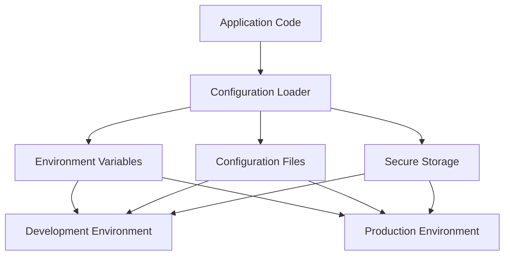

## 12.2.8 Hard Coding

In the realm of software development, hard coding is a common anti-pattern that can significantly impact the flexibility, maintainability, and security of your code. In this section, we will explore what hard coding entails, its negative impacts, and strategies to avoid it, particularly in TypeScript.

### Understanding Hard Coding

Hard coding refers to the practice of embedding fixed values directly into your source code. These values can include configuration data, environment-specific information, or any other constants that might need to change over time or across different environments. Developers often resort to hard coding for convenience or due to time constraints, but this practice can lead to several issues down the line.

#### Why Hard Coding Occurs

1. **Convenience**: Developers might hard code values to quickly test a feature or fix a bug without considering long-term implications.
2. **Lack of Awareness**: Sometimes, developers may not be aware of the best practices for managing configurations and dependencies.
3. **Time Constraints**: Under tight deadlines, developers might choose the quickest solution, which often involves hard coding.
4. **Legacy Code**: Older codebases may have hard-coded values that continue to propagate as new features are added.

### Negative Impacts of Hard Coding

Hard coding can have several detrimental effects on your codebase:

1. **Reduced Reusability**: Hard-coded values make it difficult to reuse code across different environments or projects. For instance, a URL hard-coded for a development server won't work in production without modification.

2. **Increased Maintenance Effort**: Every time a hard-coded value needs to change, developers must manually update the code, increasing the risk of errors and inconsistencies.

3. **Deployment Challenges**: Deploying to new environments becomes cumbersome as each environment may require different configurations.

4. **Security Risks**: Hard coding sensitive information like API keys or database credentials can expose them to unauthorized access, especially if the code is stored in a public repository.

5. **Lack of Flexibility**: Hard-coded values limit the ability to adapt to changes in requirements or environments, leading to brittle systems.

### Examples of Hard Coding in TypeScript

Let's look at some examples of hard coding in TypeScript to understand how it manifests in code.

#### Example 1: Hard-Coded URLs

```typescript
class ApiService {
  private baseUrl: string = "https://dev.example.com/api"; // Hard-coded URL

  fetchData(endpoint: string): Promise<any> {
    return fetch(`${this.baseUrl}/${endpoint}`)
      .then(response => response.json());
  }
}
```

#### Example 2: Hard-Coded API Keys

```typescript
class WeatherService {
  private apiKey: string = "1234567890abcdef"; // Hard-coded API key

  getWeather(city: string): Promise<any> {
    return fetch(`https://api.weather.com/v3/wx/forecast?apiKey=${this.apiKey}&city=${city}`)
      .then(response => response.json());
  }
}
```

#### Example 3: Hard-Coded File Paths

```typescript
class FileManager {
  private filePath: string = "/usr/local/data/config.json"; // Hard-coded file path

  readConfig(): Promise<any> {
    return fetch(this.filePath)
      .then(response => response.json());
  }
}
```

### Strategies to Avoid Hard Coding

To mitigate the issues associated with hard coding, consider the following strategies:

#### Configuration Management

1. **External Configuration Files**: Store configurations in separate files such as JSON or YAML. This allows you to change configurations without modifying the source code.

   ```json
   // config.json
   {
     "baseUrl": "https://dev.example.com/api",
     "apiKey": "1234567890abcdef",
     "filePath": "/usr/local/data/config.json"
   }
   ```

2. **Environment Variables**: Use environment variables to manage configurations that vary between environments (e.g., development, testing, production).

   ```typescript
   class ApiService {
     private baseUrl: string = process.env.BASE_URL || "https://default.example.com/api";

     fetchData(endpoint: string): Promise<any> {
       return fetch(`${this.baseUrl}/${endpoint}`)
         .then(response => response.json());
     }
   }
   ```

#### Dependency Injection

Dependency Injection (DI) allows you to inject configurations into your classes, promoting flexibility and testability.

```typescript
interface Config {
  baseUrl: string;
  apiKey: string;
}

class ApiService {
  constructor(private config: Config) {}

  fetchData(endpoint: string): Promise<any> {
    return fetch(`${this.config.baseUrl}/${endpoint}`)
      .then(response => response.json());
  }
}

// Usage
const config: Config = {
  baseUrl: "https://dev.example.com/api",
  apiKey: "1234567890abcdef"
};

const apiService = new ApiService(config);
```

#### Use of TypeScript Interfaces

Define interfaces to specify the shape of configuration objects, ensuring type safety and clarity.

```typescript
interface Config {
  baseUrl: string;
  apiKey: string;
  filePath: string;
}

const config: Config = {
  baseUrl: "https://dev.example.com/api",
  apiKey: "1234567890abcdef",
  filePath: "/usr/local/data/config.json"
};
```

#### Environment-Specific Configurations

Manage different configurations for various environments using separate configuration files or environment variables.

```typescript
// config.dev.json
{
  "baseUrl": "https://dev.example.com/api",
  "apiKey": "dev-api-key"
}

// config.prod.json
{
  "baseUrl": "https://prod.example.com/api",
  "apiKey": "prod-api-key"
}
```

### Refactoring Example

Let's refactor a hard-coded example into a more flexible and maintainable solution.

#### Before Refactoring

```typescript
class ApiService {
  private baseUrl: string = "https://dev.example.com/api"; // Hard-coded URL

  fetchData(endpoint: string): Promise<any> {
    return fetch(`${this.baseUrl}/${endpoint}`)
      .then(response => response.json());
  }
}
```

#### After Refactoring

```typescript
interface Config {
  baseUrl: string;
}

class ApiService {
  constructor(private config: Config) {}

  fetchData(endpoint: string): Promise<any> {
    return fetch(`${this.config.baseUrl}/${endpoint}`)
      .then(response => response.json());
  }
}

// Usage
const config: Config = {
  baseUrl: process.env.BASE_URL || "https://default.example.com/api"
};

const apiService = new ApiService(config);
```

### Best Practices

1. **Centralized Configuration Management**: Use a centralized system to manage configurations, ensuring consistency and ease of updates.

2. **Secure Storage Solutions**: Keep sensitive data out of the codebase by using secure storage solutions like AWS Secrets Manager or Azure Key Vault.

3. **Version Control for Configurations**: Track configuration changes using version control systems to maintain a history and facilitate rollbacks if needed.

4. **Automated Deployment Pipelines**: Incorporate configuration management into your CI/CD pipelines to automate deployments across different environments.

5. **Documentation**: Document configuration management practices and ensure all team members are aware of how to manage and update configurations.

### Visualizing Configuration Management

Below is a diagram illustrating how configuration management can be organized in a typical application setup.



**Diagram Description**: This diagram shows how an application can load configurations from various sources, including environment variables, configuration files, and secure storage, to adapt to different environments.

### Try It Yourself

To better understand these concepts, try refactoring a piece of your own code where you have hard-coded values. Experiment with moving these values into configuration files or environment variables and see how it improves the flexibility and maintainability of your code.

### Knowledge Check

- What are some common reasons developers might resort to hard coding?
- How can hard coding impact the security of your application?
- What are the benefits of using environment variables for configuration management?
- How does dependency injection help in avoiding hard coding?
- Why is it important to use secure storage solutions for sensitive data?

### Embrace the Journey

Remember, avoiding hard coding is a step towards writing more maintainable and adaptable code. As you continue to develop your skills, you'll find that these practices not only improve your code but also enhance your ability to work effectively in different environments. Keep experimenting, stay curious, and enjoy the journey!

## Quiz Time!



### What is hard coding?

- [x] Embedding fixed values directly into source code
- [ ] Using dynamic values from configuration files
- [ ] Storing values in environment variables
- [ ] Utilizing dependency injection for values

> **Explanation:** Hard coding involves embedding fixed values directly into the source code, which can lead to inflexibility and maintenance challenges.


### Why is hard coding considered an anti-pattern?

- [x] It reduces code reusability and flexibility
- [ ] It makes code easier to read and understand
- [ ] It enhances security by hiding values in code
- [ ] It simplifies deployment across environments

> **Explanation:** Hard coding reduces code reusability and flexibility, making it difficult to adapt to different environments or changes in requirements.


### Which of the following is a strategy to avoid hard coding?

- [x] Using environment variables
- [ ] Embedding values directly in the code
- [ ] Hard coding sensitive information
- [ ] Ignoring configuration management

> **Explanation:** Using environment variables is a strategy to avoid hard coding by externalizing configuration data.


### What is the benefit of using TypeScript interfaces for configuration objects?

- [x] Ensures type safety and clarity
- [ ] Increases the complexity of the code
- [ ] Makes the code less readable
- [ ] Forces hard coding of values

> **Explanation:** TypeScript interfaces ensure type safety and clarity by defining the shape of configuration objects.


### How does dependency injection promote flexibility?

- [x] By allowing configurations to be injected into classes
- [ ] By embedding fixed values in the code
- [ ] By reducing the need for configuration files
- [ ] By hard coding dependencies

> **Explanation:** Dependency injection promotes flexibility by allowing configurations to be injected into classes, making them easier to change and test.


### What is a potential security risk of hard coding?

- [x] Exposing sensitive information in code repositories
- [ ] Enhancing security by hiding values in code
- [ ] Making code easier to read and understand
- [ ] Reducing the need for secure storage solutions

> **Explanation:** Hard coding can expose sensitive information in code repositories, posing a security risk.


### Which of the following is a best practice to avoid hard coding?

- [x] Using centralized configuration management systems
- [ ] Embedding all values directly in the code
- [ ] Ignoring the use of environment variables
- [ ] Storing sensitive data in the codebase

> **Explanation:** Using centralized configuration management systems is a best practice to avoid hard coding and ensure consistency.


### What is the role of secure storage solutions in configuration management?

- [x] Keeping sensitive data out of the codebase
- [ ] Embedding sensitive data directly in the code
- [ ] Ignoring security concerns
- [ ] Making code less flexible

> **Explanation:** Secure storage solutions keep sensitive data out of the codebase, enhancing security.


### How can automated deployment pipelines help in configuration management?

- [x] By automating deployments across different environments
- [ ] By embedding configurations directly in the code
- [ ] By ignoring configuration changes
- [ ] By reducing the need for version control

> **Explanation:** Automated deployment pipelines help in configuration management by automating deployments across different environments.


### True or False: Hard coding values makes it easier to adapt to different environments.

- [ ] True
- [x] False

> **Explanation:** False. Hard coding values makes it difficult to adapt to different environments, as changes require manual code updates.


