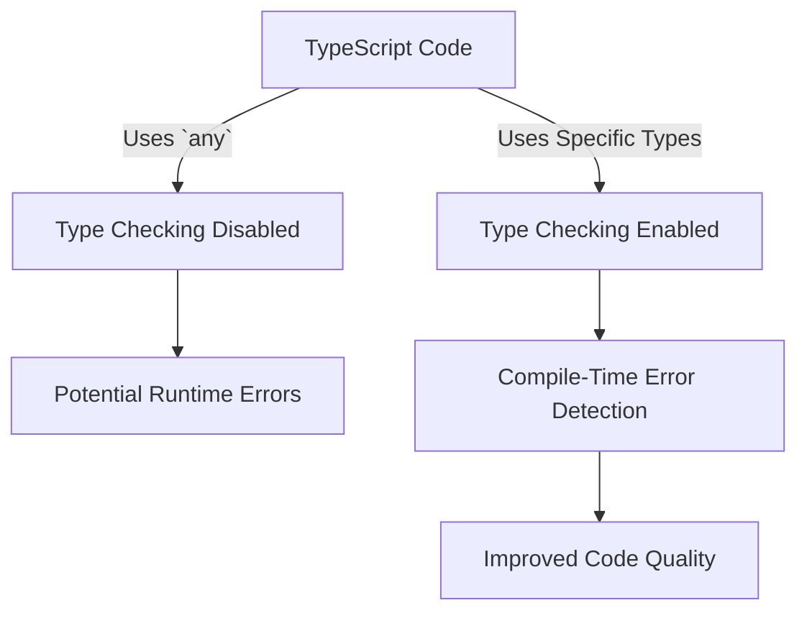

## 12.2.9 Overusing `any` Type

In the world of TypeScript, the `any` type stands as a double-edged sword. While it offers flexibility, it can also undermine the very essence of TypeScript's type safety if overused. In this section, we'll delve into the nature of the `any` type, explore its consequences, and provide strategies to avoid its overuse.

### Understanding the `any` Type

The `any` type in TypeScript is a type that can represent any value. It is the most flexible type, allowing developers to bypass the type checking system. When a variable is declared with the `any` type, TypeScript effectively turns off type checking for that variable, allowing it to hold any value without raising type errors.

#### Intended Use Cases

The `any` type is intended for scenarios where type information is not available or when interfacing with dynamic content. Some legitimate use cases include:

- **Interfacing with JavaScript Libraries**: When using third-party JavaScript libraries that do not have TypeScript type definitions, `any` can be used as a temporary measure.
- **Gradual Migration**: During the migration of a JavaScript codebase to TypeScript, `any` can serve as a placeholder until proper types are defined.
- **Prototype Development**: In the early stages of development, where rapid prototyping is more critical than type safety, `any` can be used to speed up the process.

### Consequences of Overuse

While `any` provides flexibility, overusing it can negate the benefits of TypeScript's static type system. Here are some consequences:

#### Loss of Type Safety

By using `any`, you lose the benefits of TypeScript's static type checking, which is designed to catch errors at compile time. This can lead to:

- **Increased Runtime Errors**: Without type checks, errors that could have been caught during development might only surface at runtime, leading to potentially costly bugs.
- **Reduced Code Maintainability**: Code that heavily relies on `any` becomes harder to understand and maintain, as developers cannot rely on type information to understand what kind of data is being manipulated.

#### Hiding Type-Related Bugs

The use of `any` can mask type-related bugs, making them harder to detect. For example, if a function expects a specific type but receives an incorrect one, `any` will not flag this discrepancy, potentially leading to unexpected behavior.

### Common Scenarios Leading to Overuse

Several scenarios can lead developers to overuse the `any` type:

#### Porting JavaScript Code to TypeScript

When transitioning a JavaScript codebase to TypeScript, developers might use `any` as a quick fix to suppress type errors. This approach can lead to a codebase that superficially uses TypeScript without leveraging its full potential.

#### Suppressing Compiler Errors

Developers might use `any` to quickly bypass compiler errors, especially when deadlines are tight. While this might solve immediate issues, it can introduce long-term problems.

#### Lack of Understanding of TypeScript's Type System

A lack of familiarity with TypeScript's type system can lead developers to default to `any` instead of exploring more appropriate types.

### Examples of Overuse

Let's examine some code snippets where `any` is used unnecessarily and how it can hide type-related bugs.

```typescript
// Example of overusing `any`
function processData(data: any) {
    console.log(data.name); // Assumes data has a 'name' property
}

const userData = { id: 1, username: 'JohnDoe' };
processData(userData); // No error, but 'name' is undefined
```

In this example, the `processData` function assumes that `data` has a `name` property. However, because `data` is typed as `any`, TypeScript does not enforce this assumption, leading to potential runtime errors.

### Strategies to Avoid Overusing `any`

To avoid the pitfalls of overusing `any`, consider the following strategies:

#### Proper Typing

Define accurate types and interfaces to describe the shape of your data. This approach not only improves type safety but also enhances code readability and maintainability.

```typescript
// Using a specific type instead of `any`
interface User {
    id: number;
    name: string;
}

function processUserData(user: User) {
    console.log(user.name); // TypeScript ensures 'name' exists
}

const user: User = { id: 1, name: 'John Doe' };
processUserData(user);
```

#### Leveraging Advanced Types

Utilize TypeScript's advanced types, such as union, intersection, and generics, to handle complex typing scenarios.

```typescript
// Using union types
type StringOrNumber = string | number;

function printValue(value: StringOrNumber) {
    if (typeof value === 'string') {
        console.log(`String value: ${value}`);
    } else {
        console.log(`Number value: ${value}`);
    }
}
```

#### Type Inference

TypeScript's type inference can automatically determine the type of a variable based on its initial value. Leverage this feature to reduce the need for explicit type annotations.

```typescript
// TypeScript infers the type of 'count' as number
let count = 0;
count += 1; // No need for explicit type annotation
```

#### Gradual Typing

Instead of defaulting to `any`, gradually refine types as you gain more understanding of the data structures in your code.

```typescript
// Start with a broad type and refine it over time
let data: unknown = fetchData();

if (typeof data === 'object' && data !== null) {
    const userData = data as User;
    console.log(userData.name);
}
```

#### Linting Tools

Use linters like TSLint or ESLint with TypeScript plugins to detect overuse of `any`. These tools can help enforce coding standards and highlight areas where `any` is used excessively.

### Refactoring Example

Let's refactor a piece of code to replace `any` with specific types or interfaces, demonstrating improved type safety.

**Before Refactoring:**

```typescript
// Using `any` type
function calculateTotal(items: any[]) {
    return items.reduce((total, item) => total + item.price, 0);
}

const cartItems = [{ price: 10 }, { price: 20 }, { price: 30 }];
console.log(calculateTotal(cartItems)); // Works, but lacks type safety
```

**After Refactoring:**

```typescript
// Using a specific interface
interface CartItem {
    price: number;
}

function calculateTotal(items: CartItem[]): number {
    return items.reduce((total, item) => total + item.price, 0);
}

const cartItems: CartItem[] = [{ price: 10 }, { price: 20 }, { price: 30 }];
console.log(calculateTotal(cartItems)); // Type-safe and clear
```

### Best Practices

To fully embrace TypeScript's type system and avoid overusing `any`, consider the following best practices:

- **Embrace TypeScript's Type System**: Make a habit of defining types and interfaces for your data structures.
- **Seek Assistance**: If you're unsure how to type complex structures, seek help from the TypeScript community or consult resources like the [TypeScript Handbook](https://www.typescriptlang.org/docs/handbook/intro.html).
- **Continuous Learning**: Stay updated with new TypeScript features and best practices to improve your code quality.

### Visualizing the Impact of `any` Type

To better understand the impact of overusing the `any` type, let's visualize the flow of type information in a TypeScript program.



**Diagram Description**: This flowchart illustrates how using `any` disables type checking, leading to potential runtime errors, whereas using specific types enables compile-time error detection, resulting in improved code quality.

### Try It Yourself

To solidify your understanding, try modifying the code examples provided in this section. Experiment with replacing `any` with more specific types and observe how TypeScript's type system helps catch errors early.

### Knowledge Check

- **Why is the `any` type considered a double-edged sword in TypeScript?**
- **What are some legitimate use cases for the `any` type?**
- **How can overusing `any` lead to runtime errors?**
- **What are some strategies to avoid overusing `any`?**

### Embrace the Journey

Remember, mastering TypeScript's type system is a journey. As you progress, you'll find that embracing type safety leads to more robust and maintainable code. Keep experimenting, stay curious, and enjoy the journey!

## Quiz Time!



### What is the primary purpose of the `any` type in TypeScript?

- [x] To allow any value to be assigned to a variable, bypassing type checks.
- [ ] To enforce strict type checking on variables.
- [ ] To automatically infer the type of a variable.
- [ ] To convert TypeScript code to JavaScript.

> **Explanation:** The `any` type allows any value to be assigned to a variable, effectively bypassing TypeScript's type checking.

### What is a common consequence of overusing the `any` type?

- [x] Loss of type safety and increased runtime errors.
- [ ] Improved code readability.
- [ ] Enhanced performance of the application.
- [ ] Automatic type inference.

> **Explanation:** Overusing `any` leads to a loss of type safety, which can result in increased runtime errors.

### Which of the following is a legitimate use case for the `any` type?

- [x] Interfacing with third-party JavaScript libraries without type definitions.
- [ ] Suppressing compiler errors permanently.
- [ ] Replacing all types in a TypeScript project.
- [ ] Avoiding the use of interfaces.

> **Explanation:** The `any` type can be used when interfacing with third-party JavaScript libraries that lack type definitions.

### How can developers avoid overusing the `any` type?

- [x] By defining accurate types and interfaces.
- [ ] By using `any` for all variables.
- [ ] By ignoring TypeScript compiler errors.
- [ ] By converting TypeScript code to JavaScript.

> **Explanation:** Defining accurate types and interfaces helps avoid overusing the `any` type.

### What is the benefit of using TypeScript's type inference?

- [x] It reduces the need for explicit type annotations.
- [ ] It disables type checking.
- [ ] It automatically converts JavaScript to TypeScript.
- [ ] It increases the complexity of the code.

> **Explanation:** TypeScript's type inference reduces the need for explicit type annotations, making code cleaner and more maintainable.

### What is the impact of using `any` on code maintainability?

- [x] It reduces code maintainability by hiding type information.
- [ ] It improves code maintainability by simplifying types.
- [ ] It has no impact on code maintainability.
- [ ] It automatically documents the code.

> **Explanation:** Using `any` reduces code maintainability by hiding type information, making it harder to understand the code.

### Which tool can help detect overuse of the `any` type?

- [x] ESLint with TypeScript plugins.
- [ ] A JavaScript minifier.
- [ ] A CSS preprocessor.
- [ ] A database query optimizer.

> **Explanation:** ESLint with TypeScript plugins can help detect overuse of the `any` type and enforce coding standards.

### What is a strategy for gradually refining types in a TypeScript project?

- [x] Gradual typing.
- [ ] Immediate conversion to JavaScript.
- [ ] Replacing all types with `any`.
- [ ] Ignoring type errors.

> **Explanation:** Gradual typing involves refining types over time, improving type safety without defaulting to `any`.

### How does TypeScript's type system help catch errors early?

- [x] By providing compile-time error detection.
- [ ] By executing code faster.
- [ ] By converting TypeScript to JavaScript.
- [ ] By disabling runtime checks.

> **Explanation:** TypeScript's type system provides compile-time error detection, helping catch errors early in the development process.

### True or False: Overusing `any` type can lead to increased runtime errors.

- [x] True
- [ ] False

> **Explanation:** Overusing `any` can lead to increased runtime errors because it bypasses TypeScript's type checking, allowing type-related bugs to go unnoticed.


