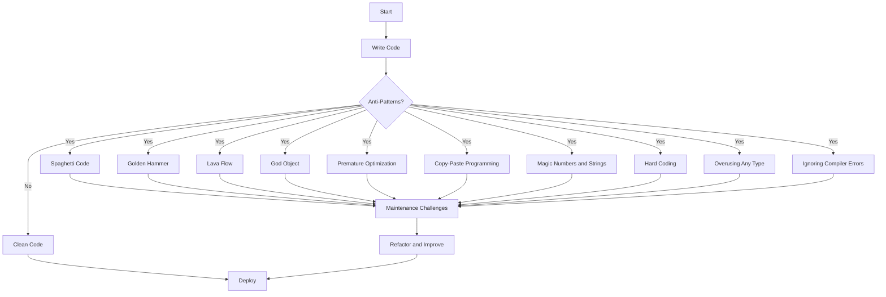

## 12.2 Common Anti-Patterns in TypeScript

In the realm of software development, anti-patterns are like the dark side of design patterns. They are common solutions to recurring problems that, instead of solving the issue, often lead to more complex problems. While some anti-patterns are language-agnostic, others are particularly relevant to TypeScript due to its unique features like static typing, interfaces, and an advanced type system. In this section, we'll explore some prevalent anti-patterns in TypeScript, understand why they are problematic, and learn strategies to avoid them for cleaner, more efficient code.

### Introduction to TypeScript Anti-Patterns

TypeScript, with its robust type system and advanced features, offers a powerful toolset for building scalable and maintainable applications. However, these features can also lead to specific anti-patterns if not used correctly. Understanding these anti-patterns is crucial for developers aiming to write high-quality TypeScript code. This section will guide you through some of the most common anti-patterns in TypeScript, providing insights into their root causes and offering strategies to avoid them.

### Structure of the Section

In the following subsections, we will delve into specific anti-patterns. For each anti-pattern, we will provide:

- A clear definition.
- An explanation of why it's problematic.
- Examples illustrating the anti-pattern in code.
- Strategies and best practices to avoid it.

Let's embark on this journey of identifying and overcoming TypeScript anti-patterns.

### 12.2.1 Spaghetti Code

#### Definition

Spaghetti code refers to a tangled, unstructured codebase that is difficult to read, maintain, and extend. It often results from a lack of planning, poor design, and hasty coding practices.

#### Why It's Problematic

Spaghetti code makes it challenging to understand the flow of the program, leading to increased chances of bugs and errors. It also complicates the process of implementing new features or fixing existing issues, as changes in one part of the code can have unforeseen effects elsewhere.

#### Example of Spaghetti Code

```typescript
function processOrder(order: any) {
    if (order.status === 'new') {
        // Process new order
        console.log('Processing new order');
        // ... more code
    } else if (order.status === 'pending') {
        // Process pending order
        console.log('Processing pending order');
        // ... more code
    } else if (order.status === 'shipped') {
        // Process shipped order
        console.log('Processing shipped order');
        // ... more code
    } else {
        console.log('Unknown order status');
    }
}
```

#### Strategies to Avoid Spaghetti Code

1. **Use Design Patterns**: Implement design patterns such as Strategy or State to manage complex logic.
2. **Refactor Regularly**: Continuously refactor your code to improve structure and readability.
3. **Modularize Code**: Break down large functions into smaller, reusable modules.
4. **Adopt SOLID Principles**: Follow SOLID principles to enhance code maintainability and scalability.

#### Refactored Example

```typescript
interface OrderProcessor {
    process(order: any): void;
}

class NewOrderProcessor implements OrderProcessor {
    process(order: any): void {
        console.log('Processing new order');
        // ... more code
    }
}

class PendingOrderProcessor implements OrderProcessor {
    process(order: any): void {
        console.log('Processing pending order');
        // ... more code
    }
}

class ShippedOrderProcessor implements OrderProcessor {
    process(order: any): void {
        console.log('Processing shipped order');
        // ... more code
    }
}

function processOrder(order: any) {
    let processor: OrderProcessor;

    switch (order.status) {
        case 'new':
            processor = new NewOrderProcessor();
            break;
        case 'pending':
            processor = new PendingOrderProcessor();
            break;
        case 'shipped':
            processor = new ShippedOrderProcessor();
            break;
        default:
            console.log('Unknown order status');
            return;
    }

    processor.process(order);
}
```

### 12.2.2 Golden Hammer

#### Definition

The Golden Hammer anti-pattern occurs when a developer overuses a familiar solution or tool, applying it to every problem regardless of its suitability.

#### Why It's Problematic

Relying on a single solution for all problems can lead to inefficient and suboptimal code. It prevents developers from exploring and utilizing more appropriate tools or techniques that might better address specific challenges.

#### Example of Golden Hammer

```typescript
// Using a class for everything, even when a simple function would suffice
class MathOperations {
    add(a: number, b: number): number {
        return a + b;
    }
}

const mathOps = new MathOperations();
console.log(mathOps.add(5, 3));
```

#### Strategies to Avoid Golden Hammer

1. **Evaluate Alternatives**: Before choosing a solution, evaluate different approaches and select the most suitable one.
2. **Stay Informed**: Keep up with new technologies and methodologies to expand your toolkit.
3. **Encourage Code Reviews**: Use code reviews to identify and challenge over-reliance on a single solution.

#### Refactored Example

```typescript
// Using a simple function instead of a class
function add(a: number, b: number): number {
    return a + b;
}

console.log(add(5, 3));
```

### 12.2.3 Lava Flow

#### Definition

Lava Flow refers to the retention of outdated, unused, or poorly understood code within a codebase. This often happens when code is hastily written and then forgotten, or when developers are afraid to remove it due to potential unknown dependencies.

#### Why It's Problematic

Lava Flow clutters the codebase, making it harder to navigate and understand. It can also introduce hidden bugs and increase maintenance costs, as developers waste time dealing with unnecessary code.

#### Example of Lava Flow

```typescript
// Old function that is no longer used
function calculateDiscount(price: number): number {
    // Complex logic that is now obsolete
    return price * 0.9;
}

// New function that is used
function applyDiscount(price: number, discount: number): number {
    return price - discount;
}
```

#### Strategies to Avoid Lava Flow

1. **Regular Code Audits**: Conduct regular audits to identify and remove unused or obsolete code.
2. **Use Version Control**: Rely on version control systems to safely remove unused code, knowing it can be retrieved if needed.
3. **Document Code**: Maintain thorough documentation to help identify code dependencies and usage.

#### Refactored Example

```typescript
// Removed the obsolete function
function applyDiscount(price: number, discount: number): number {
    return price - discount;
}
```

### 12.2.4 God Object

#### Definition

A God Object is a class that knows too much or does too much. It centralizes too much responsibility, often leading to a violation of the Single Responsibility Principle (SRP).

#### Why It's Problematic

God Objects create tight coupling and make the codebase difficult to maintain. They hinder scalability and testability, as changes in the God Object can have widespread effects across the application.

#### Example of God Object

```typescript
class OrderManager {
    createOrder() {
        // Create order logic
    }

    processPayment() {
        // Payment processing logic
    }

    shipOrder() {
        // Shipping logic
    }

    sendNotification() {
        // Notification logic
    }
}
```

#### Strategies to Avoid God Object

1. **Decompose Responsibilities**: Break down the God Object into smaller classes, each with a single responsibility.
2. **Use Interfaces**: Define interfaces to separate different functionalities and promote loose coupling.
3. **Apply SOLID Principles**: Follow SOLID principles to ensure each class has a clear, focused purpose.

#### Refactored Example

```typescript
interface OrderService {
    createOrder(): void;
}

interface PaymentService {
    processPayment(): void;
}

interface ShippingService {
    shipOrder(): void;
}

interface NotificationService {
    sendNotification(): void;
}

class OrderManager implements OrderService, PaymentService, ShippingService, NotificationService {
    createOrder() {
        // Create order logic
    }

    processPayment() {
        // Payment processing logic
    }

    shipOrder() {
        // Shipping logic
    }

    sendNotification() {
        // Notification logic
    }
}
```

### 12.2.5 Premature Optimization

#### Definition

Premature Optimization involves making performance improvements to code before they are necessary or before the code is fully understood.

#### Why It's Problematic

Focusing on optimization too early can lead to complex, unreadable code that is difficult to maintain. It can also waste valuable development time on optimizations that may not be needed.

#### Example of Premature Optimization

```typescript
function calculateSum(arr: number[]): number {
    let sum = 0;
    for (let i = 0; i < arr.length; i++) {
        sum += arr[i];
    }
    return sum;
}

// Optimized with a complex algorithm that is not needed
function calculateSumOptimized(arr: number[]): number {
    // Complex logic here
    return arr.reduce((acc, val) => acc + val, 0);
}
```

#### Strategies to Avoid Premature Optimization

1. **Profile Before Optimizing**: Use profiling tools to identify actual performance bottlenecks.
2. **Focus on Readability**: Prioritize code readability and maintainability over premature optimizations.
3. **Optimize Iteratively**: Implement optimizations iteratively, based on profiling results.

#### Refactored Example

```typescript
function calculateSum(arr: number[]): number {
    return arr.reduce((acc, val) => acc + val, 0);
}
```

### 12.2.6 Copy-Paste Programming

#### Definition

Copy-Paste Programming occurs when developers duplicate code instead of creating reusable components or functions. This leads to code duplication and inconsistency.

#### Why It's Problematic

Duplicated code increases the risk of bugs and maintenance overhead. Changes made to one instance of the code must be manually replicated across all copies, leading to potential errors.

#### Example of Copy-Paste Programming

```typescript
function calculateAreaCircle(radius: number): number {
    return Math.PI * radius * radius;
}

function calculateAreaSquare(side: number): number {
    return side * side;
}

// Duplicated logic for rectangle
function calculateAreaRectangle(width: number, height: number): number {
    return width * height;
}
```

#### Strategies to Avoid Copy-Paste Programming

1. **Create Reusable Functions**: Extract common logic into reusable functions or classes.
2. **Use Inheritance and Interfaces**: Leverage TypeScript's inheritance and interfaces to promote code reuse.
3. **Refactor Regularly**: Continuously refactor code to eliminate duplication.

#### Refactored Example

```typescript
interface Shape {
    calculateArea(): number;
}

class Circle implements Shape {
    constructor(private radius: number) {}

    calculateArea(): number {
        return Math.PI * this.radius * this.radius;
    }
}

class Square implements Shape {
    constructor(private side: number) {}

    calculateArea(): number {
        return this.side * this.side;
    }
}

class Rectangle implements Shape {
    constructor(private width: number, private height: number) {}

    calculateArea(): number {
        return this.width * this.height;
    }
}
```

### 12.2.7 Magic Numbers and Strings

#### Definition

Magic Numbers and Strings refer to the use of hard-coded literals without explanation or context, making the code difficult to understand and maintain.

#### Why It's Problematic

Magic numbers and strings obscure the meaning of the code, making it harder for others (or even the original developer) to understand its purpose. They also increase the risk of errors if the same literal is used in multiple places and needs to be changed.

#### Example of Magic Numbers and Strings

```typescript
function calculateDiscount(price: number): number {
    return price * 0.9; // Magic number
}

function getStatusMessage(status: string): string {
    if (status === '200') { // Magic string
        return 'OK';
    } else if (status === '404') {
        return 'Not Found';
    }
    return 'Unknown Status';
}
```

#### Strategies to Avoid Magic Numbers and Strings

1. **Use Constants**: Define constants for magic numbers and strings to provide context and improve readability.
2. **Document Code**: Use comments to explain the purpose of constants and their values.
3. **Refactor Regularly**: Continuously refactor code to replace magic numbers and strings with meaningful constants.

#### Refactored Example

```typescript
const DISCOUNT_RATE = 0.9;

function calculateDiscount(price: number): number {
    return price * DISCOUNT_RATE;
}

const STATUS_OK = '200';
const STATUS_NOT_FOUND = '404';

function getStatusMessage(status: string): string {
    if (status === STATUS_OK) {
        return 'OK';
    } else if (status === STATUS_NOT_FOUND) {
        return 'Not Found';
    }
    return 'Unknown Status';
}
```

### 12.2.8 Hard Coding

#### Definition

Hard Coding involves embedding configuration data directly into the code, rather than using external configuration files or environment variables.

#### Why It's Problematic

Hard-coded values make it difficult to change configuration settings without modifying the code. This can lead to errors and inconsistencies, especially in environments where different configurations are needed.

#### Example of Hard Coding

```typescript
function connectToDatabase() {
    const host = 'localhost';
    const port = 5432;
    const user = 'admin';
    const password = 'password';
    // Database connection logic
}
```

#### Strategies to Avoid Hard Coding

1. **Use Configuration Files**: Store configuration data in external files or environment variables.
2. **Parameterize Code**: Pass configuration settings as parameters to functions or classes.
3. **Adopt Environment-Specific Configurations**: Use environment-specific configurations to manage different settings for development, testing, and production environments.

#### Refactored Example

```typescript
function connectToDatabase(config: { host: string; port: number; user: string; password: string }) {
    const { host, port, user, password } = config;
    // Database connection logic
}

// Usage
const dbConfig = {
    host: process.env.DB_HOST || 'localhost',
    port: Number(process.env.DB_PORT) || 5432,
    user: process.env.DB_USER || 'admin',
    password: process.env.DB_PASSWORD || 'password',
};

connectToDatabase(dbConfig);
```

### 12.2.9 Overusing Any Type

#### Definition

Overusing the `any` type in TypeScript involves using it as a catch-all type, bypassing the benefits of TypeScript's static typing system.

#### Why It's Problematic

Using `any` negates the advantages of TypeScript's type system, leading to potential runtime errors and making the code harder to understand and maintain. It also reduces the effectiveness of TypeScript's tooling, such as autocompletion and type checking.

#### Example of Overusing Any Type

```typescript
function processData(data: any) {
    console.log(data.name); // No type checking
    // More processing logic
}
```

#### Strategies to Avoid Overusing Any Type

1. **Use Specific Types**: Define specific types or interfaces for function parameters and return values.
2. **Leverage Type Inference**: Allow TypeScript to infer types where possible, reducing the need for explicit `any` types.
3. **Refactor Regularly**: Continuously refactor code to replace `any` with more specific types.

#### Refactored Example

```typescript
interface Data {
    name: string;
    // Other properties
}

function processData(data: Data) {
    console.log(data.name);
    // More processing logic
}
```

### 12.2.10 Ignoring TypeScript Compiler Errors

#### Definition

Ignoring TypeScript compiler errors involves bypassing or suppressing errors instead of addressing the underlying issues.

#### Why It's Problematic

Ignoring compiler errors can lead to runtime errors and bugs, as the code may not behave as expected. It also undermines the benefits of TypeScript's type system, which is designed to catch errors early in the development process.

#### Example of Ignoring TypeScript Compiler Errors

```typescript
// @ts-ignore
const result = someFunction();
```

#### Strategies to Avoid Ignoring TypeScript Compiler Errors

1. **Address Errors Promptly**: Investigate and resolve compiler errors as they arise, rather than ignoring them.
2. **Use TypeScript's Strict Mode**: Enable strict mode to catch more errors and enforce better coding practices.
3. **Refactor Regularly**: Continuously refactor code to address and resolve compiler errors.

#### Refactored Example

```typescript
// Correctly typed function
function someFunction(): string {
    return 'Hello, TypeScript!';
}

const result = someFunction();
```

### Emphasize Learning and Improvement

As we conclude this exploration of common anti-patterns in TypeScript, it's essential to adopt a mindset of continuous improvement. Reflect on your coding practices, and be open to feedback and code reviews. Remember, the goal is to write clean, efficient, and maintainable code that leverages the full power of TypeScript's features.

### Visualizing Anti-Patterns

To better understand the impact of anti-patterns, let's visualize the flow of a typical TypeScript application with and without anti-patterns.



This diagram illustrates how anti-patterns can lead to maintenance challenges, necessitating refactoring and improvement before deployment.

### Try It Yourself

To solidify your understanding of these anti-patterns, try refactoring a piece of code you have written recently. Identify any anti-patterns present and apply the strategies outlined in this section to improve the code. Experiment with different approaches and observe how they affect the readability and maintainability of your code.

### References and Links

- [MDN Web Docs: JavaScript Guide](https://developer.mozilla.org/en-US/docs/Web/JavaScript/Guide)
- [TypeScript Handbook](https://www.typescriptlang.org/docs/handbook/intro.html)
- [Refactoring Guru: Anti-Patterns](https://refactoring.guru/antipatterns)

### Knowledge Check

Before moving on, take a moment to reflect on what you've learned. Consider the following questions:

- Can you identify any anti-patterns in your current projects?
- How might you refactor your code to eliminate these anti-patterns?
- What strategies can you implement to prevent anti-patterns in future projects?

Remember, this is just the beginning. As you progress, you'll build more complex and efficient TypeScript applications. Keep experimenting, stay curious, and enjoy the journey!

## Quiz Time!



### What is a common consequence of Spaghetti Code?

- [x] Increased difficulty in maintaining and extending the code
- [ ] Improved code readability
- [ ] Enhanced performance
- [ ] Easier debugging

> **Explanation:** Spaghetti code leads to tangled, unstructured code that is hard to maintain and extend.


### What is the Golden Hammer anti-pattern?

- [x] Overusing a familiar solution for all problems
- [ ] Using too many different tools for a single problem
- [ ] Avoiding the use of known design patterns
- [ ] Relying on outdated technology

> **Explanation:** The Golden Hammer anti-pattern involves applying a familiar solution to every problem, regardless of its suitability.


### How can Lava Flow be avoided?

- [x] Conduct regular code audits to remove unused code
- [ ] Use more complex algorithms
- [ ] Increase code comments
- [ ] Add more features

> **Explanation:** Regular code audits help identify and remove obsolete or unused code, preventing Lava Flow.


### What is a God Object?

- [x] A class that centralizes too much responsibility
- [ ] A class that is highly optimized
- [ ] A class with minimal functionality
- [ ] A class that is used infrequently

> **Explanation:** A God Object is a class that knows too much or does too much, violating the Single Responsibility Principle.


### What is the risk of Premature Optimization?

- [x] Creating complex, unreadable code
- [ ] Improving code performance
- [ ] Reducing code size
- [ ] Enhancing code security

> **Explanation:** Premature Optimization can lead to complex code that is difficult to maintain and may not be necessary.


### How can Copy-Paste Programming be mitigated?

- [x] Create reusable functions or classes
- [ ] Increase code duplication
- [ ] Use more magic numbers
- [ ] Avoid using functions

> **Explanation:** Creating reusable functions or classes helps eliminate code duplication, mitigating Copy-Paste Programming.


### What is the problem with Magic Numbers and Strings?

- [x] They obscure the meaning of the code
- [ ] They improve code readability
- [ ] They enhance performance
- [ ] They reduce code size

> **Explanation:** Magic numbers and strings make the code difficult to understand and maintain.


### How can Hard Coding be avoided?

- [x] Use configuration files or environment variables
- [ ] Embed more data in the code
- [ ] Increase the use of constants
- [ ] Use more complex algorithms

> **Explanation:** Using configuration files or environment variables allows for easier changes to configuration settings without modifying the code.


### What is a consequence of overusing the `any` type in TypeScript?

- [x] Loss of type safety and increased runtime errors
- [ ] Improved code performance
- [ ] Enhanced code readability
- [ ] Reduced code size

> **Explanation:** Overusing the `any` type negates TypeScript's type safety, leading to potential runtime errors.


### True or False: Ignoring TypeScript compiler errors is a good practice.

- [ ] True
- [x] False

> **Explanation:** Ignoring TypeScript compiler errors can lead to runtime errors and undermines the benefits of TypeScript's type system.



