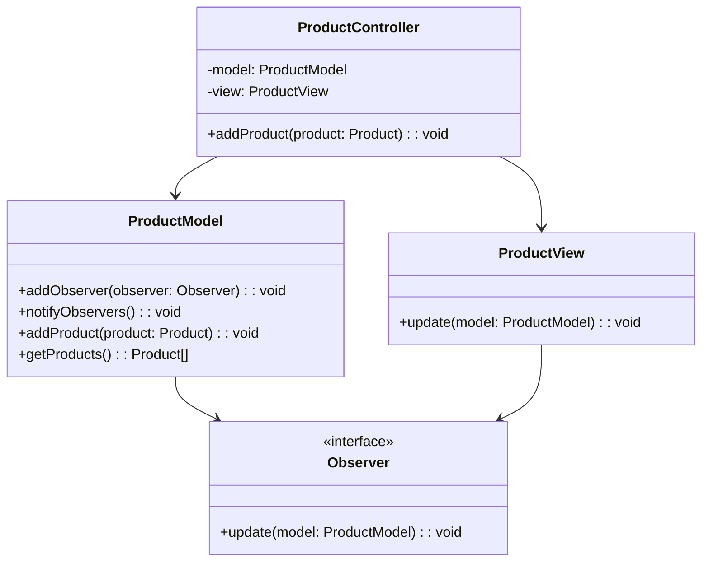
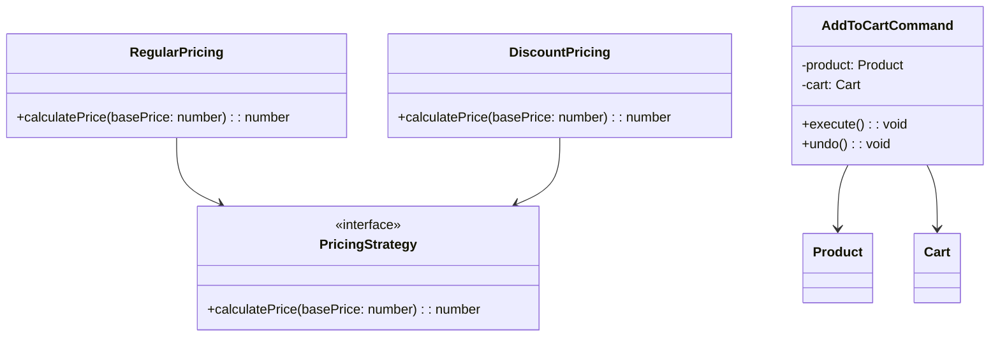

## 13.2 Case Study: Complex Application Architecture

In this section, we delve into a comprehensive case study of a complex TypeScript application architecture that effectively utilizes multiple design patterns. This case study illustrates practical applications and the benefits achieved by combining these patterns in a real-world scenario.

### Introduction to the Case Study

#### Context of the Application

Let's explore a large-scale e-commerce platform designed to handle millions of users and transactions daily. The platform's primary purpose is to provide a seamless shopping experience, integrating features like product browsing, cart management, payment processing, and order tracking. Given the application's scale and the need for high availability, performance, and maintainability, a combination of design patterns was essential to its architecture.

#### Necessity of Combining Design Patterns

The complexity of the application required a robust architecture that could address various challenges such as scalability, maintainability, and flexibility. By leveraging multiple design patterns, the development team aimed to create a modular and extensible system that could evolve with changing business requirements and technological advancements.

### Detailed Analysis

#### Major Components and Applied Design Patterns

Let's break down the application into its major components and explore the design patterns applied to each:

1. **User Interface (UI) Layer**
   - **Model-View-Controller (MVC) Pattern**: This pattern was employed to separate concerns, allowing independent development and testing of the user interface, business logic, and data access.
   - **Observer Pattern**: Used to manage real-time updates in the UI, ensuring that changes in the data model are reflected immediately.

2. **Business Logic Layer**
   - **Strategy Pattern**: Implemented to handle various pricing strategies and promotional campaigns dynamically.
   - **Command Pattern**: Utilized for encapsulating user actions, enabling features like undo/redo and action logging.

3. **Data Access Layer**
   - **Repository Pattern**: Provided a consistent interface for data access, abstracting the underlying database operations.
   - **Unit of Work Pattern**: Ensured atomic transactions, coordinating changes across multiple repositories.

4. **Communication Layer**
   - **Facade Pattern**: Simplified interactions with external services like payment gateways and shipping providers.
   - **Adapter Pattern**: Enabled integration with third-party APIs, translating their interfaces to match the application's requirements.

5. **Infrastructure Layer**
   - **Singleton Pattern**: Ensured a single instance of critical services like configuration management and logging.
   - **Dependency Injection Pattern**: Facilitated loose coupling and enhanced testability by injecting dependencies at runtime.

#### Interaction of Patterns

The interaction between these patterns was crucial for achieving a cohesive architecture. For instance, the MVC pattern in the UI layer worked seamlessly with the Observer pattern to provide real-time updates. Similarly, the Strategy and Command patterns in the business logic layer allowed for flexible and reversible user actions.

### Implementation Details

#### Code Excerpts and UML Diagrams

Let's explore some code excerpts and UML diagrams to visualize the architecture:

##### MVC and Observer in the UI Layer

```typescript
// Model
class ProductModel {
  private observers: Observer[] = [];
  private products: Product[] = [];

  public addObserver(observer: Observer): void {
    this.observers.push(observer);
  }

  public notifyObservers(): void {
    for (const observer of this.observers) {
      observer.update(this);
    }
  }

  public addProduct(product: Product): void {
    this.products.push(product);
    this.notifyObservers();
  }

  public getProducts(): Product[] {
    return this.products;
  }
}

// Observer
interface Observer {
  update(model: ProductModel): void;
}

// View
class ProductView implements Observer {
  update(model: ProductModel): void {
    console.log("Products updated:", model.getProducts());
  }
}

// Controller
class ProductController {
  constructor(private model: ProductModel, private view: ProductView) {
    this.model.addObserver(this.view);
  }

  public addProduct(product: Product): void {
    this.model.addProduct(product);
  }
}
```



##### Strategy and Command in the Business Logic Layer

```typescript
// Strategy
interface PricingStrategy {
  calculatePrice(basePrice: number): number;
}

class RegularPricing implements PricingStrategy {
  calculatePrice(basePrice: number): number {
    return basePrice;
  }
}

class DiscountPricing implements PricingStrategy {
  calculatePrice(basePrice: number): number {
    return basePrice * 0.9;
  }
}

// Command
class AddToCartCommand {
  constructor(private product: Product, private cart: Cart) {}

  execute(): void {
    this.cart.addProduct(this.product);
  }

  undo(): void {
    this.cart.removeProduct(this.product);
  }
}
```



#### Critical Sections and TypeScript Features

The integration of these patterns was crucial in sections like the checkout process, where multiple patterns ensured a smooth and reliable user experience. TypeScript's strong typing and interfaces were leveraged to enforce contracts between components, reducing runtime errors and improving code readability.

### Challenges and Solutions

#### Challenges in Combining Patterns

Combining multiple patterns in a single application posed several challenges, such as managing dependencies between patterns and ensuring that pattern interactions did not introduce complexity or performance bottlenecks.

#### Addressing Challenges

To address these challenges, the development team adopted the following strategies:

- **Modular Design**: Each pattern was encapsulated within its module, reducing dependencies and promoting reusability.
- **Clear Interfaces**: TypeScript interfaces were used to define clear contracts between components, ensuring that changes in one module did not affect others.
- **Performance Optimization**: Profiling tools were used to identify and optimize performance bottlenecks, ensuring that the application remained responsive under load.

### Benefits Realized

#### Advantages of Using Multiple Patterns

The use of multiple design patterns provided several benefits:

- **Scalability**: The modular architecture allowed the application to scale horizontally, handling increased user traffic without significant refactoring.
- **Maintainability**: Clear separation of concerns and well-defined interfaces made the codebase easier to maintain and extend.
- **Performance**: Optimized interactions between patterns ensured that the application remained performant, even under heavy load.

#### Metrics and Feedback

The application achieved a significant reduction in bugs and improved onboarding time for new developers, thanks to the clear structure and documentation provided by the design patterns. User feedback highlighted the platform's reliability and responsiveness, contributing to increased user satisfaction and retention.

### Lessons Learned

#### Key Insights and Best Practices

Throughout the project, several key insights and best practices emerged:

- **Start Simple**: Begin with a simple architecture and introduce patterns as complexity grows. This approach prevents over-engineering and ensures that patterns are applied where they provide the most value.
- **Continuous Refactoring**: Regularly refactor the codebase to incorporate new patterns and improve existing implementations. This practice keeps the architecture flexible and adaptable to changing requirements.
- **Leverage TypeScript Features**: Utilize TypeScript's type system to enforce contracts and improve code quality. Features like generics and type guards can enhance pattern implementations.

#### Advice for Developers

For developers considering a similar approach, it's essential to:

- **Understand the Patterns**: Gain a deep understanding of each pattern's strengths and limitations before applying them.
- **Focus on Collaboration**: Encourage collaboration between team members to ensure that patterns are applied consistently and effectively.
- **Embrace Change**: Be open to changing the architecture as new patterns and technologies emerge.

### Conclusion

The application of multiple design patterns in this complex TypeScript application architecture had a profound impact on its scalability, maintainability, and performance. By thoughtfully combining patterns, the development team created a robust and flexible system that met the project's demanding requirements. As you embark on your projects, consider the benefits of applying combined patterns and tailor them to your specific needs.

Remember, the journey of mastering design patterns is ongoing. Keep experimenting, stay curious, and enjoy the process of building innovative and efficient software solutions.

## Quiz Time!



### Which design pattern was used in the UI layer for real-time updates?

- [x] Observer Pattern
- [ ] Strategy Pattern
- [ ] Command Pattern
- [ ] Singleton Pattern

> **Explanation:** The Observer Pattern was used to manage real-time updates in the UI, ensuring changes in the data model are reflected immediately.

### What pattern was applied to handle various pricing strategies?

- [ ] Command Pattern
- [x] Strategy Pattern
- [ ] Observer Pattern
- [ ] Facade Pattern

> **Explanation:** The Strategy Pattern was implemented to handle various pricing strategies dynamically.

### Which pattern ensured a single instance of critical services?

- [ ] Adapter Pattern
- [ ] Command Pattern
- [x] Singleton Pattern
- [ ] Observer Pattern

> **Explanation:** The Singleton Pattern ensured a single instance of critical services like configuration management and logging.

### What was the primary benefit of using the Repository Pattern?

- [ ] Real-time updates
- [x] Consistent interface for data access
- [ ] Dynamic pricing strategies
- [ ] Simplified external service interactions

> **Explanation:** The Repository Pattern provided a consistent interface for data access, abstracting the underlying database operations.

### Which pattern was used to encapsulate user actions for undo/redo functionality?

- [ ] Observer Pattern
- [ ] Strategy Pattern
- [x] Command Pattern
- [ ] Facade Pattern

> **Explanation:** The Command Pattern was utilized for encapsulating user actions, enabling features like undo/redo and action logging.

### How were dependencies managed to enhance testability?

- [x] Dependency Injection Pattern
- [ ] Singleton Pattern
- [ ] Observer Pattern
- [ ] Strategy Pattern

> **Explanation:** The Dependency Injection Pattern facilitated loose coupling and enhanced testability by injecting dependencies at runtime.

### Which pattern was used to simplify interactions with external services?

- [ ] Observer Pattern
- [ ] Command Pattern
- [x] Facade Pattern
- [ ] Strategy Pattern

> **Explanation:** The Facade Pattern simplified interactions with external services like payment gateways and shipping providers.

### What strategy was adopted to address performance bottlenecks?

- [ ] Ignoring bottlenecks
- [ ] Adding more patterns
- [x] Performance Optimization
- [ ] Reducing code complexity

> **Explanation:** Profiling tools were used to identify and optimize performance bottlenecks, ensuring the application remained responsive under load.

### What was a key lesson learned regarding architecture?

- [x] Start Simple
- [ ] Add all patterns at once
- [ ] Avoid refactoring
- [ ] Ignore TypeScript features

> **Explanation:** A key lesson learned was to start with a simple architecture and introduce patterns as complexity grows, preventing over-engineering.

### True or False: The modular architecture allowed the application to scale horizontally.

- [x] True
- [ ] False

> **Explanation:** The modular architecture allowed the application to scale horizontally, handling increased user traffic without significant refactoring.


