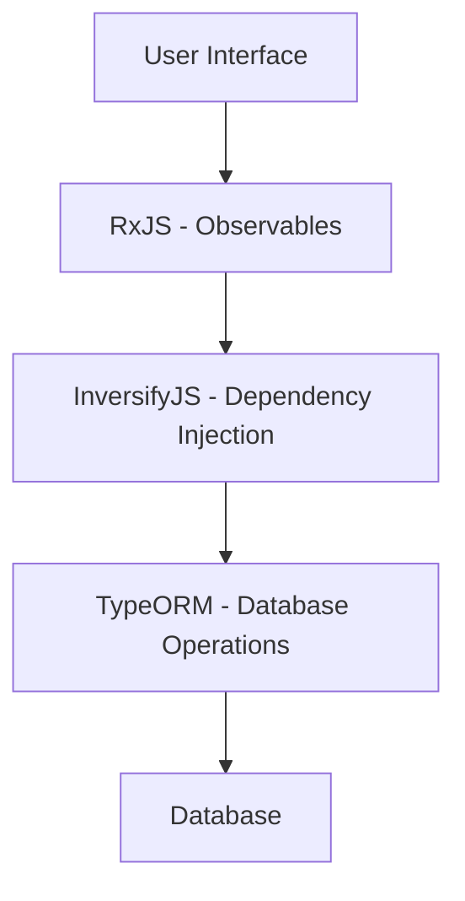

## 14.5 Third-Party Libraries Implementing Patterns

In the world of software development, design patterns are invaluable tools that provide proven solutions to common problems. However, implementing these patterns from scratch can be time-consuming and error-prone. This is where third-party libraries come into play, offering pre-built implementations of design patterns that have been tested and optimized by the community. By leveraging these libraries, developers can focus on building features rather than reinventing the wheel.

### Introduction

Using third-party libraries to implement design patterns can significantly enhance productivity and code quality. These libraries encapsulate complex logic, allowing developers to use well-tested solutions without delving into the intricate details of pattern implementation. However, it is crucial to understand the underlying principles of these patterns to use the libraries effectively. This understanding ensures that developers can make informed decisions about when and how to use a library, and how to troubleshoot issues that may arise.

### Criteria for Selecting Libraries

When choosing a third-party library to implement design patterns, several factors should be considered:

- **Community Support**: A vibrant community can provide valuable resources, such as tutorials, forums, and plugins, which can be crucial for troubleshooting and learning.
- **Documentation**: Comprehensive and clear documentation is essential for understanding how to use the library effectively.
- **Compatibility**: Ensure that the library is compatible with your project's existing technologies and frameworks.
- **Performance**: Evaluate the library's performance, especially if it will be used in performance-critical parts of your application.
- **Maintenance and Updates**: A well-maintained library with regular updates is more likely to be secure and compatible with the latest technologies.

### Overview of Key Libraries

In this section, we will explore three key libraries in the TypeScript ecosystem that implement design patterns: InversifyJS, RxJS, and TypeORM. Each of these libraries offers unique capabilities and is widely used in the industry.

#### InversifyJS

InversifyJS is a powerful and lightweight inversion of control (IoC) container for TypeScript and JavaScript applications. It helps manage dependencies in a scalable way, making it easier to implement the Dependency Injection pattern. InversifyJS is particularly useful in large applications where managing dependencies manually can become cumbersome.

#### RxJS

RxJS, or Reactive Extensions for JavaScript, is a library for reactive programming using Observables. It allows developers to work with asynchronous data streams and is a perfect fit for implementing the Observer pattern. RxJS is widely used in applications that require real-time data handling, such as chat applications and live data feeds.

#### TypeORM

TypeORM is an Object-Relational Mapping (ORM) library that can be used with TypeScript and JavaScript. It simplifies database interactions by mapping database tables to TypeScript classes. TypeORM implements several design patterns, including the Active Record and Data Mapper patterns, making it easier to manage database operations in a structured way.

### InversifyJS: Implementing Dependency Injection

InversifyJS is designed to help developers manage dependencies through the Dependency Injection pattern. This pattern allows for the decoupling of classes and their dependencies, promoting a more modular and testable codebase.

#### Basic Usage

To get started with InversifyJS, you need to install it via npm:

```bash
npm install inversify reflect-metadata --save
```

Here is a simple example demonstrating how to use InversifyJS to manage dependencies:

```typescript
import "reflect-metadata";
import { Container, injectable, inject } from "inversify";

// Define a service interface
interface Warrior {
    fight(): string;
    sneak(): string;
}

// Implement the service
@injectable()
class Ninja implements Warrior {
    public fight() {
        return "Ninja fights!";
    }
    public sneak() {
        return "Ninja sneaks!";
    }
}

// Create a container and bind the interface to the implementation
const container = new Container();
container.bind<Warrior>("Warrior").to(Ninja);

// Resolve the dependency
const ninja = container.get<Warrior>("Warrior");
console.log(ninja.fight()); // Output: Ninja fights!
```

In this example, we define a `Warrior` interface and a `Ninja` class that implements it. The `@injectable()` decorator marks the `Ninja` class as available for dependency injection. We then create a container, bind the `Warrior` interface to the `Ninja` implementation, and resolve the dependency.

#### Advanced Features

InversifyJS also supports more advanced features, such as:

- **Singletons**: Ensuring that only one instance of a service is created.
- **Named and Tagged Bindings**: Providing additional metadata to distinguish between multiple implementations of the same interface.
- **Middleware**: Adding custom logic to the resolution process.

These features make InversifyJS a flexible and powerful tool for managing dependencies in complex applications.

### RxJS: Reactive Programming with Observables

RxJS is a library that brings the power of reactive programming to JavaScript and TypeScript. It allows developers to work with asynchronous data streams using Observables, which are collections that arrive over time.

#### Basic Usage

To use RxJS, you need to install it via npm:

```bash
npm install rxjs
```

Here is a simple example demonstrating how to create and subscribe to an Observable:

```typescript
import { Observable } from 'rxjs';

// Create an Observable
const observable = new Observable<number>(subscriber => {
    subscriber.next(1);
    subscriber.next(2);
    subscriber.next(3);
    subscriber.complete();
});

// Subscribe to the Observable
observable.subscribe({
    next(x) { console.log('Received value: ' + x); },
    complete() { console.log('Done!'); }
});
```

In this example, we create an Observable that emits three values and then completes. We subscribe to the Observable and log each received value to the console.

#### Operators and Transformations

RxJS provides a rich set of operators that allow you to transform, filter, and combine Observables. Here is an example using the `map` operator to transform emitted values:

```typescript
import { from } from 'rxjs';
import { map } from 'rxjs/operators';

// Create an Observable from an array
const numbers = from([1, 2, 3, 4, 5]);

// Use the map operator to transform values
const squaredNumbers = numbers.pipe(
    map(x => x * x)
);

// Subscribe to the transformed Observable
squaredNumbers.subscribe(x => console.log(x)); // Output: 1, 4, 9, 16, 25
```

In this example, we use the `map` operator to square each number emitted by the Observable.

### TypeORM: Simplifying Database Interactions

TypeORM is an ORM that simplifies database interactions by mapping database tables to TypeScript classes. It supports both the Active Record and Data Mapper patterns, providing flexibility in how you manage database operations.

#### Basic Usage

To use TypeORM, you need to install it along with a database driver, such as `pg` for PostgreSQL:

```bash
npm install typeorm reflect-metadata pg
```

Here is a simple example demonstrating how to define an entity and perform basic CRUD operations:

```typescript
import "reflect-metadata";
import { createConnection, Entity, PrimaryGeneratedColumn, Column, BaseEntity } from "typeorm";

// Define an entity
@Entity()
class User extends BaseEntity {
    @PrimaryGeneratedColumn()
    id: number;

    @Column()
    name: string;

    @Column()
    age: number;
}

// Create a connection and perform CRUD operations
createConnection({
    type: "postgres",
    host: "localhost",
    port: 5432,
    username: "test",
    password: "test",
    database: "test",
    entities: [User],
    synchronize: true,
}).then(async connection => {
    // Create a new user
    const user = new User();
    user.name = "John Doe";
    user.age = 30;
    await user.save();

    // Find all users
    const users = await User.find();
    console.log(users);
}).catch(error => console.log(error));
```

In this example, we define a `User` entity with `id`, `name`, and `age` columns. We then create a connection to a PostgreSQL database and perform basic CRUD operations.

#### Advanced Features

TypeORM also supports advanced features such as:

- **Eager and Lazy Loading**: Controlling how related entities are loaded.
- **Query Builder**: Constructing complex SQL queries using a fluent API.
- **Migrations**: Managing database schema changes over time.

These features make TypeORM a comprehensive solution for managing database interactions in TypeScript applications.

### Encourage Hands-On Exploration

While third-party libraries provide powerful tools for implementing design patterns, it is essential to understand the underlying principles to use them effectively. We encourage you to try out these libraries in sample projects, experimenting with different features and configurations. This hands-on exploration will deepen your understanding of both the libraries and the design patterns they implement.

### Try It Yourself

To get started with these libraries, consider creating a simple project that combines InversifyJS, RxJS, and TypeORM. For example, you could build a small application that manages a list of tasks, using TypeORM to store tasks in a database, RxJS to handle real-time updates, and InversifyJS to manage dependencies.

### Visualizing the Interaction of Libraries

To better understand how these libraries can work together, let's visualize their interaction in a typical application architecture:



**Diagram Description**: This diagram illustrates how RxJS, InversifyJS, and TypeORM can interact in an application. The user interface communicates with RxJS to handle real-time data streams. RxJS interacts with InversifyJS to manage dependencies, which in turn uses TypeORM to perform database operations.

### References and Links

- [InversifyJS Documentation](https://inversify.io/)
- [RxJS Documentation](https://rxjs.dev/)
- [TypeORM Documentation](https://typeorm.io/)

These resources provide comprehensive guides and examples to help you get started with each library.

### Knowledge Check

As you explore these libraries, consider the following questions to test your understanding:

- How does InversifyJS implement the Dependency Injection pattern?
- What are the benefits of using Observables in RxJS for handling asynchronous data?
- How does TypeORM simplify database interactions in a TypeScript application?

### Embrace the Journey

Remember, this is just the beginning. As you progress, you'll build more complex and interactive applications using these libraries. Keep experimenting, stay curious, and enjoy the journey!

## Quiz Time!



### What is the primary design pattern implemented by InversifyJS?

- [x] Dependency Injection
- [ ] Observer
- [ ] Singleton
- [ ] Factory

> **Explanation:** InversifyJS is primarily used for implementing the Dependency Injection pattern, which helps manage dependencies in a scalable way.

### Which library is best suited for handling asynchronous data streams?

- [ ] InversifyJS
- [x] RxJS
- [ ] TypeORM
- [ ] Lodash

> **Explanation:** RxJS is designed for reactive programming and is ideal for handling asynchronous data streams using Observables.

### What pattern does TypeORM primarily implement?

- [ ] Observer
- [ ] Singleton
- [x] Active Record and Data Mapper
- [ ] Factory

> **Explanation:** TypeORM implements the Active Record and Data Mapper patterns, simplifying database interactions by mapping tables to classes.

### Which of the following is a key factor to consider when selecting a third-party library?

- [x] Community Support
- [ ] Color Scheme
- [ ] Font Style
- [ ] Logo Design

> **Explanation:** Community support is crucial as it provides resources, tutorials, and forums that can help in troubleshooting and learning.

### What is a benefit of using third-party libraries for design patterns?

- [x] They provide tested and optimized solutions.
- [ ] They make code harder to read.
- [ ] They increase the complexity of the code.
- [ ] They reduce performance.

> **Explanation:** Third-party libraries offer tested and optimized solutions, allowing developers to focus on building features rather than implementing patterns from scratch.

### How does RxJS transform emitted values?

- [ ] Through direct modification
- [x] Using operators like `map`
- [ ] By changing the source code
- [ ] By recompiling the application

> **Explanation:** RxJS uses operators like `map` to transform emitted values in a functional and declarative manner.

### What is a common use case for TypeORM?

- [ ] Handling real-time data streams
- [ ] Managing dependencies
- [x] Simplifying database interactions
- [ ] Creating animations

> **Explanation:** TypeORM is commonly used to simplify database interactions by mapping database tables to TypeScript classes.

### Which feature of InversifyJS allows for distinguishing between multiple implementations of the same interface?

- [ ] Observables
- [x] Named and Tagged Bindings
- [ ] Eager Loading
- [ ] Lazy Loading

> **Explanation:** InversifyJS uses Named and Tagged Bindings to provide additional metadata for distinguishing between multiple implementations of the same interface.

### What is the main advantage of using Observables in RxJS?

- [x] Handling asynchronous data streams efficiently
- [ ] Increasing code complexity
- [ ] Reducing code readability
- [ ] Slowing down performance

> **Explanation:** Observables in RxJS allow for efficient handling of asynchronous data streams, making it easier to work with real-time data.

### True or False: TypeORM supports both the Active Record and Data Mapper patterns.

- [x] True
- [ ] False

> **Explanation:** TypeORM supports both the Active Record and Data Mapper patterns, providing flexibility in how developers manage database operations.


