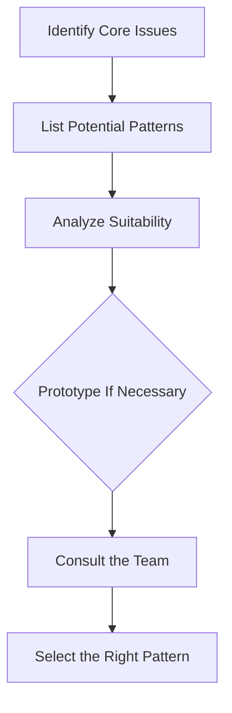

## 16.1 Selecting the Right Pattern

### Introduction

In the realm of software development, selecting the right design pattern is akin to choosing the right tool for a job. The correct pattern can significantly enhance code quality, maintainability, and scalability, while the wrong choice can lead to unnecessary complexity and technical debt. This section aims to provide expert developers with a comprehensive guide on how to choose the most appropriate design pattern for a specific problem or project, considering various factors such as requirements, constraints, and desired outcomes.

### Importance of Selecting the Right Design Pattern

Design patterns are proven solutions to common software design problems. They encapsulate best practices and provide a shared language for developers to communicate complex ideas succinctly. Selecting the right pattern is crucial because:

- **Improves Code Quality**: Patterns promote code that is clean, modular, and easier to understand.
- **Enhances Maintainability**: Well-chosen patterns make it easier to update and extend code over time.
- **Boosts Scalability**: Patterns can help design systems that gracefully handle increased load or complexity.
- **Facilitates Communication**: Patterns provide a common vocabulary that can improve team collaboration and understanding.

### Criteria for Selection

When choosing a design pattern, consider the following key factors:

#### Problem Domain

Analyze the specific problem or requirement that needs to be addressed. Understanding the core issue is the first step in selecting a pattern that effectively solves it. For example, if the problem involves managing complex object creation, a creational pattern like Factory or Builder might be appropriate.

#### Pattern Intent

Match the intent of the design pattern with the needs of the problem. Each pattern has a specific purpose, such as managing object creation, structuring code, or defining behavior. Ensure that the pattern's intent aligns with the problem at hand.

#### Complexity

Assess the complexity the pattern introduces versus the benefits it provides. Some patterns, like Singleton, are straightforward, while others, like Visitor, can add significant complexity. Choose a pattern that balances simplicity with functionality.

#### Flexibility and Extensibility

Consider the need for future changes and how the pattern accommodates them. Patterns like Strategy or Observer offer flexibility by allowing behavior to be changed at runtime, which can be beneficial for systems that require frequent updates.

#### Team Familiarity

Take into account the team's knowledge and experience with certain patterns. A pattern that is well-understood by the team will be easier to implement and maintain. Conversely, using an unfamiliar pattern may require additional training and resources.

#### Performance Impact

Evaluate any performance implications associated with the pattern. Some patterns, such as Flyweight, are designed to optimize performance, while others may introduce overhead. Consider the performance trade-offs when selecting a pattern.

#### Existing Architecture

Consider how the pattern fits within the current system architecture. Ensure that the chosen pattern integrates well with existing components and does not require significant rework or restructuring.

### Decision-Making Process

To select the right pattern, follow this step-by-step approach:

#### Identify the Core Issues

Clearly define the problem and what needs to be solved. This involves understanding the requirements, constraints, and desired outcomes. A well-defined problem statement is essential for selecting an appropriate pattern.

#### List Potential Patterns

Based on the problem, list design patterns that could be relevant. Consider patterns from different categories, such as creational, structural, or behavioral, to ensure a comprehensive evaluation.

#### Analyze Suitability

Compare the patterns against the criteria listed above. Evaluate each pattern's intent, complexity, flexibility, team familiarity, performance impact, and fit within the existing architecture.

#### Prototype If Necessary

Suggest building small prototypes to test how patterns perform in context. Prototyping can help validate assumptions and reveal potential issues before full-scale implementation.

#### Consult the Team

Encourage collaborative decision-making to leverage diverse perspectives. Involving the team in the selection process can lead to better-informed decisions and increased buy-in.

#### Visualizing the Decision-Making Process

Visual aids can help clarify the decision-making process. Below is a flowchart that illustrates the steps involved in selecting the right design pattern:

### Common Scenarios and Pattern Matches

Here are some common programming scenarios and the patterns that might be appropriate:

#### Managing Object Creation

- **Factory Pattern**: Use when you need to create objects without specifying the exact class of object that will be created.
- **Builder Pattern**: Use when constructing a complex object step-by-step is required.

#### Handling State Changes

- **State Pattern**: Use when an object must change its behavior based on its state.
- **Observer Pattern**: Use when an object needs to notify other objects about state changes.

#### Structuring Code

- **Adapter Pattern**: Use to allow incompatible interfaces to work together.
- **Facade Pattern**: Use to provide a simplified interface to a complex subsystem.

#### Defining Behavior

- **Strategy Pattern**: Use to define a family of algorithms and make them interchangeable.
- **Command Pattern**: Use to encapsulate a request as an object, allowing parameterization and queuing.

#### Reasoning Behind Each Suggestion

For each scenario, the suggested pattern addresses the core issue effectively. For instance, the Factory Pattern abstracts the instantiation process, making it ideal for scenarios where the exact type of object is determined at runtime. The Observer Pattern, on the other hand, is perfect for implementing event-driven systems where changes in one part of the system need to be reflected elsewhere.

### Avoiding Overengineering

While design patterns offer powerful solutions, it's important to avoid overengineering. Here are some guidelines:

- **Keep It Simple, Stupid (KISS)**: Emphasize simplicity. Use the simplest solution that effectively addresses the problem.
- **Avoid Unnecessary Complexity**: Don't use complex patterns for simple problems. Overengineering can lead to increased maintenance costs and reduced clarity.
- **Evaluate the Need**: Before implementing a pattern, evaluate whether it truly adds value to the project.

### Case Studies

#### Successful Pattern Selection

Consider a scenario where a team needed to manage complex object creation in a TypeScript application. They chose the Builder Pattern, which allowed them to construct objects step-by-step, resulting in a flexible and maintainable solution. The pattern's intent aligned perfectly with the problem, and the team was familiar with its implementation, leading to a successful outcome.

#### Correcting a Wrong Pattern Choice

In another case, a team initially chose the Singleton Pattern to manage shared resources in a web application. However, they soon realized that the pattern did not accommodate the need for multiple instances in certain scenarios. By switching to the Multiton Pattern, they were able to manage instances more effectively, demonstrating the importance of reevaluating pattern choices when necessary.

### Conclusion

Selecting the right design pattern is a critical decision in software development. It requires a thoughtful analysis of the problem, consideration of various criteria, and collaboration with the team. By following the guidelines outlined in this section, expert developers can make informed decisions that enhance code quality, maintainability, and scalability. Remember, continuous learning about patterns is essential to making more informed decisions in the ever-evolving landscape of software development.

### Quiz Time!



### What is the primary benefit of selecting the right design pattern?

- [x] Improves code quality, maintainability, and scalability.
- [ ] Reduces the need for testing.
- [ ] Increases the complexity of the code.
- [ ] Guarantees faster execution time.

> **Explanation:** Selecting the right design pattern improves code quality, maintainability, and scalability by providing a proven solution to common design problems.

### Which factor is NOT typically considered when selecting a design pattern?

- [ ] Problem Domain
- [ ] Pattern Intent
- [ ] Team Familiarity
- [x] Color of the code editor

> **Explanation:** The color of the code editor is not relevant to selecting a design pattern. The focus should be on factors like problem domain, pattern intent, and team familiarity.

### What is the main purpose of the Factory Pattern?

- [x] To create objects without specifying the exact class of object that will be created.
- [ ] To manage state changes in an object.
- [ ] To provide a simplified interface to a complex subsystem.
- [ ] To encapsulate a request as an object.

> **Explanation:** The Factory Pattern is used to create objects without specifying the exact class of object that will be created, allowing for more flexibility.

### Why is it important to consider team familiarity when selecting a design pattern?

- [x] It ensures the pattern is implemented and maintained effectively.
- [ ] It guarantees the pattern will improve performance.
- [ ] It reduces the need for documentation.
- [ ] It ensures the pattern is the most complex available.

> **Explanation:** Team familiarity is important because a pattern that is well-understood by the team will be easier to implement and maintain.

### What should you do if a chosen pattern does not fit the problem well?

- [x] Reevaluate and consider switching to a more suitable pattern.
- [ ] Continue using the pattern regardless of fit.
- [ ] Abandon the use of design patterns altogether.
- [ ] Ignore the issue and hope it resolves itself.

> **Explanation:** If a chosen pattern does not fit well, it's important to reevaluate and consider switching to a more suitable pattern to ensure the best solution.

### What is the KISS principle?

- [x] Keep It Simple, Stupid
- [ ] Keep It Secure, Stupid
- [ ] Keep It Scalable, Stupid
- [ ] Keep It Structured, Stupid

> **Explanation:** The KISS principle stands for "Keep It Simple, Stupid," emphasizing the importance of simplicity in design.

### Which pattern is suitable for managing state changes in an object?

- [x] State Pattern
- [ ] Factory Pattern
- [ ] Adapter Pattern
- [ ] Singleton Pattern

> **Explanation:** The State Pattern is suitable for managing state changes in an object, allowing it to alter its behavior when its state changes.

### Why is it important to avoid overengineering with design patterns?

- [x] To prevent unnecessary complexity and maintenance costs.
- [ ] To ensure the code is as complex as possible.
- [ ] To reduce the need for testing.
- [ ] To guarantee faster execution time.

> **Explanation:** Avoiding overengineering is important to prevent unnecessary complexity and maintenance costs, ensuring the solution is as simple as possible.

### What is a potential downside of using a complex design pattern?

- [x] It may introduce unnecessary complexity.
- [ ] It guarantees faster execution time.
- [ ] It reduces the need for documentation.
- [ ] It ensures the code is easier to understand.

> **Explanation:** A potential downside of using a complex design pattern is that it may introduce unnecessary complexity, making the code harder to understand and maintain.

### True or False: The Singleton Pattern is always the best choice for managing shared resources.

- [ ] True
- [x] False

> **Explanation:** False. While the Singleton Pattern is useful for managing shared resources, it is not always the best choice, especially if multiple instances are needed in certain scenarios.



