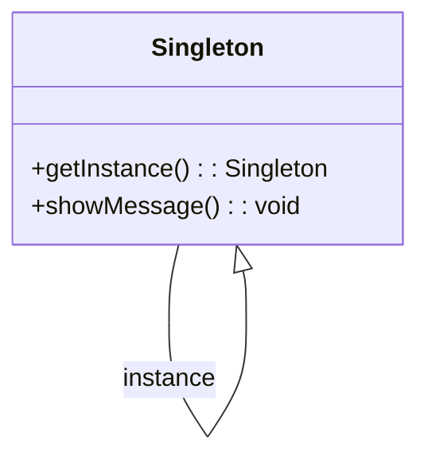

## 16.4 Documentation and Maintainability

In the realm of software engineering, documentation is often the unsung hero that ensures the longevity and maintainability of a codebase. This is especially true when implementing design patterns in TypeScript, where the complexity and abstraction can obscure the underlying logic. In this section, we will explore the importance of documentation, strategies for documenting design patterns, tools to aid in documentation, and best practices to maintain high-quality, understandable code.

### The Importance of Documentation

**Explain the Benefits of Good Documentation**

Documentation serves as the backbone of any successful software project. It provides a roadmap for developers, both current and future, to understand the intricacies of the codebase. Good documentation facilitates easier onboarding, allowing new team members to quickly grasp the system's architecture and design decisions. It also supports knowledge transfer, ensuring that critical information does not reside solely in the minds of a few developers.

**Discuss Long-term Maintenance and Technical Debt**

Without proper documentation, maintaining a codebase becomes a daunting task. As the project evolves, undocumented code can lead to increased technical debt, where the cost of future changes and bug fixes escalates due to the lack of clarity. Comprehensive documentation mitigates this risk by providing a clear understanding of the system's components and their interactions, making it easier to implement changes and enhancements.

### Documenting Design Patterns

**Provide Tips on Documenting Design Patterns**

When documenting design patterns in TypeScript, it's crucial to articulate both the intent and implementation clearly. Here are some tips:

- **Explain Why a Pattern Was Chosen**: Document the rationale behind selecting a particular design pattern. This helps others understand the problem it solves and the benefits it brings to the project.
  
- **Detail the Implementation**: Provide a step-by-step explanation of how the pattern is implemented in the code. Include code snippets and comments to illustrate key points.

- **Use Comments, README Files, and Wikis**: Comments within the code should clarify complex logic and highlight the use of patterns. README files and wikis can provide a broader overview of the project's architecture and design choices.

**Example Code Snippet: Documenting a Singleton Pattern**

```typescript
// Singleton.ts
// This class implements the Singleton pattern to ensure only one instance exists.

class Singleton {
  private static instance: Singleton;

  // Private constructor to prevent direct instantiation
  private constructor() {}

  // Method to get the single instance of the class
  public static getInstance(): Singleton {
    if (!Singleton.instance) {
      Singleton.instance = new Singleton();
    }
    return Singleton.instance;
  }

  // Example method
  public showMessage(): void {
    console.log("Hello, I am a Singleton!");
  }
}

// Usage
const singleton = Singleton.getInstance();
singleton.showMessage();
```

In the above example, comments explain the purpose of the Singleton pattern and the implementation details, making it easier for other developers to understand the code.

### Tools for Documentation

**Introduce Tools like TypeDoc**

TypeDoc is a powerful tool for generating API documentation directly from TypeScript code. It parses the codebase and produces a comprehensive set of HTML documents that describe the code's structure and functionality.

- **TypeDoc**: Use TypeDoc to automatically generate documentation from your TypeScript code. It extracts comments and type information to create a detailed API reference.

**Suggest Using Diagrams to Visualize Patterns**

Visual aids like UML diagrams can significantly enhance the understanding of design patterns and their relationships. They provide a graphical representation of the system's architecture, making it easier to comprehend complex interactions.



The above class diagram illustrates the Singleton pattern, showing the relationship between the class and its instance.

### Incorporating Documentation into Development Workflow

**Recommend Integrating Documentation Tasks**

Incorporating documentation into the development workflow ensures that it remains an integral part of the project. Here are some strategies:

- **Code Reviews**: Include documentation checks as part of the code review process. Ensure that new code is well-documented before merging it into the main branch.

- **Pull Request Requirements**: Require documentation updates as part of the pull request process. This encourages developers to document their changes as they work.

**Encourage Keeping Documentation in Version Control**

Storing documentation alongside the code in version control systems like Git ensures that it evolves with the project. This approach allows for easy tracking of changes and ensures that documentation remains relevant.

### Maintaining Documentation

**Offer Strategies for Keeping Documentation Up-to-date**

Documentation must be maintained to remain useful. Here are some strategies:

- **Regular Audits**: Conduct regular audits of the documentation to identify outdated or missing information.

- **Assign Documentation Ownership**: Designate team members to be responsible for maintaining specific sections of the documentation.

- **Automate Documentation Generation**: Use tools like TypeDoc to automate the generation of documentation, reducing the manual effort required.

### Enhancing Code Readability

**Advocate for Writing Self-documenting Code**

Self-documenting code is written in a way that its purpose is immediately clear to anyone reading it. This can be achieved through:

- **Clear Naming Conventions**: Use descriptive names for variables, functions, and classes that convey their purpose.

- **Modular Design**: Break down complex logic into smaller, reusable functions or classes.

**Discuss the Role of Linting and Formatting Tools**

Linting and formatting tools help maintain code clarity by enforcing consistent coding standards. Tools like ESLint and Prettier can automatically format code and highlight potential issues, making it easier to read and understand.

### Examples and Case Studies

**Provide Examples of Well-documented TypeScript Projects**

Examining well-documented projects can provide valuable insights into effective documentation practices. Here are a few examples:

- **Angular**: The Angular framework is known for its comprehensive documentation, which includes guides, tutorials, and API references.

- **TypeScript**: The TypeScript language itself has extensive documentation, covering everything from basic syntax to advanced features.

**Highlight the Positive Impact of Good Documentation**

Projects with good documentation often experience smoother development processes, quicker onboarding of new team members, and reduced maintenance costs. Documentation acts as a single source of truth, guiding developers in their work and reducing the likelihood of errors.

### Best Practices

**Summarize Key Practices for Effective Documentation**

To ensure documentation is effective, it should be:

- **Clear and Concise**: Avoid unnecessary jargon and keep explanations straightforward.

- **Accessible**: Ensure documentation is easy to find and navigate.

- **Regularly Updated**: Keep documentation current with the latest changes in the codebase.

### Conclusion

In conclusion, documentation is a cornerstone of maintainable software. It provides the necessary context for understanding complex systems and facilitates long-term maintenance. By prioritizing documentation throughout the project lifecycle, developers can ensure that their code remains understandable and adaptable to future needs.

## Quiz Time!



### What is one of the primary benefits of good documentation?

- [x] Easier onboarding of new team members
- [ ] Faster code execution
- [ ] Reduced memory usage
- [ ] Increased code complexity

> **Explanation:** Good documentation helps new team members understand the codebase more quickly, facilitating easier onboarding.

### Why is it important to document the choice of a design pattern?

- [x] To explain the problem it solves and the benefits it provides
- [ ] To increase the file size of the project
- [ ] To make the code harder to read
- [ ] To ensure the pattern is never changed

> **Explanation:** Documenting the choice of a design pattern helps others understand why it was chosen and the problem it addresses.

### What tool is recommended for generating API documentation from TypeScript code?

- [x] TypeDoc
- [ ] JSDoc
- [ ] Swagger
- [ ] Postman

> **Explanation:** TypeDoc is specifically designed for generating documentation from TypeScript code.

### What is a benefit of using diagrams in documentation?

- [x] They provide a graphical representation of the system's architecture.
- [ ] They increase the complexity of the documentation.
- [ ] They replace the need for written documentation.
- [ ] They are only useful for small projects.

> **Explanation:** Diagrams help visualize complex interactions and relationships, making the system's architecture easier to understand.

### How can documentation be integrated into the development workflow?

- [x] By including documentation checks in code reviews
- [ ] By ignoring documentation until the end of the project
- [ ] By keeping documentation separate from the codebase
- [ ] By using only verbal explanations

> **Explanation:** Integrating documentation checks into code reviews ensures that documentation is maintained as part of the development process.

### What is a strategy for keeping documentation up-to-date?

- [x] Conducting regular audits
- [ ] Writing documentation only at the project's start
- [ ] Avoiding documentation for small changes
- [ ] Using only external documentation tools

> **Explanation:** Regular audits help identify outdated or missing information, ensuring documentation remains current.

### What is self-documenting code?

- [x] Code that is written in a way that its purpose is immediately clear
- [ ] Code that has no comments or documentation
- [ ] Code that is only understood by its author
- [ ] Code that is written in multiple languages

> **Explanation:** Self-documenting code uses clear naming conventions and modular design to make its purpose obvious.

### What role do linting and formatting tools play in code readability?

- [x] They enforce consistent coding standards.
- [ ] They increase the complexity of the code.
- [ ] They remove all comments from the code.
- [ ] They are only used for debugging.

> **Explanation:** Linting and formatting tools help maintain code clarity by enforcing consistent coding standards.

### What is a common characteristic of well-documented projects?

- [x] They experience smoother development processes.
- [ ] They have more bugs and issues.
- [ ] They are harder to onboard new team members.
- [ ] They require more maintenance.

> **Explanation:** Well-documented projects often have smoother development processes and easier onboarding.

### True or False: Documentation should be regularly updated to reflect changes in the codebase.

- [x] True
- [ ] False

> **Explanation:** Regular updates ensure that documentation remains accurate and relevant to the current state of the codebase.


