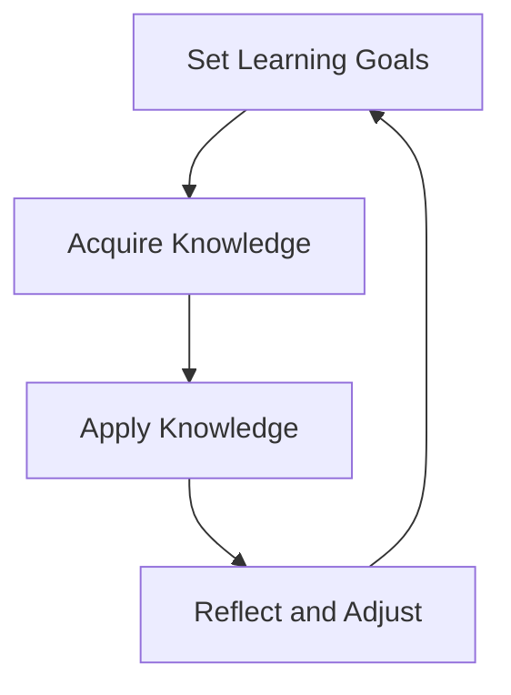
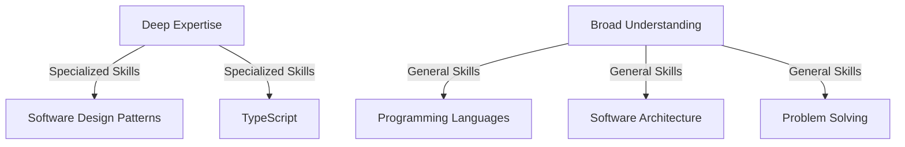

## 16.7 Continual Learning and Adaptation

In the ever-evolving world of software development, continual learning and adaptation are not just beneficial—they are essential. As technologies advance and new design patterns emerge, developers must remain agile and informed to maintain their effectiveness and innovation. In this section, we will explore why continual learning matters, how to embrace new design patterns, effective learning strategies, staying informed, adapting to change, sharing knowledge, and balancing depth and breadth in skill development.

### Why Continual Learning Matters

#### The Rapid Pace of Change in Technology

The technology landscape is characterized by rapid and constant change. New programming languages, frameworks, and tools are introduced regularly, each promising to solve problems more efficiently or effectively than their predecessors. For instance, TypeScript itself emerged as a powerful alternative to JavaScript, offering static typing and other features that enhance code quality and maintainability. Developers who embrace continual learning can leverage these advancements to improve their work and stay competitive in the job market.

#### Personal Growth and Career Advancement

Continual learning leads to personal growth and career advancement. By staying updated with the latest trends and technologies, developers can position themselves as experts in their field. This not only opens up opportunities for career advancement but also enhances job satisfaction. Learning new skills can lead to roles with greater responsibility, higher pay, and more interesting projects.

### Embracing New Design Patterns

#### Being Open to Emerging Patterns

Design patterns are reusable solutions to common problems in software design. As the industry evolves, new patterns emerge to address new challenges. Being open to these emerging patterns is crucial. For example, the rise of microservices architecture has led to new patterns for managing distributed systems. Understanding when and how to apply these patterns can lead to more robust and scalable applications.

#### Comparing New Patterns with Existing Ones

When a new design pattern emerges, it's beneficial to compare it with existing ones. This comparison helps developers understand the benefits and trade-offs of each pattern. For instance, comparing the Observer pattern with the Publish/Subscribe pattern can reveal differences in how they handle event distribution and decoupling. By understanding these nuances, developers can make informed decisions about which pattern to use in a given context.

### Effective Learning Strategies

#### Setting Learning Goals and Creating a Personal Development Plan

To make continual learning effective, it's important to set clear learning goals and create a personal development plan. This plan should outline what you want to learn, why it's important, and how you will achieve it. For example, if you want to learn more about TypeScript design patterns, your plan might include reading specific books, taking an online course, and applying what you've learned in a side project.

#### Various Learning Methods

1. **Formal Education**: Enroll in courses and pursue certifications to gain structured knowledge. Platforms like Coursera, edX, and Udacity offer courses on TypeScript and software design patterns.

2. **Informal Learning**: Blogs, podcasts, and video tutorials are excellent resources for informal learning. Websites like Medium, Dev.to, and YouTube have a wealth of content created by industry experts.

3. **Hands-On Practice**: Engage in side projects and coding challenges to apply what you've learned. Websites like LeetCode, HackerRank, and GitHub are great for finding coding challenges and collaborating on projects.

### Staying Informed

#### Subscribing to Industry Newsletters and Following Thought Leaders

To stay informed about the latest trends and technologies, subscribe to industry newsletters and follow thought leaders on social media platforms like Twitter and LinkedIn. Newsletters like JavaScript Weekly and TypeScript Weekly provide curated content on the latest developments in the field.

#### Joining Professional Networks

Join professional networks and communities to connect with other developers. Platforms like Stack Overflow, Reddit, and Meetup offer opportunities to engage with peers, share knowledge, and learn from others' experiences.

### Adapting to Change

#### Resilience and Flexibility in the Face of New Technologies

Adapting to change requires resilience and flexibility. When new technologies or paradigms emerge, it's important to approach them with an open mind and a willingness to learn. This adaptability can lead to innovative solutions and improved workflows.

#### Managing Change Effectively Within Teams and Projects

Managing change effectively within teams and projects involves clear communication and collaboration. When introducing new technologies or patterns, involve team members in the decision-making process and provide training and support to ensure a smooth transition.

### Sharing Knowledge

#### Teaching Others to Reinforce Understanding

Teaching others is a powerful way to reinforce your own understanding. By explaining concepts to others, you deepen your own knowledge and identify any gaps in your understanding. Consider writing articles, presenting at meetups, or contributing to open-source projects to share your expertise.

#### Writing Articles and Presenting at Meetups

Writing articles and presenting at meetups are excellent ways to share knowledge and engage with the community. Platforms like Medium and Dev.to allow you to publish articles, while Meetup and Eventbrite are great for finding and organizing events.

### Balancing Depth and Breadth

#### T-Shaped Skill Set: Deep Expertise and Broad Understanding

Developing a T-shaped skill set involves having deep expertise in certain areas while maintaining a broad understanding of others. This balance allows you to specialize in a particular domain while remaining adaptable and versatile.

#### Focusing on Fundamental Principles

While technologies and patterns may change, fundamental principles remain relevant over time. Focus on understanding core concepts like algorithms, data structures, and software architecture to build a strong foundation that can be applied to any technology.

### Conclusion

In conclusion, the most successful developers are those who continually learn and adapt. By embracing new design patterns, setting learning goals, staying informed, adapting to change, sharing knowledge, and balancing depth and breadth, you can remain effective and innovative in your field. Cultivate a mindset of curiosity and lifelong learning, and remember that the journey of learning is just as important as the destination.

### Try It Yourself

To put these concepts into practice, consider the following exercises:

1. **Create a Personal Development Plan**: Outline your learning goals for the next six months. Include specific skills you want to acquire and resources you will use.

2. **Compare Design Patterns**: Choose two design patterns and compare their use cases, benefits, and trade-offs. Write a short article or blog post summarizing your findings.

3. **Join a Professional Network**: Find a local or online community related to TypeScript or software design patterns. Participate in discussions and share your knowledge with others.

4. **Teach a Concept**: Choose a design pattern you are familiar with and explain it to a colleague or friend. Use diagrams and code examples to illustrate your points.

5. **Balance Your Skill Set**: Identify areas where you have deep expertise and areas where you need to broaden your understanding. Create a plan to develop a T-shaped skill set.

### Visualizing Continual Learning and Adaptation

To help visualize these concepts, consider the following diagrams:

#### Diagram 1: The Continual Learning Cycle

*Caption: The continual learning cycle involves setting goals, acquiring and applying knowledge, and reflecting to adjust future learning.*

#### Diagram 2: T-Shaped Skill Set

*Caption: A T-shaped skill set combines deep expertise in specific areas with a broad understanding of general skills.*

### References and Links

- [MDN Web Docs](https://developer.mozilla.org/en-US/)
- [W3Schools](https://www.w3schools.com/)
- [JavaScript Weekly](https://javascriptweekly.com/)
- [TypeScript Weekly](https://typescriptweekly.com/)
- [Coursera](https://www.coursera.org/)
- [edX](https://www.edx.org/)
- [Udacity](https://www.udacity.com/)
- [Medium](https://medium.com/)
- [Dev.to](https://dev.to/)
- [Stack Overflow](https://stackoverflow.com/)
- [Reddit](https://www.reddit.com/)
- [Meetup](https://www.meetup.com/)

### Knowledge Check

1. **What is the importance of continual learning in software development?**

   Continual learning is crucial in software development due to the rapid pace of technological change. It enables developers to stay updated with the latest trends, tools, and methodologies, leading to personal growth and career advancement.

2. **How can developers embrace new design patterns effectively?**

   Developers can embrace new design patterns by being open to emerging patterns, comparing them with existing ones, and understanding their benefits and trade-offs. This approach helps in making informed decisions about pattern application.

3. **What are some effective learning strategies for software developers?**

   Effective learning strategies include setting learning goals, creating a personal development plan, engaging in formal education, informal learning, and hands-on practice through side projects and coding challenges.

4. **How can developers stay informed about industry trends?**

   Developers can stay informed by subscribing to industry newsletters, following thought leaders on social media, and joining professional networks and communities to engage with peers and share knowledge.

5. **Why is adaptability important in software development?**

   Adaptability is important because it allows developers to remain resilient and flexible in the face of new technologies or paradigms, leading to innovative solutions and improved workflows.

6. **How can sharing knowledge benefit software developers?**

   Sharing knowledge reinforces understanding, helps identify knowledge gaps, and fosters community engagement. Writing articles, presenting at meetups, and contributing to open-source projects are effective ways to share knowledge.

7. **What is a T-shaped skill set, and why is it beneficial?**

   A T-shaped skill set combines deep expertise in specific areas with a broad understanding of general skills. This balance allows developers to specialize while remaining adaptable and versatile.

8. **What are some resources for continual learning in software development?**

   Resources for continual learning include online platforms like Coursera, edX, Udacity, blogs, podcasts, video tutorials, coding challenge websites like LeetCode and HackerRank, and professional networks like Stack Overflow and Reddit.

9. **How can developers balance depth and breadth in their skill development?**

   Developers can balance depth and breadth by focusing on fundamental principles, identifying areas of deep expertise, and creating a plan to broaden their understanding in other areas.

10. **What is the continual learning cycle, and how does it work?**

    The continual learning cycle involves setting learning goals, acquiring and applying knowledge, and reflecting on the experience to adjust future learning. This cycle promotes ongoing personal and professional development.

## Quiz Time!



### Why is continual learning crucial in software development?

- [x] Due to the rapid pace of technological change
- [ ] Because it is mandated by most companies
- [ ] To avoid using legacy code
- [ ] Because it is a requirement for certification

> **Explanation:** Continual learning is crucial due to the rapid pace of technological change, which requires developers to stay updated with the latest trends, tools, and methodologies.

### How can developers effectively embrace new design patterns?

- [x] By being open to emerging patterns
- [x] By comparing new patterns with existing ones
- [ ] By avoiding new patterns until they are widely adopted
- [ ] By focusing only on patterns they already know

> **Explanation:** Developers can effectively embrace new design patterns by being open to them and comparing them with existing ones to understand their benefits and trade-offs.

### What is a T-shaped skill set?

- [x] A combination of deep expertise in specific areas and broad understanding of general skills
- [ ] A focus solely on deep expertise in one area
- [ ] A broad understanding of many areas without deep expertise
- [ ] A skill set that is outdated and no longer relevant

> **Explanation:** A T-shaped skill set combines deep expertise in specific areas with a broad understanding of general skills, allowing developers to specialize while remaining adaptable.

### Which of the following is an effective learning strategy for developers?

- [x] Setting learning goals and creating a personal development plan
- [ ] Ignoring new technologies until they are mainstream
- [ ] Relying solely on formal education
- [ ] Avoiding hands-on practice

> **Explanation:** Setting learning goals and creating a personal development plan is an effective strategy, as it provides structure and direction for continual learning.

### How can developers stay informed about industry trends?

- [x] Subscribing to industry newsletters
- [x] Following thought leaders on social media
- [ ] Avoiding professional networks
- [ ] Ignoring new developments

> **Explanation:** Developers can stay informed by subscribing to industry newsletters and following thought leaders on social media, which provide insights into the latest trends and technologies.

### What is the benefit of sharing knowledge as a developer?

- [x] It reinforces understanding and helps identify knowledge gaps
- [ ] It is a requirement for all developers
- [ ] It is only beneficial for junior developers
- [ ] It is not necessary for experienced developers

> **Explanation:** Sharing knowledge reinforces understanding, helps identify knowledge gaps, and fosters community engagement, making it beneficial for developers of all experience levels.

### What is the continual learning cycle?

- [x] Setting goals, acquiring and applying knowledge, and reflecting to adjust future learning
- [ ] Learning only when required by a job
- [ ] Focusing on one technology for an entire career
- [ ] Avoiding change and sticking to known methods

> **Explanation:** The continual learning cycle involves setting goals, acquiring and applying knowledge, and reflecting to adjust future learning, promoting ongoing development.

### How can developers balance depth and breadth in their skill development?

- [x] By focusing on fundamental principles and creating a plan to broaden understanding
- [ ] By specializing in one area and ignoring others
- [ ] By learning only what is necessary for current projects
- [ ] By avoiding new technologies

> **Explanation:** Developers can balance depth and breadth by focusing on fundamental principles and creating a plan to broaden their understanding in other areas.

### Why is adaptability important in software development?

- [x] It allows developers to remain resilient and flexible in the face of new technologies
- [ ] It is only important for junior developers
- [ ] It is not necessary for experienced developers
- [ ] It is a requirement for certification

> **Explanation:** Adaptability allows developers to remain resilient and flexible in the face of new technologies, leading to innovative solutions and improved workflows.

### What is the role of a personal development plan in continual learning?

- [x] It outlines learning goals and provides a structured approach to achieving them
- [ ] It is only useful for beginners
- [ ] It is not necessary for experienced developers
- [ ] It is a requirement for certification

> **Explanation:** A personal development plan outlines learning goals and provides a structured approach to achieving them, making it a valuable tool for continual learning.


