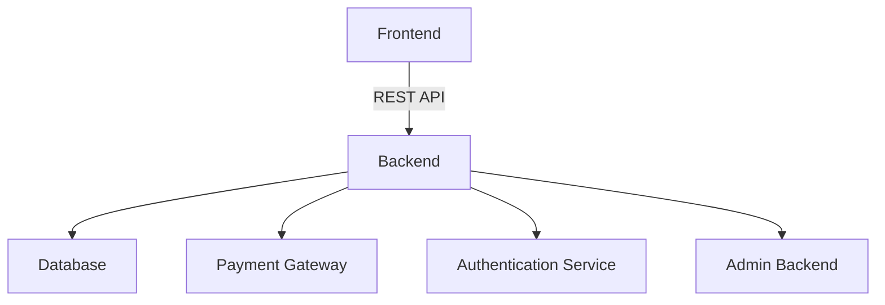

## 17.3 Implementing an E-commerce Platform

### Introduction

Building an e-commerce platform is a complex endeavor that involves managing various components such as inventory, orders, payments, and user accounts. These components must work seamlessly together to provide a smooth user experience. The complexity arises from the need to handle concurrent users, integrate with third-party services, and ensure data consistency and security.

Using TypeScript for such large-scale applications offers significant benefits, including type safety, which reduces runtime errors, and improved maintainability, which facilitates easier refactoring and scaling. This case study aims to demonstrate how design patterns can address the complexities of building an e-commerce platform, providing a robust and scalable solution.

### System Requirements

Before diving into the implementation, let's outline the key features our e-commerce platform will support:

- **User Registration and Authentication**: Secure user accounts with registration and login capabilities.
- **Product Catalog Management**: A comprehensive catalog that allows users to browse and search for products.
- **Shopping Cart Functionality**: Enabling users to add, remove, and update products in their cart.
- **Order Processing**: Managing the lifecycle of an order from creation to fulfillment.
- **Payment Integration**: Supporting multiple payment methods for user convenience.
- **Administrative Backend**: Allowing administrators to manage products, orders, and users.

### Architectural Overview

To manage the complexity of an e-commerce platform, we need a well-defined architecture. Here's a high-level overview of the system architecture:



**Description**: This diagram illustrates the separation of concerns among different modules. The frontend communicates with the backend via a REST API. The backend interacts with the database, payment gateway, and authentication service. The admin backend provides a separate interface for administrative tasks.

### Design Patterns Applied

Design patterns provide reusable solutions to common problems, making our codebase more modular and maintainable. Here are the key design patterns we'll apply:

- **Model-View-Controller (MVC)**: Structuring the frontend application to separate concerns.
- **Repository Pattern**: Abstracting data access from the database.
- **Singleton Pattern**: Managing configurations and database connections.
- **Factory Pattern**: Creating objects such as orders or users.
- **Observer Pattern**: Implementing event-driven features like real-time inventory updates.
- **Chain of Responsibility Pattern**: Handling requests through middleware.
- **Strategy Pattern**: Implementing different payment methods.
- **Decorator Pattern**: Adding features to product objects dynamically.
- **Facade Pattern**: Simplifying complex API interactions.

### Implementation Details

#### User Authentication

For user authentication, we will use the **Singleton Pattern** to manage the authentication service. This ensures that there is only one instance of the authentication service, providing a centralized point for managing user sessions.

```typescript
class AuthService {
  private static instance: AuthService;
  private constructor() {}

  static getInstance(): AuthService {
    if (!AuthService.instance) {
      AuthService.instance = new AuthService();
    }
    return AuthService.instance;
  }

  login(username: string, password: string): boolean {
    // Implement login logic
    return true;
  }

  logout(): void {
    // Implement logout logic
  }
}

// Usage
const authService = AuthService.getInstance();
authService.login('user', 'password');
```

**Security Best Practices**: Ensure passwords are hashed and stored securely. Use tokens for session management and implement measures to prevent common vulnerabilities such as SQL injection and cross-site scripting (XSS).

#### Product Catalog

The product catalog is a critical component of the platform. We'll design the product model with extensibility in mind, using the **Decorator Pattern** to handle product variations and promotions.

```typescript
interface Product {
  getPrice(): number;
}

class BasicProduct implements Product {
  constructor(private price: number) {}

  getPrice(): number {
    return this.price;
  }
}

class DiscountDecorator implements Product {
  constructor(private product: Product, private discount: number) {}

  getPrice(): number {
    return this.product.getPrice() * (1 - this.discount);
  }
}

// Usage
const basicProduct = new BasicProduct(100);
const discountedProduct = new DiscountDecorator(basicProduct, 0.1);
console.log(discountedProduct.getPrice()); // Outputs: 90
```

#### Shopping Cart

The shopping cart will use the **Observer Pattern** to update cart totals when items are added or removed. This ensures that the cart's state is always consistent with the user's actions.

```typescript
class ShoppingCart {
  private items: Product[] = [];
  private observers: Function[] = [];

  addObserver(observer: Function): void {
    this.observers.push(observer);
  }

  addItem(item: Product): void {
    this.items.push(item);
    this.notifyObservers();
  }

  private notifyObservers(): void {
    this.observers.forEach(observer => observer(this.items));
  }
}

// Usage
const cart = new ShoppingCart();
cart.addObserver((items) => console.log('Cart updated:', items));
cart.addItem(new BasicProduct(50));
```

#### Order Processing

Order processing involves multiple steps, from validation to payment and fulfillment. We'll use the **Command Pattern** to encapsulate order operations, allowing us to queue, log, or undo operations if necessary.

```typescript
interface OrderCommand {
  execute(): void;
}

class CreateOrderCommand implements OrderCommand {
  constructor(private orderId: string) {}

  execute(): void {
    console.log(`Creating order ${this.orderId}`);
    // Implement order creation logic
  }
}

// Usage
const createOrder = new CreateOrderCommand('12345');
createOrder.execute();
```

#### Payment Integration

To support multiple payment gateways, we'll apply the **Strategy Pattern**. This allows us to define a family of algorithms (payment methods) and make them interchangeable.

```typescript
interface PaymentStrategy {
  pay(amount: number): void;
}

class CreditCardPayment implements PaymentStrategy {
  pay(amount: number): void {
    console.log(`Paid ${amount} using Credit Card`);
  }
}

class PayPalPayment implements PaymentStrategy {
  pay(amount: number): void {
    console.log(`Paid ${amount} using PayPal`);
  }
}

// Usage
const paymentMethod: PaymentStrategy = new CreditCardPayment();
paymentMethod.pay(100);
```

#### Admin Backend

The admin backend will use the **MVC Pattern** to separate concerns, making it easier to manage and extend. We'll also implement role-based access control using the **Proxy Pattern** to ensure only authorized users can perform certain actions.

```typescript
class AdminProxy {
  constructor(private adminService: AdminService, private userRole: string) {}

  performAction(action: string): void {
    if (this.userRole === 'admin') {
      this.adminService.performAction(action);
    } else {
      console.log('Access denied');
    }
  }
}

// Usage
const adminService = new AdminService();
const adminProxy = new AdminProxy(adminService, 'admin');
adminProxy.performAction('deleteUser');
```

### Database and Data Access

We'll use the **Repository Pattern** to abstract database interactions, making it easier to test and change the data source without affecting business logic. This pattern provides a clean separation between the data access layer and the business logic.

```typescript
interface ProductRepository {
  findAll(): Product[];
  findById(id: string): Product | null;
}

class InMemoryProductRepository implements ProductRepository {
  private products: Product[] = [];

  findAll(): Product[] {
    return this.products;
  }

  findById(id: string): Product | null {
    return this.products.find(product => product.id === id) || null;
  }
}

// Usage
const productRepo: ProductRepository = new InMemoryProductRepository();
const products = productRepo.findAll();
```

### Scalability Considerations

Scalability is a critical aspect of an e-commerce platform. The chosen patterns and architecture support scaling by:

- **Load Balancing**: Distributing incoming requests across multiple servers to ensure no single server is overwhelmed.
- **Caching**: Storing frequently accessed data in memory to reduce database load.
- **Asynchronous Processing**: Using message queues to handle tasks that don't require immediate processing, such as sending confirmation emails.

### Testing and Quality Assurance

Testing is crucial to ensure the reliability of the platform. We'll employ various testing strategies:

- **Unit Tests**: Testing individual components in isolation.
- **Integration Tests**: Testing the interaction between different components.
- **End-to-End Tests**: Simulating user interactions to test the entire system.

Design patterns promote modularity, making it easier to test components in isolation and mock dependencies.

### Security Considerations

Security is paramount in an e-commerce platform. We'll implement secure coding practices, including:

- **Data Validation**: Ensuring all input is validated and sanitized.
- **Secure Communication**: Using HTTPS to encrypt data in transit.
- **Protection Against Vulnerabilities**: Implementing measures to prevent SQL injection, XSS, and CSRF attacks.

### Challenges and Solutions

Building an e-commerce platform presents several challenges, such as handling concurrent users and integrating third-party services. Design patterns help overcome these challenges by providing a structured approach to problem-solving.

For example, the **Observer Pattern** allows us to efficiently manage real-time updates, while the **Facade Pattern** simplifies complex API interactions, making it easier to integrate with external services.

### Conclusion

In this case study, we've explored how design patterns can be applied to build a scalable and maintainable e-commerce platform using TypeScript. By leveraging patterns such as MVC, Repository, and Strategy, we've addressed the complexities of managing inventory, orders, and payments. We encourage readers to apply these principles in their projects to achieve similar success.

### Additional Resources

For further exploration, consider the following resources:

- [TypeScript E-commerce Boilerplate](https://github.com/your-repo)
- [TypeORM Documentation](https://typeorm.io/)
- [RxJS Documentation](https://rxjs.dev/)
- [Node.js Best Practices](https://github.com/goldbergyoni/nodebestpractices)

## Quiz Time!



### Which design pattern is used to manage configurations and database connections in the e-commerce platform?

- [x] Singleton Pattern
- [ ] Factory Pattern
- [ ] Observer Pattern
- [ ] Strategy Pattern

> **Explanation:** The Singleton Pattern ensures that there is only one instance of a class, making it ideal for managing configurations and database connections.

### What pattern is applied to handle product variations and promotions?

- [ ] Factory Pattern
- [x] Decorator Pattern
- [ ] Observer Pattern
- [ ] Command Pattern

> **Explanation:** The Decorator Pattern allows for adding features to objects dynamically, making it suitable for handling product variations and promotions.

### How does the Observer Pattern benefit the shopping cart functionality?

- [x] It updates cart totals when items are added or removed.
- [ ] It manages user authentication.
- [ ] It handles payment processing.
- [ ] It abstracts database interactions.

> **Explanation:** The Observer Pattern is used to update cart totals dynamically as items are added or removed, ensuring consistency.

### Which pattern is used to encapsulate order operations?

- [ ] Strategy Pattern
- [ ] Observer Pattern
- [x] Command Pattern
- [ ] Factory Pattern

> **Explanation:** The Command Pattern encapsulates order operations, allowing for queuing, logging, or undoing operations.

### What pattern supports multiple payment gateways?

- [x] Strategy Pattern
- [ ] Singleton Pattern
- [ ] Observer Pattern
- [ ] Command Pattern

> **Explanation:** The Strategy Pattern allows for defining a family of algorithms (payment methods) and making them interchangeable.

### Which pattern is used for role-based access control in the admin backend?

- [ ] Factory Pattern
- [ ] Observer Pattern
- [ ] Command Pattern
- [x] Proxy Pattern

> **Explanation:** The Proxy Pattern is used to control access to certain actions based on user roles, ensuring security.

### How does the Repository Pattern benefit database interactions?

- [x] It abstracts database interactions, facilitating testing and changes.
- [ ] It manages user authentication.
- [ ] It handles payment processing.
- [ ] It updates cart totals.

> **Explanation:** The Repository Pattern abstracts database interactions, making it easier to test and change the data source without affecting business logic.

### What is a key scalability consideration for the e-commerce platform?

- [x] Load balancing
- [ ] User authentication
- [ ] Payment processing
- [ ] Role-based access control

> **Explanation:** Load balancing is crucial for distributing incoming requests across multiple servers, ensuring scalability.

### Which testing strategy involves simulating user interactions?

- [ ] Unit Tests
- [ ] Integration Tests
- [x] End-to-End Tests
- [ ] Load Tests

> **Explanation:** End-to-End Tests simulate user interactions to test the entire system, ensuring it functions as expected.

### True or False: The Facade Pattern simplifies complex API interactions.

- [x] True
- [ ] False

> **Explanation:** The Facade Pattern provides a simplified interface to complex subsystems, making API interactions easier.


