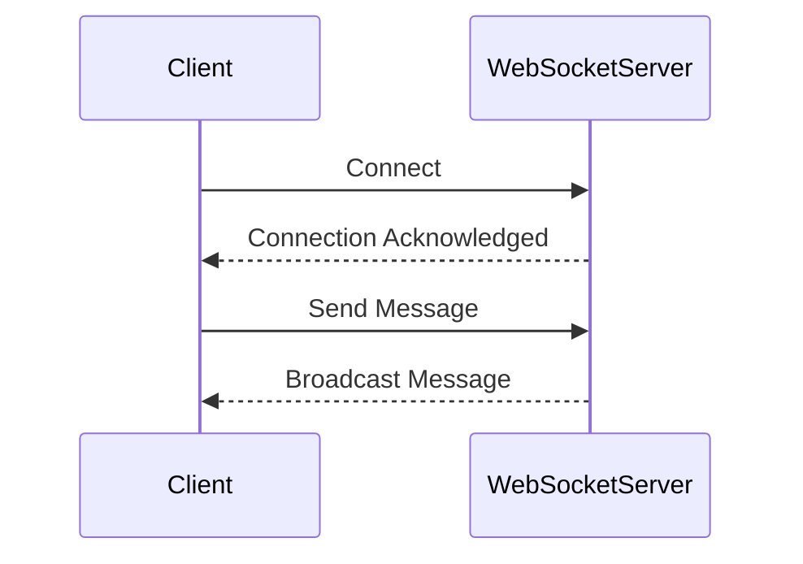

## 17.5 Designing a Real-Time Chat Application

### Introduction

In today's digital age, real-time chat applications have become a cornerstone of communication, enabling instant connectivity across the globe. From social networking platforms to customer support systems, real-time messaging is integral to modern web and mobile applications. However, developing a robust chat application involves navigating complexities such as real-time data transmission, user interaction management, and system scalability.

TypeScript, with its static typing and modern JavaScript features, combined with design patterns, offers a powerful toolkit for building scalable and maintainable chat systems. In this case study, we will explore how to architect a real-time chat application using TypeScript and various design patterns to address these challenges.

### Application Requirements

Before diving into the design patterns and architecture, let's outline the core features that our real-time chat application will support:

- **User Authentication and Management**: Securely authenticate users and manage their sessions.
- **Real-Time Messaging**: Enable users to send and receive messages instantly, whether in one-on-one or group chats.
- **Online/Offline Status Indicators**: Display users' current status to others.
- **Message History and Persistence**: Store and retrieve past messages for continuity.
- **Notifications**: Alert users to new messages or changes in status.

### Design Patterns Employed

To achieve these features, we'll employ several design patterns that provide reusable solutions to common problems in software design:

- **Observer Pattern**: For real-time event handling and updating user interfaces.
- **Mediator Pattern**: To manage communication between multiple users and components.
- **Publish/Subscribe Pattern**: To decouple message producers and consumers.
- **Singleton Pattern**: For managing WebSocket or SignalR connections.
- **Factory Pattern**: To create message and user objects.
- **Proxy Pattern**: To control access to resources and handle network communication.

### Architecture Overview

Our chat application will consist of three main components: frontend, backend, and network. Here's a high-level overview of the architecture:

- **Frontend**: Built with a modern JavaScript framework like React or Angular, utilizing TypeScript for type safety and maintainability.
- **Backend**: A Node.js server handling authentication, message routing, and persistence.
- **Network**: Using WebSockets for real-time communication, providing a full-duplex communication channel over a single TCP connection.

#### Real-Time Communication

For real-time features, we will use WebSockets due to their efficiency and support for bi-directional communication. This choice allows us to push updates to clients instantly, which is crucial for a responsive chat application.



### Implementation Details

#### Real-Time Messaging

To handle real-time messaging, we will implement the Observer and Publish/Subscribe Patterns. These patterns allow us to broadcast messages to all connected clients efficiently.

```typescript
// Observer Pattern Implementation
class ChatRoom {
    private observers: Set<Observer> = new Set();

    public subscribe(observer: Observer): void {
        this.observers.add(observer);
    }

    public unsubscribe(observer: Observer): void {
        this.observers.delete(observer);
    }

    public notify(message: string): void {
        this.observers.forEach(observer => observer.update(message));
    }
}

interface Observer {
    update(message: string): void;
}

class User implements Observer {
    constructor(private name: string) {}

    update(message: string): void {
        console.log(`${this.name} received message: ${message}`);
    }
}

// Usage
const chatRoom = new ChatRoom();
const user1 = new User("Alice");
const user2 = new User("Bob");

chatRoom.subscribe(user1);
chatRoom.subscribe(user2);

chatRoom.notify("Hello, everyone!");
```

#### User Management

For managing user sessions, we will use the Singleton Pattern. This ensures that we have a single instance managing user connections and sessions.

```typescript
// Singleton Pattern for Session Management
class SessionManager {
    private static instance: SessionManager;
    private sessions: Map<string, UserSession> = new Map();

    private constructor() {}

    public static getInstance(): SessionManager {
        if (!SessionManager.instance) {
            SessionManager.instance = new SessionManager();
        }
        return SessionManager.instance;
    }

    public createSession(userId: string): UserSession {
        const session = new UserSession(userId);
        this.sessions.set(userId, session);
        return session;
    }

    public getSession(userId: string): UserSession | undefined {
        return this.sessions.get(userId);
    }
}

class UserSession {
    constructor(public userId: string) {}
}

// Usage
const sessionManager = SessionManager.getInstance();
const session = sessionManager.createSession("user123");
```

#### Message Handling

To ensure consistent message processing, we'll apply the Command Pattern. This pattern encapsulates a request as an object, allowing us to parameterize and queue messages.

```typescript
// Command Pattern for Message Processing
interface Command {
    execute(): void;
}

class SendMessageCommand implements Command {
    constructor(private message: string, private chatRoom: ChatRoom) {}

    execute(): void {
        this.chatRoom.notify(this.message);
    }
}

// Usage
const sendMessage = new SendMessageCommand("Hello, World!", chatRoom);
sendMessage.execute();
```

#### UI Updates

The Observer Pattern will also be used to update the user interface in response to events such as new messages or user status changes. Components will subscribe to relevant events and update accordingly.

```typescript
// UI Component subscribing to chat updates
class ChatComponent implements Observer {
    constructor(private chatRoom: ChatRoom) {
        this.chatRoom.subscribe(this);
    }

    update(message: string): void {
        // Update UI with new message
        console.log("New message received:", message);
    }
}

// Usage
const chatComponent = new ChatComponent(chatRoom);
```

#### Scalability Considerations

To support many concurrent users, we need to consider scalability strategies. These include:

- **Load Balancing**: Distributing incoming requests across multiple servers.
- **Message Queue Systems**: Using systems like RabbitMQ or Kafka to handle message distribution.
- **Redis for Pub/Sub**: Leveraging Redis to manage real-time message broadcasting.

#### Persistence and Message History

For storing message history, we'll implement a data storage solution. The Repository Pattern will help abstract database interactions, making it easier to switch between different storage solutions if needed.

```typescript
// Repository Pattern for Message Storage
interface MessageRepository {
    saveMessage(message: Message): Promise<void>;
    getMessageHistory(chatRoomId: string): Promise<Message[]>;
}

class InMemoryMessageRepository implements MessageRepository {
    private messages: Map<string, Message[]> = new Map();

    async saveMessage(message: Message): Promise<void> {
        const messages = this.messages.get(message.chatRoomId) || [];
        messages.push(message);
        this.messages.set(message.chatRoomId, messages);
    }

    async getMessageHistory(chatRoomId: string): Promise<Message[]> {
        return this.messages.get(chatRoomId) || [];
    }
}

// Usage
const messageRepo = new InMemoryMessageRepository();
await messageRepo.saveMessage(new Message("user123", "Hello!"));
```

### Security Considerations

Security is paramount in a chat application. We must address potential issues such as data encryption, authentication, and authorization. The Proxy Pattern can be used to manage secure access to backend services, ensuring that only authorized users can access certain resources.

```typescript
// Proxy Pattern for Secure Access
interface ChatService {
    sendMessage(userId: string, message: string): void;
}

class RealChatService implements ChatService {
    sendMessage(userId: string, message: string): void {
        console.log(`Message from ${userId}: ${message}`);
    }
}

class ChatServiceProxy implements ChatService {
    constructor(private realService: RealChatService, private userId: string) {}

    sendMessage(userId: string, message: string): void {
        if (this.userId === userId) {
            this.realService.sendMessage(userId, message);
        } else {
            console.log("Unauthorized access attempt");
        }
    }
}

// Usage
const realService = new RealChatService();
const proxy = new ChatServiceProxy(realService, "user123");
proxy.sendMessage("user123", "Hello, secure world!");
```

### Testing Strategies

Testing real-time features requires a combination of unit tests and integration tests. Tools like Jest and Mocha can be used for unit testing, while tools like Selenium or Cypress can simulate multiple users and message traffic for integration testing.

- **Unit Tests**: Test individual components and services in isolation.
- **Integration Tests**: Test the interaction between components, ensuring that real-time features work as expected.
- **Load Testing**: Simulate high traffic to test scalability and performance.

### Challenges and Solutions

Developing a real-time chat application presents several challenges, such as network latency, connection drops, and data consistency. Design patterns help mitigate these issues by providing structured solutions:

- **Network Latency**: Use the Observer Pattern to minimize the impact of latency by updating the UI asynchronously.
- **Connection Drops**: Implement reconnection logic using the Singleton Pattern to manage WebSocket connections.
- **Data Consistency**: Use the Command Pattern to ensure that messages are processed in a consistent manner.

### Conclusion

In this case study, we've explored how to design a real-time chat application using TypeScript and design patterns. By leveraging patterns like Observer, Mediator, and Singleton, we can build a scalable, maintainable, and robust chat system. As you continue your journey, consider exploring advanced features such as media sharing or push notifications to enhance your application's capabilities.

### Additional Resources

For further reading and exploration, consider the following resources:

- [Socket.IO Documentation](https://socket.io/docs/)
- [SignalR Documentation](https://docs.microsoft.com/en-us/aspnet/core/signalr/introduction?view=aspnetcore-5.0)
- [TypeScript Handbook](https://www.typescriptlang.org/docs/handbook/intro.html)
- [Design Patterns: Elements of Reusable Object-Oriented Software](https://en.wikipedia.org/wiki/Design_Patterns)

## Quiz Time!



### Which design pattern is used for managing WebSocket connections in a chat application?

- [x] Singleton Pattern
- [ ] Observer Pattern
- [ ] Factory Pattern
- [ ] Proxy Pattern

> **Explanation:** The Singleton Pattern is used to ensure that there is only one instance of the WebSocket connection manager, providing a single point of access.

### What pattern helps decouple message producers and consumers in a chat application?

- [ ] Singleton Pattern
- [ ] Factory Pattern
- [x] Publish/Subscribe Pattern
- [ ] Proxy Pattern

> **Explanation:** The Publish/Subscribe Pattern decouples message producers and consumers, allowing them to communicate through a message broker.

### Which pattern is beneficial for real-time event handling and updating user interfaces?

- [ ] Singleton Pattern
- [x] Observer Pattern
- [ ] Factory Pattern
- [ ] Proxy Pattern

> **Explanation:** The Observer Pattern is ideal for handling real-time events and updating user interfaces as it allows objects to subscribe to and receive updates from a subject.

### How can the Command Pattern be used in a chat application?

- [x] For consistent message processing
- [ ] For managing WebSocket connections
- [ ] For creating user objects
- [ ] For secure access control

> **Explanation:** The Command Pattern encapsulates requests as objects, allowing for consistent processing of messages.

### What is a key advantage of using the Mediator Pattern in a chat application?

- [x] It manages communication between multiple users and components.
- [ ] It ensures a single instance of a class.
- [ ] It decouples message producers and consumers.
- [ ] It controls access to resources.

> **Explanation:** The Mediator Pattern centralizes communication between components, reducing dependencies and simplifying interactions.

### Which pattern can be used to manage secure access to backend services?

- [ ] Observer Pattern
- [ ] Factory Pattern
- [ ] Singleton Pattern
- [x] Proxy Pattern

> **Explanation:** The Proxy Pattern controls access to resources, making it suitable for managing secure access to backend services.

### What is the role of the Repository Pattern in a chat application?

- [x] To abstract database interactions
- [ ] To manage WebSocket connections
- [ ] To handle real-time events
- [ ] To create user objects

> **Explanation:** The Repository Pattern abstracts database interactions, allowing for flexible data storage solutions.

### Which pattern is used to create message and user objects?

- [ ] Singleton Pattern
- [ ] Observer Pattern
- [x] Factory Pattern
- [ ] Proxy Pattern

> **Explanation:** The Factory Pattern is used to create objects, such as messages and users, providing a flexible way to instantiate them.

### How does the Observer Pattern help with network latency?

- [x] By updating the UI asynchronously
- [ ] By managing WebSocket connections
- [ ] By controlling access to resources
- [ ] By creating message objects

> **Explanation:** The Observer Pattern allows the UI to update asynchronously, minimizing the impact of network latency.

### True or False: The Singleton Pattern is used to decouple message producers and consumers.

- [ ] True
- [x] False

> **Explanation:** The Singleton Pattern is used to ensure a single instance of a class, not for decoupling message producers and consumers.


