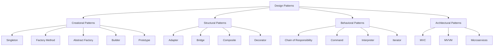

## 18.1 Recap of Key Concepts

As we reach the conclusion of our journey through the world of design patterns in TypeScript, it's time to reflect on the key concepts and insights we've explored. This recap will serve as a comprehensive summary, reinforcing your understanding and highlighting how these concepts interconnect within TypeScript development.

### Summarizing Core Principles

At the heart of effective software design lies a set of foundational principles that guide us in creating robust and maintainable applications. Let's revisit these core principles:

#### Object-Oriented Design Principles

Object-oriented design (OOD) is a paradigm centered around the concept of "objects," which can contain data and code to manipulate that data. The principles of OOD help us structure our code in a way that promotes reuse, scalability, and maintainability. Key OOD principles include:

- **Encapsulation**: Bundling data with the methods that operate on that data, restricting direct access to some of the object's components.
- **Abstraction**: Hiding the complex reality while exposing only the necessary parts.
- **Inheritance**: Creating new classes based on existing classes to promote code reuse.
- **Polymorphism**: Allowing objects to be treated as instances of their parent class, enabling a single interface to represent different underlying forms (data types).

#### SOLID Principles

The SOLID principles are a set of five guidelines that help us design software that is easy to maintain and extend:

- **Single Responsibility Principle (SRP)**: A class should have only one reason to change, meaning it should have only one job or responsibility.
- **Open/Closed Principle (OCP)**: Software entities should be open for extension but closed for modification.
- **Liskov Substitution Principle (LSP)**: Objects of a superclass should be replaceable with objects of a subclass without affecting the correctness of the program.
- **Interface Segregation Principle (ISP)**: Clients should not be forced to depend on interfaces they do not use.
- **Dependency Inversion Principle (DIP)**: High-level modules should not depend on low-level modules. Both should depend on abstractions.

These principles underpin the effective use of design patterns in TypeScript, guiding us in creating systems that are both flexible and robust.

### Highlighting Key Design Patterns

Throughout this guide, we've explored a variety of design patterns, each serving a unique purpose in software design. Let's categorize and summarize these patterns:

#### Creational Patterns

Creational patterns deal with object creation mechanisms, trying to create objects in a manner suitable to the situation. They help make a system independent of how its objects are created, composed, and represented.

- **Singleton Pattern**: Ensures a class has only one instance and provides a global point of access to it. Useful in scenarios like managing a shared resource or configuration settings.
  
  ```typescript
  class Singleton {
    private static instance: Singleton;
    private constructor() {}
    
    public static getInstance(): Singleton {
      if (!Singleton.instance) {
        Singleton.instance = new Singleton();
      }
      return Singleton.instance;
    }
  }
  ```

- **Factory Method Pattern**: Defines an interface for creating an object but lets subclasses alter the type of objects that will be created. Ideal for scenarios where a class can't anticipate the class of objects it must create.

- **Abstract Factory Pattern**: Provides an interface for creating families of related or dependent objects without specifying their concrete classes. Useful in UI component libraries where different themes or styles are needed.

- **Builder Pattern**: Separates the construction of a complex object from its representation, allowing the same construction process to create different representations. Useful for constructing complex objects step by step.

- **Prototype Pattern**: Creates new objects by copying an existing object, known as the prototype. Efficient for creating objects when the cost of creating a new instance is more expensive than copying an existing one.

- **Object Pool Pattern**: Manages a pool of reusable objects to improve performance, especially when object creation is costly.

- **Dependency Injection Pattern**: Passes dependencies to a class instead of hard-coding them, promoting loose coupling and enhancing testability.

- **Lazy Initialization Pattern**: Defers object creation until it is needed, improving performance by avoiding unnecessary computations.

- **Multiton Pattern**: Allows controlled creation of multiple instances with a key, useful for managing instances that are logically singleton per key.

#### Structural Patterns

Structural patterns are concerned with how classes and objects are composed to form larger structures. They help ensure that if one part of a system changes, the entire system doesn't need to change.

- **Adapter Pattern**: Allows incompatible interfaces to work together. It acts as a bridge between two incompatible interfaces.

- **Bridge Pattern**: Decouples an abstraction from its implementation so that the two can vary independently.

- **Composite Pattern**: Composes objects into tree structures to represent part-whole hierarchies, allowing clients to treat individual objects and compositions uniformly.

- **Decorator Pattern**: Attaches additional responsibilities to an object dynamically, providing a flexible alternative to subclassing for extending functionality.

- **Facade Pattern**: Provides a simplified interface to a complex subsystem, making it easier to use.

- **Flyweight Pattern**: Uses sharing to support large numbers of fine-grained objects efficiently.

- **Proxy Pattern**: Provides a surrogate or placeholder for another object to control access to it.

- **Module Pattern**: Encapsulates code within modules for better organization and maintainability.

- **Extension Object Pattern**: Adds functionality to objects dynamically by attaching new extension objects.

#### Behavioral Patterns

Behavioral patterns are concerned with algorithms and the assignment of responsibilities between objects. They help in defining how objects interact in a system.

- **Chain of Responsibility Pattern**: Passes a request along a chain of handlers until one handles it, decoupling sender and receiver.

- **Command Pattern**: Encapsulates a request as an object, allowing parameterization and queuing of requests.

- **Interpreter Pattern**: Defines a representation of a grammar and an interpreter to work with it.

- **Iterator Pattern**: Provides a way to access elements of a collection sequentially without exposing its underlying representation.

- **Mediator Pattern**: Defines an object that encapsulates how a set of objects interact, promoting loose coupling.

- **Memento Pattern**: Captures and restores an object's internal state without violating encapsulation.

- **Observer Pattern**: Defines a one-to-many dependency so that when one object changes state, all its dependents are notified.

- **State Pattern**: Allows an object to alter its behavior when its internal state changes.

- **Strategy Pattern**: Defines a family of algorithms, encapsulates each one, and makes them interchangeable.

- **Template Method Pattern**: Defines the skeleton of an algorithm, deferring exact steps to subclasses.

- **Visitor Pattern**: Represents an operation to be performed on elements of an object structure, allowing new operations to be added without modifying the classes.

- **Specification Pattern**: Combines business rules with logic to evaluate objects.

- **Publish/Subscribe Pattern**: Decouples components by using a message broker.

#### Architectural Patterns

Architectural patterns provide a blueprint for structuring software systems. They help in organizing code and managing complexity at a higher level.

- **Model-View-Controller (MVC) Pattern**: Divides an application into three interconnected components to separate internal representations from user interactions.

- **Model-View-ViewModel (MVVM) Pattern**: Structures code to separate development of user interfaces from business logic, facilitating data binding.

- **Flux and Redux Architecture**: Manages application state in predictable ways, promoting unidirectional data flow.

- **Microservices Architecture**: Designs applications as suites of independently deployable services.

- **Event-Driven Architecture**: Builds systems that react to events, promoting asynchronous communication.

- **Service-Oriented Architecture (SOA)**: Structures applications around reusable services.

- **Hexagonal Architecture (Ports and Adapters)**: Isolates application core from external factors via ports and adapters.

- **Micro Frontends**: Architectures front-end applications as independent microservices.

### Interconnections and Relationships

Design patterns often work best when combined, allowing us to solve complex problems more effectively. Here are some ways patterns interconnect:

- **Composition Over Inheritance**: Many patterns, such as Decorator and Strategy, favor composition over inheritance, promoting flexibility and reuse.

- **Separation of Concerns**: Patterns like MVC and MVVM emphasize separating different aspects of a program to improve modularity and maintainability.

- **Loose Coupling and High Cohesion**: Patterns like Observer and Mediator promote loose coupling between components, while patterns like Composite and Facade encourage high cohesion within components.

- **Reusability and Extensibility**: Patterns such as Factory Method and Abstract Factory enhance reusability and extensibility by decoupling object creation from usage.

- **State Management**: Patterns like State, Memento, and Command provide mechanisms for managing state changes and undo/redo functionality.

### TypeScript-Specific Insights

TypeScript's features significantly enhance the implementation of design patterns, offering strong typing, interfaces, and generics that improve code quality and maintainability.

- **Type System**: TypeScript's static typing helps catch errors early and provides better tooling support. It allows us to define clear contracts using interfaces and type aliases.

- **Interfaces and Generics**: Interfaces allow us to define contracts for classes, while generics enable us to write reusable and flexible code. These features are particularly useful in patterns like Strategy and Observer.

- **Decorators**: TypeScript supports decorators, which can be used to modify classes and methods, aligning well with the Decorator pattern.

- **Modules and Namespaces**: TypeScript's module system helps organize code, making it easier to implement patterns like Module and Facade.

### Practical Applications

Throughout the guide, we've explored real-world applications and case studies that demonstrate the power of design patterns in building scalable, maintainable, and efficient TypeScript applications.

- **Web Frameworks**: Patterns like MVC and MVVM are foundational in web frameworks like Angular and React, helping manage complexity and improve code organization.

- **State Management**: Redux, a popular state management library, leverages patterns like Flux and Command to manage application state predictably.

- **Microservices**: The Microservices architecture pattern is widely used in building scalable backend systems, allowing independent deployment and scaling of services.

- **Real-Time Applications**: Patterns like Observer and Publish/Subscribe are crucial in building real-time applications, enabling efficient event handling and data updates.

### Encourage Reflection

As we conclude, take a moment to reflect on how these concepts can be applied in your own projects. Consider how your understanding of design patterns has evolved through this guide and how you can leverage these patterns to enhance your TypeScript applications.

Remember, mastering design patterns is a journey. As you continue to explore and apply these concepts, you'll gain deeper insights and develop more sophisticated solutions. Keep experimenting, stay curious, and enjoy the journey!

### Visual Aids

To help visualize the interconnections between these concepts, let's use a mind map to represent the relationships between different design patterns and principles.



This mind map illustrates how different patterns are categorized and how they relate to each other, providing a visual summary of the key concepts covered in this guide.

## Quiz Time!



### Which principle emphasizes that a class should have only one reason to change?

- [x] Single Responsibility Principle
- [ ] Open/Closed Principle
- [ ] Liskov Substitution Principle
- [ ] Dependency Inversion Principle

> **Explanation:** The Single Responsibility Principle states that a class should have only one reason to change, meaning it should have only one job or responsibility.


### What is the main benefit of the Factory Method pattern?

- [x] It defines an interface for creating objects but lets subclasses alter the type of objects that will be created.
- [ ] It ensures a class has only one instance.
- [ ] It provides a simplified interface to a complex subsystem.
- [ ] It allows incompatible interfaces to work together.

> **Explanation:** The Factory Method pattern defines an interface for creating objects but lets subclasses alter the type of objects that will be created, promoting flexibility.


### Which pattern is used to compose objects into tree structures to represent part-whole hierarchies?

- [x] Composite Pattern
- [ ] Adapter Pattern
- [ ] Bridge Pattern
- [ ] Decorator Pattern

> **Explanation:** The Composite Pattern is used to compose objects into tree structures to represent part-whole hierarchies, allowing clients to treat individual objects and compositions uniformly.


### How does the Observer pattern help in software design?

- [x] It defines a one-to-many dependency so that when one object changes state, all its dependents are notified.
- [ ] It encapsulates a request as an object, allowing parameterization and queuing.
- [ ] It provides a surrogate or placeholder for another object to control access to it.
- [ ] It separates the construction of a complex object from its representation.

> **Explanation:** The Observer pattern defines a one-to-many dependency so that when one object changes state, all its dependents are notified, promoting loose coupling.


### What is a key advantage of using TypeScript's type system in design patterns?

- [x] It helps catch errors early and provides better tooling support.
- [ ] It allows for dynamic typing.
- [ ] It simplifies code by removing type annotations.
- [ ] It restricts the use of interfaces and generics.

> **Explanation:** TypeScript's type system helps catch errors early and provides better tooling support, enhancing the implementation of design patterns.


### Which architectural pattern divides an application into three interconnected components?

- [x] Model-View-Controller (MVC) Pattern
- [ ] Microservices Architecture
- [ ] Event-Driven Architecture
- [ ] Hexagonal Architecture

> **Explanation:** The Model-View-Controller (MVC) Pattern divides an application into three interconnected components to separate internal representations from user interactions.


### What is the main purpose of the Decorator pattern?

- [x] To attach additional responsibilities to an object dynamically.
- [ ] To provide a simplified interface to a complex subsystem.
- [ ] To ensure a class has only one instance.
- [ ] To decouple an abstraction from its implementation.

> **Explanation:** The Decorator pattern attaches additional responsibilities to an object dynamically, providing a flexible alternative to subclassing for extending functionality.


### Which pattern is crucial in building real-time applications for efficient event handling?

- [x] Observer Pattern
- [ ] Singleton Pattern
- [ ] Factory Method Pattern
- [ ] Proxy Pattern

> **Explanation:** The Observer Pattern is crucial in building real-time applications, enabling efficient event handling and data updates.


### How does the Strategy pattern simplify code?

- [x] By defining a family of algorithms, encapsulating each one, and making them interchangeable.
- [ ] By providing a surrogate or placeholder for another object to control access to it.
- [ ] By using sharing to support large numbers of fine-grained objects efficiently.
- [ ] By encapsulating a request as an object, allowing parameterization and queuing.

> **Explanation:** The Strategy pattern simplifies code by defining a family of algorithms, encapsulating each one, and making them interchangeable, avoiding complex conditionals.


### True or False: The SOLID principles are only applicable to object-oriented programming.

- [x] True
- [ ] False

> **Explanation:** The SOLID principles are primarily designed for object-oriented programming to help create systems that are easy to maintain and extend.


