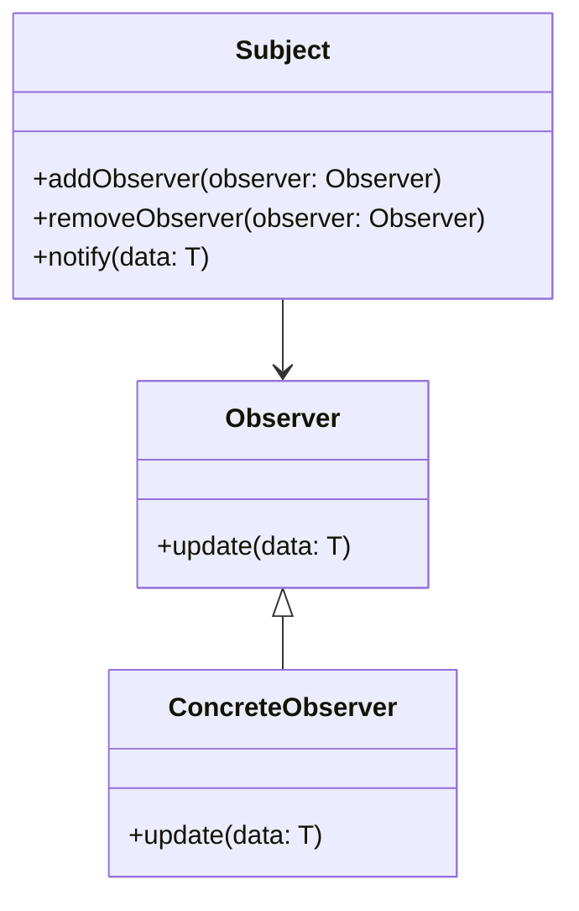

## 19.6 Frequently Asked Questions (FAQ)

Welcome to the FAQ section of "Design Patterns in TypeScript for Expert Software Engineers." Here, we address common questions and concerns that developers often encounter when working with design patterns in TypeScript. Our goal is to provide clear and concise answers that enhance your understanding and help you apply these patterns effectively in your projects.

### General Questions

#### 1. What are design patterns, and why are they important?

Design patterns are reusable solutions to common problems in software design. They provide a template for how to solve a problem in a way that is proven to be effective. Understanding and applying design patterns can lead to more maintainable, scalable, and robust code. They help in communicating design ideas more effectively and can significantly reduce the time needed to solve complex design issues.

#### 2. How do design patterns differ from algorithms?

While both design patterns and algorithms are solutions to problems, they address different types of issues. Algorithms are step-by-step procedures for calculations, data processing, and automated reasoning tasks. Design patterns, on the other hand, are high-level strategies for solving common problems in software architecture and design, focusing on the relationships and interactions between classes or objects.

#### 3. Are design patterns language-specific?

No, design patterns are not language-specific. They are conceptual solutions that can be implemented in any programming language. However, the implementation details may vary depending on the language features. This guide focuses on implementing design patterns in TypeScript, leveraging its unique features like static typing and interfaces.

### Design Pattern Implementation

#### 4. How can I decide which design pattern to use?

Choosing the right design pattern depends on the problem you are trying to solve. Here are a few steps to guide you:
- **Identify the problem**: Clearly define the problem you are facing.
- **Understand the context**: Consider the context in which the problem occurs.
- **Match the pattern**: Look for a design pattern that addresses similar problems.
- **Evaluate trade-offs**: Consider the trade-offs of using a particular pattern, such as complexity and performance.

Refer to Chapter 16, "Selecting the Right Pattern," for more detailed guidance.

#### 5. Can I combine multiple design patterns in a single application?

Yes, combining multiple design patterns is common in complex applications. Patterns can complement each other and address different aspects of a problem. For example, you might use the Singleton pattern to manage a single instance of a class and the Observer pattern to notify other parts of the application about changes in that instance. Chapter 13, "Applying Multiple Patterns," provides insights into combining patterns effectively.

#### 6. How do I implement the Singleton pattern in TypeScript?

The Singleton pattern ensures that a class has only one instance and provides a global point of access to it. Here’s a simple implementation in TypeScript:

```typescript
class Singleton {
  private static instance: Singleton;

  private constructor() {
    // Private constructor to prevent instantiation
  }

  public static getInstance(): Singleton {
    if (!Singleton.instance) {
      Singleton.instance = new Singleton();
    }
    return Singleton.instance;
  }
}

// Usage
const singleton1 = Singleton.getInstance();
const singleton2 = Singleton.getInstance();
console.log(singleton1 === singleton2); // true
```

In this example, the `getInstance` method ensures that only one instance of the `Singleton` class is created. For more details, see Section 4.1, "Singleton Pattern."

### TypeScript Features

#### 7. What TypeScript features are particularly useful for implementing design patterns?

TypeScript offers several features that enhance the implementation of design patterns:
- **Static Typing**: Helps catch errors at compile time and provides better code documentation.
- **Interfaces**: Allow you to define contracts for classes, which is useful for patterns like Factory and Strategy.
- **Generics**: Enable the creation of reusable components, which can be applied in patterns like Iterator and Observer.
- **Decorators**: Provide a way to add annotations and meta-programming syntax, useful in patterns like Decorator and Proxy.

For a comprehensive overview, refer to Chapter 3, "TypeScript Language Features and Best Practices."

#### 8. How do TypeScript interfaces help in implementing design patterns?

Interfaces in TypeScript define the structure that a class must follow, making them ideal for design patterns that rely on polymorphism. For instance, in the Strategy pattern, you can define an interface for different algorithms and then implement this interface in various classes. This allows you to switch algorithms at runtime without changing the client code.

```typescript
interface Strategy {
  execute(data: string): string;
}

class ConcreteStrategyA implements Strategy {
  execute(data: string): string {
    return `Strategy A: ${data}`;
  }
}

class ConcreteStrategyB implements Strategy {
  execute(data: string): string {
    return `Strategy B: ${data}`;
  }
}

class Context {
  private strategy: Strategy;

  constructor(strategy: Strategy) {
    this.strategy = strategy;
  }

  public setStrategy(strategy: Strategy): void {
    this.strategy = strategy;
  }

  public executeStrategy(data: string): string {
    return this.strategy.execute(data);
  }
}

// Usage
const context = new Context(new ConcreteStrategyA());
console.log(context.executeStrategy("data")); // Strategy A: data
context.setStrategy(new ConcreteStrategyB());
console.log(context.executeStrategy("data")); // Strategy B: data
```

### Performance Considerations

#### 9. Do design patterns impact performance?

Design patterns are primarily about improving code maintainability and scalability, but they can have performance implications. Some patterns, like Flyweight and Object Pool, are specifically designed to optimize performance by reducing memory usage or object creation overhead. However, patterns like Decorator or Proxy might introduce additional layers of abstraction, which could impact performance if not used judiciously.

#### 10. How can I ensure that using design patterns doesn't degrade performance?

To ensure that design patterns do not negatively impact performance, consider the following:
- **Profile your code**: Use profiling tools to identify bottlenecks.
- **Evaluate complexity**: Consider the complexity added by the pattern and whether it is justified.
- **Optimize critical paths**: Focus on optimizing parts of the code that are performance-critical.
- **Use lazy initialization**: Delay the creation of objects until they are needed, as demonstrated in the Lazy Initialization pattern.

Refer to Chapter 15, "Performance Optimization Patterns," for more strategies.

### Troubleshooting and Best Practices

#### 11. What are common pitfalls when implementing design patterns in TypeScript?

Some common pitfalls include:
- **Overengineering**: Using patterns unnecessarily can lead to complex and hard-to-maintain code.
- **Ignoring TypeScript features**: Not leveraging TypeScript's static typing and interfaces can lead to less robust implementations.
- **Misapplying patterns**: Using a pattern in the wrong context can introduce inefficiencies and bugs.

#### 12. How can I avoid overusing design patterns?

To avoid overusing design patterns, follow these guidelines:
- **Understand the problem**: Ensure that the pattern addresses a real problem.
- **Keep it simple**: Use the simplest solution that works.
- **Refactor when necessary**: Introduce patterns during refactoring if they simplify the code or improve maintainability.

### Advanced Topics

#### 13. How do I implement design patterns using TypeScript generics?

Generics allow you to create components that work with any data type, enhancing the flexibility of design patterns. For example, in the Observer pattern, you can use generics to define a subject that can notify observers with different types of data:

```typescript
interface Observer<T> {
  update(data: T): void;
}

class Subject<T> {
  private observers: Observer<T>[] = [];

  public addObserver(observer: Observer<T>): void {
    this.observers.push(observer);
  }

  public removeObserver(observer: Observer<T>): void {
    this.observers = this.observers.filter(obs => obs !== observer);
  }

  public notify(data: T): void {
    for (const observer of this.observers) {
      observer.update(data);
    }
  }
}

class ConcreteObserver implements Observer<number> {
  public update(data: number): void {
    console.log(`Received data: ${data}`);
  }
}

// Usage
const subject = new Subject<number>();
const observer = new ConcreteObserver();
subject.addObserver(observer);
subject.notify(42); // Received data: 42
```

### Visualizing Design Patterns

#### 14. How can I visualize the relationships in design patterns?

Visualizing design patterns can help in understanding the interactions between different components. Tools like UML diagrams can be used to represent class structures and relationships. Here's an example of a class diagram for the Observer pattern:



This diagram shows how the `Subject` class maintains a list of `Observer` objects and notifies them of changes.

### References and Further Reading

#### 15. Where can I find more resources on design patterns in TypeScript?

For further reading, consider the following resources:
- **"Design Patterns: Elements of Reusable Object-Oriented Software"** by Erich Gamma et al. - A foundational book on design patterns.
- **"Learning TypeScript"** by Remo H. Jansen - A comprehensive guide to TypeScript.
- **MDN Web Docs** - Offers extensive documentation on JavaScript and TypeScript features.
- **TypeScript Handbook** - The official guide to TypeScript.

### Knowledge Check

#### 16. How can I test my understanding of design patterns?

Engage with the following exercises:
- **Implement a pattern**: Choose a pattern and implement it in a small project.
- **Refactor existing code**: Identify areas in your codebase that could benefit from a design pattern.
- **Participate in code reviews**: Discuss design pattern implementations with peers to gain different perspectives.

### Embrace the Journey

Remember, mastering design patterns is a journey. As you continue to apply these patterns, you'll gain deeper insights and develop more efficient solutions. Stay curious, keep experimenting, and enjoy the process of becoming a more skilled software engineer.

## Quiz Time!



### What is the primary purpose of design patterns?

- [x] To provide reusable solutions to common software design problems.
- [ ] To optimize code for maximum performance.
- [ ] To ensure code compatibility across different languages.
- [ ] To replace the need for algorithms in programming.

> **Explanation:** Design patterns are primarily about providing reusable solutions to common design problems, not about performance optimization or replacing algorithms.

### How do design patterns differ from algorithms?

- [x] Design patterns are high-level strategies for solving design problems, while algorithms are step-by-step procedures for calculations.
- [ ] Design patterns are language-specific, while algorithms are not.
- [ ] Algorithms focus on code structure, while design patterns focus on data processing.
- [ ] Design patterns are only applicable to object-oriented programming.

> **Explanation:** Design patterns are strategies for solving design problems, whereas algorithms are specific procedures for calculations and data processing.

### Which TypeScript feature is particularly useful for implementing the Strategy pattern?

- [x] Interfaces
- [ ] Decorators
- [ ] Generics
- [ ] Modules

> **Explanation:** Interfaces in TypeScript allow you to define contracts for classes, making them ideal for implementing the Strategy pattern.

### What is a common pitfall when implementing design patterns?

- [x] Overengineering
- [ ] Underutilizing TypeScript features
- [ ] Ignoring design patterns altogether
- [ ] Using patterns only in large projects

> **Explanation:** Overengineering, or using patterns unnecessarily, can lead to complex and hard-to-maintain code.

### How can you avoid overusing design patterns?

- [x] Understand the problem and use the simplest solution that works.
- [ ] Always use design patterns for every problem.
- [ ] Avoid using design patterns in small projects.
- [ ] Use design patterns only for performance optimization.

> **Explanation:** To avoid overusing design patterns, ensure they address a real problem and use the simplest solution that works.

### What is the Singleton pattern used for?

- [x] Ensuring a class has only one instance and provides a global access point.
- [ ] Allowing multiple instances of a class with different configurations.
- [ ] Managing a collection of objects.
- [ ] Decoupling object creation from its usage.

> **Explanation:** The Singleton pattern ensures a class has only one instance and provides a global access point to it.

### How can TypeScript generics enhance design pattern implementation?

- [x] By allowing the creation of components that work with any data type.
- [ ] By enforcing strict data types in all components.
- [ ] By simplifying the creation of interfaces.
- [ ] By eliminating the need for type annotations.

> **Explanation:** TypeScript generics allow the creation of components that work with any data type, enhancing the flexibility of design patterns.

### What is a benefit of using the Flyweight pattern?

- [x] Reducing memory usage by sharing common data among objects.
- [ ] Simplifying the creation of complex objects.
- [ ] Ensuring a class has only one instance.
- [ ] Decoupling an abstraction from its implementation.

> **Explanation:** The Flyweight pattern reduces memory usage by sharing common data among multiple objects.

### Which design pattern is useful for notifying multiple objects about state changes?

- [x] Observer
- [ ] Singleton
- [ ] Factory
- [ ] Adapter

> **Explanation:** The Observer pattern is used to notify multiple objects about changes in another object's state.

### True or False: Design patterns are only applicable to object-oriented programming.

- [ ] True
- [x] False

> **Explanation:** Design patterns are applicable to various programming paradigms, not just object-oriented programming.




