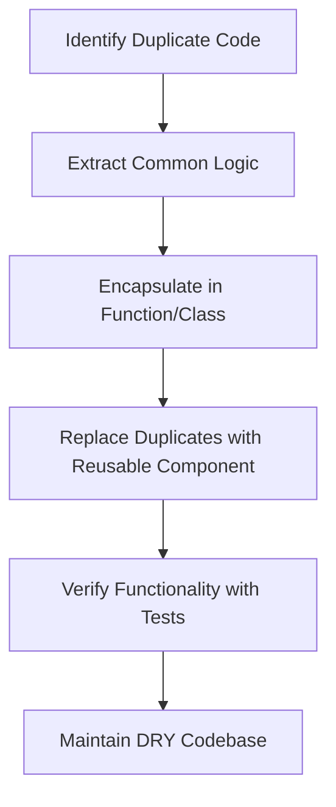

## 2.2 DRY (Don't Repeat Yourself)

### Introduction to the DRY Principle

The DRY (Don't Repeat Yourself) principle is a cornerstone of software engineering that emphasizes the reduction of code duplication to enhance maintainability and minimize errors. Coined by Andy Hunt and Dave Thomas in their book "The Pragmatic Programmer," the DRY principle advocates for the consolidation of knowledge within a system to ensure that any piece of information or logic is represented only once. This principle is crucial for creating scalable and maintainable codebases, especially in complex applications where redundancy can lead to inconsistencies and increased maintenance efforts.

### Understanding the Significance of DRY

In software development, redundancy can manifest in various forms, such as repeated code blocks, duplicated logic, or similar data structures across different modules. The DRY principle aims to eliminate these redundancies by encouraging developers to encapsulate reusable logic in functions, classes, or modules. By adhering to DRY, developers can achieve:

- **Reduced Maintenance Effort**: Changes need to be made in only one place, reducing the risk of errors and inconsistencies.
- **Improved Readability**: Code becomes easier to understand and navigate, as each piece of logic is defined in a single location.
- **Enhanced Flexibility**: Modifications can be implemented more efficiently, as changes propagate automatically to all instances of the reused logic.

### Code Duplication: The Hidden Enemy

To fully appreciate the DRY principle, it's essential to understand the negative impacts of code duplication. Let's explore a simple example in TypeScript:

```typescript
// Example of code duplication
function calculateAreaOfRectangle(width: number, height: number): number {
    return width * height;
}

function calculateAreaOfSquare(side: number): number {
    return side * side;
}

function calculateAreaOfCircle(radius: number): number {
    return Math.PI * radius * radius;
}
```

In this example, the logic for calculating areas is repeated across multiple functions. While the calculations differ slightly, the underlying concept of computing an area is duplicated. This duplication can lead to:

- **Increased Maintenance Effort**: If the formula for calculating an area changes, developers must update each function individually, increasing the risk of errors.
- **Inconsistencies**: If one function is updated while others are not, inconsistencies can arise, leading to incorrect results.
- **Code Bloat**: Repeated logic contributes to larger codebases, making it harder to navigate and understand.

### Applying the DRY Principle in TypeScript

To adhere to the DRY principle, developers can leverage TypeScript's features, such as functions, classes, modules, interfaces, and generics, to encapsulate reusable logic. Let's refactor the previous example using DRY principles:

```typescript
// DRY approach using a generic function
function calculateArea(shape: { type: string, dimensions: number[] }): number {
    switch (shape.type) {
        case 'rectangle':
            return shape.dimensions[0] * shape.dimensions[1];
        case 'square':
            return shape.dimensions[0] * shape.dimensions[0];
        case 'circle':
            return Math.PI * shape.dimensions[0] * shape.dimensions[0];
        default:
            throw new Error('Unknown shape type');
    }
}

// Usage
const rectangle = { type: 'rectangle', dimensions: [5, 10] };
const square = { type: 'square', dimensions: [4] };
const circle = { type: 'circle', dimensions: [3] };

console.log(calculateArea(rectangle)); // Output: 50
console.log(calculateArea(square));    // Output: 16
console.log(calculateArea(circle));    // Output: 28.27
```

In this refactored example, we use a single function, `calculateArea`, to handle different shapes. This approach reduces duplication and centralizes the logic for area calculation, making it easier to maintain and extend.

### Leveraging TypeScript's Interfaces and Generics

TypeScript's interfaces and generics provide powerful tools for abstracting common patterns and adhering to the DRY principle. By defining interfaces and using generics, developers can create flexible and reusable components.

#### Using Interfaces

Interfaces in TypeScript allow developers to define contracts for objects, ensuring consistency and reducing duplication. Consider the following example:

```typescript
// Define an interface for shapes
interface Shape {
    type: string;
    calculateArea(): number;
}

// Implement the interface for different shapes
class Rectangle implements Shape {
    constructor(private width: number, private height: number) {}

    calculateArea(): number {
        return this.width * this.height;
    }
}

class Square implements Shape {
    constructor(private side: number) {}

    calculateArea(): number {
        return this.side * this.side;
    }
}

class Circle implements Shape {
    constructor(private radius: number) {}

    calculateArea(): number {
        return Math.PI * this.radius * this.radius;
    }
}

// Usage
const shapes: Shape[] = [
    new Rectangle(5, 10),
    new Square(4),
    new Circle(3)
];

shapes.forEach(shape => console.log(shape.calculateArea()));
```

In this example, we define a `Shape` interface with a `calculateArea` method. Each shape class implements this interface, ensuring that the area calculation logic is encapsulated within each class. This approach adheres to the DRY principle by eliminating redundant logic and promoting code reuse.

#### Utilizing Generics

Generics in TypeScript allow developers to create reusable components that work with various data types. By using generics, developers can abstract common patterns and reduce duplication. Consider the following example:

```typescript
// Generic function to find the maximum value in an array
function findMax<T>(arr: T[], compare: (a: T, b: T) => number): T | null {
    if (arr.length === 0) return null;
    return arr.reduce((max, current) => compare(max, current) > 0 ? max : current);
}

// Usage with numbers
const numbers = [1, 5, 3, 9, 2];
const maxNumber = findMax(numbers, (a, b) => a - b);
console.log(maxNumber); // Output: 9

// Usage with strings
const strings = ['apple', 'banana', 'cherry'];
const maxString = findMax(strings, (a, b) => a.localeCompare(b));
console.log(maxString); // Output: 'cherry'
```

In this example, the `findMax` function is a generic function that can work with any data type, as long as a comparison function is provided. This approach reduces duplication by creating a single, reusable function for finding the maximum value in an array.

### When Violating DRY Might Be Justified

While the DRY principle is a valuable guideline, there are scenarios where violating it might be justified. These scenarios often involve trade-offs between DRY and other principles, such as simplicity or performance.

#### Avoiding Premature Optimization

In some cases, adhering strictly to the DRY principle can lead to over-abstraction, making the code more complex than necessary. It's essential to balance DRY with the KISS (Keep It Simple, Stupid) principle, which advocates for simplicity. Avoid premature optimization by focusing on clarity and maintainability first, and refactor for DRY when duplication becomes a significant issue.

#### Handling Performance Concerns

In performance-critical applications, adhering to DRY might introduce overhead that impacts performance. In such cases, duplicating code might be justified to achieve optimal performance, especially if the duplicated logic is small and unlikely to change.

#### Managing Different Contexts

In some scenarios, similar logic might be used in different contexts, each with unique requirements. In such cases, duplicating code might be justified to maintain clarity and avoid introducing unnecessary complexity.

### Best Practices for Identifying and Refactoring Duplicate Code

To effectively apply the DRY principle, developers should adopt best practices for identifying and refactoring duplicate code:

- **Conduct Code Reviews**: Regular code reviews help identify duplication and encourage adherence to the DRY principle.
- **Use Static Analysis Tools**: Tools like ESLint and SonarQube can help detect code duplication and suggest refactoring opportunities.
- **Leverage IDE Features**: Modern IDEs offer features like code inspection and refactoring tools to identify and eliminate duplication.
- **Encourage Team Collaboration**: Foster a culture of collaboration and knowledge sharing to ensure that team members are aware of existing reusable components.

### Tools and Techniques for Maintaining DRY Codebases

Maintaining a DRY codebase requires ongoing effort and the use of appropriate tools and techniques:

- **Version Control Systems**: Use version control systems like Git to track changes and ensure consistency across the codebase.
- **Automated Testing**: Implement automated tests to verify that refactoring efforts do not introduce errors.
- **Continuous Integration**: Use continuous integration pipelines to automate code quality checks and enforce DRY principles.
- **Documentation**: Maintain comprehensive documentation to ensure that team members understand the purpose and usage of reusable components.

### Visualizing DRY in Action

To better understand the DRY principle, let's visualize the process of refactoring duplicate code into a reusable component:



**Figure 1**: Visualizing the process of refactoring duplicate code into a reusable component.

### Knowledge Check

Before we conclude, let's reinforce our understanding with a few questions:

- What are the key benefits of adhering to the DRY principle?
- How can TypeScript's interfaces and generics help in reducing code duplication?
- When might it be justified to violate the DRY principle?

### Conclusion

The DRY principle is a fundamental concept in software engineering that promotes maintainability, readability, and flexibility by reducing code duplication. By leveraging TypeScript's features, such as functions, classes, interfaces, and generics, developers can effectively adhere to the DRY principle and create scalable, maintainable codebases. While there are scenarios where violating DRY might be justified, it's essential to balance DRY with other principles and adopt best practices for identifying and refactoring duplicate code.

Remember, maintaining a DRY codebase is an ongoing effort that requires collaboration, the use of appropriate tools, and a commitment to continuous improvement. As you continue your journey in software development, keep experimenting, stay curious, and embrace the principles that lead to high-quality, maintainable code.

## Quiz Time!



### What does the DRY principle stand for?

- [x] Don't Repeat Yourself
- [ ] Do Repeat Yourself
- [ ] Duplicate Reusable Yields
- [ ] Dynamic Resource Yielding

> **Explanation:** The DRY principle stands for "Don't Repeat Yourself," emphasizing the reduction of code duplication.

### Which of the following is a benefit of adhering to the DRY principle?

- [x] Reduced maintenance effort
- [ ] Increased code complexity
- [ ] More code duplication
- [ ] Slower performance

> **Explanation:** Adhering to the DRY principle reduces maintenance effort by centralizing logic and minimizing redundancy.

### What TypeScript feature can help reduce code duplication by defining contracts for objects?

- [x] Interfaces
- [ ] Variables
- [ ] Enums
- [ ] Promises

> **Explanation:** Interfaces in TypeScript define contracts for objects, promoting consistency and reducing duplication.

### When might it be justified to violate the DRY principle?

- [x] To avoid premature optimization
- [ ] To increase code duplication
- [ ] To decrease code readability
- [ ] To introduce more complexity

> **Explanation:** Violating DRY might be justified to avoid premature optimization and maintain simplicity.

### What tool can help detect code duplication in a TypeScript codebase?

- [x] ESLint
- [ ] Git
- [ ] Node.js
- [ ] Angular

> **Explanation:** ESLint is a static analysis tool that can help detect code duplication and suggest refactoring opportunities.

### Which TypeScript feature allows creating reusable components that work with various data types?

- [x] Generics
- [ ] Functions
- [ ] Variables
- [ ] Enums

> **Explanation:** Generics in TypeScript allow creating reusable components that work with different data types.

### What is a common consequence of code duplication?

- [x] Increased maintenance effort
- [ ] Improved performance
- [ ] Enhanced readability
- [ ] Reduced code size

> **Explanation:** Code duplication often leads to increased maintenance effort due to the need to update multiple instances of the same logic.

### Which principle should be balanced with DRY to avoid over-abstraction?

- [x] KISS (Keep It Simple, Stupid)
- [ ] YAGNI (You Aren't Gonna Need It)
- [ ] SOLID
- [ ] GRASP

> **Explanation:** The KISS principle should be balanced with DRY to avoid over-abstraction and maintain simplicity.

### What is a key step in refactoring duplicate code?

- [x] Extract common logic into a reusable component
- [ ] Increase code duplication
- [ ] Decrease code readability
- [ ] Introduce more complexity

> **Explanation:** A key step in refactoring duplicate code is to extract common logic into a reusable component.

### True or False: DRY principle always leads to better performance.

- [ ] True
- [x] False

> **Explanation:** While the DRY principle enhances maintainability, it does not always lead to better performance, as some scenarios may require code duplication for optimization.


