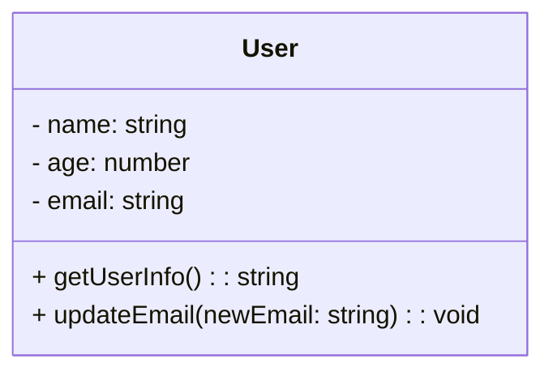

## 2.3 KISS (Keep It Simple, Stupid)

In the world of software engineering, the KISS principle—"Keep It Simple, Stupid"—serves as a guiding light for developers striving to create clean, efficient, and maintainable code. This principle emphasizes simplicity in design and implementation, which is particularly crucial in complex TypeScript applications. Let's delve into the origins of the KISS principle, explore why simplicity is vital, and examine strategies to maintain simplicity in your TypeScript projects.

### Origins of the KISS Principle

The KISS principle originated in the U.S. Navy in 1960, coined by aircraft engineer Kelly Johnson. The idea was to design systems that could be easily understood and repaired by average mechanics in the field under combat conditions. This concept has since been adopted in various fields, including software engineering, where it underscores the importance of simplicity.

### The Importance of Simplicity in Software Development

Simplicity in software development is not just a preference; it's a necessity. Complex code can lead to increased bugs, higher maintenance costs, and more challenging debugging processes. In TypeScript, where static typing and modern JavaScript features are leveraged, simplicity can significantly enhance readability and maintainability.

#### Benefits of Simplicity

1. **Readability**: Simple code is easier to read and understand, making it accessible to new team members and reducing the learning curve.
2. **Maintainability**: With fewer lines of code and less complexity, maintaining and updating the codebase becomes more straightforward.
3. **Reduced Errors**: Simplicity minimizes the potential for bugs and errors, as there are fewer interactions and dependencies to manage.
4. **Faster Development**: Simple solutions can be developed and tested more quickly, speeding up the development process.

### Examples of Complexity vs. Simplicity

Let's consider a TypeScript example to illustrate the difference between overly complicated code and a simplified version.

#### Overly Complicated Code

```typescript
class User {
    private name: string;
    private age: number;
    private email: string;
    private address: string;
    private phoneNumber: string;

    constructor(name: string, age: number, email: string, address: string, phoneNumber: string) {
        this.name = name;
        this.age = age;
        this.email = email;
        this.address = address;
        this.phoneNumber = phoneNumber;
    }

    public getUserInfo(): string {
        return `Name: ${this.name}, Age: ${this.age}, Email: ${this.email}, Address: ${this.address}, Phone: ${this.phoneNumber}`;
    }

    public updateEmail(newEmail: string): void {
        if (this.validateEmail(newEmail)) {
            this.email = newEmail;
        }
    }

    private validateEmail(email: string): boolean {
        // Complex email validation logic
        return /^[^\s@]+@[^\s@]+\.[^\s@]+$/.test(email);
    }
}
```

#### Simplified Version

```typescript
class User {
    constructor(
        private name: string,
        private age: number,
        private email: string
    ) {}

    public getUserInfo(): string {
        return `Name: ${this.name}, Age: ${this.age}, Email: ${this.email}`;
    }

    public updateEmail(newEmail: string): void {
        this.email = newEmail;
    }
}
```

**Key Differences**:
- The simplified version removes unnecessary properties and complex validation logic.
- It focuses on essential functionality, making it easier to read and maintain.

### Strategies to Achieve Simplicity

Achieving simplicity in software design requires deliberate effort and a strategic approach. Here are some effective strategies:

#### 1. Breaking Down Complex Problems

Divide complex problems into smaller, manageable pieces. This approach, often referred to as "divide and conquer," allows you to tackle each part independently, simplifying the overall solution.

**Example**: If you're building a large application, consider breaking it into modules or components, each responsible for a specific functionality.

#### 2. Avoiding Unnecessary Features

Resist the temptation to add features that are not immediately necessary. This practice, known as YAGNI (You Aren't Gonna Need It), helps keep the codebase lean and focused.

**Example**: If a feature is not required in the current iteration, defer its implementation until it's genuinely needed.

#### 3. Writing Clear and Straightforward Code

Prioritize clarity over cleverness. Use descriptive variable names, consistent formatting, and straightforward logic to enhance code readability.

**Example**: Instead of using complex one-liners, break them into multiple lines with comments explaining each step.

### Common Challenges in Maintaining Simplicity

Despite the best intentions, maintaining simplicity can be challenging. Here are some common obstacles and how to overcome them:

#### 1. Feature Creep

As projects evolve, there's often pressure to add more features, leading to increased complexity. To combat this, establish clear project goals and prioritize features based on their impact and necessity.

#### 2. Premature Optimization

Optimizing code too early can introduce unnecessary complexity. Focus on writing clear, correct code first, and optimize only when performance issues arise.

#### 3. Balancing Simplicity and Necessary Complexity

While simplicity is essential, some complexity is unavoidable, especially in large-scale applications. The key is to balance simplicity with the necessary complexity to meet functional requirements.

### TypeScript-Specific Examples

TypeScript offers features that can aid in maintaining simplicity, such as type inference, interfaces, and generics. Let's explore how these features can be used to simplify code.

#### Type Inference

TypeScript's type inference can reduce the need for explicit type annotations, simplifying code without sacrificing type safety.

```typescript
let userName = "Alice"; // TypeScript infers the type as string
```

#### Interfaces

Interfaces can define clear contracts for objects, promoting simplicity by ensuring consistent usage across the codebase.

```typescript
interface User {
    name: string;
    age: number;
    email: string;
}

function printUser(user: User): void {
    console.log(`Name: ${user.name}, Age: ${user.age}, Email: ${user.email}`);
}
```

#### Generics

Generics allow you to write flexible and reusable code, reducing duplication and complexity.

```typescript
function identity<T>(arg: T): T {
    return arg;
}

let output = identity<string>("Hello, TypeScript!");
```

### Encouraging a Simplicity Mindset

Adopting a mindset that values simplicity in design and implementation is crucial for long-term success. Encourage team members to:

- **Focus on the essentials**: Prioritize core functionality and defer non-essential features.
- **Embrace refactoring**: Regularly review and refactor code to eliminate complexity.
- **Foster collaboration**: Encourage open communication and knowledge sharing to identify simpler solutions.

### Visualizing Simplicity in Code

To better understand the impact of simplicity, let's visualize a simplified code structure using a class diagram.



**Diagram Description**: This class diagram represents a simplified `User` class with three properties and two methods, emphasizing a straightforward design.

### Knowledge Check

To reinforce your understanding of the KISS principle, consider the following questions:

- How does simplicity improve code readability and maintainability?
- What are some strategies to achieve simplicity in TypeScript applications?
- How can TypeScript's features, such as type inference and interfaces, aid in maintaining simplicity?

### Try It Yourself

Experiment with simplifying a complex TypeScript function. Start with a function that performs multiple tasks and refactor it into smaller, focused functions. Observe how this change impacts readability and maintainability.

### Embrace the Journey

Remember, simplicity is a journey, not a destination. As you progress in your software development career, continually seek opportunities to simplify your code and design. Keep experimenting, stay curious, and enjoy the journey!

## Quiz Time!



### What is the primary goal of the KISS principle in software development?

- [x] To improve readability and maintainability by keeping code simple
- [ ] To add as many features as possible
- [ ] To optimize code for performance above all else
- [ ] To use complex algorithms for every problem

> **Explanation:** The KISS principle aims to keep code simple to enhance readability and maintainability.

### Which of the following is NOT a benefit of simplicity in code?

- [ ] Easier readability
- [ ] Reduced errors
- [x] Increased complexity
- [ ] Faster development

> **Explanation:** Simplicity reduces complexity, making code easier to read and maintain.

### What is a common challenge in maintaining simplicity?

- [x] Feature creep
- [ ] Using TypeScript
- [ ] Writing comments
- [ ] Using interfaces

> **Explanation:** Feature creep can lead to increased complexity, making it challenging to maintain simplicity.

### How can TypeScript's type inference aid in maintaining simplicity?

- [x] By reducing the need for explicit type annotations
- [ ] By making code more complex
- [ ] By requiring more comments
- [ ] By enforcing strict type checks

> **Explanation:** Type inference reduces the need for explicit type annotations, simplifying code.

### What strategy helps in breaking down complex problems?

- [x] Divide and conquer
- [ ] Premature optimization
- [ ] Feature creep
- [ ] Over-engineering

> **Explanation:** The divide and conquer strategy involves breaking down complex problems into smaller, manageable pieces.

### What is YAGNI?

- [x] A principle that suggests avoiding unnecessary features
- [ ] A type of TypeScript interface
- [ ] A complex algorithm
- [ ] A method of optimization

> **Explanation:** YAGNI stands for "You Aren't Gonna Need It" and advises against adding unnecessary features.

### Which TypeScript feature can define clear contracts for objects?

- [x] Interfaces
- [ ] Generics
- [ ] Type inference
- [ ] Modules

> **Explanation:** Interfaces define clear contracts for objects, promoting simplicity and consistency.

### What is a benefit of using generics in TypeScript?

- [x] Writing flexible and reusable code
- [ ] Increasing code complexity
- [ ] Avoiding type safety
- [ ] Reducing code readability

> **Explanation:** Generics allow for flexible and reusable code, reducing duplication and complexity.

### How can premature optimization affect code?

- [x] It can introduce unnecessary complexity
- [ ] It always improves performance
- [ ] It simplifies code
- [ ] It reduces the need for refactoring

> **Explanation:** Premature optimization can lead to unnecessary complexity, making code harder to maintain.

### True or False: The KISS principle encourages adding as many features as possible.

- [ ] True
- [x] False

> **Explanation:** The KISS principle advises against adding unnecessary features, focusing on simplicity instead.


