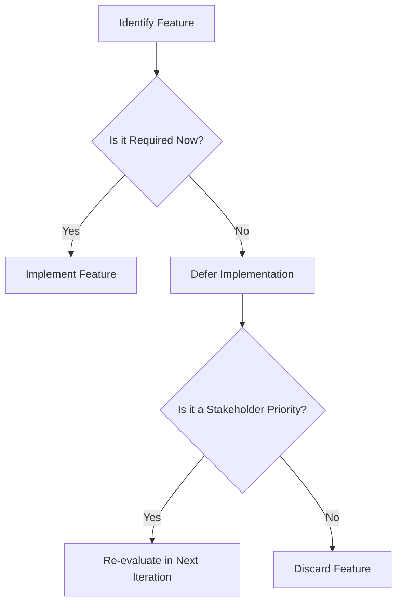

## 2.4 YAGNI (You Aren't Gonna Need It)

In the fast-paced world of software development, it's easy to get caught up in the excitement of building new features and capabilities. However, the YAGNI principle, an acronym for "You Aren't Gonna Need It," serves as a crucial reminder to developers to focus on what is necessary rather than what might be needed in the future. This principle is a cornerstone of agile software development, emphasizing the importance of simplicity and efficiency.

### Understanding the YAGNI Principle

The YAGNI principle is a fundamental tenet of agile methodologies, particularly Extreme Programming (XP). It advises developers to avoid implementing features until they are actually needed. This approach helps prevent the common pitfalls of over-engineering and feature bloat, which can lead to increased complexity, higher maintenance costs, and a greater potential for bugs.

#### Importance in Agile Software Development

Agile development thrives on flexibility and responsiveness to change. By adhering to YAGNI, teams can focus on delivering value incrementally, ensuring that each feature added to the codebase serves a clear purpose and meets current requirements. This approach not only speeds up development but also enhances the overall quality of the software.

### Negative Impacts of Adding Unnecessary Functionality

Adding features based on assumptions about future needs can have several detrimental effects:

#### Increased Codebase Complexity

Every additional feature introduces new dependencies and interactions within the codebase. This complexity can make the system harder to understand, test, and modify. As a result, the likelihood of errors increases, and the time required to implement changes grows.

#### Higher Maintenance Costs

Unnecessary features require ongoing maintenance, including updates, bug fixes, and documentation. This additional workload can strain resources and divert attention from more critical tasks, ultimately increasing the total cost of ownership for the software.

#### Potential for Introducing Bugs

Each new feature introduces potential points of failure. Unnecessary features, especially those that are not well-understood or documented, can lead to unexpected behaviors and bugs. These issues can be challenging to diagnose and resolve, particularly if the feature was not initially required.

### Examples of Premature Feature Implementation

Consider a scenario where a development team anticipates the need for a complex reporting system in a web application. They spend weeks building this feature, only to find out later that users prefer a simpler, more intuitive dashboard. The time and effort spent on the unnecessary reporting system could have been used to enhance other aspects of the application that directly impact user satisfaction.

Another example involves a mobile app developer who preemptively adds support for multiple languages, anticipating global expansion. However, the app fails to gain traction in its initial market, rendering the multilingual support irrelevant and adding unnecessary complexity to the codebase.

### Determining Whether a Feature is Necessary

To effectively apply the YAGNI principle, developers must be adept at distinguishing between necessary and unnecessary features. Here are some strategies to help make this determination:

#### Relying on Current Requirements

Focus on the current needs and requirements of the project. Avoid making assumptions about future needs unless they are explicitly stated and prioritized by stakeholders. This approach ensures that development efforts are aligned with the project's immediate goals.

#### Engaging with Stakeholders

Regularly engage with stakeholders, including product owners, users, and business analysts, to understand their priorities and expectations. This collaboration helps ensure that the development team is working on features that deliver the most value to the end-users.

### Strategies to Resist the Temptation of Over-Building

Resisting the urge to over-engineer requires discipline and a commitment to agile principles. Here are some strategies to help developers stay focused on what truly matters:

#### Focusing on Minimum Viable Products (MVPs)

An MVP is a version of a product with just enough features to satisfy early adopters and provide feedback for future development. By concentrating on the MVP, developers can deliver value quickly and iteratively, avoiding the temptation to add unnecessary features.

#### Iterative Development and Continuous Feedback

Adopt an iterative development process that emphasizes regular feedback and adaptation. This approach allows teams to refine and enhance the product based on real-world usage and feedback, ensuring that only necessary features are implemented.

### Relating YAGNI to TypeScript Development Practices

TypeScript, with its strong typing and modern features, is well-suited to support the YAGNI principle. Here are some ways TypeScript can help developers adhere to YAGNI:

#### Leveraging TypeScript's Type System

TypeScript's type system encourages developers to define clear interfaces and contracts, which can help prevent the introduction of unnecessary complexity. By focusing on well-defined types, developers can ensure that each feature serves a specific purpose and integrates seamlessly with the rest of the codebase.

#### Utilizing TypeScript's Module System

TypeScript's module system allows developers to organize code into discrete, reusable components. This modularity supports the YAGNI principle by enabling developers to add or remove features without affecting the entire codebase.

### Anecdotes and Case Studies

Let's explore a real-world example where the YAGNI principle was successfully applied:

A software company was developing a new project management tool. Initially, the team considered adding a complex resource management feature, anticipating that it might be useful for some users. However, by adhering to YAGNI, they decided to focus on core project management functionalities first. This decision allowed them to deliver a high-quality product quickly, gather user feedback, and iteratively add features based on actual user needs. Ultimately, the resource management feature was never implemented, as user feedback indicated that it was not a priority.

### Visualizing the YAGNI Principle

To better understand the YAGNI principle, let's visualize the decision-making process involved in determining whether a feature is necessary:

**Diagram Description:** This flowchart illustrates the decision-making process for determining whether to implement a feature. It emphasizes the importance of focusing on current requirements and stakeholder priorities.

### Knowledge Check

Before we wrap up, let's pose a few questions to reinforce your understanding of the YAGNI principle:

- Why is the YAGNI principle important in agile development?
- What are some negative impacts of adding unnecessary features?
- How can developers determine whether a feature is necessary?
- What strategies can help resist the temptation to over-build?

### Embrace the Journey

Remember, the YAGNI principle is not about limiting creativity or innovation. Instead, it's about ensuring that every feature added to the codebase serves a clear purpose and delivers value. By embracing YAGNI, you'll create more maintainable, efficient, and user-focused software. Keep experimenting, stay curious, and enjoy the journey of continuous improvement!

### Quiz Time!



### What does the YAGNI principle stand for?

- [x] You Aren't Gonna Need It
- [ ] You Are Gonna Need It
- [ ] You Always Gonna Need It
- [ ] You Aren't Gonna Need Everything

> **Explanation:** YAGNI stands for "You Aren't Gonna Need It," emphasizing the avoidance of unnecessary features.

### Why is YAGNI important in agile development?

- [x] It helps focus on delivering value incrementally.
- [ ] It encourages adding all possible features upfront.
- [ ] It promotes speculative future feature development.
- [ ] It requires detailed long-term planning.

> **Explanation:** YAGNI helps teams focus on delivering value incrementally by implementing only necessary features.

### What is a negative impact of adding unnecessary functionality?

- [x] Increased codebase complexity
- [ ] Simplified codebase
- [ ] Reduced maintenance costs
- [ ] Enhanced performance

> **Explanation:** Adding unnecessary functionality increases codebase complexity, making it harder to maintain.

### How can developers determine if a feature is necessary?

- [x] Focus on current requirements and stakeholder priorities.
- [ ] Implement features based on assumptions.
- [ ] Add features that might be useful in the future.
- [ ] Ignore stakeholder feedback.

> **Explanation:** Developers should focus on current requirements and stakeholder priorities to determine if a feature is necessary.

### What is a strategy to resist over-building?

- [x] Focus on Minimum Viable Products (MVPs)
- [ ] Implement all features at once
- [ ] Avoid stakeholder engagement
- [ ] Prioritize speculative features

> **Explanation:** Focusing on MVPs helps resist over-building by delivering essential features first.

### How does TypeScript support the YAGNI principle?

- [x] By encouraging clear interfaces and modular code
- [ ] By promoting complex type hierarchies
- [ ] By requiring all features to be implemented upfront
- [ ] By discouraging modular code

> **Explanation:** TypeScript supports YAGNI by encouraging clear interfaces and modular code, which helps avoid unnecessary complexity.

### What is an example of premature feature implementation?

- [x] Adding multilingual support before market validation
- [ ] Implementing user-requested features
- [ ] Focusing on core functionalities first
- [ ] Engaging with stakeholders for feedback

> **Explanation:** Adding multilingual support before market validation is an example of premature feature implementation.

### What does the flowchart in the article illustrate?

- [x] The decision-making process for feature implementation
- [ ] The process of adding all features at once
- [ ] The steps for creating a complex codebase
- [ ] The method for ignoring stakeholder priorities

> **Explanation:** The flowchart illustrates the decision-making process for determining whether to implement a feature.

### What is an MVP?

- [x] Minimum Viable Product
- [ ] Maximum Valuable Product
- [ ] Most Valuable Product
- [ ] Minimum Valuable Product

> **Explanation:** MVP stands for Minimum Viable Product, focusing on delivering essential features first.

### True or False: YAGNI discourages creativity and innovation.

- [ ] True
- [x] False

> **Explanation:** YAGNI does not discourage creativity and innovation; it ensures that features serve a clear purpose and deliver value.


