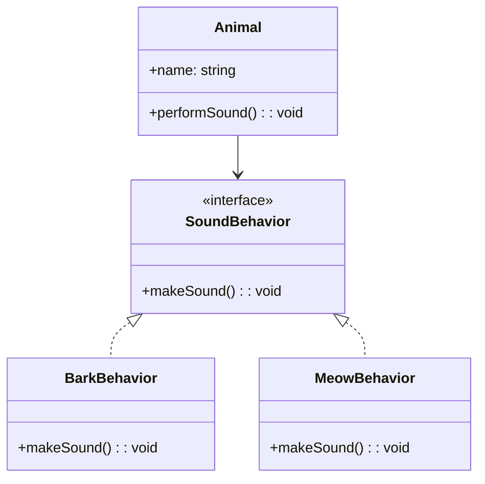

## 2.5 Composition over Inheritance

In the world of object-oriented programming (OOP), two primary techniques for creating objects and defining relationships between them are inheritance and composition. While both have their place, the principle of "composition over inheritance" has gained traction for its ability to create more flexible and reusable code. In this section, we'll explore these concepts in depth, discuss their pros and cons, and demonstrate how to implement them effectively in TypeScript.

### Understanding Inheritance in OOP

Inheritance is a fundamental concept in OOP that allows a class (known as a subclass or derived class) to inherit properties and methods from another class (known as a superclass or base class). This mechanism supports code reuse and establishes a hierarchical relationship between classes.

#### Example of Inheritance in TypeScript

```typescript
class Animal {
    constructor(public name: string) {}

    makeSound(): void {
        console.log(`${this.name} makes a sound.`);
    }
}

class Dog extends Animal {
    makeSound(): void {
        console.log(`${this.name} barks.`);
    }
}

const dog = new Dog("Buddy");
dog.makeSound(); // Output: Buddy barks.
```

In this example, `Dog` inherits from `Animal`, overriding the `makeSound` method to provide specific behavior.

### Limitations and Drawbacks of Inheritance

While inheritance can simplify code by promoting reuse, it comes with several drawbacks, especially when used excessively or improperly:

#### Fragile Base Class Problem

When a base class is modified, all derived classes are affected. This can lead to unexpected behaviors and bugs, especially in large systems where the base class is widely used.

#### Reduced Flexibility

Inheritance creates a tight coupling between the base and derived classes. This can make it difficult to change the base class without impacting all subclasses, reducing the flexibility to adapt to new requirements.

#### Increased Coupling

Inheritance often leads to a rigid class hierarchy, making it challenging to refactor or extend the system without breaking existing code.

### Embracing Composition for Flexibility and Reuse

Composition involves building complex objects by combining simpler ones. Instead of inheriting behavior, objects are composed of other objects that implement the desired functionality. This approach promotes loose coupling and greater flexibility.

#### Example of Composition in TypeScript

```typescript
interface SoundBehavior {
    makeSound(): void;
}

class BarkBehavior implements SoundBehavior {
    makeSound(): void {
        console.log("Barks.");
    }
}

class Animal {
    constructor(public name: string, private soundBehavior: SoundBehavior) {}

    performSound(): void {
        console.log(`${this.name} `);
        this.soundBehavior.makeSound();
    }
}

const dog = new Animal("Buddy", new BarkBehavior());
dog.performSound(); // Output: Buddy Barks.
```

In this example, the `Animal` class uses composition to include a `SoundBehavior`, allowing different sound behaviors to be easily swapped without modifying the `Animal` class.

### Design Patterns Leveraging Composition

Several design patterns leverage composition to achieve flexibility and reuse:

#### Strategy Pattern

The Strategy Pattern defines a family of algorithms, encapsulates each one, and makes them interchangeable. This pattern uses composition to delegate behavior to different strategy classes.

#### Decorator Pattern

The Decorator Pattern attaches additional responsibilities to an object dynamically. It provides a flexible alternative to subclassing for extending functionality.

### When to Use Inheritance

Despite its limitations, inheritance is still appropriate in certain scenarios:

- **Is-a Relationship**: Use inheritance when there is a clear hierarchical relationship, such as a `Car` class inheriting from a `Vehicle` class.
- **Shared Behavior**: When multiple classes share the same behavior, inheritance can be used to avoid code duplication.

### Best Practices for Choosing Between Composition and Inheritance

- **Favor Composition**: Use composition to achieve greater flexibility and reuse. It allows you to change behavior at runtime and promotes loose coupling.
- **Use Inheritance Sparingly**: Reserve inheritance for cases where it makes logical sense and provides clear benefits.
- **Design for Change**: Anticipate changes and design your system to accommodate them with minimal impact.

### Advanced Concepts: Protocol-Oriented Programming in TypeScript

Protocol-oriented programming (POP) is a paradigm that emphasizes the use of protocols (interfaces in TypeScript) to define behavior. This approach aligns with the principles of composition, as it encourages defining flexible and reusable components.

#### Example of Protocol-Oriented Programming in TypeScript

```typescript
interface Flyable {
    fly(): void;
}

class Bird implements Flyable {
    fly(): void {
        console.log("Flies in the sky.");
    }
}

class Airplane implements Flyable {
    fly(): void {
        console.log("Flies through the clouds.");
    }
}

function performFly(flyable: Flyable): void {
    flyable.fly();
}

const bird = new Bird();
const airplane = new Airplane();

performFly(bird); // Output: Flies in the sky.
performFly(airplane); // Output: Flies through the clouds.
```

In this example, both `Bird` and `Airplane` implement the `Flyable` interface, allowing them to be used interchangeably in the `performFly` function.

### Try It Yourself

Experiment with the following modifications to the code examples:

- **Add New Behaviors**: Create additional sound behaviors (e.g., `MeowBehavior`) and apply them to different animals.
- **Implement Additional Interfaces**: Define new interfaces for other behaviors (e.g., `Swimmable`) and implement them in various classes.
- **Mix and Match**: Combine different behaviors to create unique animal classes with multiple abilities.

### Visualizing Composition Over Inheritance

To better understand the relationship between composition and inheritance, consider the following class diagram:



**Diagram Description**: This diagram illustrates the composition relationship between the `Animal` class and the `SoundBehavior` interface. The `BarkBehavior` and `MeowBehavior` classes implement the `SoundBehavior` interface, allowing them to be used interchangeably by the `Animal` class.

### References and Links

- [MDN Web Docs: Inheritance](https://developer.mozilla.org/en-US/docs/Web/JavaScript/Inheritance_and_the_prototype_chain)
- [MDN Web Docs: Composition](https://developer.mozilla.org/en-US/docs/Web/JavaScript/Guide/Details_of_the_Object_Model)
- [Refactoring Guru: Strategy Pattern](https://refactoring.guru/design-patterns/strategy)
- [Refactoring Guru: Decorator Pattern](https://refactoring.guru/design-patterns/decorator)

### Knowledge Check

- **Question**: What are the main advantages of using composition over inheritance?
- **Exercise**: Implement a new class that uses both composition and inheritance to achieve specific behavior.

### Embrace the Journey

Remember, mastering the principles of composition over inheritance is a journey. As you continue to explore and apply these concepts, you'll discover new ways to create flexible and maintainable code. Keep experimenting, stay curious, and enjoy the process!

## Quiz Time!



### What is a primary advantage of using composition over inheritance?

- [x] Greater flexibility and reuse
- [ ] Simpler code structure
- [ ] Faster execution time
- [ ] Easier debugging

> **Explanation:** Composition allows for greater flexibility and reuse by enabling the combination of different behaviors without modifying existing code.

### Which design pattern is known for using composition to attach additional responsibilities to an object dynamically?

- [ ] Singleton
- [ ] Factory
- [x] Decorator
- [ ] Observer

> **Explanation:** The Decorator Pattern uses composition to add responsibilities to an object at runtime, offering a flexible alternative to subclassing.

### What problem arises when a base class is modified, affecting all derived classes?

- [ ] Diamond problem
- [x] Fragile base class problem
- [ ] Circular dependency
- [ ] Memory leak

> **Explanation:** The fragile base class problem occurs when changes to a base class inadvertently affect all derived classes, potentially causing unexpected behaviors.

### In which scenario is inheritance still appropriate?

- [x] When there is a clear is-a relationship
- [ ] When behavior needs to change at runtime
- [ ] When classes have unrelated behaviors
- [ ] When code needs to be loosely coupled

> **Explanation:** Inheritance is suitable when there is a clear hierarchical is-a relationship, such as a `Car` class inheriting from a `Vehicle` class.

### What is protocol-oriented programming?

- [ ] A paradigm that eliminates the need for interfaces
- [x] A paradigm that emphasizes using interfaces to define behavior
- [ ] A paradigm that focuses on inheritance hierarchies
- [ ] A paradigm that uses only abstract classes

> **Explanation:** Protocol-oriented programming emphasizes defining behavior through interfaces, promoting flexibility and reuse.

### Which of the following is a drawback of deep inheritance hierarchies?

- [ ] Improved modularity
- [ ] Easier code maintenance
- [x] Reduced flexibility
- [ ] Simplified debugging

> **Explanation:** Deep inheritance hierarchies can lead to reduced flexibility, as changes to a base class can impact all derived classes.

### How does composition promote loose coupling?

- [x] By delegating behavior to separate objects
- [ ] By using fewer classes
- [ ] By avoiding interfaces
- [ ] By sharing state between objects

> **Explanation:** Composition promotes loose coupling by delegating behavior to separate objects, allowing for easier modification and extension.

### What is a common use case for the Strategy Pattern?

- [ ] Managing object creation
- [ ] Observing state changes
- [x] Defining interchangeable algorithms
- [ ] Simplifying complex subsystems

> **Explanation:** The Strategy Pattern is used to define a family of interchangeable algorithms, allowing behavior to be selected at runtime.

### Which TypeScript feature is often used to implement composition?

- [ ] Abstract classes
- [x] Interfaces
- [ ] Enums
- [ ] Generics

> **Explanation:** Interfaces are often used in TypeScript to implement composition, defining contracts for behavior that can be implemented by different classes.

### True or False: Composition is always better than inheritance.

- [ ] True
- [x] False

> **Explanation:** While composition offers many advantages, inheritance is still appropriate in certain scenarios, such as when there is a clear hierarchical relationship.


