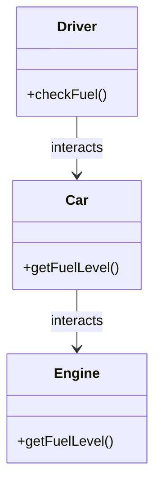

## 2.6 Law of Demeter

The Law of Demeter (LoD), also known as the Principle of Least Knowledge, is a fundamental guideline in object-oriented design that suggests minimizing the knowledge a given class has about other classes. By doing so, it promotes loose coupling and enhances the modularity of the software. Let's delve into the details of this principle, understand its significance, and explore how it can be applied effectively in TypeScript.

### Understanding the Law of Demeter

The Law of Demeter can be summarized as "only talk to your immediate friends." In practical terms, this means that a method of an object should only call methods of:

- The object itself.
- Any parameters passed to the method.
- Any objects it creates or instantiates.
- Its direct component objects.

This principle discourages the practice of chaining method calls across multiple objects, which can lead to tightly coupled code. Instead, it encourages designing systems where each class has a minimal understanding of the internal workings of other classes.

### Promoting Loose Coupling with LoD

Loose coupling is a design goal that allows individual components of a system to be modified or replaced with minimal impact on other components. The Law of Demeter supports this by limiting the interactions between objects, thus reducing dependencies and making the codebase more resilient to changes.

#### Violating the Law of Demeter

Consider the following TypeScript example that violates the Law of Demeter:

```typescript
class Engine {
    getFuelLevel(): number {
        return 50; // Assume a fixed fuel level for simplicity
    }
}

class Car {
    engine: Engine;

    constructor(engine: Engine) {
        this.engine = engine;
    }

    getFuelLevel(): number {
        return this.engine.getFuelLevel();
    }
}

class Driver {
    car: Car;

    constructor(car: Car) {
        this.car = car;
    }

    checkFuel(): number {
        // Violates LoD: Driver knows about the car's engine
        return this.car.engine.getFuelLevel();
    }
}

const engine = new Engine();
const car = new Car(engine);
const driver = new Driver(car);

console.log(driver.checkFuel());
```

In this example, the `Driver` class directly accesses the `Engine` object through the `Car` object, which violates the Law of Demeter. The `Driver` should not need to know about the `Engine` to check the fuel level.

#### Refactoring to Comply with LoD

Let's refactor the code to comply with the Law of Demeter:

```typescript
class Engine {
    getFuelLevel(): number {
        return 50;
    }
}

class Car {
    private engine: Engine;

    constructor(engine: Engine) {
        this.engine = engine;
    }

    getFuelLevel(): number {
        return this.engine.getFuelLevel();
    }
}

class Driver {
    private car: Car;

    constructor(car: Car) {
        this.car = car;
    }

    checkFuel(): number {
        // Complies with LoD: Driver only interacts with Car
        return this.car.getFuelLevel();
    }
}

const engine = new Engine();
const car = new Car(engine);
const driver = new Driver(car);

console.log(driver.checkFuel());
```

In the refactored version, the `Driver` class only interacts with the `Car` class, which encapsulates the interaction with the `Engine`. This adheres to the Law of Demeter and promotes loose coupling.

### Benefits of Adhering to the Law of Demeter

Adhering to the Law of Demeter offers several benefits:

1. **Enhanced Maintainability**: By reducing dependencies between classes, changes in one class are less likely to impact others, making the code easier to maintain.

2. **Easier Testing**: With fewer dependencies, individual classes can be tested in isolation, leading to more straightforward and reliable unit tests.

3. **Increased Encapsulation**: The principle encourages encapsulating the internal details of a class, exposing only what is necessary, thus protecting the integrity of the class.

### Trade-offs and Criticisms of Strict LoD Adherence

While the Law of Demeter promotes good design practices, strict adherence can sometimes lead to overly complex code. Here are some potential trade-offs:

- **Increased Boilerplate**: Following LoD strictly may result in additional methods that merely delegate calls, increasing the amount of boilerplate code.
- **Performance Overhead**: In some cases, adhering to LoD might introduce unnecessary layers of abstraction, potentially impacting performance.
- **Reduced Flexibility**: By limiting interactions, the design might become less flexible, especially in scenarios where deep object interactions are necessary.

### Applying the Law of Demeter in TypeScript

TypeScript, with its robust type system and support for interfaces, provides excellent tools for applying the Law of Demeter. Let's explore how to design TypeScript classes and interfaces to comply with LoD.

#### Using Interfaces to Limit Knowledge

Interfaces can be used to define clear contracts between classes, ensuring that only necessary methods are exposed. Consider the following example:

```typescript
interface FuelCheckable {
    getFuelLevel(): number;
}

class Engine implements FuelCheckable {
    getFuelLevel(): number {
        return 50;
    }
}

class Car implements FuelCheckable {
    private engine: Engine;

    constructor(engine: Engine) {
        this.engine = engine;
    }

    getFuelLevel(): number {
        return this.engine.getFuelLevel();
    }
}

class Driver {
    private vehicle: FuelCheckable;

    constructor(vehicle: FuelCheckable) {
        this.vehicle = vehicle;
    }

    checkFuel(): number {
        return this.vehicle.getFuelLevel();
    }
}

const engine = new Engine();
const car = new Car(engine);
const driver = new Driver(car);

console.log(driver.checkFuel());
```

In this example, the `FuelCheckable` interface defines a contract for checking fuel levels. The `Driver` class interacts with any object that implements this interface, adhering to the Law of Demeter.

#### Middleware and Service Layers

In complex applications, middleware or service layers can help manage interactions between objects, facilitating compliance with the Law of Demeter. These layers act as intermediaries, encapsulating the logic for interacting with various components.

Consider a service layer example:

```typescript
class FuelService {
    getFuelLevel(vehicle: FuelCheckable): number {
        return vehicle.getFuelLevel();
    }
}

class Driver {
    private fuelService: FuelService;
    private vehicle: FuelCheckable;

    constructor(fuelService: FuelService, vehicle: FuelCheckable) {
        this.fuelService = fuelService;
        this.vehicle = vehicle;
    }

    checkFuel(): number {
        return this.fuelService.getFuelLevel(this.vehicle);
    }
}

const fuelService = new FuelService();
const driver = new Driver(fuelService, car);

console.log(driver.checkFuel());
```

In this setup, the `FuelService` acts as a middleware layer, managing the interaction between the `Driver` and the `Car`, further adhering to the Law of Demeter.

### Encouraging Mindful Design in TypeScript Applications

When designing complex TypeScript applications, it's essential to be mindful of object interactions. Here are some tips to encourage compliance with the Law of Demeter:

- **Design with Interfaces**: Use interfaces to define clear boundaries between components, ensuring minimal exposure of internal details.
- **Encapsulate Logic**: Encapsulate complex logic within classes, exposing only necessary methods to external components.
- **Leverage Middleware**: Use middleware or service layers to manage interactions between components, reducing direct dependencies.
- **Review Object Interactions**: Regularly review and refactor object interactions to ensure they comply with the Law of Demeter.

### Visualizing the Law of Demeter

To better understand the Law of Demeter, let's visualize the interactions between objects in a compliant and non-compliant design.



In this diagram, the `Driver` interacts only with the `Car`, and the `Car` interacts with the `Engine`, adhering to the Law of Demeter.

### Try It Yourself

To reinforce your understanding, try modifying the code examples to introduce new components or change the interactions. For instance, add a `FuelSensor` class that the `Car` uses to get the fuel level, and ensure the `Driver` still complies with the Law of Demeter.

### Conclusion

The Law of Demeter is a powerful principle that promotes loose coupling and enhances the modularity of software systems. By limiting the knowledge a class has about other classes, we can create more maintainable, testable, and encapsulated code. While strict adherence may have trade-offs, mindful application of this principle can lead to robust and flexible TypeScript applications.

## Quiz Time!



### What is the primary goal of the Law of Demeter?

- [x] To reduce coupling between classes
- [ ] To increase the number of methods in a class
- [ ] To allow deep object interactions
- [ ] To make code execution faster

> **Explanation:** The Law of Demeter aims to reduce coupling between classes by limiting the interactions to immediate friends only.

### Which of the following violates the Law of Demeter?

- [x] Accessing a method of an object's component's component
- [ ] Accessing a method of the object itself
- [ ] Accessing a method of a parameter passed to the method
- [ ] Accessing a method of an object it creates

> **Explanation:** Accessing a method of an object's component's component involves deep interaction, which violates the Law of Demeter.

### What is a benefit of adhering to the Law of Demeter?

- [x] Enhanced maintainability
- [ ] Increased code complexity
- [ ] More direct object interactions
- [ ] Higher coupling

> **Explanation:** Adhering to the Law of Demeter enhances maintainability by reducing dependencies between classes.

### How can interfaces help in applying the Law of Demeter?

- [x] By defining clear contracts between classes
- [ ] By exposing all internal methods
- [ ] By increasing the number of dependencies
- [ ] By allowing deep object interactions

> **Explanation:** Interfaces define clear contracts between classes, ensuring minimal exposure of internal details.

### What is a potential trade-off of strict adherence to the Law of Demeter?

- [x] Increased boilerplate code
- [ ] Reduced encapsulation
- [ ] Higher coupling
- [ ] More direct interactions

> **Explanation:** Strict adherence to the Law of Demeter may result in increased boilerplate code due to additional delegation methods.

### How does the Law of Demeter affect testing?

- [x] It makes testing easier by reducing dependencies
- [ ] It complicates testing by increasing dependencies
- [ ] It has no impact on testing
- [ ] It makes testing harder by requiring more mocks

> **Explanation:** The Law of Demeter makes testing easier by reducing dependencies, allowing classes to be tested in isolation.

### What role do middleware layers play in the Law of Demeter?

- [x] They manage interactions between components
- [ ] They increase direct dependencies
- [ ] They expose internal details
- [ ] They reduce encapsulation

> **Explanation:** Middleware layers manage interactions between components, facilitating compliance with the Law of Demeter.

### Which of the following is NOT a method to encourage compliance with the Law of Demeter?

- [ ] Design with interfaces
- [ ] Encapsulate logic
- [ ] Leverage middleware
- [x] Increase direct object interactions

> **Explanation:** Increasing direct object interactions goes against the Law of Demeter, which aims to limit such interactions.

### True or False: The Law of Demeter is also known as the Principle of Least Knowledge.

- [x] True
- [ ] False

> **Explanation:** True. The Law of Demeter is also known as the Principle of Least Knowledge, emphasizing minimal knowledge between classes.

### True or False: The Law of Demeter allows a method to call methods of any object it knows about.

- [ ] True
- [x] False

> **Explanation:** False. The Law of Demeter restricts a method to call methods only of its immediate friends, not any object it knows about.


