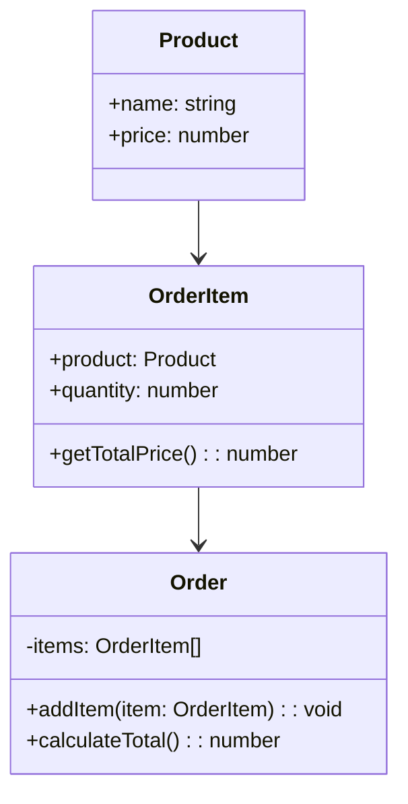

## 2.7.1 Information Expert

The Information Expert principle is a fundamental concept in the GRASP (General Responsibility Assignment Software Patterns) methodology, which provides guidelines for assigning responsibilities to objects in object-oriented design. This principle suggests that responsibilities should be assigned to the class that has the necessary information to fulfill them. By doing so, we achieve better encapsulation, cohesion, and maintainability in our software designs.

### Understanding the Information Expert Principle

The Information Expert principle is based on the idea that a class should be responsible for handling tasks that it has the necessary data or knowledge to perform. This approach ensures that the logic is placed where the data resides, minimizing the need for data transfer between objects and reducing dependencies.

#### Key Concepts

- **Encapsulation**: By assigning responsibilities to the class that holds the data, we encapsulate the behavior with the data, leading to a more modular and understandable system.
- **Cohesion**: Classes that follow the Information Expert principle tend to have high cohesion, as their methods are closely related to the data they manage.
- **Maintainability**: When responsibilities are assigned to the appropriate classes, it becomes easier to maintain and extend the system, as changes to data or behavior are localized.

### Identifying the Information Expert

To identify the Information Expert in a system, follow these steps:

1. **Analyze the Responsibilities**: Determine what tasks need to be performed and what information is required for each task.
2. **Locate the Data**: Identify which classes currently hold or should hold the necessary data.
3. **Assign Responsibilities**: Assign the responsibility to the class that has the most relevant information to perform the task.

### TypeScript Examples

Let's explore some TypeScript examples to illustrate the Information Expert principle in action.

#### Example 1: E-Commerce Order Processing

Consider an e-commerce application where we need to calculate the total price of an order, including taxes and discounts.

```typescript
class Product {
  constructor(public name: string, public price: number) {}
}

class OrderItem {
  constructor(public product: Product, public quantity: number) {}

  getTotalPrice(): number {
    return this.product.price * this.quantity;
  }
}

class Order {
  private items: OrderItem[] = [];

  addItem(item: OrderItem): void {
    this.items.push(item);
  }

  calculateTotal(): number {
    return this.items.reduce((total, item) => total + item.getTotalPrice(), 0);
  }
}

// Usage
const product1 = new Product('Laptop', 1000);
const product2 = new Product('Mouse', 50);

const orderItem1 = new OrderItem(product1, 1);
const orderItem2 = new OrderItem(product2, 2);

const order = new Order();
order.addItem(orderItem1);
order.addItem(orderItem2);

console.log('Total Order Price:', order.calculateTotal());
```

In this example, the `OrderItem` class is the Information Expert for calculating the total price of an item because it has access to both the product price and the quantity. The `Order` class is the Information Expert for calculating the total order price because it holds the collection of `OrderItem` objects.

#### Example 2: Library Management System

Let's consider a library management system where we need to check if a book is available for borrowing.

```typescript
class Book {
  constructor(public title: string, public author: string, public isAvailable: boolean) {}

  checkAvailability(): boolean {
    return this.isAvailable;
  }
}

class Library {
  private books: Book[] = [];

  addBook(book: Book): void {
    this.books.push(book);
  }

  isBookAvailable(title: string): boolean {
    const book = this.books.find(book => book.title === title);
    return book ? book.checkAvailability() : false;
  }
}

// Usage
const book1 = new Book('The Great Gatsby', 'F. Scott Fitzgerald', true);
const book2 = new Book('1984', 'George Orwell', false);

const library = new Library();
library.addBook(book1);
library.addBook(book2);

console.log('Is "The Great Gatsby" available?', library.isBookAvailable('The Great Gatsby'));
console.log('Is "1984" available?', library.isBookAvailable('1984'));
```

Here, the `Book` class is the Information Expert for checking availability because it directly manages the `isAvailable` property. The `Library` class is responsible for managing the collection of books and delegating the availability check to the `Book` class.

### Benefits of Following the Information Expert Principle

Adhering to the Information Expert principle offers several advantages:

- **Improved Encapsulation**: By keeping data and behavior together, we reduce the exposure of internal details and protect the integrity of the data.
- **Higher Cohesion**: Classes have focused responsibilities, making them easier to understand and modify.
- **Reduced Duplication**: Logic is centralized in the class that owns the data, minimizing the risk of code duplication.
- **Enhanced Maintainability**: Changes to data structures or behavior are localized, simplifying maintenance and reducing the likelihood of introducing bugs.

### Potential Pitfalls of Ignoring the Information Expert Principle

Ignoring the Information Expert principle can lead to several issues:

- **Bloated Classes**: Responsibilities may be assigned to classes that do not have the necessary information, leading to bloated classes with too many responsibilities.
- **Duplicated Code**: Logic may be duplicated across multiple classes, increasing the risk of inconsistencies and bugs.
- **Tight Coupling**: Classes may become tightly coupled if they need to access data from other classes to perform their responsibilities, making the system harder to maintain and extend.

### Real-World Applications

The Information Expert principle is widely applicable in real-world applications. For example, in a banking system, the `Account` class would be the Information Expert for calculating the account balance, as it holds the transaction data. In a content management system, the `Article` class would be the Information Expert for managing article content and metadata.

### Visualizing the Information Expert Principle

To better understand the Information Expert principle, let's visualize the relationship between classes and their responsibilities using a class diagram.



In this diagram, we see that the `OrderItem` class is responsible for calculating the total price of an item, while the `Order` class is responsible for calculating the total price of the order. This visualization highlights how responsibilities are assigned to the classes that have the necessary information.

### Try It Yourself

Experiment with the provided code examples by making the following modifications:

1. **Add a Discount**: Modify the `OrderItem` class to include a discount percentage and adjust the `getTotalPrice` method to apply the discount.
2. **Track Borrower Information**: Enhance the `Library` system by adding a `borrower` property to the `Book` class and implement a method to borrow a book, updating its availability status.

### References and Links

- [GRASP Patterns: Information Expert](https://www.cin.ufpe.br/~if717/Papers/GRASP.pdf)
- [TypeScript Handbook](https://www.typescriptlang.org/docs/handbook/intro.html)
- [MDN Web Docs: Object-Oriented Programming](https://developer.mozilla.org/en-US/docs/Learn/JavaScript/Objects/Object-oriented_JS)

### Knowledge Check

- **What is the Information Expert principle?**
- **How does the Information Expert principle improve encapsulation and cohesion?**
- **What are the potential pitfalls of not following the Information Expert principle?**
- **How can the Information Expert principle be applied in a library management system?**

### Embrace the Journey

Remember, mastering the Information Expert principle is a journey. As you continue to apply this principle in your projects, you'll discover its power in creating well-structured and maintainable software. Keep experimenting, stay curious, and enjoy the process of refining your design skills!

## Quiz Time!



### What is the primary goal of the Information Expert principle?

- [x] Assign responsibilities to the class that has the necessary information.
- [ ] Assign responsibilities to the class with the most methods.
- [ ] Assign responsibilities to the class with the least dependencies.
- [ ] Assign responsibilities to the class that is easiest to modify.

> **Explanation:** The Information Expert principle focuses on assigning responsibilities to the class that has the necessary information to fulfill them, ensuring better encapsulation and cohesion.

### How does the Information Expert principle help in reducing code duplication?

- [x] By centralizing logic in the class that owns the data.
- [ ] By distributing logic across multiple classes.
- [ ] By minimizing the number of classes in the system.
- [ ] By using global variables to share data.

> **Explanation:** The Information Expert principle centralizes logic in the class that owns the data, reducing the risk of code duplication and inconsistencies.

### Which of the following is a benefit of following the Information Expert principle?

- [x] Improved encapsulation
- [x] Higher cohesion
- [ ] Increased coupling
- [ ] More complex class hierarchies

> **Explanation:** Following the Information Expert principle leads to improved encapsulation and higher cohesion, as responsibilities are assigned to the appropriate classes.

### What is a potential pitfall of ignoring the Information Expert principle?

- [x] Bloated classes with too many responsibilities
- [ ] Increased encapsulation
- [ ] Reduced code duplication
- [ ] Simplified system architecture

> **Explanation:** Ignoring the Information Expert principle can result in bloated classes with too many responsibilities, making the system harder to maintain.

### In the provided e-commerce example, which class is the Information Expert for calculating the total price of an order?

- [ ] Product
- [x] Order
- [ ] OrderItem
- [ ] Customer

> **Explanation:** The `Order` class is the Information Expert for calculating the total price of an order, as it holds the collection of `OrderItem` objects.

### How does the Information Expert principle relate to real-world applications?

- [x] It ensures that logic is placed where the data resides.
- [ ] It encourages the use of global variables for data sharing.
- [ ] It promotes the use of inheritance over composition.
- [ ] It discourages the use of interfaces and abstract classes.

> **Explanation:** The Information Expert principle ensures that logic is placed where the data resides, leading to better encapsulation and maintainability in real-world applications.

### Which of the following scenarios demonstrates the Information Expert principle?

- [x] A `Book` class checking its own availability status.
- [ ] A `Library` class managing the availability of all books.
- [ ] A `Customer` class calculating the total price of an order.
- [ ] A `Product` class managing the entire order process.

> **Explanation:** A `Book` class checking its own availability status demonstrates the Information Expert principle, as the class holds the necessary information.

### How can the Information Expert principle improve maintainability?

- [x] By localizing changes to data structures or behavior.
- [ ] By increasing the number of classes in the system.
- [ ] By using inheritance to share behavior.
- [ ] By minimizing the use of interfaces.

> **Explanation:** The Information Expert principle improves maintainability by localizing changes to data structures or behavior, making the system easier to modify and extend.

### True or False: The Information Expert principle can lead to tighter coupling between classes.

- [ ] True
- [x] False

> **Explanation:** The Information Expert principle reduces coupling by assigning responsibilities to the class that has the necessary information, minimizing dependencies between classes.

### What is the relationship between the Information Expert principle and cohesion?

- [x] The principle promotes high cohesion by ensuring classes have focused responsibilities.
- [ ] The principle reduces cohesion by distributing responsibilities across classes.
- [ ] The principle has no impact on cohesion.
- [ ] The principle increases cohesion by using inheritance.

> **Explanation:** The Information Expert principle promotes high cohesion by ensuring classes have focused responsibilities, making them easier to understand and modify.


