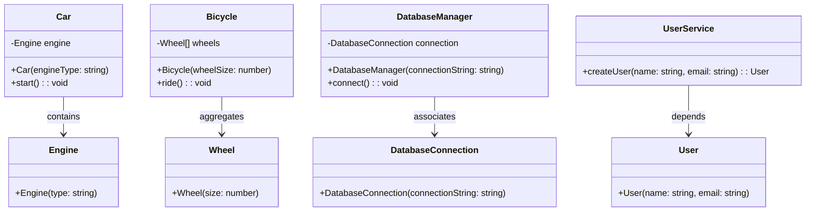

## 2.7.2 Creator

In the realm of object-oriented design, the **Creator** principle is a fundamental concept that guides the assignment of responsibilities for creating objects. It is one of the GRASP (General Responsibility Assignment Software Patterns) principles, which are a set of guidelines for designing objects and assigning responsibilities in a way that leads to a robust and maintainable system. In this section, we'll delve into the Creator principle, explore its criteria, and demonstrate its application in TypeScript.

### Understanding the Creator Principle

The Creator principle suggests that a class should be responsible for creating instances of another class if one or more of the following conditions are met:

1. **Containment**: The class contains or aggregates instances of the other class.
2. **Aggregation**: The class aggregates instances of the other class.
3. **Association**: The class closely uses or is associated with instances of the other class.
4. **Dependency**: The class has the initializing data that will be passed to the created instances.

By adhering to these criteria, we can ensure that object creation responsibilities are logically assigned, leading to a design that is easier to understand and maintain.

### Criteria for Assigning Creation Responsibilities

#### Containment

When a class contains instances of another class, it is often logical for it to be responsible for creating those instances. This is because the containing class has a direct relationship with the contained objects, often managing their lifecycle.

```typescript
class Engine {
    constructor(public type: string) {}
}

class Car {
    private engine: Engine;

    constructor(engineType: string) {
        this.engine = new Engine(engineType);
    }

    start() {
        console.log(`Starting car with ${this.engine.type} engine.`);
    }
}

const myCar = new Car('V8');
myCar.start();
```

In this example, the `Car` class contains an `Engine` object, so it makes sense for the `Car` to create the `Engine`.

#### Aggregation

Aggregation implies a whole-part relationship where the part can exist independently of the whole. When a class aggregates instances of another class, it can also be responsible for creating those instances.

```typescript
class Wheel {
    constructor(public size: number) {}
}

class Bicycle {
    private wheels: Wheel[];

    constructor(wheelSize: number) {
        this.wheels = [new Wheel(wheelSize), new Wheel(wheelSize)];
    }

    ride() {
        console.log(`Riding a bicycle with wheels of size ${this.wheels[0].size}.`);
    }
}

const myBicycle = new Bicycle(26);
myBicycle.ride();
```

Here, the `Bicycle` class aggregates `Wheel` objects, and thus, it takes on the responsibility of creating them.

#### Association

When a class is closely associated with another class, it may be appropriate for it to create instances of that class. This association often involves a direct relationship where one class uses or interacts with the other.

```typescript
class DatabaseConnection {
    constructor(public connectionString: string) {}
}

class DatabaseManager {
    private connection: DatabaseConnection;

    constructor(connectionString: string) {
        this.connection = new DatabaseConnection(connectionString);
    }

    connect() {
        console.log(`Connecting to database with ${this.connection.connectionString}.`);
    }
}

const dbManager = new DatabaseManager('localhost:5432');
dbManager.connect();
```

The `DatabaseManager` class is closely associated with `DatabaseConnection`, and it is responsible for creating the connection object.

#### Dependency

When a class has the data necessary to initialize another class, it can be responsible for creating instances of that class. This ensures that the creation logic is centralized and the necessary data is readily available.

```typescript
class User {
    constructor(public name: string, public email: string) {}
}

class UserService {
    createUser(name: string, email: string): User {
        return new User(name, email);
    }
}

const userService = new UserService();
const user = userService.createUser('Alice', 'alice@example.com');
console.log(`User created: ${user.name}, ${user.email}`);
```

In this case, `UserService` has the data required to create a `User`, so it takes on the responsibility of creating user instances.

### Benefits of Following the Creator Principle

Adhering to the Creator principle offers several benefits:

- **Reduced Coupling**: By assigning creation responsibilities based on relationships, we minimize the dependencies between classes, leading to a more modular design.
- **Improved Maintainability**: Centralizing object creation in logical places makes the code easier to understand and modify.
- **Enhanced Flexibility**: Changes to object creation logic are localized, making it easier to adapt to new requirements.

### Interaction with Design Patterns

The Creator principle often interacts with design patterns that focus on object creation, such as the Factory Method and Abstract Factory patterns.

#### Factory Method Pattern

The Factory Method pattern defines an interface for creating an object but allows subclasses to alter the type of objects that will be created. This pattern aligns well with the Creator principle, as it provides a way to delegate creation responsibilities to subclasses.

```typescript
abstract class Document {
    abstract createPage(): Page;
}

class Report extends Document {
    createPage(): Page {
        return new ReportPage();
    }
}

class Invoice extends Document {
    createPage(): Page {
        return new InvoicePage();
    }
}

interface Page {
    render(): void;
}

class ReportPage implements Page {
    render() {
        console.log('Rendering report page.');
    }
}

class InvoicePage implements Page {
    render() {
        console.log('Rendering invoice page.');
    }
}

const report = new Report();
const reportPage = report.createPage();
reportPage.render();
```

In this example, the `Document` class uses the Factory Method pattern to delegate the creation of `Page` objects to its subclasses.

#### Abstract Factory Pattern

The Abstract Factory pattern provides an interface for creating families of related objects without specifying their concrete classes. This pattern is useful when you need to ensure that a group of related objects are created together.

```typescript
interface GUIFactory {
    createButton(): Button;
    createCheckbox(): Checkbox;
}

class WindowsFactory implements GUIFactory {
    createButton(): Button {
        return new WindowsButton();
    }

    createCheckbox(): Checkbox {
        return new WindowsCheckbox();
    }
}

class MacFactory implements GUIFactory {
    createButton(): Button {
        return new MacButton();
    }

    createCheckbox(): Checkbox {
        return new MacCheckbox();
    }
}

interface Button {
    click(): void;
}

interface Checkbox {
    check(): void;
}

class WindowsButton implements Button {
    click() {
        console.log('Windows button clicked.');
    }
}

class WindowsCheckbox implements Checkbox {
    check() {
        console.log('Windows checkbox checked.');
    }
}

class MacButton implements Button {
    click() {
        console.log('Mac button clicked.');
    }
}

class MacCheckbox implements Checkbox {
    check() {
        console.log('Mac checkbox checked.');
    }
}

function createUI(factory: GUIFactory) {
    const button = factory.createButton();
    const checkbox = factory.createCheckbox();
    button.click();
    checkbox.check();
}

const windowsFactory = new WindowsFactory();
createUI(windowsFactory);

const macFactory = new MacFactory();
createUI(macFactory);
```

In this example, the `GUIFactory` interface defines methods for creating related GUI components, and the concrete factories implement these methods to create platform-specific components.

### Best Practices for Applying the Creator Principle in TypeScript

- **Identify Relationships**: Before assigning creation responsibilities, identify the relationships between classes to ensure that the Creator principle is applied logically.
- **Use Interfaces and Abstract Classes**: Leverage TypeScript's type system to define interfaces and abstract classes that encapsulate creation logic, promoting flexibility and reusability.
- **Centralize Creation Logic**: Keep object creation logic centralized to reduce duplication and improve maintainability.
- **Leverage Design Patterns**: Use design patterns like Factory Method and Abstract Factory to implement the Creator principle in a structured way.
- **Encourage Loose Coupling**: Aim for a design where classes are loosely coupled, making it easier to modify and extend the system.

### Visualizing the Creator Principle

To better understand the Creator principle, let's visualize the relationships between objects and how creation responsibilities are assigned.



This diagram illustrates how the Creator principle assigns creation responsibilities based on containment, aggregation, association, and dependency.

### Try It Yourself

To deepen your understanding of the Creator principle, try modifying the code examples provided:

- **Experiment with Different Relationships**: Change the relationships between classes and observe how the creation responsibilities shift.
- **Implement Additional Patterns**: Incorporate other design patterns, such as Singleton or Builder, to see how they interact with the Creator principle.
- **Refactor Code**: Refactor existing code to better adhere to the Creator principle, focusing on reducing coupling and improving maintainability.

### Knowledge Check

Before we conclude, let's reinforce what we've learned with a few questions:

- What are the criteria for assigning creation responsibilities according to the Creator principle?
- How does the Creator principle interact with the Factory Method pattern?
- What are the benefits of following the Creator principle in object-oriented design?

### Embrace the Journey

Remember, mastering the Creator principle is just one step in your journey to becoming an expert in object-oriented design. As you continue to explore design patterns and principles, you'll gain a deeper understanding of how to create robust and maintainable systems. Keep experimenting, stay curious, and enjoy the journey!

## Quiz Time!



### What is the primary role of the Creator principle in object-oriented design?

- [x] Assigning object creation responsibilities based on relationships
- [ ] Defining interfaces for object creation
- [ ] Managing object lifecycles
- [ ] Ensuring objects are created in a specific order

> **Explanation:** The Creator principle focuses on assigning object creation responsibilities based on existing relationships between objects.

### Which of the following is NOT a criterion for assigning creation responsibilities according to the Creator principle?

- [ ] Containment
- [ ] Aggregation
- [ ] Association
- [x] Inheritance

> **Explanation:** Inheritance is not a criterion for assigning creation responsibilities in the Creator principle.

### How does the Creator principle help in reducing coupling?

- [x] By assigning creation responsibilities based on logical relationships
- [ ] By centralizing all creation logic in a single class
- [ ] By using inheritance to share creation logic
- [ ] By avoiding the use of interfaces

> **Explanation:** The Creator principle reduces coupling by ensuring that creation responsibilities are assigned based on logical relationships, minimizing dependencies between classes.

### Which design pattern aligns well with the Creator principle by allowing subclasses to alter the type of objects created?

- [ ] Singleton
- [x] Factory Method
- [ ] Observer
- [ ] Decorator

> **Explanation:** The Factory Method pattern aligns well with the Creator principle by allowing subclasses to alter the type of objects that will be created.

### What is the benefit of using the Abstract Factory pattern in conjunction with the Creator principle?

- [x] It allows for the creation of families of related objects without specifying concrete classes.
- [ ] It centralizes all object creation logic in a single class.
- [ ] It ensures that only one instance of an object is created.
- [ ] It simplifies the creation of complex objects with many dependencies.

> **Explanation:** The Abstract Factory pattern allows for the creation of families of related objects without specifying their concrete classes, which aligns with the Creator principle.

### Which TypeScript feature can be leveraged to encapsulate creation logic and promote flexibility?

- [ ] Enums
- [x] Interfaces and Abstract Classes
- [ ] Type Guards
- [ ] Decorators

> **Explanation:** Interfaces and abstract classes can be used to encapsulate creation logic and promote flexibility in TypeScript.

### What is a key benefit of centralizing object creation logic?

- [x] Improved maintainability and reduced duplication
- [ ] Faster object creation times
- [ ] Increased coupling between classes
- [ ] Simplified inheritance hierarchies

> **Explanation:** Centralizing object creation logic improves maintainability and reduces duplication, making the code easier to understand and modify.

### In the context of the Creator principle, what does "dependency" refer to?

- [ ] A class that inherits from another class
- [x] A class that has the initializing data for another class
- [ ] A class that contains instances of another class
- [ ] A class that aggregates instances of another class

> **Explanation:** In the context of the Creator principle, "dependency" refers to a class that has the initializing data necessary to create instances of another class.

### True or False: The Creator principle can be applied to reduce the complexity of object creation in large systems.

- [x] True
- [ ] False

> **Explanation:** True. The Creator principle helps reduce the complexity of object creation in large systems by logically assigning creation responsibilities based on relationships.

### Which of the following best describes the relationship between the Creator principle and the Factory Method pattern?

- [x] The Factory Method pattern provides a way to delegate creation responsibilities to subclasses, aligning with the Creator principle.
- [ ] The Factory Method pattern centralizes all creation logic in a single class, contrary to the Creator principle.
- [ ] The Factory Method pattern focuses on managing object lifecycles, unrelated to the Creator principle.
- [ ] The Factory Method pattern ensures objects are created in a specific order, unrelated to the Creator principle.

> **Explanation:** The Factory Method pattern provides a way to delegate creation responsibilities to subclasses, which aligns with the Creator principle.


