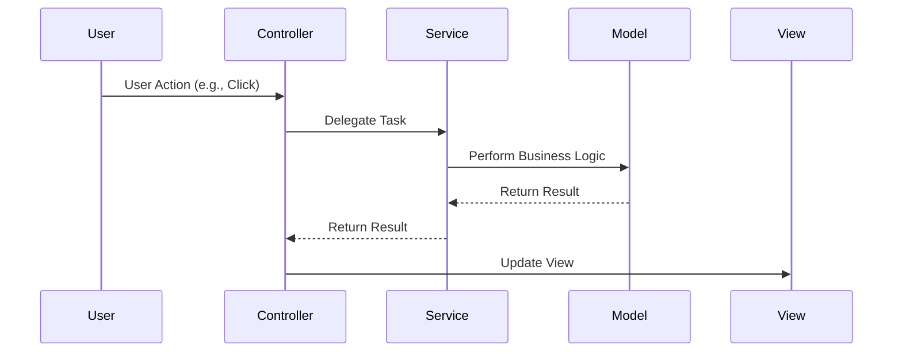

## 2.7.3 Controller

In the realm of software design, particularly within the context of object-oriented programming, the Controller pattern plays a pivotal role. It is one of the GRASP (General Responsibility Assignment Software Patterns) principles, which provide guidelines for assigning responsibilities to objects in a way that leads to robust and maintainable systems. The Controller pattern is essential for managing system events and delegating work to other objects, ensuring that your application remains organized and efficient.

### Understanding the Controller Pattern

The Controller pattern is a design principle that defines objects responsible for handling system events. These objects act as intermediaries between the user interface and the business logic of an application. By doing so, they help maintain a separation of concerns, which is crucial for building scalable and maintainable software.

#### Purpose of the Controller

The primary purpose of a controller is to:

- **Handle System Events**: Controllers are responsible for receiving and processing input from the user or other systems. This can include user actions like button clicks, form submissions, or API requests.
  
- **Delegate Work**: Once a controller receives an event, it delegates the necessary tasks to other objects, such as models or services, to perform the actual work. This delegation ensures that the controller does not become overloaded with business logic.

- **Coordinate Tasks**: Controllers often coordinate multiple tasks, ensuring that the right operations are performed in the correct sequence. They act as the glue that binds different parts of the application together.

### Types of Controllers

Controllers can be categorized into two main types: use-case controllers and façade controllers. Each serves a distinct purpose and is used in different contexts.

#### Use-Case Controller

A use-case controller is responsible for handling a specific use case or user interaction. It is tightly coupled with a particular functionality or feature of the application. For example, in an e-commerce application, you might have a `CheckoutController` that manages the checkout process.

**Characteristics of Use-Case Controllers:**

- **Specificity**: They are designed to handle specific use cases, making them highly focused.
- **Direct Interaction**: They often interact directly with the user interface components that trigger their actions.
- **Limited Scope**: Their scope is limited to the functionality they are designed to manage.

#### Façade Controller

A façade controller, on the other hand, provides a simplified interface to a complex subsystem. It acts as a single point of entry for various operations, often coordinating multiple use-case controllers or services.

**Characteristics of Façade Controllers:**

- **Broad Scope**: They manage a broader range of operations compared to use-case controllers.
- **Simplified Interface**: They offer a simplified interface to the client, hiding the complexities of the underlying system.
- **Coordination Role**: They often coordinate multiple tasks and interactions between different components.

### Implementing Controllers in TypeScript

Let's explore how to implement controllers in TypeScript through practical examples. We'll start with a simple use-case controller and then move on to a more complex façade controller.

#### Example: Use-Case Controller in TypeScript

Consider a simple application where users can register and log in. We'll create a `UserController` to handle user-related actions.

```typescript
// userController.ts

interface IUserService {
  registerUser(username: string, password: string): Promise<void>;
  loginUser(username: string, password: string): Promise<boolean>;
}

class UserController {
  private userService: IUserService;

  constructor(userService: IUserService) {
    this.userService = userService;
  }

  async register(username: string, password: string): Promise<void> {
    try {
      await this.userService.registerUser(username, password);
      console.log('User registered successfully.');
    } catch (error) {
      console.error('Error registering user:', error);
    }
  }

  async login(username: string, password: string): Promise<void> {
    try {
      const success = await this.userService.loginUser(username, password);
      if (success) {
        console.log('User logged in successfully.');
      } else {
        console.log('Invalid username or password.');
      }
    } catch (error) {
      console.error('Error logging in user:', error);
    }
  }
}
```

In this example, the `UserController` acts as a use-case controller, handling user registration and login. It delegates the actual work to a `UserService`, which encapsulates the business logic.

#### Example: Façade Controller in TypeScript

Now, let's consider a more complex scenario where we have multiple subsystems, such as order processing, payment, and shipping. We'll create a `CheckoutController` to act as a façade controller.

```typescript
// checkoutController.ts

interface IOrderService {
  createOrder(cartId: string): Promise<string>;
}

interface IPaymentService {
  processPayment(orderId: string, paymentDetails: any): Promise<boolean>;
}

interface IShippingService {
  scheduleShipping(orderId: string): Promise<void>;
}

class CheckoutController {
  private orderService: IOrderService;
  private paymentService: IPaymentService;
  private shippingService: IShippingService;

  constructor(orderService: IOrderService, paymentService: IPaymentService, shippingService: IShippingService) {
    this.orderService = orderService;
    this.paymentService = paymentService;
    this.shippingService = shippingService;
  }

  async checkout(cartId: string, paymentDetails: any): Promise<void> {
    try {
      const orderId = await this.orderService.createOrder(cartId);
      const paymentSuccess = await this.paymentService.processPayment(orderId, paymentDetails);

      if (paymentSuccess) {
        await this.shippingService.scheduleShipping(orderId);
        console.log('Checkout completed successfully.');
      } else {
        console.log('Payment failed. Checkout aborted.');
      }
    } catch (error) {
      console.error('Error during checkout:', error);
    }
  }
}
```

In this example, the `CheckoutController` coordinates multiple services to complete the checkout process. It acts as a façade, providing a single point of entry for the checkout operation.

### Keeping Controllers Slim

One of the key principles when implementing controllers is to keep them slim. This means that controllers should not contain excessive business logic. Instead, they should focus on coordinating tasks and delegating work to other objects, such as services or models.

#### Benefits of Slim Controllers

- **Separation of Concerns**: By delegating business logic to other components, controllers maintain a clear separation of concerns. This makes the system easier to understand and maintain.
  
- **Reusability**: Keeping controllers slim allows for greater reusability of business logic, as it is encapsulated in separate components that can be used across different controllers.

- **Testability**: Slim controllers are easier to test because they have fewer responsibilities. You can test the business logic independently from the controller.

### Controllers in Architectural Patterns

Controllers are a fundamental part of many architectural patterns, including the Model-View-Controller (MVC) pattern. In MVC, the controller acts as the intermediary between the model (business logic) and the view (user interface).

#### Model-View-Controller (MVC)

In the MVC pattern, the controller:

- **Receives Input**: It receives input from the user via the view.
- **Processes Input**: It processes the input, often by interacting with the model.
- **Updates View**: It updates the view based on the results of the processing.

The MVC pattern is widely used in web development frameworks like Angular, React (with Redux), and many others. It helps in organizing code and separating concerns, making the application more modular and easier to maintain.

#### Other Architectural Patterns

Controllers are also used in other architectural patterns, such as:

- **Model-View-Presenter (MVP)**: Similar to MVC, but with a presenter instead of a controller. The presenter handles user input and updates the view.
  
- **Model-View-ViewModel (MVVM)**: Used in frameworks like Angular and Knockout. The view model acts as an intermediary between the view and the model, similar to a controller.

### Visualizing the Controller Pattern

To better understand the role of controllers, let's visualize their interaction with other components in an application.



**Diagram Description**: This sequence diagram illustrates how a controller interacts with different components in an application. The controller receives a user action, delegates tasks to a service, which then interacts with the model to perform business logic. The result is returned to the controller, which updates the view accordingly.

### Try It Yourself

To deepen your understanding of the Controller pattern, try modifying the examples provided:

1. **Add New Features**: Extend the `UserController` to handle password reset functionality. Implement a new method that delegates the task to a `UserService`.

2. **Refactor to Façade**: Refactor the `CheckoutController` to include a new service for handling discounts. Ensure that the controller remains slim by delegating the discount calculation to the new service.

3. **Experiment with MVC**: Implement a simple MVC application using TypeScript. Create a controller that handles user input, interacts with a model, and updates a view.

### Key Takeaways

- **Controllers Handle System Events**: They are responsible for receiving and processing input from users or other systems.

- **Delegation is Key**: Controllers delegate tasks to other objects, such as services or models, to keep business logic out of the controller.

- **Slim Controllers are Better**: Keeping controllers slim ensures a clear separation of concerns, making the application easier to maintain and test.

- **Integral to Architectural Patterns**: Controllers are a fundamental part of many architectural patterns, including MVC, MVP, and MVVM.

- **Experimentation Encouraged**: Try modifying and extending the provided examples to gain a deeper understanding of the Controller pattern.

### References and Further Reading

- [MDN Web Docs: MVC Pattern](https://developer.mozilla.org/en-US/docs/Glossary/MVC)
- [Martin Fowler's Patterns of Enterprise Application Architecture](https://martinfowler.com/books/eaa.html)
- [Angular Documentation: Controllers](https://angular.io/guide/architecture)

## Quiz Time!



### What is the primary role of a controller in software architecture?

- [x] Handle system events and delegate tasks
- [ ] Store and manage data
- [ ] Render the user interface
- [ ] Perform complex business logic

> **Explanation:** The primary role of a controller is to handle system events and delegate tasks to other components, such as services or models.

### What is a use-case controller?

- [x] A controller that handles specific user interactions or use cases
- [ ] A controller that provides a simplified interface to a complex subsystem
- [ ] A controller that manages all aspects of the application
- [ ] A controller that directly manipulates the database

> **Explanation:** A use-case controller is responsible for handling specific user interactions or use cases, focusing on a particular functionality.

### How can you keep controllers slim?

- [x] By delegating business logic to services or models
- [ ] By adding more functionality to the controller
- [ ] By directly interacting with the database
- [ ] By handling all user interface updates within the controller

> **Explanation:** Controllers should delegate business logic to services or models to maintain a clear separation of concerns and keep them slim.

### What is the difference between a use-case controller and a façade controller?

- [x] A use-case controller handles specific interactions, while a façade controller provides a simplified interface to a subsystem
- [ ] A use-case controller is broader in scope than a façade controller
- [ ] A use-case controller is used only in web applications
- [ ] A use-case controller directly updates the view

> **Explanation:** A use-case controller is focused on specific interactions, whereas a façade controller provides a simplified interface to a complex subsystem.

### In the MVC pattern, what role does the controller play?

- [x] It acts as an intermediary between the model and the view
- [ ] It stores and retrieves data
- [ ] It renders the user interface
- [ ] It performs all business logic

> **Explanation:** In the MVC pattern, the controller acts as an intermediary between the model and the view, handling input and coordinating tasks.

### Which architectural pattern uses a presenter instead of a controller?

- [x] Model-View-Presenter (MVP)
- [ ] Model-View-Controller (MVC)
- [ ] Model-View-ViewModel (MVVM)
- [ ] Façade Pattern

> **Explanation:** The Model-View-Presenter (MVP) pattern uses a presenter instead of a controller to handle user input and update the view.

### What is a façade controller?

- [x] A controller that provides a simplified interface to a complex subsystem
- [ ] A controller that handles specific use cases
- [ ] A controller that directly manipulates the database
- [ ] A controller that manages user interface updates

> **Explanation:** A façade controller provides a simplified interface to a complex subsystem, coordinating multiple tasks and interactions.

### Why is it important to keep controllers slim?

- [x] To maintain separation of concerns and improve testability
- [ ] To handle all user interface updates within the controller
- [ ] To perform complex business logic within the controller
- [ ] To directly interact with the database

> **Explanation:** Keeping controllers slim ensures a clear separation of concerns, making the application easier to maintain and test.

### Which of the following is a benefit of using controllers in software architecture?

- [x] They help maintain a separation of concerns
- [ ] They store and manage data
- [ ] They render the user interface
- [ ] They perform all business logic

> **Explanation:** Controllers help maintain a separation of concerns by delegating tasks to other components, such as services or models.

### Controllers are only used in the MVC pattern.

- [ ] True
- [x] False

> **Explanation:** Controllers are used in various architectural patterns, not just MVC. They are also found in patterns like MVP and MVVM.


