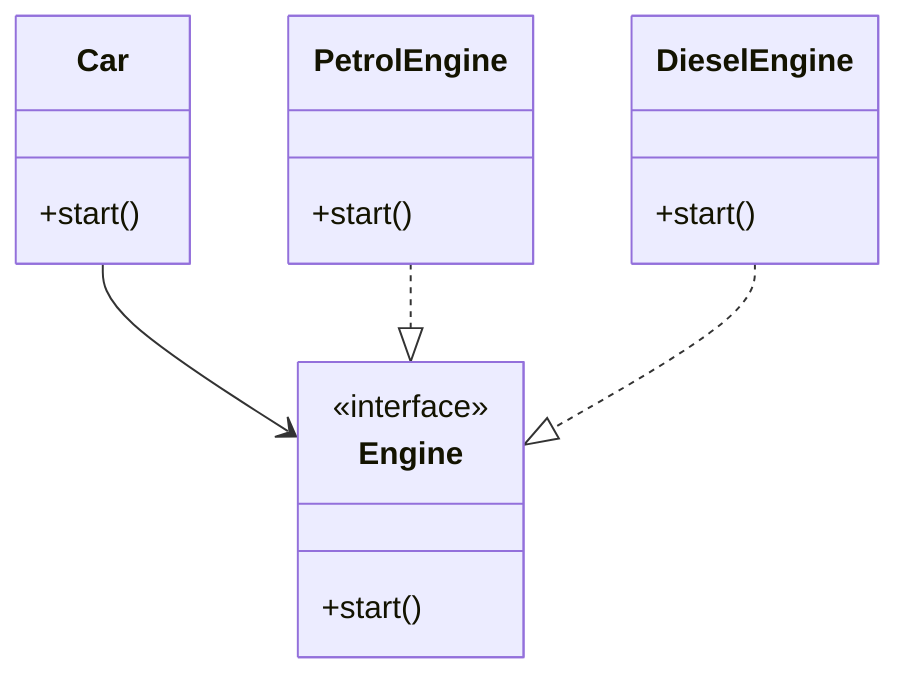

## 2.7.4 Low Coupling

In the world of software engineering, the concept of coupling refers to the degree of direct knowledge that one class has about another. Low coupling is a design principle aimed at reducing dependencies among classes, thereby increasing the reusability and flexibility of modules. In this section, we will explore the significance of low coupling, its impact on system design, and strategies to achieve it using TypeScript.

### Understanding Low Coupling

Low coupling is a fundamental principle in software design that advocates for minimizing the interdependencies between different modules or classes. When a system exhibits low coupling, changes in one module are less likely to require changes in another, leading to more maintainable and scalable code.

#### Significance of Low Coupling

1. **Maintainability**: Systems with low coupling are easier to maintain because changes in one part of the system do not ripple through to other parts.
2. **Reusability**: Modules that are not tightly bound to each other can be reused in different contexts without modification.
3. **Flexibility**: Low coupling allows for easier adaptation and extension of the system, as new functionality can be added with minimal impact on existing code.
4. **Testability**: With fewer dependencies, individual modules can be tested in isolation, leading to more robust and reliable tests.

### The Impact of High Coupling

High coupling occurs when classes or modules are heavily dependent on each other. This can negatively impact a system in several ways:

- **Rigidity**: A change in one module necessitates changes in dependent modules, making the system difficult to modify.
- **Fragility**: A small change can cause a cascade of failures across the system.
- **Limited Reusability**: Tightly coupled modules are often specific to a particular context, reducing their applicability elsewhere.
- **Complex Testing**: Testing becomes challenging as it requires setting up the entire network of dependencies.

### Examples of High and Low Coupling in TypeScript

Let's explore examples to illustrate the difference between high and low coupling.

#### High Coupling Example

```typescript
class Engine {
  start() {
    console.log("Engine started");
  }
}

class Car {
  private engine: Engine;

  constructor() {
    this.engine = new Engine(); // Direct dependency
  }

  start() {
    this.engine.start();
  }
}

const myCar = new Car();
myCar.start();
```

In this example, the `Car` class is tightly coupled to the `Engine` class. Any change to the `Engine` class, such as modifying its constructor, would require changes to the `Car` class.

#### Low Coupling Example

```typescript
interface Engine {
  start(): void;
}

class PetrolEngine implements Engine {
  start() {
    console.log("Petrol engine started");
  }
}

class DieselEngine implements Engine {
  start() {
    console.log("Diesel engine started");
  }
}

class Car {
  private engine: Engine;

  constructor(engine: Engine) {
    this.engine = engine; // Dependency injection
  }

  start() {
    this.engine.start();
  }
}

const petrolCar = new Car(new PetrolEngine());
petrolCar.start();

const dieselCar = new Car(new DieselEngine());
dieselCar.start();
```

Here, the `Car` class depends on an abstraction (`Engine` interface) rather than a concrete implementation. This reduces coupling and allows for different types of engines to be used without modifying the `Car` class.

### Strategies to Achieve Low Coupling

Achieving low coupling in a system involves several strategies, including the use of interfaces, dependency injection, and design patterns.

#### Using Interfaces and Abstractions

Interfaces and abstractions allow classes to interact with each other through a common contract, reducing direct dependencies on specific implementations.

- **Define Interfaces**: Use interfaces to define the expected behavior of a class without tying it to a specific implementation.
- **Program to an Interface, Not an Implementation**: This principle encourages the use of interfaces to define interactions between classes, allowing for more flexibility and easier substitution of different implementations.

#### Dependency Injection

Dependency Injection (DI) is a technique where an object's dependencies are provided to it from the outside rather than being created internally. This promotes low coupling by allowing different implementations to be injected as needed.

- **Constructor Injection**: Pass dependencies through the constructor.
- **Setter Injection**: Provide dependencies through setter methods.
- **Interface Injection**: Use interfaces to inject dependencies.

```typescript
class Car {
  private engine: Engine;

  constructor(engine: Engine) {
    this.engine = engine; // Dependency injection
  }

  start() {
    this.engine.start();
  }
}
```

#### Applying Design Patterns

Certain design patterns inherently promote low coupling by structuring interactions between classes in a way that minimizes dependencies.

- **Observer Pattern**: Allows objects to be notified of changes in other objects without being tightly coupled to them.
- **Mediator Pattern**: Centralizes complex communications and control logic between objects, reducing direct dependencies.

### Balancing Low Coupling with Other Design Considerations

While low coupling is desirable, it is important to balance it with other design considerations such as cohesion and performance.

- **Cohesion**: Ensure that classes are cohesive, meaning they have a single, well-defined purpose. High cohesion often complements low coupling.
- **Performance**: Excessive use of interfaces and abstractions can sometimes lead to performance overhead. Evaluate the trade-offs based on the specific requirements of the system.

### Impact of Low Coupling on Testing and Maintainability

Low coupling has a profound impact on the testability and maintainability of a system.

- **Isolated Testing**: With low coupling, classes can be tested in isolation, making unit tests more straightforward and reliable.
- **Easier Maintenance**: Changes in one part of the system are less likely to affect other parts, reducing the risk of introducing bugs during maintenance.

### Visualizing Low Coupling

To better understand the concept of low coupling, let's visualize the relationship between classes in a system with low coupling.



**Diagram Description**: This class diagram illustrates how the `Car` class depends on the `Engine` interface rather than specific implementations like `PetrolEngine` or `DieselEngine`. This abstraction reduces coupling and allows for flexibility in choosing different engine types.

### Try It Yourself

To solidify your understanding of low coupling, try modifying the code examples provided:

- **Experiment with Different Engines**: Create a new engine type, such as `ElectricEngine`, and integrate it with the `Car` class without modifying the existing code.
- **Implement a New Pattern**: Apply the Observer pattern to the `Car` class to notify other components when the engine starts.

### Conclusion

Low coupling is a crucial principle in software design that enhances the flexibility, maintainability, and reusability of a system. By leveraging interfaces, dependency injection, and design patterns, we can achieve low coupling in our TypeScript applications. Remember, the goal is to create systems that are easy to change and extend without introducing unintended side effects.

## Quiz Time!



### What is the primary goal of low coupling in software design?

- [x] To reduce dependencies among classes
- [ ] To increase the number of classes in a system
- [ ] To ensure every class has multiple responsibilities
- [ ] To make classes dependent on specific implementations

> **Explanation:** Low coupling aims to reduce dependencies among classes, making the system more flexible and maintainable.

### Which of the following is a negative impact of high coupling?

- [x] Rigidity in the system
- [ ] Increased flexibility
- [ ] Easier testing
- [ ] Improved reusability

> **Explanation:** High coupling leads to rigidity, making the system difficult to modify and maintain.

### How can interfaces help achieve low coupling?

- [x] By defining a common contract for interactions
- [ ] By increasing the number of dependencies
- [ ] By tying classes to specific implementations
- [ ] By making classes more complex

> **Explanation:** Interfaces define a common contract for interactions, allowing for flexibility and reducing direct dependencies.

### What is dependency injection?

- [x] A technique for providing dependencies from the outside
- [ ] A method for creating dependencies internally
- [ ] A way to increase coupling between classes
- [ ] A pattern for reducing class cohesion

> **Explanation:** Dependency injection provides dependencies from the outside, promoting low coupling by allowing different implementations to be injected as needed.

### Which design pattern inherently promotes low coupling?

- [x] Observer Pattern
- [ ] Singleton Pattern
- [ ] Factory Pattern
- [ ] Command Pattern

> **Explanation:** The Observer Pattern allows objects to be notified of changes in other objects without being tightly coupled to them, promoting low coupling.

### What is the relationship between low coupling and cohesion?

- [x] High cohesion often complements low coupling
- [ ] Low coupling decreases cohesion
- [ ] High cohesion increases coupling
- [ ] Cohesion and coupling are unrelated

> **Explanation:** High cohesion often complements low coupling, as cohesive classes have a single, well-defined purpose, reducing unnecessary dependencies.

### How does low coupling impact testing?

- [x] It allows for isolated testing of classes
- [ ] It makes testing more complex
- [ ] It requires integration testing for all classes
- [ ] It reduces the need for testing

> **Explanation:** Low coupling allows for isolated testing of classes, making unit tests more straightforward and reliable.

### What is a potential trade-off when achieving low coupling?

- [x] Performance overhead due to excessive use of interfaces
- [ ] Increased rigidity in the system
- [ ] Reduced flexibility
- [ ] Decreased maintainability

> **Explanation:** Excessive use of interfaces and abstractions can sometimes lead to performance overhead, so it's important to evaluate trade-offs based on system requirements.

### Which of the following is an example of low coupling in TypeScript?

- [x] Using an interface for dependency injection
- [ ] Creating dependencies internally within a class
- [ ] Tying classes to specific implementations
- [ ] Using global variables for communication

> **Explanation:** Using an interface for dependency injection reduces direct dependencies and promotes low coupling.

### True or False: Low coupling makes a system more difficult to maintain.

- [ ] True
- [x] False

> **Explanation:** Low coupling makes a system easier to maintain by reducing dependencies and allowing changes to be made with minimal impact on other parts of the system.


