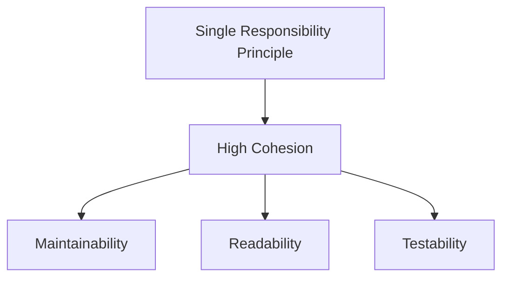

## 2.7.5 High Cohesion

In the realm of software engineering, especially within object-oriented design, the concept of **High Cohesion** stands as a cornerstone for creating maintainable, understandable, and scalable systems. High cohesion refers to the degree to which the elements of a module or class belong together. A highly cohesive class is one where all its methods and properties are closely related to its core purpose, leading to a more intuitive and manageable codebase.

### Understanding High Cohesion

High cohesion is desirable because it ensures that a class or module has a single, well-defined purpose. When a class is cohesive, it becomes easier to understand, test, and maintain. This principle aligns closely with the **Single Responsibility Principle (SRP)**, which states that a class should have only one reason to change. By adhering to high cohesion, developers can create systems where each component is focused and specialized, reducing complexity and enhancing clarity.

#### Why High Cohesion is Desirable

1. **Improved Maintainability**: Classes with high cohesion are easier to maintain because changes in one part of the system are less likely to impact other parts. This reduces the risk of introducing bugs when modifying code.

2. **Enhanced Readability**: When a class has a clear and focused purpose, it becomes easier for developers to understand its functionality. This is particularly important in large codebases where multiple developers may be working on the same project.

3. **Facilitated Testing**: Cohesive classes are simpler to test because their behavior is predictable and confined to a specific domain. This makes it easier to write unit tests that cover all possible scenarios.

4. **Increased Reusability**: Classes that adhere to high cohesion are more likely to be reusable across different parts of an application or even in different projects, as they encapsulate specific functionality that can be easily understood and integrated.

### Problems Associated with Low Cohesion

Low cohesion occurs when a class or module tries to do too much, leading to a tangled web of responsibilities. This can result in several issues:

- **Complexity**: Classes with low cohesion tend to have complex and convoluted logic, making them difficult to understand and modify.
- **Increased Coupling**: Low cohesion often leads to high coupling, where classes become dependent on each other, making the system fragile and difficult to change.
- **Difficult Testing**: Testing becomes challenging as it is hard to isolate and test individual functionalities within a class.
- **Poor Reusability**: Classes with low cohesion are less likely to be reusable because their functionality is too broad and intertwined with other parts of the system.

### TypeScript Examples Demonstrating High Cohesion

Let's explore how high cohesion can be implemented in TypeScript through practical examples. Consider a simple scenario where we need to manage user accounts in an application.

#### Example of High Cohesion

```typescript
class User {
    private username: string;
    private email: string;
    private password: string;

    constructor(username: string, email: string, password: string) {
        this.username = username;
        this.email = email;
        this.password = password;
    }

    public changeEmail(newEmail: string): void {
        if (this.validateEmail(newEmail)) {
            this.email = newEmail;
        } else {
            throw new Error('Invalid email format');
        }
    }

    private validateEmail(email: string): boolean {
        const emailRegex = /^[^\s@]+@[^\s@]+\.[^\s@]+$/;
        return emailRegex.test(email);
    }
}
```

In this example, the `User` class is highly cohesive. It encapsulates all the properties and methods related to a user's account, such as changing the email and validating its format. Each method is directly related to the core responsibility of managing user account data.

#### Example of Low Cohesion

```typescript
class UserManager {
    private users: User[] = [];

    public addUser(username: string, email: string, password: string): void {
        const user = new User(username, email, password);
        this.users.push(user);
    }

    public sendEmail(email: string, message: string): void {
        // Logic to send an email
    }

    public generateReport(): string {
        // Logic to generate a report
        return 'Report';
    }
}
```

The `UserManager` class demonstrates low cohesion. It handles user management, email sending, and report generation, which are unrelated responsibilities. This makes the class difficult to maintain and understand.

### Identifying and Refactoring Classes with Low Cohesion

Identifying low cohesion in your code involves looking for classes that have multiple, unrelated responsibilities. Here are some steps to refactor such classes:

1. **Analyze Responsibilities**: Break down the class into its individual responsibilities. Identify which methods and properties belong together.

2. **Create New Classes**: For each distinct responsibility, create a new class. This helps in organizing the code into logical units.

3. **Refactor Methods**: Move methods and properties to the appropriate classes. Ensure each class has a single, focused purpose.

4. **Review and Test**: After refactoring, review the code to ensure it adheres to high cohesion. Write tests to verify that the refactored classes work as expected.

#### Refactoring Example

Let's refactor the `UserManager` class to improve cohesion:

```typescript
class User {
    private username: string;
    private email: string;
    private password: string;

    constructor(username: string, email: string, password: string) {
        this.username = username;
        this.email = email;
        this.password = password;
    }

    // Additional methods related to user management
}

class EmailService {
    public sendEmail(email: string, message: string): void {
        // Logic to send an email
    }
}

class ReportGenerator {
    public generateReport(users: User[]): string {
        // Logic to generate a report
        return 'Report';
    }
}
```

By creating separate classes for email sending and report generation, we have improved the cohesion of each class. Now, each class has a clear and focused responsibility.

### Relationship Between High Cohesion and the Single Responsibility Principle

High cohesion and the Single Responsibility Principle (SRP) are closely related. SRP states that a class should have only one reason to change, which naturally leads to high cohesion. When a class adheres to SRP, it is inherently cohesive because it focuses on a single responsibility.

#### Visualizing the Relationship



In this diagram, we see that adhering to the Single Responsibility Principle leads to high cohesion, which in turn enhances maintainability, readability, and testability.

### Best Practices for Designing Cohesive Modules and Classes

1. **Define Clear Responsibilities**: Before writing code, clearly define what each class or module is responsible for. This helps in maintaining focus and avoiding scope creep.

2. **Limit Class Size**: Keep classes small and focused. If a class grows too large, consider splitting it into smaller, more cohesive units.

3. **Use Descriptive Naming**: Use clear and descriptive names for classes and methods to convey their purpose and functionality.

4. **Encapsulate Related Data and Behavior**: Ensure that data and behavior that are closely related are encapsulated within the same class.

5. **Review and Refactor Regularly**: Regularly review your code for cohesion. Refactor classes that have taken on too many responsibilities.

6. **Leverage TypeScript Features**: Use TypeScript's interfaces and type annotations to define clear contracts and ensure that classes adhere to their intended responsibilities.

### Try It Yourself

To deepen your understanding of high cohesion, try refactoring a class in your current project that seems to have multiple responsibilities. Break it down into smaller, more cohesive classes. Observe how this affects the readability and maintainability of your code.

### Knowledge Check

- What is high cohesion, and why is it important?
- How does high cohesion relate to the Single Responsibility Principle?
- What are some signs of low cohesion in a class?
- How can you refactor a class to improve its cohesion?
- What are some best practices for designing cohesive classes?

### Embrace the Journey

Remember, achieving high cohesion is an ongoing process. As you continue to develop and maintain software, regularly assess your classes and modules for cohesion. Keep experimenting, stay curious, and enjoy the journey of crafting clean, maintainable code!

## Quiz Time!



### What is the primary benefit of high cohesion in a class?

- [x] Improved maintainability
- [ ] Increased complexity
- [ ] Reduced readability
- [ ] Higher coupling

> **Explanation:** High cohesion improves maintainability by ensuring that a class has a focused responsibility, making it easier to understand and modify.


### How does high cohesion relate to the Single Responsibility Principle?

- [x] High cohesion naturally leads to adherence to the Single Responsibility Principle.
- [ ] High cohesion contradicts the Single Responsibility Principle.
- [ ] High cohesion and the Single Responsibility Principle are unrelated.
- [ ] High cohesion requires multiple responsibilities in a class.

> **Explanation:** High cohesion ensures that a class has a single, focused responsibility, which aligns with the Single Responsibility Principle.


### Which of the following is a sign of low cohesion in a class?

- [x] The class has multiple unrelated responsibilities.
- [ ] The class has a single, well-defined purpose.
- [ ] The class is easy to understand and maintain.
- [ ] The class has a small number of methods.

> **Explanation:** Low cohesion is indicated by a class having multiple unrelated responsibilities, making it difficult to understand and maintain.


### What is a recommended approach to refactor a class with low cohesion?

- [x] Break down the class into smaller, more focused classes.
- [ ] Add more methods to the class.
- [ ] Increase the number of properties in the class.
- [ ] Combine unrelated responsibilities into a single method.

> **Explanation:** Refactoring a class with low cohesion involves breaking it down into smaller, more focused classes, each with a single responsibility.


### Which TypeScript feature can help ensure high cohesion in classes?

- [x] Interfaces
- [ ] Global variables
- [ ] Magic numbers
- [ ] Hard coding

> **Explanation:** Interfaces in TypeScript can help define clear contracts and ensure that classes adhere to their intended responsibilities, promoting high cohesion.


### What is a potential consequence of low cohesion in a codebase?

- [x] Increased complexity and difficulty in maintenance
- [ ] Improved readability and simplicity
- [ ] Enhanced testability
- [ ] Greater reusability

> **Explanation:** Low cohesion leads to increased complexity and difficulty in maintenance, as classes with multiple responsibilities are harder to understand and modify.


### How can descriptive naming contribute to high cohesion?

- [x] By conveying the purpose and functionality of classes and methods
- [ ] By making the code more complex
- [ ] By increasing the number of methods in a class
- [ ] By reducing the need for comments

> **Explanation:** Descriptive naming helps convey the purpose and functionality of classes and methods, contributing to high cohesion by making the code more understandable.


### What is the relationship between high cohesion and testability?

- [x] High cohesion enhances testability by making classes more predictable and focused.
- [ ] High cohesion reduces testability by complicating class interactions.
- [ ] High cohesion has no impact on testability.
- [ ] High cohesion requires more complex test cases.

> **Explanation:** High cohesion enhances testability by ensuring that classes are more predictable and focused, making it easier to write unit tests.


### Which of the following is NOT a best practice for designing cohesive classes?

- [ ] Define clear responsibilities
- [ ] Limit class size
- [ ] Use descriptive naming
- [x] Combine unrelated functionalities

> **Explanation:** Combining unrelated functionalities is not a best practice for designing cohesive classes, as it leads to low cohesion.


### True or False: High cohesion and low coupling are both desirable characteristics in software design.

- [x] True
- [ ] False

> **Explanation:** Both high cohesion and low coupling are desirable characteristics in software design, as they lead to more maintainable and understandable codebases.


