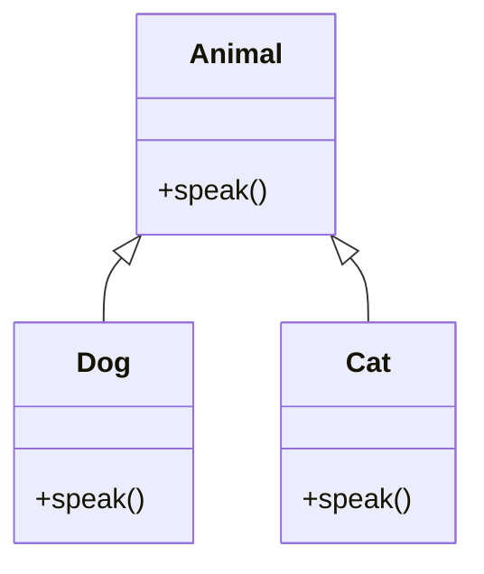

## 2.7.6 Polymorphism

Polymorphism is a cornerstone of object-oriented programming (OOP) that allows objects to be treated as instances of their parent class. This capability is crucial for achieving flexibility and extensibility in software design. In TypeScript, polymorphism is implemented through interfaces, abstract classes, and method overriding, enabling developers to write more maintainable and scalable code.

### Understanding Polymorphism

Polymorphism, derived from the Greek words "poly" (many) and "morph" (form), refers to the ability of different objects to respond to the same function call in different ways. In the context of OOP, it allows for the design of systems where objects of different types can be treated as objects of a common super type. This is achieved through:

- **Method Overriding**: Subclasses provide specific implementations of methods that are defined in their superclass.
- **Interfaces**: Define a contract that multiple classes can implement, ensuring a consistent API.
- **Abstract Classes**: Serve as partially implemented classes that can be extended by other classes.

### Dynamic Behavior Changes

Polymorphism supports dynamic behavior changes by allowing objects to be interchangeable through a common interface. This means that the exact method that gets executed is determined at runtime, based on the actual object type. This dynamic dispatch is a powerful mechanism that enables flexibility in code execution.

#### Example: Method Overriding in TypeScript

Let's consider a simple example to illustrate method overriding in TypeScript:

```typescript
class Animal {
    speak(): void {
        console.log("Animal makes a sound");
    }
}

class Dog extends Animal {
    speak(): void {
        console.log("Dog barks");
    }
}

class Cat extends Animal {
    speak(): void {
        console.log("Cat meows");
    }
}

function makeAnimalSpeak(animal: Animal): void {
    animal.speak();
}

const myDog = new Dog();
const myCat = new Cat();

makeAnimalSpeak(myDog); // Output: Dog barks
makeAnimalSpeak(myCat); // Output: Cat meows
```

In this example, the `speak` method is overridden in the `Dog` and `Cat` classes. When `makeAnimalSpeak` is called, the appropriate method for the specific object type is executed, demonstrating polymorphism.

### Interfaces and Polymorphism

Interfaces in TypeScript define a contract that classes must adhere to. This allows different classes to implement the same interface and be used interchangeably.

#### Example: Using Interfaces

Consider a scenario where we have different types of payment methods:

```typescript
interface PaymentMethod {
    pay(amount: number): void;
}

class CreditCardPayment implements PaymentMethod {
    pay(amount: number): void {
        console.log(`Paid ${amount} using Credit Card`);
    }
}

class PayPalPayment implements PaymentMethod {
    pay(amount: number): void {
        console.log(`Paid ${amount} using PayPal`);
    }
}

function processPayment(paymentMethod: PaymentMethod, amount: number): void {
    paymentMethod.pay(amount);
}

const creditCard = new CreditCardPayment();
const payPal = new PayPalPayment();

processPayment(creditCard, 100); // Output: Paid 100 using Credit Card
processPayment(payPal, 200); // Output: Paid 200 using PayPal
```

Here, both `CreditCardPayment` and `PayPalPayment` implement the `PaymentMethod` interface, allowing them to be used interchangeably in the `processPayment` function.

### Abstract Classes and Polymorphism

Abstract classes provide a way to define a base class with common functionality that can be shared by derived classes. They can include both implemented methods and abstract methods that must be implemented by subclasses.

#### Example: Abstract Classes

Let's look at an example of abstract classes:

```typescript
abstract class Shape {
    abstract area(): number;

    displayArea(): void {
        console.log(`The area is ${this.area()}`);
    }
}

class Circle extends Shape {
    constructor(private radius: number) {
        super();
    }

    area(): number {
        return Math.PI * this.radius * this.radius;
    }
}

class Rectangle extends Shape {
    constructor(private width: number, private height: number) {
        super();
    }

    area(): number {
        return this.width * this.height;
    }
}

const circle = new Circle(5);
const rectangle = new Rectangle(4, 6);

circle.displayArea(); // Output: The area is 78.53981633974483
rectangle.displayArea(); // Output: The area is 24
```

In this example, `Shape` is an abstract class with an abstract method `area`. The `Circle` and `Rectangle` classes extend `Shape` and provide their own implementations of the `area` method.

### Scenarios Simplified by Polymorphism

Polymorphism simplifies code by allowing developers to handle different types through a common interface. This is particularly useful in scenarios such as:

- **Collections of Objects**: Managing a collection of objects of different types that share a common interface.
- **Strategy Pattern**: Defining a family of algorithms, encapsulating each one, and making them interchangeable.
- **Observer Pattern**: Allowing multiple observers to listen to and react to events from a subject.

#### Example: Strategy Pattern

The Strategy pattern is a behavioral design pattern that enables selecting an algorithm's behavior at runtime. Polymorphism is key to implementing this pattern.

```typescript
interface SortingStrategy {
    sort(data: number[]): number[];
}

class BubbleSort implements SortingStrategy {
    sort(data: number[]): number[] {
        console.log("Sorting using Bubble Sort");
        // Bubble sort logic
        return data;
    }
}

class QuickSort implements SortingStrategy {
    sort(data: number[]): number[] {
        console.log("Sorting using Quick Sort");
        // Quick sort logic
        return data;
    }
}

class Sorter {
    constructor(private strategy: SortingStrategy) {}

    setStrategy(strategy: SortingStrategy): void {
        this.strategy = strategy;
    }

    sort(data: number[]): number[] {
        return this.strategy.sort(data);
    }
}

const sorter = new Sorter(new BubbleSort());
sorter.sort([5, 3, 8, 1]); // Output: Sorting using Bubble Sort

sorter.setStrategy(new QuickSort());
sorter.sort([5, 3, 8, 1]); // Output: Sorting using Quick Sort
```

In this example, the `Sorter` class uses a `SortingStrategy` interface to determine the sorting algorithm at runtime. This allows for flexibility and easy swapping of algorithms.

### Challenges in Applying Polymorphism

While polymorphism offers many benefits, it also presents challenges:

- **Complexity**: Overuse of polymorphism can lead to complex code that is difficult to understand and maintain.
- **Performance Overhead**: Dynamic dispatch can introduce performance overhead, especially in performance-critical applications.
- **Debugging Difficulty**: Tracing through polymorphic calls can be challenging, as the actual method executed is determined at runtime.

### Visualizing Polymorphism

To better understand polymorphism, let's visualize the relationship between classes and interfaces using a class diagram.



In this diagram, `Dog` and `Cat` are subclasses of `Animal`, each providing their own implementation of the `speak` method.

### Try It Yourself

Experiment with the code examples provided by:

- Adding a new class, `Bird`, that extends `Animal` and overrides the `speak` method.
- Implementing a new payment method class, `BitcoinPayment`, that implements the `PaymentMethod` interface.
- Creating a new sorting strategy, `MergeSort`, and using it with the `Sorter` class.

### References and Links

For further reading on polymorphism and related concepts, consider the following resources:

- [MDN Web Docs: Polymorphism](https://developer.mozilla.org/en-US/docs/Glossary/Polymorphism)
- [TypeScript Handbook: Interfaces](https://www.typescriptlang.org/docs/handbook/interfaces.html)
- [TypeScript Handbook: Classes](https://www.typescriptlang.org/docs/handbook/classes.html)

### Knowledge Check

Before we conclude, let's summarize the key takeaways:

- Polymorphism allows objects to be treated as instances of their parent class, enabling dynamic behavior changes.
- Interfaces and abstract classes are essential tools for implementing polymorphism in TypeScript.
- Polymorphism simplifies code by allowing different types to be handled through a common interface.
- Design patterns like Strategy and Observer leverage polymorphism to enhance flexibility and extensibility.
- While powerful, polymorphism can introduce complexity and performance challenges if not used judiciously.

### Embrace the Journey

Remember, mastering polymorphism is a journey. As you continue to explore and experiment with these concepts, you'll gain a deeper understanding of how to design flexible and maintainable software. Keep experimenting, stay curious, and enjoy the journey!

## Quiz Time!



### What is polymorphism in the context of object-oriented programming?

- [x] The ability of different objects to respond to the same function call in different ways.
- [ ] The process of creating new classes from existing ones.
- [ ] The encapsulation of data within a class.
- [ ] The use of interfaces to define a contract.

> **Explanation:** Polymorphism allows different objects to respond to the same function call in different ways, enabling dynamic behavior changes.

### Which TypeScript feature is NOT directly related to implementing polymorphism?

- [ ] Interfaces
- [ ] Abstract classes
- [x] Generics
- [ ] Method overriding

> **Explanation:** Generics are used for creating reusable components, not directly for implementing polymorphism.

### How does polymorphism support dynamic behavior changes?

- [x] By allowing objects to be interchangeable through a common interface.
- [ ] By enforcing strict type checking at compile time.
- [ ] By allowing multiple inheritance.
- [ ] By providing a way to encapsulate data.

> **Explanation:** Polymorphism allows objects to be interchangeable through a common interface, enabling dynamic behavior changes.

### What is the role of interfaces in polymorphism?

- [x] They define a contract that multiple classes can implement, ensuring a consistent API.
- [ ] They allow for multiple inheritance.
- [ ] They provide a way to encapsulate data.
- [ ] They enable the creation of new classes from existing ones.

> **Explanation:** Interfaces define a contract that multiple classes can implement, ensuring a consistent API and enabling polymorphism.

### Which design pattern leverages polymorphism to enhance flexibility?

- [x] Strategy Pattern
- [ ] Singleton Pattern
- [ ] Factory Pattern
- [ ] Decorator Pattern

> **Explanation:** The Strategy Pattern leverages polymorphism to enhance flexibility by allowing different algorithms to be interchangeable.

### What is a potential challenge of using polymorphism?

- [x] Complexity in code understanding and maintenance.
- [ ] Lack of flexibility in code execution.
- [ ] Inability to handle different types.
- [ ] Difficulty in defining interfaces.

> **Explanation:** Polymorphism can introduce complexity in code understanding and maintenance if overused.

### How can polymorphism simplify code?

- [x] By allowing different types to be handled through a common interface.
- [ ] By enforcing strict type checking at compile time.
- [ ] By allowing multiple inheritance.
- [ ] By providing a way to encapsulate data.

> **Explanation:** Polymorphism simplifies code by allowing different types to be handled through a common interface.

### Which method in TypeScript is used to provide specific implementations in subclasses?

- [x] Method overriding
- [ ] Method overloading
- [ ] Method chaining
- [ ] Method binding

> **Explanation:** Method overriding is used to provide specific implementations in subclasses, enabling polymorphism.

### What is the benefit of using abstract classes in polymorphism?

- [x] They provide a base class with common functionality that can be shared by derived classes.
- [ ] They allow for multiple inheritance.
- [ ] They provide a way to encapsulate data.
- [ ] They enable the creation of new classes from existing ones.

> **Explanation:** Abstract classes provide a base class with common functionality that can be shared by derived classes, supporting polymorphism.

### Polymorphism can introduce performance overhead in applications.

- [x] True
- [ ] False

> **Explanation:** Polymorphism can introduce performance overhead due to dynamic dispatch, especially in performance-critical applications.


