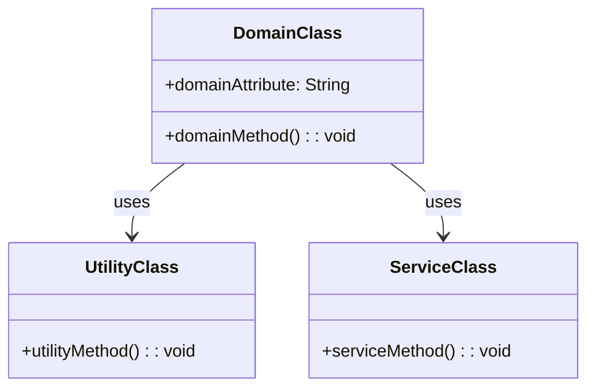

## 2.7.7 Pure Fabrication

In the realm of software engineering, particularly when dealing with object-oriented design, the concept of Pure Fabrication emerges as a crucial principle for achieving low coupling and high cohesion. This principle, part of the GRASP (General Responsibility Assignment Software Patterns) set, advocates for the creation of classes that do not directly represent concepts within the problem domain. Instead, these classes are fabricated to fulfill specific responsibilities that enhance the design's overall structure and maintainability.

### Understanding Pure Fabrication

Pure Fabrication involves the deliberate creation of classes that serve specific roles, often as utility classes or services, without being tied to the domain model. This approach is sometimes necessary to address practical software engineering needs that the domain model alone cannot satisfy. By introducing fabricated classes, developers can achieve a more modular and flexible design.

#### Why Pure Fabrication is Necessary

In many software systems, adhering strictly to the domain model can lead to designs that are overly complex or difficult to maintain. Domain models are excellent for capturing business logic and representing real-world entities, but they can fall short when it comes to implementing technical concerns such as logging, data persistence, or communication with external systems. Pure Fabrication allows developers to encapsulate these concerns in dedicated classes, leading to cleaner and more manageable codebases.

### Examples of Pure Fabrication

Let's explore some scenarios where Pure Fabrication leads to better design:

#### Utility Classes

Utility classes are a common example of Pure Fabrication. These classes provide a set of static methods that perform common tasks, such as string manipulation, date formatting, or mathematical calculations. By centralizing these functionalities, utility classes promote code reuse and reduce duplication.

```typescript
// Utility class for string operations
class StringUtils {
  // Method to capitalize the first letter of a string
  static capitalizeFirstLetter(input: string): string {
    if (!input) return '';
    return input.charAt(0).toUpperCase() + input.slice(1);
  }

  // Method to reverse a string
  static reverse(input: string): string {
    return input.split('').reverse().join('');
  }
}

// Usage
console.log(StringUtils.capitalizeFirstLetter('hello')); // Output: Hello
console.log(StringUtils.reverse('TypeScript')); // Output: tpircSepyT
```

#### Service Classes

Service classes are another form of Pure Fabrication. These classes encapsulate operations that involve multiple domain objects or require interaction with external systems. For example, a `PaymentService` class might handle the process of charging a customer, interacting with a payment gateway, and updating the order status.

```typescript
// Service class for handling payments
class PaymentService {
  // Method to process a payment
  processPayment(orderId: string, amount: number): boolean {
    // Logic to interact with a payment gateway
    console.log(`Processing payment of $${amount} for order ${orderId}`);
    // Assume payment is successful
    return true;
  }
}

// Usage
const paymentService = new PaymentService();
const paymentSuccess = paymentService.processPayment('12345', 100.00);
console.log(`Payment successful: ${paymentSuccess}`); // Output: Payment successful: true
```

### Trade-offs in Pure Fabrication

While Pure Fabrication offers significant benefits, it also involves trade-offs. One of the main challenges is balancing the purity of the domain model with practical software engineering needs. Introducing too many fabricated classes can lead to a fragmented design, where responsibilities are scattered across numerous classes. Conversely, adhering too strictly to the domain model can result in monolithic classes that are difficult to maintain.

#### Balancing Domain Models and Practical Needs

The key to effectively using Pure Fabrication lies in finding the right balance. Developers should strive to maintain the integrity of the domain model while introducing fabricated classes only when necessary to address specific technical concerns. This balance ensures that the design remains cohesive and maintainable.

### Supporting Low Coupling and High Cohesion

Pure Fabrication supports low coupling and high cohesion by encapsulating specific responsibilities in dedicated classes. This separation of concerns reduces dependencies between classes, making the system more modular and easier to understand.

#### Low Coupling

Low coupling refers to minimizing dependencies between classes. By using fabricated classes to handle specific tasks, developers can reduce the interconnections between domain classes, leading to a more flexible and adaptable design.

#### High Cohesion

High cohesion involves grouping related functionalities within a single class. Fabricated classes achieve high cohesion by focusing on a specific set of responsibilities, ensuring that each class has a clear and well-defined purpose.

### Guidelines for Introducing Fabricated Classes

When considering the introduction of fabricated classes in TypeScript applications, developers should follow these guidelines:

1. **Identify Technical Concerns**: Determine which aspects of the system are not well-represented by the domain model, such as logging, data access, or external communication.

2. **Encapsulate Responsibilities**: Create fabricated classes to encapsulate these concerns, ensuring that each class has a clear and focused responsibility.

3. **Maintain Balance**: Avoid overusing fabricated classes. Strive to maintain a balance between the domain model and fabricated classes to ensure a cohesive design.

4. **Promote Reusability**: Design fabricated classes with reusability in mind, allowing them to be easily integrated into different parts of the system.

5. **Document Intent**: Clearly document the purpose and responsibilities of each fabricated class to aid in understanding and maintenance.

### Try It Yourself

To deepen your understanding of Pure Fabrication, try modifying the provided examples:

- **Extend the `StringUtils` class** to include additional string manipulation methods, such as converting a string to camel case or checking if a string is a palindrome.

- **Enhance the `PaymentService` class** to simulate interaction with a mock payment gateway, including handling different payment statuses and logging transactions.

By experimenting with these modifications, you'll gain a better understanding of how Pure Fabrication can be applied to create flexible and maintainable software designs.

### Visualizing Pure Fabrication

To further illustrate the concept of Pure Fabrication, let's visualize the relationships between domain classes and fabricated classes using a class diagram.



In this diagram, we see a `DomainClass` that uses both a `UtilityClass` and a `ServiceClass`. The `UtilityClass` and `ServiceClass` are examples of fabricated classes that provide specific functionalities, allowing the `DomainClass` to remain focused on its core responsibilities.

### References and Further Reading

For more information on Pure Fabrication and related design principles, consider exploring the following resources:

- [GRASP Patterns on Wikipedia](https://en.wikipedia.org/wiki/GRASP_(object-oriented_design))
- [Design Patterns: Elements of Reusable Object-Oriented Software](https://www.amazon.com/Design-Patterns-Elements-Reusable-Object-Oriented/dp/0201633612) by Erich Gamma et al.
- [TypeScript Documentation](https://www.typescriptlang.org/docs/)

### Knowledge Check

To reinforce your understanding of Pure Fabrication, consider the following questions:

- What are the main benefits of using Pure Fabrication in software design?
- How does Pure Fabrication support low coupling and high cohesion?
- When should you introduce fabricated classes in a TypeScript application?

### Embrace the Journey

Remember, mastering design patterns like Pure Fabrication is a journey. As you continue to explore and apply these principles, you'll develop a deeper understanding of how to create robust and maintainable software systems. Keep experimenting, stay curious, and enjoy the process of refining your design skills!

## Quiz Time!



### What is Pure Fabrication in software design?

- [x] Creating classes that do not represent concepts in the problem domain to achieve low coupling and high cohesion.
- [ ] A method of strictly adhering to domain models without any additional classes.
- [ ] A technique for increasing coupling between classes.
- [ ] A pattern that focuses on user interface design.

> **Explanation:** Pure Fabrication involves creating classes that are not part of the domain model to address technical concerns and improve design.

### Which of the following is an example of a fabricated class?

- [x] Utility class for string manipulation
- [ ] Domain class representing a customer
- [ ] Interface for a payment gateway
- [ ] Abstract class for database entities

> **Explanation:** Utility classes are fabricated to provide specific functionalities not tied to the domain model.

### What is a key benefit of Pure Fabrication?

- [x] Achieving low coupling and high cohesion
- [ ] Increasing the complexity of the domain model
- [ ] Reducing the number of classes in a system
- [ ] Making all classes part of the domain model

> **Explanation:** Pure Fabrication helps in achieving low coupling and high cohesion by encapsulating specific responsibilities.

### When should you consider introducing a fabricated class?

- [x] When technical concerns are not well-represented by the domain model
- [ ] When the domain model is too simple
- [ ] When you want to increase the number of classes
- [ ] When you need to strictly adhere to the domain model

> **Explanation:** Fabricated classes are introduced to address technical concerns that the domain model does not cover.

### How does Pure Fabrication support high cohesion?

- [x] By grouping related functionalities within a single class
- [ ] By spreading responsibilities across multiple classes
- [ ] By increasing dependencies between classes
- [ ] By focusing on the domain model alone

> **Explanation:** Pure Fabrication supports high cohesion by ensuring each fabricated class has a clear and focused responsibility.

### What is a trade-off of using Pure Fabrication?

- [x] Balancing domain models with practical software engineering needs
- [ ] Reducing the number of classes in a system
- [ ] Making the domain model more complex
- [ ] Eliminating the need for utility classes

> **Explanation:** The trade-off involves balancing the purity of the domain model with practical needs, ensuring a cohesive design.

### Which principle does Pure Fabrication help achieve?

- [x] Low coupling
- [ ] High coupling
- [ ] Increased complexity
- [ ] Domain model purity

> **Explanation:** Pure Fabrication helps achieve low coupling by reducing dependencies between domain classes.

### What should you document when introducing a fabricated class?

- [x] The purpose and responsibilities of the class
- [ ] The exact code implementation
- [ ] The number of methods in the class
- [ ] The name of the developer who created it

> **Explanation:** Documenting the purpose and responsibilities aids in understanding and maintaining the fabricated class.

### True or False: Pure Fabrication classes are always part of the domain model.

- [ ] True
- [x] False

> **Explanation:** Pure Fabrication classes are not part of the domain model; they are created to address specific technical concerns.

### What is the primary goal of Pure Fabrication?

- [x] To achieve low coupling and high cohesion
- [ ] To increase the number of domain classes
- [ ] To focus solely on user interface design
- [ ] To eliminate the need for service classes

> **Explanation:** The primary goal of Pure Fabrication is to achieve low coupling and high cohesion by creating classes that address specific technical concerns.


