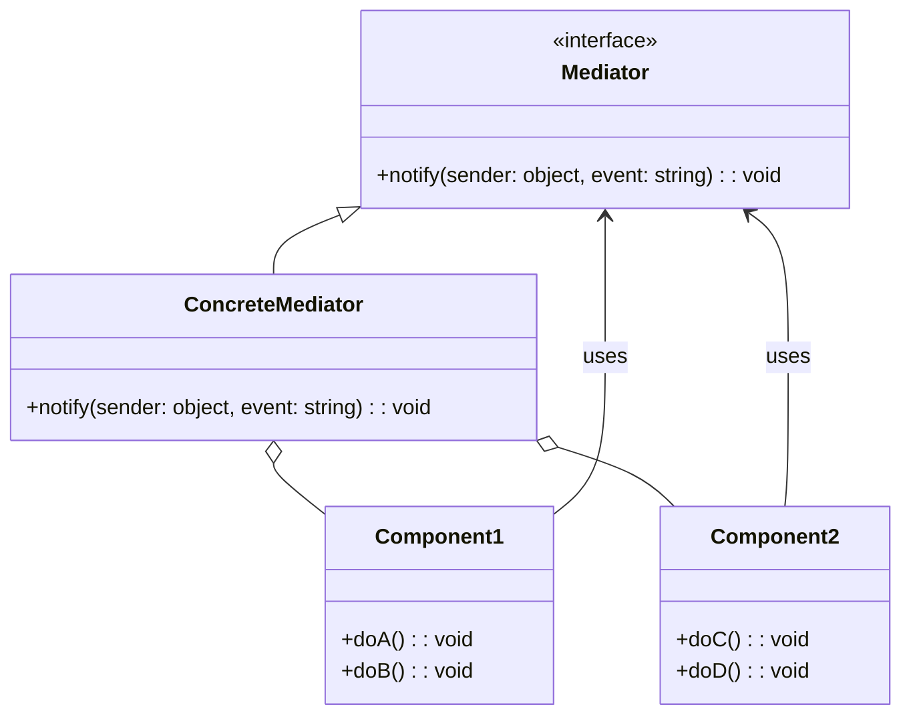

## 2.7.8 Indirection

In the realm of software engineering, especially when dealing with complex systems, the principle of **Indirection** plays a pivotal role in enhancing flexibility and reducing coupling between components. This principle is part of the GRASP (General Responsibility Assignment Software Patterns) principles, which guide the assignment of responsibilities in object-oriented design. In this section, we will delve into the concept of indirection, its purpose, and how it can be effectively implemented in TypeScript to create more maintainable and scalable systems.

### Understanding Indirection

**Indirection** refers to the introduction of intermediary objects or layers that mediate interactions between components. By doing so, it reduces the direct coupling between components, allowing them to evolve independently. This decoupling is crucial for building systems that are flexible and adaptable to change.

#### Purpose of Indirection

The primary purpose of indirection is to manage dependencies and interactions between components in a way that minimizes the impact of changes. By introducing an intermediary, components can communicate without being directly aware of each other's implementations. This abstraction layer can be used to:

- **Decouple Components**: Allow components to interact without being tightly bound to each other.
- **Increase Flexibility**: Facilitate changes and extensions without affecting other parts of the system.
- **Enhance Reusability**: Enable components to be reused in different contexts by abstracting their interactions.

### Implementing Indirection in TypeScript

Let's explore how indirection can be implemented in TypeScript using various design patterns and techniques. We will look at examples such as middleware, adapters, and service layers to illustrate the concept.

#### Middleware Pattern

Middleware is a common pattern used in web development to process requests and responses in a chain of responsibility. It acts as an intermediary layer that can modify or handle requests before they reach the final destination.

```typescript
type Request = { url: string; method: string; };
type Response = { status: number; body: string; };

type Middleware = (req: Request, res: Response, next: () => void) => void;

class Server {
  private middlewares: Middleware[] = [];

  use(middleware: Middleware) {
    this.middlewares.push(middleware);
  }

  handleRequest(req: Request, res: Response) {
    const runMiddleware = (index: number) => {
      if (index < this.middlewares.length) {
        this.middlewares[index](req, res, () => runMiddleware(index + 1));
      }
    };
    runMiddleware(0);
  }
}

// Usage
const server = new Server();

server.use((req, res, next) => {
  console.log(`Request URL: ${req.url}`);
  next();
});

server.use((req, res, next) => {
  if (req.method !== 'GET') {
    res.status = 405;
    res.body = 'Method Not Allowed';
  } else {
    next();
  }
});

const req: Request = { url: '/api/data', method: 'GET' };
const res: Response = { status: 200, body: '' };

server.handleRequest(req, res);
console.log(res); // { status: 200, body: '' }
```

In this example, the `Server` class uses a chain of middleware functions to process requests. Each middleware can modify the request or response, or pass control to the next middleware in the chain. This pattern exemplifies indirection by allowing middleware to be added or removed without changing the core logic of the server.

#### Adapter Pattern

The Adapter pattern is another form of indirection that allows incompatible interfaces to work together. It acts as a bridge between two incompatible interfaces, enabling them to communicate.

```typescript
interface OldInterface {
  oldMethod(): string;
}

class OldSystem implements OldInterface {
  oldMethod(): string {
    return 'Old system method';
  }
}

interface NewInterface {
  newMethod(): string;
}

class Adapter implements NewInterface {
  private oldSystem: OldSystem;

  constructor(oldSystem: OldSystem) {
    this.oldSystem = oldSystem;
  }

  newMethod(): string {
    return this.oldSystem.oldMethod();
  }
}

// Usage
const oldSystem = new OldSystem();
const adapter = new Adapter(oldSystem);

console.log(adapter.newMethod()); // Outputs: Old system method
```

In this example, the `Adapter` class allows the `OldSystem` to be used where a `NewInterface` is expected. This indirection enables the integration of legacy systems without modifying their existing code.

#### Service Layer Pattern

The Service Layer pattern introduces a layer that encapsulates the business logic of an application. It provides a set of services that can be used by the presentation layer, acting as an intermediary between the user interface and the data access layers.

```typescript
class UserService {
  getUser(id: number): string {
    // Simulate fetching user from a database
    return `User with ID: ${id}`;
  }
}

class UserController {
  private userService: UserService;

  constructor(userService: UserService) {
    this.userService = userService;
  }

  getUserInfo(id: number): string {
    return this.userService.getUser(id);
  }
}

// Usage
const userService = new UserService();
const userController = new UserController(userService);

console.log(userController.getUserInfo(1)); // Outputs: User with ID: 1
```

Here, the `UserService` acts as a service layer that provides user-related operations. The `UserController` uses this service to retrieve user information, demonstrating indirection by separating the business logic from the presentation layer.

### Impact of Indirection on System Complexity and Performance

While indirection offers significant benefits in terms of flexibility and decoupling, it can also introduce complexity and performance overhead. Let's explore these aspects in more detail.

#### Complexity

Indirection can increase the complexity of a system by adding additional layers and components. This complexity can make the system harder to understand and maintain, especially if the indirection layers are not well-documented or if their purpose is not clear.

To manage complexity, it is essential to:

- **Document the Purpose**: Clearly document the purpose and responsibilities of each indirection layer.
- **Keep It Simple**: Avoid unnecessary indirection. Use it only when it provides clear benefits.
- **Use Clear Naming**: Use descriptive names for intermediary components to convey their role in the system.

#### Performance

Indirection can also impact performance due to the additional processing and communication overhead introduced by intermediary layers. Each layer adds a level of abstraction, which can slow down the system if not managed properly.

To mitigate performance issues:

- **Optimize Critical Paths**: Identify and optimize performance-critical paths in the system.
- **Use Caching**: Implement caching strategies to reduce the need for repeated processing.
- **Measure and Monitor**: Continuously measure and monitor system performance to identify and address bottlenecks.

### Indirection in Design Patterns

Indirection is a fundamental concept in many design patterns, such as Proxy and Mediator. Let's explore how these patterns leverage indirection to achieve their goals.

#### Proxy Pattern

The Proxy pattern introduces a surrogate or placeholder for another object to control access to it. This pattern uses indirection to add additional behavior or control access without modifying the original object.

```typescript
interface Subject {
  request(): void;
}

class RealSubject implements Subject {
  request(): void {
    console.log('RealSubject: Handling request.');
  }
}

class ProxySubject implements Subject {
  private realSubject: RealSubject;

  constructor(realSubject: RealSubject) {
    this.realSubject = realSubject;
  }

  request(): void {
    console.log('ProxySubject: Checking access before forwarding request.');
    this.realSubject.request();
    console.log('ProxySubject: Logging the request.');
  }
}

// Usage
const realSubject = new RealSubject();
const proxy = new ProxySubject(realSubject);

proxy.request();
// Outputs:
// ProxySubject: Checking access before forwarding request.
// RealSubject: Handling request.
// ProxySubject: Logging the request.
```

In this example, the `ProxySubject` acts as an intermediary that controls access to the `RealSubject`. This indirection allows additional behavior, such as access control and logging, to be added without modifying the `RealSubject`.

#### Mediator Pattern

The Mediator pattern defines an object that encapsulates how a set of objects interact. It uses indirection to reduce the dependencies between communicating objects, allowing them to interact through the mediator instead of directly.

```typescript
interface Mediator {
  notify(sender: object, event: string): void;
}

class ConcreteMediator implements Mediator {
  private component1: Component1;
  private component2: Component2;

  constructor(c1: Component1, c2: Component2) {
    this.component1 = c1;
    this.component2 = c2;
    this.component1.setMediator(this);
    this.component2.setMediator(this);
  }

  notify(sender: object, event: string): void {
    if (event === 'A') {
      console.log('Mediator reacts on A and triggers following operations:');
      this.component2.doC();
    }
    if (event === 'D') {
      console.log('Mediator reacts on D and triggers following operations:');
      this.component1.doB();
      this.component2.doC();
    }
  }
}

class BaseComponent {
  protected mediator: Mediator;

  setMediator(mediator: Mediator): void {
    this.mediator = mediator;
  }
}

class Component1 extends BaseComponent {
  doA(): void {
    console.log('Component 1 does A.');
    this.mediator.notify(this, 'A');
  }

  doB(): void {
    console.log('Component 1 does B.');
  }
}

class Component2 extends BaseComponent {
  doC(): void {
    console.log('Component 2 does C.');
  }

  doD(): void {
    console.log('Component 2 does D.');
    this.mediator.notify(this, 'D');
  }
}

// Usage
const c1 = new Component1();
const c2 = new Component2();
const mediator = new ConcreteMediator(c1, c2);

c1.doA();
c2.doD();
// Outputs:
// Component 1 does A.
// Mediator reacts on A and triggers following operations:
// Component 2 does C.
// Component 2 does D.
// Mediator reacts on D and triggers following operations:
// Component 1 does B.
// Component 2 does C.
```

In this example, the `ConcreteMediator` manages the interactions between `Component1` and `Component2`. This indirection allows the components to communicate without being directly aware of each other, reducing their dependencies.

### Balancing Indirection and Overhead

While indirection offers numerous benefits, it is essential to balance these benefits against the potential overhead it introduces. Here are some guidelines to help you make informed decisions about when and how to use indirection:

- **Assess the Need**: Evaluate whether indirection is necessary for your specific use case. Consider the complexity and flexibility requirements of your system.
- **Measure Impact**: Continuously measure the impact of indirection on system performance and complexity. Use profiling tools to identify bottlenecks and optimize where needed.
- **Iterate and Refine**: As your system evolves, revisit your use of indirection. Refactor and refine your design to ensure it remains efficient and maintainable.

### Try It Yourself

To deepen your understanding of indirection, try experimenting with the code examples provided. Here are some suggestions:

- **Modify the Middleware Chain**: Add additional middleware functions to the server example. Experiment with different request and response modifications.
- **Create a New Adapter**: Implement an adapter for a different legacy system. Explore how the adapter pattern can be used to integrate various systems.
- **Extend the Service Layer**: Add new methods to the `UserService` and use them in the `UserController`. Consider how the service layer can be expanded to support additional business logic.

### Visualizing Indirection

To better understand how indirection works, let's visualize the interactions between components using the Mediator pattern as an example.



**Diagram Description**: This class diagram illustrates the relationship between the `ConcreteMediator`, `Component1`, and `Component2`. The `ConcreteMediator` acts as an intermediary, facilitating communication between the components.

### Key Takeaways

- **Indirection** introduces intermediary objects to reduce direct coupling and increase flexibility.
- It can be implemented using patterns like Middleware, Adapter, and Service Layer.
- While beneficial, indirection can introduce complexity and performance overhead.
- Patterns like Proxy and Mediator leverage indirection to achieve their goals.
- Balance the benefits of indirection against potential overhead by assessing the need, measuring impact, and iterating on design.

Remember, indirection is a powerful tool in your design arsenal. Use it wisely to create systems that are both flexible and maintainable. Keep experimenting, stay curious, and enjoy the journey of mastering design patterns in TypeScript!

## Quiz Time!



### What is the primary purpose of indirection in software design?

- [x] To decouple components and increase flexibility
- [ ] To increase system complexity
- [ ] To directly couple components
- [ ] To reduce system performance

> **Explanation:** Indirection is used to decouple components and increase flexibility by introducing intermediary objects.

### Which pattern is an example of using indirection to control access to an object?

- [x] Proxy Pattern
- [ ] Singleton Pattern
- [ ] Factory Pattern
- [ ] Observer Pattern

> **Explanation:** The Proxy Pattern uses indirection to control access to an object by introducing a surrogate or placeholder.

### In the Middleware pattern, what role does each middleware function play?

- [x] It processes requests and responses, potentially modifying them or passing control to the next middleware.
- [ ] It acts as the final destination for requests.
- [ ] It directly couples the client and server.
- [ ] It reduces system flexibility.

> **Explanation:** Each middleware function processes requests and responses, potentially modifying them or passing control to the next middleware in the chain.

### How does the Adapter pattern use indirection?

- [x] By acting as a bridge between incompatible interfaces
- [ ] By directly modifying the original interface
- [ ] By coupling two interfaces tightly
- [ ] By increasing system complexity

> **Explanation:** The Adapter pattern uses indirection by acting as a bridge between incompatible interfaces, allowing them to work together.

### What is a potential downside of using indirection?

- [x] Increased system complexity and performance overhead
- [ ] Reduced flexibility
- [ ] Direct coupling of components
- [ ] Decreased maintainability

> **Explanation:** Indirection can increase system complexity and performance overhead due to additional layers and processing.

### Which pattern uses a mediator to manage interactions between components?

- [x] Mediator Pattern
- [ ] Observer Pattern
- [ ] Factory Pattern
- [ ] Singleton Pattern

> **Explanation:** The Mediator Pattern uses a mediator to manage interactions between components, reducing their dependencies.

### What is a key benefit of using a service layer in a system?

- [x] It encapsulates business logic and provides a set of services for the presentation layer.
- [ ] It directly couples the user interface and data access layers.
- [ ] It increases system complexity.
- [ ] It reduces system flexibility.

> **Explanation:** A service layer encapsulates business logic and provides a set of services for the presentation layer, promoting separation of concerns.

### How can indirection impact system performance?

- [x] By introducing additional processing and communication overhead
- [ ] By directly improving performance
- [ ] By eliminating all overhead
- [ ] By reducing system flexibility

> **Explanation:** Indirection can impact system performance by introducing additional processing and communication overhead due to intermediary layers.

### What should be considered when deciding to use indirection?

- [x] The complexity and flexibility requirements of the system
- [ ] The need to directly couple components
- [ ] The desire to reduce system flexibility
- [ ] The goal to increase system complexity

> **Explanation:** When deciding to use indirection, consider the complexity and flexibility requirements of the system to ensure it provides clear benefits.

### Indirection is a fundamental concept in many design patterns. True or False?

- [x] True
- [ ] False

> **Explanation:** Indirection is indeed a fundamental concept in many design patterns, such as Proxy and Mediator, as it helps decouple components and increase flexibility.


