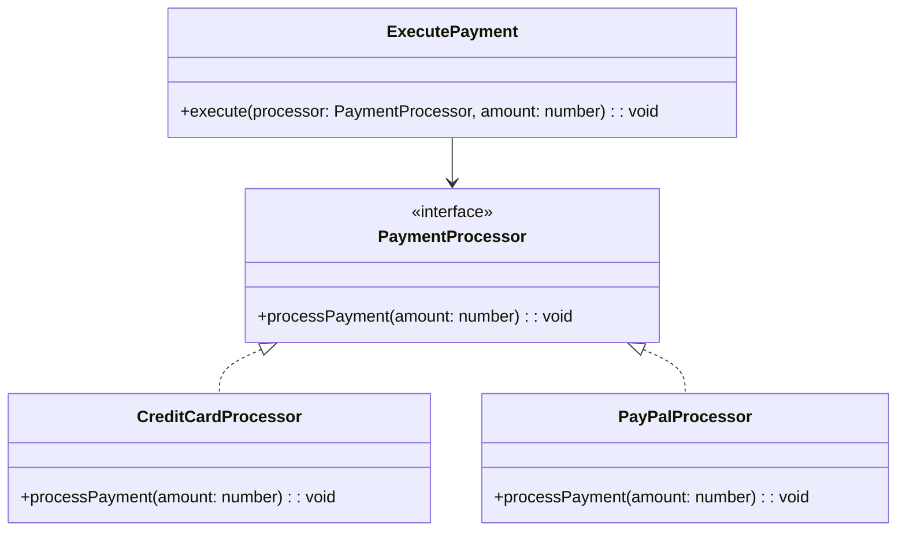

## 2.7.9 Protected Variations

In the ever-evolving landscape of software development, the ability to adapt to change is paramount. The GRASP (General Responsibility Assignment Software Patterns) principle of **Protected Variations** is a cornerstone in achieving this adaptability. By shielding elements of a system from the impact of variations in other elements through stable interfaces, we can create robust, maintainable, and flexible software architectures. In this section, we will delve into the concept of Protected Variations, its significance, and how to implement it effectively in TypeScript.

### Understanding Protected Variations

Protected Variations is a design principle that emphasizes the importance of identifying points of potential variation within a system and protecting other parts of the system from these variations. This is achieved by introducing stable interfaces or abstraction layers that act as a buffer between the varying and stable parts of the system.

#### Significance of Protected Variations

The primary goal of Protected Variations is to enhance the stability and robustness of a software system. By isolating changes to specific areas, we can reduce the ripple effect that changes in one part of the system can have on others. This leads to several benefits:

- **Easier Maintenance**: Changes are localized, making it easier to update or modify parts of the system without affecting others.
- **Adaptability**: The system can more easily accommodate new requirements or changes in technology.
- **Reduced Risk**: By minimizing the impact of changes, the risk of introducing bugs or errors is reduced.

### Identifying Points of Variation

Before we can protect against variations, we must first identify where they might occur. Points of variation are typically found in areas where:

- **Business Rules Change Frequently**: These are often subject to change as business needs evolve.
- **Technology Dependencies**: External libraries or APIs that may change over time.
- **User Interface Elements**: UI components that may need to be updated to improve user experience.
- **Algorithmic Changes**: Parts of the system that rely on complex algorithms which may need optimization or replacement.

### Implementing Protected Variations in TypeScript

To effectively implement Protected Variations in TypeScript, we can leverage several techniques, including the use of interfaces, abstraction layers, and design patterns such as Factory and Strategy.

#### Using Interfaces and Abstraction Layers

Interfaces in TypeScript provide a way to define contracts for classes, ensuring that they adhere to a specific structure. By using interfaces, we can create abstraction layers that decouple the implementation from the usage.

```typescript
// Define an interface for a payment processor
interface PaymentProcessor {
  processPayment(amount: number): void;
}

// Implement a concrete class for a credit card payment processor
class CreditCardProcessor implements PaymentProcessor {
  processPayment(amount: number): void {
    console.log(`Processing credit card payment of $${amount}`);
  }
}

// Implement a concrete class for a PayPal payment processor
class PayPalProcessor implements PaymentProcessor {
  processPayment(amount: number): void {
    console.log(`Processing PayPal payment of $${amount}`);
  }
}

// Use the interface to decouple the payment processing logic
function executePayment(processor: PaymentProcessor, amount: number): void {
  processor.processPayment(amount);
}

// Example usage
const creditCardProcessor = new CreditCardProcessor();
executePayment(creditCardProcessor, 100);

const payPalProcessor = new PayPalProcessor();
executePayment(payPalProcessor, 200);
```

In this example, the `PaymentProcessor` interface acts as a stable interface that shields the rest of the system from changes in the payment processing logic. By adhering to this interface, different payment processors can be used interchangeably without affecting the rest of the system.

#### Implementing Design Patterns

Design patterns such as Factory and Strategy are powerful tools for implementing Protected Variations. These patterns provide a structured way to encapsulate variations and expose stable interfaces.

##### Factory Pattern

The Factory Pattern is used to create objects without specifying the exact class of object that will be created. This is particularly useful for creating instances of classes that may change over time.

```typescript
// Define an interface for a product
interface Product {
  use(): void;
}

// Implement concrete classes for different types of products
class ConcreteProductA implements Product {
  use(): void {
    console.log("Using product A");
  }
}

class ConcreteProductB implements Product {
  use(): void {
    console.log("Using product B");
  }
}

// Define a factory class to create products
class ProductFactory {
  static createProduct(type: string): Product {
    if (type === "A") {
      return new ConcreteProductA();
    } else if (type === "B") {
      return new ConcreteProductB();
    } else {
      throw new Error("Invalid product type");
    }
  }
}

// Example usage
const productA = ProductFactory.createProduct("A");
productA.use();

const productB = ProductFactory.createProduct("B");
productB.use();
```

In this example, the `ProductFactory` class encapsulates the logic for creating different types of products. By using this factory, the rest of the system is protected from changes in the product creation logic.

##### Strategy Pattern

The Strategy Pattern is used to define a family of algorithms, encapsulate each one, and make them interchangeable. This pattern is particularly useful for algorithmic variations.

```typescript
// Define an interface for a sorting strategy
interface SortingStrategy {
  sort(data: number[]): number[];
}

// Implement concrete classes for different sorting algorithms
class BubbleSortStrategy implements SortingStrategy {
  sort(data: number[]): number[] {
    console.log("Sorting using bubble sort");
    // Implement bubble sort algorithm
    return data;
  }
}

class QuickSortStrategy implements SortingStrategy {
  sort(data: number[]): number[] {
    console.log("Sorting using quick sort");
    // Implement quick sort algorithm
    return data;
  }
}

// Define a context class to use the sorting strategy
class Sorter {
  constructor(private strategy: SortingStrategy) {}

  setStrategy(strategy: SortingStrategy): void {
    this.strategy = strategy;
  }

  sort(data: number[]): number[] {
    return this.strategy.sort(data);
  }
}

// Example usage
const data = [5, 3, 8, 1, 2];
const sorter = new Sorter(new BubbleSortStrategy());
console.log(sorter.sort(data));

sorter.setStrategy(new QuickSortStrategy());
console.log(sorter.sort(data));
```

In this example, the `Sorter` class uses a `SortingStrategy` interface to decouple the sorting logic from the specific algorithm used. This allows for easy substitution of different sorting algorithms without affecting the rest of the system.

### Benefits of Protected Variations

Implementing Protected Variations offers several benefits:

- **Easier Maintenance**: By isolating changes to specific areas, maintenance becomes more manageable.
- **Increased Flexibility**: The system can adapt to new requirements or changes in technology with minimal impact.
- **Improved Testability**: Stable interfaces make it easier to write unit tests and ensure system reliability.
- **Enhanced Collaboration**: With clear boundaries between components, teams can work on different parts of the system independently.

### Common Strategies for Applying Protected Variations in TypeScript

When applying Protected Variations in TypeScript projects, consider the following strategies:

- **Use Interfaces and Abstract Classes**: Define clear contracts for components to adhere to, ensuring that changes in implementation do not affect the rest of the system.
- **Leverage Design Patterns**: Utilize patterns such as Factory, Strategy, and Adapter to encapsulate variations and expose stable interfaces.
- **Modularize Code**: Break down the system into smaller, independent modules that can be developed and tested in isolation.
- **Adopt Test-Driven Development (TDD)**: Use TDD to ensure that changes do not introduce regressions and that the system remains stable.
- **Embrace Continuous Integration (CI)**: Implement CI practices to catch issues early and ensure that changes do not negatively impact the system.

### Designing for Change

One of the key aspects of Protected Variations is designing for change. By anticipating potential variations and building systems that can accommodate them, we can future-proof our applications and ensure their longevity.

#### Future-Proofing Applications

To future-proof applications, consider the following:

- **Identify Potential Variations Early**: During the design phase, identify areas that are likely to change and plan for them.
- **Use Stable Interfaces**: Define interfaces that are unlikely to change, even if the underlying implementation does.
- **Encourage Loose Coupling**: Design components that are loosely coupled, allowing for easy substitution and modification.
- **Promote Reusability**: Build components that can be reused across different parts of the system or in different projects.

By following these principles, we can create software systems that are resilient to change and capable of evolving with the needs of the business.

### Try It Yourself

To solidify your understanding of Protected Variations, try modifying the code examples provided:

- **Experiment with Different Payment Processors**: Add a new payment processor class and see how easily it can be integrated into the existing system.
- **Implement a New Sorting Algorithm**: Create a new sorting strategy and use it with the `Sorter` class.
- **Create a New Product Type**: Extend the `ProductFactory` to support a new type of product and test its integration.

By experimenting with these examples, you'll gain a deeper understanding of how Protected Variations can be applied in real-world scenarios.

### Visualizing Protected Variations

To better understand the concept of Protected Variations, let's visualize the relationship between stable interfaces and varying implementations using a class diagram.



**Diagram Description**: This class diagram illustrates the relationship between the `PaymentProcessor` interface and its concrete implementations (`CreditCardProcessor` and `PayPalProcessor`). The `ExecutePayment` function uses the `PaymentProcessor` interface to decouple the payment logic from the specific implementation.

### Conclusion

Protected Variations is a powerful principle that enables us to build software systems that are resilient to change. By identifying points of variation and shielding the rest of the system through stable interfaces and abstraction layers, we can create maintainable, adaptable, and robust applications. As you continue your journey in software development, remember to design for change and embrace the principles of Protected Variations to future-proof your applications.

## Quiz Time!



### What is the primary goal of the Protected Variations principle?

- [x] To enhance the stability and robustness of a software system by isolating changes to specific areas.
- [ ] To increase the complexity of a software system by adding more interfaces.
- [ ] To ensure that all parts of a system are tightly coupled.
- [ ] To make a system more difficult to maintain.

> **Explanation:** The primary goal of Protected Variations is to enhance stability and robustness by isolating changes to specific areas, reducing the impact on the rest of the system.

### How can interfaces help in implementing Protected Variations?

- [x] By defining contracts that decouple the implementation from the usage.
- [ ] By making the system more complex and difficult to understand.
- [ ] By ensuring that all classes have the same implementation.
- [ ] By increasing the number of dependencies in the system.

> **Explanation:** Interfaces define contracts that decouple implementation from usage, allowing for interchangeable components and protecting against variations.

### Which design pattern is useful for encapsulating algorithmic variations?

- [x] Strategy Pattern
- [ ] Singleton Pattern
- [ ] Observer Pattern
- [ ] Decorator Pattern

> **Explanation:** The Strategy Pattern is used to define a family of algorithms, encapsulate each one, and make them interchangeable, making it ideal for algorithmic variations.

### What is a benefit of using the Factory Pattern in Protected Variations?

- [x] It encapsulates the logic for creating different types of objects, protecting the system from changes in object creation logic.
- [ ] It makes the system more complex and difficult to maintain.
- [ ] It ensures that all objects are created using the same class.
- [ ] It increases the coupling between components.

> **Explanation:** The Factory Pattern encapsulates object creation logic, allowing for changes in object types without affecting the rest of the system.

### What is a common strategy for applying Protected Variations in TypeScript projects?

- [x] Use interfaces and abstract classes to define clear contracts for components.
- [ ] Avoid using any design patterns to keep the system simple.
- [ ] Ensure that all components are tightly coupled.
- [ ] Use global variables to manage state.

> **Explanation:** Using interfaces and abstract classes to define clear contracts helps in decoupling components and protecting against variations.

### Why is it important to design for change in software development?

- [x] To future-proof applications and ensure they can adapt to new requirements or changes in technology.
- [ ] To make the system more complex and difficult to maintain.
- [ ] To ensure that all parts of the system are tightly coupled.
- [ ] To make the system more difficult to understand.

> **Explanation:** Designing for change helps future-proof applications, making them adaptable to new requirements or changes in technology.

### What is a benefit of modularizing code in a TypeScript project?

- [x] It allows for independent development and testing of different parts of the system.
- [ ] It makes the system more complex and difficult to maintain.
- [ ] It ensures that all components are tightly coupled.
- [ ] It increases the number of dependencies in the system.

> **Explanation:** Modularizing code allows for independent development and testing, making maintenance easier and reducing the impact of changes.

### How does the Strategy Pattern help in achieving Protected Variations?

- [x] By allowing different algorithms to be used interchangeably without affecting the rest of the system.
- [ ] By making the system more complex and difficult to maintain.
- [ ] By ensuring that all algorithms are implemented in the same class.
- [ ] By increasing the coupling between components.

> **Explanation:** The Strategy Pattern allows different algorithms to be used interchangeably, protecting the system from changes in algorithmic logic.

### What is the role of abstraction layers in Protected Variations?

- [x] To act as a buffer between varying and stable parts of the system.
- [ ] To increase the complexity of the system.
- [ ] To ensure that all parts of the system are tightly coupled.
- [ ] To make the system more difficult to maintain.

> **Explanation:** Abstraction layers act as a buffer, decoupling varying parts from stable parts, and protecting the system from changes.

### True or False: Protected Variations can help reduce the risk of introducing bugs or errors in a system.

- [x] True
- [ ] False

> **Explanation:** By isolating changes to specific areas and using stable interfaces, Protected Variations can help reduce the risk of introducing bugs or errors.


