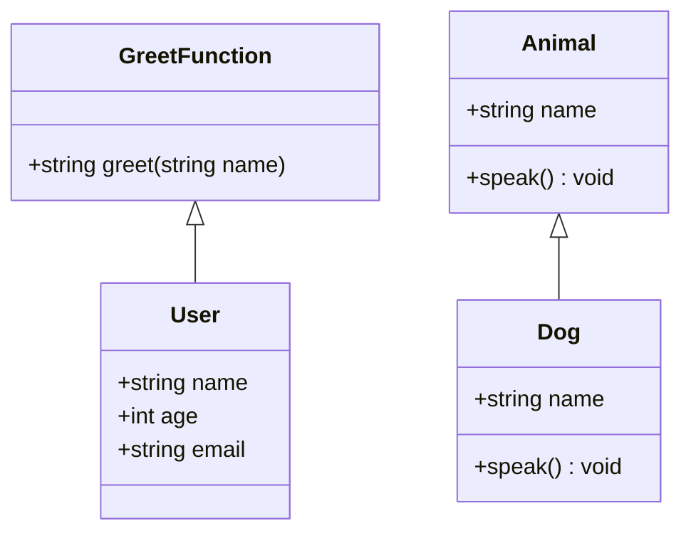

## 3.2 Interfaces and Type Aliases

In the world of TypeScript, interfaces and type aliases play a crucial role in defining the structure and behavior of objects, functions, and classes. They provide a way to create contracts within your code, ensuring that different parts of your application adhere to expected shapes and functionalities. This section delves into these powerful features, offering insights and best practices for expert software engineers.

### What are Interfaces in TypeScript?

Interfaces in TypeScript are a way to define the shape of an object. They act as a contract that an object or class must adhere to, specifying the properties and methods that must be present. Interfaces are particularly useful for ensuring consistency across different parts of an application and can be used to define complex types that are reused throughout your codebase.

#### Declaring Interfaces for Objects

To declare an interface in TypeScript, use the `interface` keyword followed by the name of the interface. Here's a simple example:

```typescript
interface User {
  name: string;
  age: number;
  email?: string; // Optional property
}

const user: User = {
  name: "Alice",
  age: 30,
  email: "alice@example.com"
};
```

In this example, the `User` interface defines a contract for objects that must have `name` and `age` properties, with `email` being optional.

#### Interfaces for Functions

Interfaces can also define the shape of functions, specifying the parameters and return type:

```typescript
interface GreetFunction {
  (name: string): string;
}

const greet: GreetFunction = (name) => `Hello, ${name}!`;
```

Here, `GreetFunction` is an interface that describes a function taking a `string` parameter and returning a `string`.

#### Interfaces for Classes

Interfaces can be implemented by classes to ensure they adhere to a specific structure:

```typescript
interface Animal {
  name: string;
  speak(): void;
}

class Dog implements Animal {
  name: string;

  constructor(name: string) {
    this.name = name;
  }

  speak() {
    console.log(`${this.name} barks.`);
  }
}

const dog = new Dog("Buddy");
dog.speak(); // Output: Buddy barks.
```

In this example, the `Dog` class implements the `Animal` interface, ensuring it has a `name` property and a `speak` method.

### Extending Interfaces and Inheritance

Interfaces in TypeScript can extend other interfaces, allowing for a form of inheritance. This is useful for creating complex types that build upon existing ones:

```typescript
interface Person {
  name: string;
  age: number;
}

interface Employee extends Person {
  employeeId: number;
}

const employee: Employee = {
  name: "Bob",
  age: 25,
  employeeId: 1234
};
```

Here, the `Employee` interface extends `Person`, inheriting its properties and adding a new one, `employeeId`.

### Understanding Type Aliases

Type aliases in TypeScript provide a way to create a new name for a type. They are similar to interfaces but offer more flexibility, especially when dealing with complex types like unions and intersections.

#### Type Aliases for Primitive and Complex Types

Type aliases can be used for primitive types, union types, intersection types, and even function types:

```typescript
type ID = string | number; // Union type

type Point = {
  x: number;
  y: number;
};

type ReadonlyPoint = Readonly<Point>; // Intersection type using utility types

type LogFunction = (message: string) => void; // Function type
```

In these examples, `ID` is a union type that can be either a `string` or a `number`, `Point` is a simple object type, `ReadonlyPoint` is an intersection type using TypeScript's utility types, and `LogFunction` is a function type.

### Comparing Interfaces and Type Aliases

While interfaces and type aliases can often be used interchangeably, there are key differences that influence when to use each.

#### When to Use Interfaces

- **Extensibility**: Interfaces can be extended or implemented, making them ideal for defining contracts that need to be expanded over time.
- **Classes**: Use interfaces when you need to define a contract for classes to implement.

#### When to Use Type Aliases

- **Complex Types**: Type aliases are more suitable for union, intersection, and tuple types.
- **Utility Types**: Use type aliases when leveraging TypeScript's utility types like `Partial`, `Readonly`, etc.

### Optional and Readonly Properties in Interfaces

TypeScript interfaces support optional properties, denoted by a `?`, and readonly properties, which cannot be modified after initialization:

```typescript
interface Config {
  readonly apiKey: string;
  timeout?: number;
}

const config: Config = {
  apiKey: "12345"
};

// config.apiKey = "67890"; // Error: Cannot assign to 'apiKey' because it is a read-only property.
```

In this example, `apiKey` is a readonly property, while `timeout` is optional.

### Enhancing Code Abstraction and Reusability

Interfaces and type aliases enhance code abstraction by allowing developers to define clear contracts and reusable types. This abstraction layer helps in maintaining large codebases by ensuring consistency and reducing the chances of errors.

#### Advanced Examples with Generics

Generics add another layer of flexibility to interfaces and type aliases, allowing them to work with a variety of types:

```typescript
interface Response<T> {
  data: T;
  status: number;
}

type Callback<T> = (result: T) => void;

function fetchData<T>(url: string, callback: Callback<T>): void {
  // Simulated fetch operation
  const data: T = {} as T; // Assume data is fetched and cast to T
  callback(data);
}
```

In this example, the `Response` interface and `Callback` type alias use generics to handle different data types.

### Best Practices for Naming and Organizing

- **Descriptive Names**: Use clear and descriptive names for interfaces and type aliases to convey their purpose.
- **Consistent Naming Conventions**: Follow consistent naming conventions, such as prefixing interfaces with `I`.
- **Organize by Module**: Group related interfaces and type aliases within modules or files to improve maintainability.

### Limitations and Potential Pitfalls

While interfaces and type aliases are powerful, they have limitations:

- **Complex Types**: Interfaces cannot represent some complex types, such as unions or mapped types, which type aliases can handle.
- **Circular References**: Be cautious of circular references when extending interfaces or creating recursive type aliases.

### Upcoming TypeScript Features

TypeScript continues to evolve, with proposals that may impact interfaces and type aliases. Stay updated with the TypeScript roadmap to leverage new features as they become available.

### Try It Yourself

Experiment with the provided examples by modifying properties, extending interfaces, or creating new type aliases. Consider how these changes affect the structure and behavior of your code.

## Visualizing Interfaces and Type Aliases



*This diagram illustrates the relationship between interfaces and classes, showing how `Dog` implements the `Animal` interface and `GreetFunction` is related to `User`.*

## Knowledge Check

- Explain the difference between interfaces and type aliases.
- Provide an example of when to use a type alias over an interface.
- Describe how generics can be used with interfaces.

## Quiz Time!



### What is the primary purpose of interfaces in TypeScript?

- [x] To define the shape of objects and ensure consistency.
- [ ] To perform arithmetic operations.
- [ ] To manage asynchronous operations.
- [ ] To handle exceptions.

> **Explanation:** Interfaces in TypeScript are used to define the structure of objects, ensuring that they adhere to a specific contract.

### How can interfaces be extended in TypeScript?

- [x] Using the `extends` keyword.
- [ ] Using the `implements` keyword.
- [ ] Using the `inherit` keyword.
- [ ] Using the `add` keyword.

> **Explanation:** Interfaces can be extended using the `extends` keyword, allowing for inheritance of properties and methods.

### What is a key advantage of using type aliases over interfaces?

- [x] Type aliases can represent union and intersection types.
- [ ] Type aliases can be implemented by classes.
- [ ] Type aliases can extend other type aliases.
- [ ] Type aliases can be used for asynchronous operations.

> **Explanation:** Type aliases are more flexible than interfaces when it comes to representing union and intersection types.

### Which of the following is a valid use of generics with interfaces?

- [x] Defining a generic interface to handle different data types.
- [ ] Using generics to perform mathematical calculations.
- [ ] Using generics to manage file I/O operations.
- [ ] Using generics to handle user authentication.

> **Explanation:** Generics can be used with interfaces to create flexible and reusable types that can handle various data types.

### What is the purpose of optional properties in interfaces?

- [x] To allow properties to be omitted when creating an object.
- [ ] To make properties immutable.
- [ ] To ensure properties are always initialized.
- [ ] To perform type checking at runtime.

> **Explanation:** Optional properties, denoted by `?`, allow certain properties to be omitted when creating an object that implements an interface.

### How do readonly properties in interfaces affect object properties?

- [x] They make properties immutable after initialization.
- [ ] They allow properties to be modified at any time.
- [ ] They ensure properties are always initialized.
- [ ] They perform type checking at runtime.

> **Explanation:** Readonly properties in interfaces make properties immutable, preventing them from being modified after initialization.

### When should you prefer interfaces over type aliases?

- [x] When you need to define a contract for classes to implement.
- [ ] When you need to represent union types.
- [ ] When you need to define complex mapped types.
- [ ] When you need to perform asynchronous operations.

> **Explanation:** Interfaces are preferred when defining contracts for classes, as they can be implemented and extended.

### What is a potential pitfall of using interfaces?

- [x] Interfaces cannot represent union types.
- [ ] Interfaces can cause runtime errors.
- [ ] Interfaces are not supported in TypeScript.
- [ ] Interfaces cannot be extended.

> **Explanation:** A limitation of interfaces is that they cannot represent union types, which is a capability of type aliases.

### How can interfaces and type aliases enhance code reusability?

- [x] By defining clear contracts and reusable types.
- [ ] By performing mathematical calculations.
- [ ] By managing file I/O operations.
- [ ] By handling user authentication.

> **Explanation:** Interfaces and type aliases enhance code reusability by defining clear contracts and reusable types, promoting consistency across the codebase.

### True or False: Type aliases can be used to define function types.

- [x] True
- [ ] False

> **Explanation:** Type aliases can be used to define function types, allowing for the creation of reusable function signatures.



Remember, mastering interfaces and type aliases is a journey. As you continue to explore TypeScript, you'll discover even more ways to leverage these features for cleaner, more maintainable code. Keep experimenting, stay curious, and enjoy the journey!
