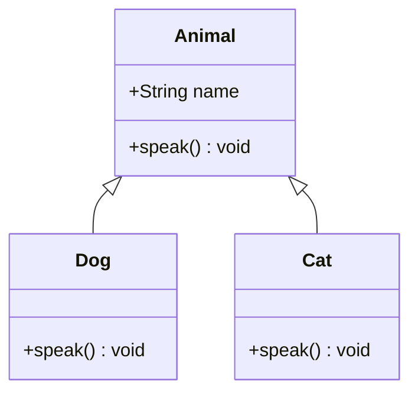

## 3.3 Classes, Inheritance, and Access Modifiers

In this section, we delve into the powerful features of TypeScript that support object-oriented programming (OOP). We'll explore how TypeScript's class syntax builds upon JavaScript's ES6+ classes, enabling developers to create robust and maintainable applications. We'll cover class declarations, inheritance, access modifiers, and more, providing you with the tools to harness TypeScript's full potential in your projects.

### Introduction to Classes in TypeScript

Classes in TypeScript are a blueprint for creating objects, encapsulating data and behavior. They are similar to classes in other OOP languages like Java or C#. TypeScript classes extend JavaScript's ES6+ class syntax by adding type annotations, access modifiers, and other features that enhance type safety and code clarity.

#### Declaring Classes

To declare a class in TypeScript, use the `class` keyword followed by the class name. Classes can contain properties, constructors, and methods.

```typescript
class Animal {
  // Property declaration
  name: string;

  // Constructor
  constructor(name: string) {
    this.name = name;
  }

  // Method
  speak(): void {
    console.log(`${this.name} makes a noise.`);
  }
}
```

In this example, we define a simple `Animal` class with a `name` property, a constructor to initialize the property, and a `speak` method.

#### Constructors and Methods

Constructors are special methods used to initialize objects. In TypeScript, you can define a constructor using the `constructor` keyword. Methods are functions associated with an object and are defined within the class body.

```typescript
class Dog extends Animal {
  constructor(name: string) {
    super(name); // Call the parent class constructor
  }

  speak(): void {
    console.log(`${this.name} barks.`);
  }
}
```

Here, the `Dog` class extends `Animal` and overrides the `speak` method to provide a specific implementation.

### Inheritance in TypeScript

Inheritance is a core concept in OOP, allowing one class to inherit properties and methods from another. In TypeScript, use the `extends` keyword to create a subclass.

```typescript
class Cat extends Animal {
  constructor(name: string) {
    super(name);
  }

  speak(): void {
    console.log(`${this.name} meows.`);
  }
}
```

The `Cat` class inherits from `Animal`, gaining access to its properties and methods. We override the `speak` method to customize the behavior for cats.

#### Method Overriding and the `super` Keyword

When a subclass has a method with the same name as a method in its superclass, it overrides the superclass method. Use the `super` keyword to call the superclass's constructor or methods.

```typescript
class Bird extends Animal {
  constructor(name: string) {
    super(name);
  }

  speak(): void {
    super.speak(); // Call the superclass method
    console.log(`${this.name} chirps.`);
  }
}
```

In this example, `Bird` calls the `speak` method of `Animal` before adding its own behavior.

### Access Modifiers in TypeScript

Access modifiers control the visibility of class members. TypeScript provides three access modifiers: `public`, `private`, and `protected`.

#### Public Members

By default, all class members are `public`, meaning they can be accessed from anywhere.

```typescript
class Vehicle {
  public brand: string;

  constructor(brand: string) {
    this.brand = brand;
  }
}
```

#### Private Members

`private` members are accessible only within the class they are declared in.

```typescript
class Engine {
  private horsepower: number;

  constructor(horsepower: number) {
    this.horsepower = horsepower;
  }

  getHorsepower(): number {
    return this.horsepower;
  }
}
```

Attempting to access `horsepower` outside `Engine` will result in a compile-time error.

#### Protected Members

`protected` members are accessible within the class and its subclasses.

```typescript
class Person {
  protected age: number;

  constructor(age: number) {
    this.age = age;
  }
}

class Employee extends Person {
  constructor(age: number) {
    super(age);
  }

  getAge(): number {
    return this.age;
  }
}
```

The `age` property is accessible in `Employee` because it extends `Person`.

### Readonly Properties

`readonly` properties can be assigned a value only once, either at declaration or in the constructor.

```typescript
class Book {
  readonly title: string;

  constructor(title: string) {
    this.title = title;
  }
}
```

Attempting to modify `title` after it's set will result in an error.

### Abstract Classes and Methods

Abstract classes cannot be instantiated directly and are meant to be extended by other classes. They can contain abstract methods, which must be implemented by subclasses.

```typescript
abstract class Shape {
  abstract area(): number;

  describe(): void {
    console.log('This is a shape.');
  }
}

class Circle extends Shape {
  radius: number;

  constructor(radius: number) {
    super();
    this.radius = radius;
  }

  area(): number {
    return Math.PI * this.radius * this.radius;
  }
}
```

`Shape` is an abstract class with an abstract method `area`. `Circle` implements `area` to provide specific functionality.

### Encapsulation and Polymorphism

Encapsulation is the bundling of data and methods that operate on that data within a single unit, or class. TypeScript's access modifiers help enforce encapsulation by restricting access to class members.

Polymorphism allows objects to be treated as instances of their parent class. This enables a single interface to represent different underlying forms (data types).

```typescript
function makeSound(animal: Animal): void {
  animal.speak();
}

const animals: Animal[] = [new Dog('Rex'), new Cat('Whiskers')];
animals.forEach(makeSound);
```

In this example, `makeSound` accepts any `Animal` type, demonstrating polymorphism.

### Implementing Design Patterns with Classes

Classes are fundamental to implementing design patterns. Let's explore how classes facilitate some common patterns.

#### Singleton Pattern

The Singleton pattern ensures a class has only one instance and provides a global access point to it.

```typescript
class Singleton {
  private static instance: Singleton;

  private constructor() {}

  static getInstance(): Singleton {
    if (!Singleton.instance) {
      Singleton.instance = new Singleton();
    }
    return Singleton.instance;
  }
}
```

#### Factory Pattern

The Factory pattern provides an interface for creating objects but allows subclasses to alter the type of objects that will be created.

```typescript
abstract class Creator {
  abstract factoryMethod(): Product;

  someOperation(): string {
    const product = this.factoryMethod();
    return `Creator: The same creator's code has just worked with ${product.operation()}`;
  }
}

class ConcreteCreator1 extends Creator {
  factoryMethod(): Product {
    return new ConcreteProduct1();
  }
}

interface Product {
  operation(): string;
}

class ConcreteProduct1 implements Product {
  operation(): string {
    return '{Result of the ConcreteProduct1}';
  }
}
```

### Best Practices in Class Design

- **Favor Composition Over Inheritance**: Use composition to achieve flexibility and reusability. Inheritance can lead to tightly coupled code.
- **Use Interfaces for Contracts**: Define interfaces to specify what a class should do, not how it should do it.
- **Keep Classes Focused**: Follow the Single Responsibility Principle (SRP) to ensure each class has one reason to change.
- **Avoid Deep Inheritance Hierarchies**: They can lead to complex and fragile codebases.

### Advanced Topics

#### Mixins

Mixins allow you to add properties and methods from one class to another without using inheritance.

```typescript
function applyMixins(derivedCtor: any, baseCtors: any[]) {
  baseCtors.forEach(baseCtor => {
    Object.getOwnPropertyNames(baseCtor.prototype).forEach(name => {
      derivedCtor.prototype[name] = baseCtor.prototype[name];
    });
  });
}

class Disposable {
  isDisposed: boolean = false;
  dispose() {
    this.isDisposed = true;
  }
}

class Activatable {
  isActive: boolean = false;
  activate() {
    this.isActive = true;
  }
  deactivate() {
    this.isActive = false;
  }
}

class SmartObject implements Disposable, Activatable {
  isDisposed: boolean = false;
  dispose: () => void;
  isActive: boolean = false;
  activate: () => void;
  deactivate: () => void;

  interact() {
    this.activate();
  }
}

applyMixins(SmartObject, [Disposable, Activatable]);
```

#### Transpilation Targets

When using TypeScript, you can specify a target version of ECMAScript. This affects how classes are transpiled, especially when targeting older versions like ES5.

### Performance Considerations

- **Avoid Overuse of Classes**: Use classes when necessary. Overuse can lead to unnecessary complexity.
- **Be Mindful of Memory Usage**: Classes can consume more memory than simple objects or functions.
- **Optimize Method Calls**: Frequent method calls can impact performance, especially in tight loops.

### Try It Yourself

Experiment with the code examples provided. Try modifying the `Animal` class to include more properties or methods. Implement a new subclass and override methods to see polymorphism in action. Use the Singleton pattern to manage a shared resource in your application.

### Visualizing Class Relationships



This diagram shows the relationship between the `Animal`, `Dog`, and `Cat` classes, illustrating inheritance.

### Further Reading

- [MDN Web Docs on Classes](https://developer.mozilla.org/en-US/docs/Web/JavaScript/Reference/Classes)
- [TypeScript Handbook on Classes](https://www.typescriptlang.org/docs/handbook/classes.html)

## Quiz Time!



### What is the default access modifier for class members in TypeScript?

- [x] public
- [ ] private
- [ ] protected
- [ ] readonly

> **Explanation:** By default, all class members in TypeScript are public, meaning they can be accessed from anywhere.

### Which keyword is used to inherit a class in TypeScript?

- [ ] implements
- [x] extends
- [ ] inherits
- [ ] super

> **Explanation:** The `extends` keyword is used to create a subclass that inherits from a superclass in TypeScript.

### What is the purpose of the `super` keyword in TypeScript?

- [ ] To declare a superclass
- [x] To call the constructor or methods of a superclass
- [ ] To override a method
- [ ] To define an abstract method

> **Explanation:** The `super` keyword is used to call the constructor or methods of a superclass from a subclass.

### How can you prevent a class property from being modified after it is set?

- [ ] Use the `private` modifier
- [ ] Use the `protected` modifier
- [x] Use the `readonly` modifier
- [ ] Use the `static` modifier

> **Explanation:** The `readonly` modifier ensures that a property can only be assigned once, either at declaration or in the constructor.

### Which of the following is a best practice in class design?

- [x] Favor composition over inheritance
- [ ] Use deep inheritance hierarchies
- [ ] Avoid using interfaces
- [ ] Make all properties public

> **Explanation:** Favoring composition over inheritance leads to more flexible and maintainable code. Deep inheritance hierarchies can make code complex and fragile.

### What is a mixin in TypeScript?

- [ ] A class that cannot be instantiated
- [x] A way to add properties and methods from one class to another without inheritance
- [ ] A method that overrides a superclass method
- [ ] A type of access modifier

> **Explanation:** Mixins allow you to add properties and methods from one class to another without using inheritance, promoting code reuse.

### How do abstract classes differ from regular classes?

- [ ] They cannot have methods
- [x] They cannot be instantiated directly
- [ ] They cannot have properties
- [ ] They cannot be extended

> **Explanation:** Abstract classes cannot be instantiated directly and are meant to be extended by other classes.

### What is the effect of specifying a transpilation target in TypeScript?

- [ ] It changes the syntax of TypeScript
- [ ] It affects the runtime environment
- [x] It determines how TypeScript code is converted to JavaScript
- [ ] It modifies the TypeScript compiler settings

> **Explanation:** The transpilation target determines how TypeScript code is converted to JavaScript, affecting compatibility with different ECMAScript versions.

### Which pattern ensures a class has only one instance?

- [ ] Factory
- [x] Singleton
- [ ] Observer
- [ ] Strategy

> **Explanation:** The Singleton pattern ensures that a class has only one instance and provides a global access point to it.

### True or False: In TypeScript, private members can be accessed by subclasses.

- [ ] True
- [x] False

> **Explanation:** Private members in TypeScript are accessible only within the class they are declared in, not by subclasses.


