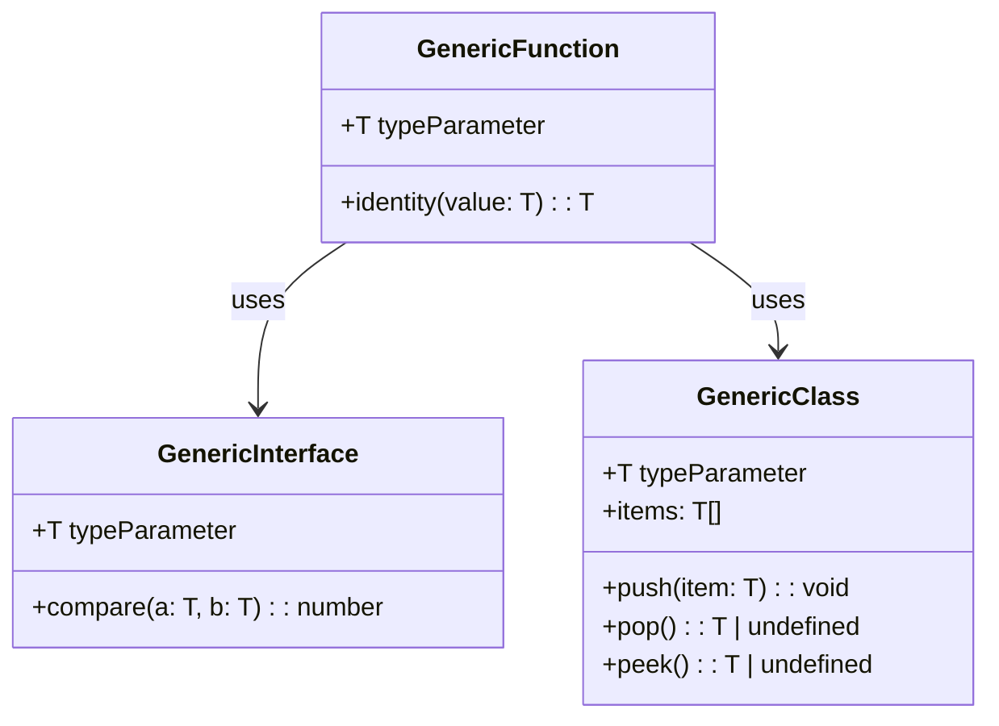

## 3.4 Generics

Generics are a powerful feature in TypeScript that enable developers to create components that can work with a variety of data types while maintaining type safety. By allowing the definition of functions, interfaces, and classes with type parameters, generics enhance code reusability and flexibility. In this section, we will delve into the concept of generics, explore their syntax and usage, and examine advanced patterns that leverage generics for expert software engineering.

### Understanding Generics in TypeScript

Generics allow you to define a placeholder for a type, which can be specified later when the function, class, or interface is used. This flexibility is particularly useful for creating reusable components that can operate on different data types without sacrificing type safety.

#### Why Use Generics?

- **Reusability**: Write code once and use it with different data types.
- **Type Safety**: Catch errors at compile time rather than runtime.
- **Flexibility**: Adapt to changing requirements without rewriting code.

### Declaring Generic Functions

Let's start by declaring a simple generic function. A generic function can accept a type parameter, which allows it to operate on a variety of types.

```typescript
// A generic function that returns the input value
function identity<T>(value: T): T {
    return value;
}

// Using the generic function with different types
let num = identity<number>(42);
let str = identity<string>("Hello, TypeScript!");
```

In the example above, `T` is a type parameter that acts as a placeholder for the actual type. When calling the `identity` function, we specify the type we want to use, such as `number` or `string`.

### Generic Interfaces and Classes

Generics can also be applied to interfaces and classes, allowing for more complex data structures and patterns.

#### Generic Interfaces

A generic interface can define a contract for a function or a data structure that operates on a type parameter.

```typescript
// A generic interface for a function that compares two values
interface Comparator<T> {
    compare(a: T, b: T): number;
}

// Implementing the Comparator interface for numbers
class NumberComparator implements Comparator<number> {
    compare(a: number, b: number): number {
        return a - b;
    }
}
```

#### Generic Classes

Generic classes allow you to create data structures that can store and manipulate data of any type.

```typescript
// A generic stack class
class GenericStack<T> {
    private items: T[] = [];

    push(item: T): void {
        this.items.push(item);
    }

    pop(): T | undefined {
        return this.items.pop();
    }

    peek(): T | undefined {
        return this.items[this.items.length - 1];
    }
}

// Using the GenericStack with different types
let numberStack = new GenericStack<number>();
numberStack.push(10);
numberStack.push(20);
console.log(numberStack.pop()); // Outputs: 20

let stringStack = new GenericStack<string>();
stringStack.push("TypeScript");
console.log(stringStack.peek()); // Outputs: TypeScript
```

### Constraints in Generics

Sometimes, you may want to restrict the types that can be used with a generic function or class. This is where constraints come in, using the `extends` keyword.

```typescript
// A generic function that requires the type to have a length property
function logLength<T extends { length: number }>(arg: T): void {
    console.log(arg.length);
}

// Valid usage
logLength("Hello");
logLength([1, 2, 3]);

// Invalid usage: Argument of type 'number' is not assignable to parameter of type '{ length: number; }'.
logLength(42);
```

### Default Type Parameters

TypeScript allows you to specify default types for type parameters, which can simplify the usage of generics.

```typescript
// A generic function with a default type parameter
function createArray<T = string>(length: number, value: T): T[] {
    return Array(length).fill(value);
}

// Using the function with and without specifying the type
let stringArray = createArray(3, "default");
let numberArray = createArray<number>(3, 42);
```

### Multiple Type Parameters

Generics can have multiple type parameters, allowing for more complex relationships between types.

```typescript
// A generic function with two type parameters
function pair<K, V>(key: K, value: V): [K, V] {
    return [key, value];
}

// Using the pair function
let stringNumberPair = pair("age", 30);
let booleanStringPair = pair(true, "success");
```

### Best Practices for Naming Type Parameters

When working with generics, it's important to use clear and consistent naming conventions for type parameters. Here are some common practices:

- **T**: A generic type (e.g., `T` for a single type).
- **U, V**: Additional generic types (e.g., `U`, `V` for multiple types).
- **K, V**: Key and value types in collections (e.g., `K` for key, `V` for value).

### Advanced Generic Patterns

Generics can be combined with other TypeScript features to create powerful patterns.

#### Conditional Types

Conditional types allow you to create types based on conditions.

```typescript
// A conditional type that checks if a type is a string
type IsString<T> = T extends string ? "Yes" : "No";

// Using the conditional type
type Test1 = IsString<string>; // "Yes"
type Test2 = IsString<number>; // "No"
```

#### Mapped Types

Mapped types transform properties of an existing type.

```typescript
// A mapped type that makes all properties optional
type Partial<T> = {
    [P in keyof T]?: T[P];
};

// Using the mapped type
interface User {
    name: string;
    age: number;
}

type PartialUser = Partial<User>;
```

#### Utility Types

TypeScript provides several utility types that leverage generics, such as `Partial`, `Readonly`, `Pick`, and `Record`.

```typescript
// Using utility types
type ReadonlyUser = Readonly<User>;
type PickUser = Pick<User, "name">;
type RecordUser = Record<"id", User>;
```

### Generics in Design Patterns

Generics play a crucial role in implementing design patterns, such as the Repository or Strategy patterns. They allow for flexible and reusable components that can adapt to different data types and business logic.

#### Repository Pattern

The Repository pattern can be implemented using generics to handle different entities.

```typescript
// A generic repository interface
interface Repository<T> {
    findById(id: number): T | undefined;
    save(entity: T): void;
}

// Implementing the repository for a specific entity
class UserRepository implements Repository<User> {
    private users: User[] = [];

    findById(id: number): User | undefined {
        return this.users.find(user => user.id === id);
    }

    save(user: User): void {
        this.users.push(user);
    }
}
```

#### Strategy Pattern

The Strategy pattern can use generics to define interchangeable algorithms.

```typescript
// A generic strategy interface
interface Strategy<T> {
    execute(data: T): void;
}

// Implementing a specific strategy
class LogStrategy implements Strategy<string> {
    execute(data: string): void {
        console.log(data);
    }
}
```

### Potential Pitfalls and Solutions

While generics offer many benefits, they can also introduce complexity. Here are some potential pitfalls and how to address them:

- **Type Inference Limitations**: Sometimes TypeScript may not infer the correct type. Explicitly specify the type parameters when necessary.
- **Complexity**: Generics can make code harder to read. Use clear naming conventions and comments to improve readability.
- **Overuse**: Avoid using generics when a simpler solution is available. Use them judiciously to maintain code clarity.

### Visualizing Generics

To better understand how generics work, let's visualize the relationship between generic functions, interfaces, and classes.



This diagram illustrates how generic functions, interfaces, and classes can be interconnected through the use of type parameters.

### Try It Yourself

To solidify your understanding of generics, try modifying the code examples provided:

- **Experiment with Different Types**: Use the `identity` function with custom types or objects.
- **Implement a Generic Queue**: Create a `GenericQueue<T>` class that supports enqueue and dequeue operations.
- **Add Constraints**: Modify the `Comparator` interface to only accept types that implement a specific method.

### Conclusion

Generics are a cornerstone of TypeScript's type system, enabling developers to write flexible, reusable, and type-safe code. By understanding how to declare and use generics, you can create robust applications that adapt to changing requirements. Remember, this is just the beginning. As you progress, you'll discover even more powerful patterns and techniques that leverage the full potential of TypeScript's generics. Keep experimenting, stay curious, and enjoy the journey!

## Quiz Time!



### What is the primary purpose of generics in TypeScript?

- [x] To enable writing reusable and type-safe code
- [ ] To improve runtime performance
- [ ] To simplify syntax
- [ ] To enforce strict variable naming conventions

> **Explanation:** Generics allow developers to write components that can work with a variety of data types while maintaining type safety, enhancing code reusability.

### How do you declare a generic function in TypeScript?

- [x] By using a type parameter in angle brackets
- [ ] By using a `generic` keyword
- [ ] By defining a `type` alias
- [ ] By using a `class` keyword

> **Explanation:** A generic function is declared using a type parameter in angle brackets, such as `<T>`, which acts as a placeholder for the actual type.

### What keyword is used to constrain a generic type parameter?

- [x] extends
- [ ] implements
- [ ] restricts
- [ ] limits

> **Explanation:** The `extends` keyword is used to constrain a generic type parameter to ensure it meets certain criteria or has specific properties.

### Which of the following is a benefit of using generics?

- [x] Type safety
- [x] Reusability
- [ ] Increased runtime speed
- [ ] Reduced code size

> **Explanation:** Generics enhance type safety and reusability by allowing components to work with different data types while catching errors at compile time.

### What is a common naming convention for a single generic type parameter?

- [x] T
- [ ] G
- [ ] X
- [ ] Y

> **Explanation:** The letter `T` is commonly used as a naming convention for a single generic type parameter, representing "Type."

### How can you specify a default type for a generic parameter?

- [x] By using an equals sign followed by the default type
- [ ] By using a `default` keyword
- [ ] By using a `type` alias
- [ ] By using a `class` keyword

> **Explanation:** A default type for a generic parameter is specified using an equals sign followed by the default type, such as `<T = string>`.

### Which utility type makes all properties of a type optional?

- [x] Partial
- [ ] Readonly
- [ ] Pick
- [ ] Record

> **Explanation:** The `Partial` utility type makes all properties of a given type optional, allowing for more flexible object creation.

### What is a potential pitfall of using generics?

- [x] Increased code complexity
- [ ] Reduced type safety
- [ ] Slower runtime performance
- [ ] Limited reusability

> **Explanation:** While generics offer many benefits, they can increase code complexity, making it harder to read and understand if not used judiciously.

### How do generics enhance the Strategy design pattern?

- [x] By allowing interchangeable algorithms to operate on different data types
- [ ] By improving runtime speed
- [ ] By simplifying the pattern's syntax
- [ ] By enforcing strict type constraints

> **Explanation:** Generics enhance the Strategy pattern by allowing interchangeable algorithms to operate on different data types, increasing flexibility and reusability.

### True or False: Generics can only be used with functions in TypeScript.

- [ ] True
- [x] False

> **Explanation:** False. Generics can be used with functions, interfaces, and classes in TypeScript, allowing for a wide range of applications.


