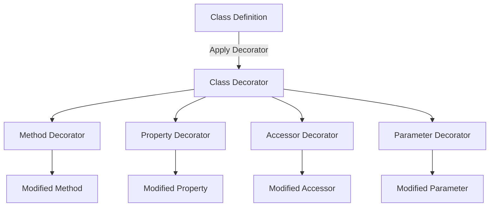

## 3.6 Decorators

Decorators in TypeScript are a powerful feature that allows developers to modify and annotate classes, methods, properties, and parameters. They enable metaprogramming capabilities, allowing for more dynamic and flexible code. In this section, we will delve into the world of decorators, exploring their types, applications, and best practices.

### Introduction to Decorators

Decorators are a form of syntactic sugar that provides a declarative way to modify the behavior of classes and their members. They are functions that are applied to a class or a class member, allowing you to add metadata, modify behavior, or even replace the target with a new definition.

#### Enabling Decorators

Decorators are an experimental feature in TypeScript, which means they are not enabled by default. To use decorators, you need to enable them in your `tsconfig.json` file by setting the `experimentalDecorators` option to `true`.

```json
{
  "compilerOptions": {
    "experimentalDecorators": true
  }
}
```

### Types of Decorators

TypeScript supports several types of decorators, each serving a different purpose:

1. **Class Decorators**
2. **Method Decorators**
3. **Accessor Decorators**
4. **Property Decorators**
5. **Parameter Decorators**

Let's explore each type with examples and explanations.

#### Class Decorators

A class decorator is applied to a class constructor. It can be used to modify or replace the class definition. Here's a simple example of a class decorator:

```typescript
function sealed(constructor: Function) {
  Object.seal(constructor);
  Object.seal(constructor.prototype);
}

@sealed
class Greeter {
  greeting: string;
  constructor(message: string) {
    this.greeting = message;
  }
  greet() {
    return `Hello, ${this.greeting}`;
  }
}
```

In this example, the `sealed` decorator seals the class, preventing new properties from being added to it.

#### Method Decorators

Method decorators are applied to methods within a class. They can modify the method's behavior or replace it entirely.

```typescript
function log(target: any, propertyKey: string, descriptor: PropertyDescriptor) {
  const originalMethod = descriptor.value;
  descriptor.value = function (...args: any[]) {
    console.log(`Calling ${propertyKey} with arguments: ${args}`);
    return originalMethod.apply(this, args);
  };
}

class Calculator {
  @log
  add(a: number, b: number): number {
    return a + b;
  }
}

const calculator = new Calculator();
calculator.add(2, 3); // Logs: Calling add with arguments: 2,3
```

Here, the `log` decorator logs the method name and arguments each time the method is called.

#### Accessor Decorators

Accessor decorators are applied to getters and setters of a class. They can modify the behavior of the accessor methods.

```typescript
function configurable(value: boolean) {
  return function (target: any, propertyKey: string, descriptor: PropertyDescriptor) {
    descriptor.configurable = value;
  };
}

class Point {
  private _x: number;
  private _y: number;

  constructor(x: number, y: number) {
    this._x = x;
    this._y = y;
  }

  @configurable(false)
  get x() {
    return this._x;
  }

  @configurable(false)
  get y() {
    return this._y;
  }
}
```

In this example, the `configurable` decorator sets the configurability of the accessor methods.

#### Property Decorators

Property decorators are applied to class properties. They can be used to add metadata or modify the property.

```typescript
function readonly(target: any, propertyKey: string) {
  Object.defineProperty(target, propertyKey, {
    writable: false
  });
}

class Book {
  @readonly
  title: string;

  constructor(title: string) {
    this.title = title;
  }
}

const book = new Book("TypeScript Guide");
book.title = "New Title"; // Error: Cannot assign to read only property 'title'
```

The `readonly` decorator makes the `title` property immutable.

#### Parameter Decorators

Parameter decorators are applied to the parameters of a class method. They can be used to add metadata about the parameters.

```typescript
function logParameter(target: any, propertyKey: string, parameterIndex: number) {
  const metadataKey = `log_${propertyKey}_parameters`;
  if (Array.isArray(target[metadataKey])) {
    target[metadataKey].push(parameterIndex);
  } else {
    target[metadataKey] = [parameterIndex];
  }
}

class Person {
  greet(@logParameter message: string) {
    console.log(message);
  }
}
```

Here, the `logParameter` decorator logs the index of the parameter it is applied to.

### Modifying Behavior with Decorators

Decorators can significantly modify or augment the behavior of the target they are applied to. They can intercept method calls, change property values, or even replace entire classes. This makes them a powerful tool for implementing cross-cutting concerns like logging, validation, or caching.

### Decorator Factories

Decorator factories are functions that return a decorator function. They allow you to pass parameters to decorators, making them more flexible.

```typescript
function logWithPrefix(prefix: string) {
  return function (target: any, propertyKey: string, descriptor: PropertyDescriptor) {
    const originalMethod = descriptor.value;
    descriptor.value = function (...args: any[]) {
      console.log(`${prefix} Calling ${propertyKey} with arguments: ${args}`);
      return originalMethod.apply(this, args);
    };
  };
}

class Logger {
  @logWithPrefix("DEBUG:")
  logMessage(message: string) {
    console.log(message);
  }
}

const logger = new Logger();
logger.logMessage("Hello, world!"); // Logs: DEBUG: Calling logMessage with arguments: Hello, world!
```

In this example, `logWithPrefix` is a decorator factory that adds a prefix to the log message.

### Real-World Use Cases

Decorators are widely used in real-world applications for various purposes:

- **Logging**: Automatically log method calls and parameters.
- **Validation**: Validate method parameters or class properties.
- **Dependency Injection**: Inject dependencies into classes.
- **ORM Mapping**: Map class properties to database columns.

#### Example: Logging with Decorators

```typescript
function logExecutionTime(target: any, propertyKey: string, descriptor: PropertyDescriptor) {
  const originalMethod = descriptor.value;
  descriptor.value = function (...args: any[]) {
    const start = performance.now();
    const result = originalMethod.apply(this, args);
    const end = performance.now();
    console.log(`${propertyKey} executed in ${end - start}ms`);
    return result;
  };
}

class PerformanceTester {
  @logExecutionTime
  compute() {
    // Simulate a time-consuming operation
    for (let i = 0; i < 1e6; i++) {}
  }
}

const tester = new PerformanceTester();
tester.compute(); // Logs: compute executed in Xms
```

### Impact on Code Readability and Maintainability

While decorators can make code more concise and expressive, they can also obscure the logic if overused. It's essential to strike a balance between using decorators for convenience and maintaining code clarity.

### Considerations for Using Decorators

- **Compatibility**: Decorators are not yet part of the ECMAScript standard, so they may not be compatible with all JavaScript environments.
- **Performance**: Decorators can introduce performance overhead, especially if they perform complex operations.
- **Readability**: Excessive use of decorators can make code harder to read and understand.

### Best Practices

- **Use Sparingly**: Apply decorators only when they provide a clear benefit.
- **Keep Simple**: Avoid complex logic within decorators to maintain performance and readability.
- **Document**: Clearly document the purpose and behavior of decorators to aid understanding.

### Upcoming Changes and Proposals

The ECMAScript proposal for decorators is still in progress, and future changes may affect how decorators are implemented in TypeScript. It's important to stay updated with the latest developments.

### Advanced Decorator Patterns

In frameworks like Angular, decorators play a crucial role in defining components, services, and modules. Understanding advanced decorator patterns can help you leverage these frameworks more effectively.

#### Angular Example

In Angular, decorators are used to define components:

```typescript
import { Component } from '@angular/core';

@Component({
  selector: 'app-root',
  templateUrl: './app.component.html',
  styleUrls: ['./app.component.css']
})
export class AppComponent {
  title = 'my-app';
}
```

The `@Component` decorator provides metadata about the component, such as its selector and template.

### Try It Yourself

Experiment with the examples provided by modifying the decorators or creating your own. Try adding new functionality or changing the behavior of existing methods.

### Visualizing Decorators

Below is a diagram illustrating the flow of how decorators are applied to a class and its members:



**Diagram Description:** This diagram shows how decorators are applied to different parts of a class, modifying their behavior or adding metadata.

### Knowledge Check

- How do decorators enhance TypeScript's metaprogramming capabilities?
- What are the different types of decorators, and how do they differ?
- How can decorator factories be used to pass parameters to decorators?
- What are some real-world use cases for decorators?
- What are the potential drawbacks of using decorators?

### Embrace the Journey

Remember, this is just the beginning. As you progress, you'll discover more advanced uses for decorators and how they can simplify complex patterns. Keep experimenting, stay curious, and enjoy the journey!

## Quiz Time!



### What is the primary purpose of decorators in TypeScript?

- [x] To modify or annotate classes and their members
- [ ] To compile TypeScript to JavaScript
- [ ] To enhance runtime performance
- [ ] To provide type safety

> **Explanation:** Decorators are used to modify or annotate classes and their members, enabling metaprogramming capabilities.

### How do you enable decorators in a TypeScript project?

- [x] Set `experimentalDecorators` to `true` in `tsconfig.json`
- [ ] Install a special TypeScript plugin
- [ ] Use a specific TypeScript version
- [ ] Enable them in the JavaScript runtime

> **Explanation:** Decorators are an experimental feature and must be enabled in `tsconfig.json` by setting `experimentalDecorators` to `true`.

### Which of the following is NOT a type of decorator in TypeScript?

- [ ] Class Decorator
- [ ] Method Decorator
- [ ] Property Decorator
- [x] Function Decorator

> **Explanation:** TypeScript supports class, method, property, accessor, and parameter decorators, but not function decorators.

### What is a decorator factory?

- [x] A function that returns a decorator function
- [ ] A built-in TypeScript feature for creating decorators
- [ ] A special type of class decorator
- [ ] A method for optimizing decorators

> **Explanation:** A decorator factory is a function that returns a decorator function, allowing parameters to be passed to the decorator.

### What are some real-world applications of decorators?

- [x] Logging
- [x] Validation
- [ ] Compiling TypeScript
- [x] Dependency Injection

> **Explanation:** Decorators are commonly used for logging, validation, and dependency injection in real-world applications.

### What is a potential drawback of using decorators?

- [x] They can obscure code logic
- [ ] They improve performance
- [ ] They simplify all code
- [ ] They are fully standardized

> **Explanation:** Decorators can obscure code logic if overused, making it harder to understand.

### How can decorators impact code readability?

- [x] They can make code harder to read if overused
- [ ] They always improve readability
- [ ] They have no impact on readability
- [ ] They only affect performance

> **Explanation:** While decorators can make code more concise, excessive use can make it harder to read.

### What is the status of decorators in the ECMAScript specification?

- [x] They are still a proposal
- [ ] They are fully standardized
- [ ] They are deprecated
- [ ] They are removed

> **Explanation:** Decorators are still a proposal in the ECMAScript specification and are not yet fully standardized.

### True or False: Decorators can replace entire classes in TypeScript.

- [x] True
- [ ] False

> **Explanation:** Class decorators can replace entire classes by returning a new class definition.

### True or False: Decorators can introduce performance overhead.

- [x] True
- [ ] False

> **Explanation:** Decorators can introduce performance overhead, especially if they perform complex operations.


