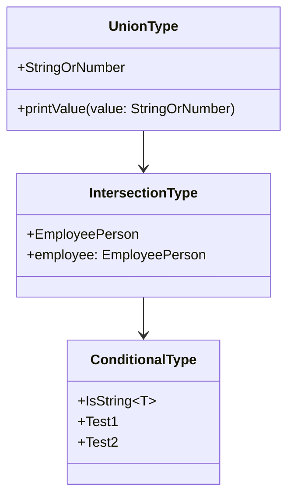

## 3.7 Advanced Types

In TypeScript, advanced types provide a powerful way to create flexible and robust type definitions. By leveraging these features, you can write more expressive and maintainable code. In this section, we'll explore union types, intersection types, mapped types, conditional types, and more. We'll also discuss best practices and potential pitfalls when working with these advanced features.

### Union Types

Union types allow a variable to hold values of multiple types. They are defined using the `|` (pipe) symbol. Union types are particularly useful when a value can be one of several types, such as a function that accepts different types of input.

**Example:**

```typescript
type StringOrNumber = string | number;

function printValue(value: StringOrNumber) {
  if (typeof value === 'string') {
    console.log(`String value: ${value}`);
  } else {
    console.log(`Number value: ${value}`);
  }
}

printValue('Hello');
printValue(42);
```

In this example, the `printValue` function can accept either a string or a number, and it uses a type guard (`typeof`) to determine the type of the value at runtime.

### Intersection Types

Intersection types combine multiple types into one. They are defined using the `&` (ampersand) symbol. Intersection types are useful when you want to merge multiple type definitions into a single one.

**Example:**

```typescript
interface Person {
  name: string;
}

interface Employee {
  employeeId: number;
}

type EmployeePerson = Person & Employee;

const employee: EmployeePerson = {
  name: 'Alice',
  employeeId: 1234,
};

console.log(employee);
```

Here, `EmployeePerson` is an intersection type that combines `Person` and `Employee`. An object of this type must have both `name` and `employeeId` properties.

### Type Guards and Type Assertions

When working with union types, type guards and type assertions help ensure type safety. Type guards are functions or expressions that perform runtime checks to determine the type of a variable. Type assertions, on the other hand, allow you to override the inferred type of a variable.

**Type Guards Example:**

```typescript
function isString(value: any): value is string {
  return typeof value === 'string';
}

function processValue(value: string | number) {
  if (isString(value)) {
    console.log(`Processing string: ${value}`);
  } else {
    console.log(`Processing number: ${value}`);
  }
}

processValue('Hello');
processValue(42);
```

**Type Assertions Example:**

```typescript
let someValue: any = 'This is a string';
let strLength: number = (someValue as string).length;

console.log(strLength);
```

Type assertions are used here to inform TypeScript that `someValue` should be treated as a string, allowing us to access string-specific properties like `length`.

### Mapped Types

Mapped types allow you to transform existing types into new ones by applying a transformation to each property. They are defined using the `in` keyword.

**Example:**

```typescript
type Readonly<T> = {
  readonly [P in keyof T]: T[P];
};

interface User {
  name: string;
  age: number;
}

type ReadonlyUser = Readonly<User>;

const user: ReadonlyUser = {
  name: 'Bob',
  age: 30,
};

// user.age = 31; // Error: Cannot assign to 'age' because it is a read-only property.
```

In this example, `Readonly` is a mapped type that takes a type `T` and makes all its properties read-only.

### Built-In Mapped Types

TypeScript provides several built-in mapped types that are commonly used:

- **`Partial<T>`**: Makes all properties of `T` optional.
- **`Readonly<T>`**: Makes all properties of `T` read-only.
- **`Pick<T, K>`**: Creates a type by picking a set of properties `K` from `T`.
- **`Record<K, T>`**: Constructs a type with a set of properties `K` of type `T`.

**Examples:**

```typescript
type PartialUser = Partial<User>;
type ReadonlyUser = Readonly<User>;
type PickUser = Pick<User, 'name'>;
type RecordUser = Record<'name' | 'age', string>;

const partialUser: PartialUser = { name: 'Alice' };
const readonlyUser: ReadonlyUser = { name: 'Bob', age: 30 };
const pickUser: PickUser = { name: 'Charlie' };
const recordUser: RecordUser = { name: 'Dave', age: '40' };
```

### Conditional Types

Conditional types enable type computations based on conditions. They are defined using the `extends` keyword and a ternary-like syntax.

**Example:**

```typescript
type IsString<T> = T extends string ? true : false;

type Test1 = IsString<string>; // true
type Test2 = IsString<number>; // false
```

Conditional types are powerful tools for creating type-safe abstractions and utilities.

### Built-In Conditional Types

TypeScript includes several built-in conditional types that are useful for common type transformations:

- **`Exclude<T, U>`**: Excludes from `T` those types that are assignable to `U`.
- **`Extract<T, U>`**: Extracts from `T` those types that are assignable to `U`.
- **`NonNullable<T>`**: Excludes `null` and `undefined` from `T`.
- **`ReturnType<T>`**: Obtains the return type of a function type `T`.
- **`InstanceType<T>`**: Obtains the instance type of a constructor function type `T`.

**Examples:**

```typescript
type ExcludeExample = Exclude<'a' | 'b' | 'c', 'a'>; // 'b' | 'c'
type ExtractExample = Extract<'a' | 'b' | 'c', 'a' | 'f'>; // 'a'
type NonNullableExample = NonNullable<string | number | null>; // string | number
type ReturnTypeExample = ReturnType<() => string>; // string
type InstanceTypeExample = InstanceType<typeof Date>; // Date
```

### Index Types and Lookup Types

Index types and lookup types allow you to access the types of properties dynamically.

**Example:**

```typescript
interface Car {
  make: string;
  model: string;
  year: number;
}

type CarKeys = keyof Car; // 'make' | 'model' | 'year'
type CarMake = Car['make']; // string
```

Here, `keyof` is used to obtain a union of the keys of `Car`, and `Car['make']` is a lookup type that retrieves the type of the `make` property.

### Creating Custom Utility Types

You can create custom utility types by combining advanced type features.

**Example:**

```typescript
type Nullable<T> = T | null;

type NullableUser = Nullable<User>;

const nullableUser: NullableUser = null;
```

In this example, `Nullable` is a custom utility type that makes a type `T` nullable.

### Complex Type Manipulations

Advanced types enable complex type manipulations, such as recursive types and type inference in conditional types.

**Recursive Types Example:**

```typescript
type JSONValue = string | number | boolean | null | JSONValue[] | { [key: string]: JSONValue };

const jsonObject: JSONValue = {
  name: 'Alice',
  age: 30,
  hobbies: ['reading', 'gaming'],
  address: {
    city: 'Wonderland',
    zip: 12345,
  },
};
```

**Type Inference in Conditional Types Example:**

```typescript
type InferArrayType<T> = T extends (infer U)[] ? U : T;

type StringArray = InferArrayType<string[]>; // string
type NumberArray = InferArrayType<number[]>; // number
```

### Best Practices for Advanced Types

- **Keep it Simple**: Avoid overcomplicating type definitions. Use advanced types judiciously to maintain readability.
- **Document Your Types**: Provide comments and documentation for complex types to aid understanding.
- **Test Your Types**: Use TypeScript's type-checking capabilities to ensure your types work as expected.
- **Balance Flexibility and Complexity**: Strive for a balance between type flexibility and code complexity.

### Potential Pitfalls

- **Increased Compilation Times**: Complex types can lead to longer compilation times. Optimize your types for performance.
- **Harder-to-Read Code**: Overuse of advanced types can make code harder to read and understand. Use them where they add value.

### Advanced Types and Generic Programming

Advanced types complement generic programming patterns by providing more expressive type definitions. They enable you to create reusable and type-safe abstractions, enhancing the flexibility and robustness of your code.

### Try It Yourself

Experiment with the code examples provided in this section. Try modifying the types and functions to see how TypeScript's type system responds. For example, create a new mapped type that makes all properties of a type optional and read-only at the same time.

### Visualizing Advanced Types

To better understand the relationships between different types, let's visualize the interaction between union, intersection, and conditional types using a class diagram.



This diagram illustrates how union types, intersection types, and conditional types can be used together to create complex type definitions.

### Conclusion

Advanced types in TypeScript provide powerful tools for creating flexible and robust type definitions. By understanding and leveraging these features, you can write more expressive and maintainable code. Remember to balance complexity with readability, and use advanced types where they add value to your code.

## Quiz Time!



### What is a union type in TypeScript?

- [x] A type that allows a variable to hold values of multiple types.
- [ ] A type that combines multiple types into one.
- [ ] A type that transforms existing types into new ones.
- [ ] A type that enables type computations based on conditions.

> **Explanation:** A union type allows a variable to hold values of multiple types, using the `|` (pipe) symbol.

### What is an intersection type in TypeScript?

- [ ] A type that allows a variable to hold values of multiple types.
- [x] A type that combines multiple types into one.
- [ ] A type that transforms existing types into new ones.
- [ ] A type that enables type computations based on conditions.

> **Explanation:** An intersection type combines multiple types into one, using the `&` (ampersand) symbol.

### Which of the following is a built-in mapped type in TypeScript?

- [x] Partial<T>
- [ ] IsString<T>
- [ ] InferArrayType<T>
- [ ] JSONValue

> **Explanation:** `Partial<T>` is a built-in mapped type that makes all properties of `T` optional.

### What does the `Exclude<T, U>` conditional type do?

- [ ] Extracts from `T` those types that are assignable to `U`.
- [x] Excludes from `T` those types that are assignable to `U`.
- [ ] Obtains the return type of a function type `T`.
- [ ] Excludes `null` and `undefined` from `T`.

> **Explanation:** `Exclude<T, U>` excludes from `T` those types that are assignable to `U`.

### What is the purpose of type guards in TypeScript?

- [x] To perform runtime checks to determine the type of a variable.
- [ ] To override the inferred type of a variable.
- [ ] To transform existing types into new ones.
- [ ] To enable type computations based on conditions.

> **Explanation:** Type guards perform runtime checks to determine the type of a variable, ensuring type safety.

### What is a mapped type in TypeScript?

- [ ] A type that allows a variable to hold values of multiple types.
- [ ] A type that combines multiple types into one.
- [x] A type that transforms existing types into new ones.
- [ ] A type that enables type computations based on conditions.

> **Explanation:** A mapped type transforms existing types into new ones by applying a transformation to each property.

### What is the `keyof` operator used for in TypeScript?

- [x] To obtain a union of the keys of a type.
- [ ] To transform existing types into new ones.
- [ ] To perform runtime checks to determine the type of a variable.
- [ ] To exclude `null` and `undefined` from a type.

> **Explanation:** The `keyof` operator is used to obtain a union of the keys of a type.

### What is the `ReturnType<T>` conditional type used for?

- [ ] To exclude from `T` those types that are assignable to `U`.
- [ ] To extract from `T` those types that are assignable to `U`.
- [x] To obtain the return type of a function type `T`.
- [ ] To exclude `null` and `undefined` from `T`.

> **Explanation:** `ReturnType<T>` obtains the return type of a function type `T`.

### What is the purpose of type assertions in TypeScript?

- [ ] To perform runtime checks to determine the type of a variable.
- [x] To override the inferred type of a variable.
- [ ] To transform existing types into new ones.
- [ ] To enable type computations based on conditions.

> **Explanation:** Type assertions allow you to override the inferred type of a variable.

### True or False: Advanced types in TypeScript can lead to increased compilation times.

- [x] True
- [ ] False

> **Explanation:** Advanced types can lead to increased compilation times due to their complexity.


