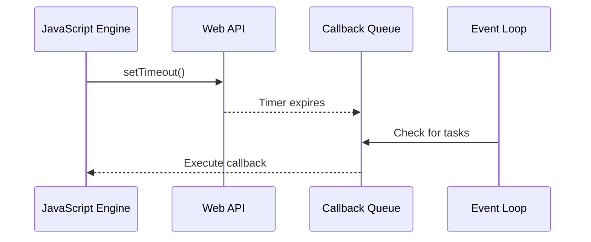

## 3.9 Asynchronous Programming with Promises and Async/Await

In the world of modern web development, handling asynchronous operations is crucial for creating responsive and efficient applications. JavaScript, and by extension TypeScript, is inherently asynchronous, making it essential for developers to master asynchronous programming paradigms. This section delves into the use of Promises and the `async`/`await` syntax in TypeScript, providing expert insights into writing cleaner and more maintainable asynchronous code.

### Understanding Asynchronous Programming

Asynchronous programming allows a program to initiate a potentially time-consuming operation and continue executing other tasks while waiting for the operation to complete. This is particularly important in JavaScript and TypeScript applications, where operations such as network requests, file I/O, and timers can block the main thread if not handled asynchronously.

### Introduction to Promises

Promises are a fundamental concept in JavaScript for managing asynchronous operations. A Promise represents a value that may be available now, or in the future, or never. It provides a mechanism to handle asynchronous results, making code more readable and maintainable.

#### Creating and Using Promises

A Promise is created using the `Promise` constructor, which takes a function with two parameters: `resolve` and `reject`. Here's a basic example:

```typescript
function fetchData(url: string): Promise<string> {
  return new Promise((resolve, reject) => {
    // Simulating an asynchronous operation
    setTimeout(() => {
      if (url) {
        resolve(`Data from ${url}`);
      } else {
        reject('URL is required');
      }
    }, 1000);
  });
}

// Using the Promise
fetchData('https://api.example.com/data')
  .then(data => console.log(data))
  .catch(error => console.error(error))
  .finally(() => console.log('Fetch operation complete'));
```

In this example, `fetchData` returns a Promise that resolves with data after a delay or rejects if no URL is provided. The `then`, `catch`, and `finally` methods are used to handle the resolved value, errors, and completion of the Promise, respectively.

### Simplifying Asynchronous Code with Async/Await

The `async`/`await` syntax, introduced in ECMAScript 2017, provides a more straightforward way to work with Promises. It allows you to write asynchronous code that looks synchronous, improving readability and maintainability.

#### Using Async/Await

To use `async`/`await`, you define an `async` function and use the `await` keyword to pause execution until a Promise is resolved or rejected. Here's how you can convert the previous Promise-based code to use `async`/`await`:

```typescript
async function fetchDataAsync(url: string): Promise<string> {
  if (!url) throw new Error('URL is required');
  return new Promise((resolve) => {
    setTimeout(() => resolve(`Data from ${url}`), 1000);
  });
}

async function main() {
  try {
    const data = await fetchDataAsync('https://api.example.com/data');
    console.log(data);
  } catch (error) {
    console.error(error);
  } finally {
    console.log('Fetch operation complete');
  }
}

main();
```

In this example, the `main` function is an `async` function that uses `await` to handle the Promise returned by `fetchDataAsync`. The `try/catch` block is used for error handling, making it easier to manage errors compared to the `catch` method.

### Error Handling in Asynchronous Code

Error handling is a critical aspect of asynchronous programming. With Promises, errors can be caught using the `catch` method. However, with `async`/`await`, you can use `try/catch` blocks, which integrate seamlessly with synchronous error handling.

#### Example of Error Handling

```typescript
async function fetchDataWithErrorHandling(url: string): Promise<string> {
  try {
    if (!url) throw new Error('URL is required');
    return new Promise((resolve) => {
      setTimeout(() => resolve(`Data from ${url}`), 1000);
    });
  } catch (error) {
    console.error('Error fetching data:', error);
    throw error; // Re-throw the error for further handling
  }
}

async function mainWithErrorHandling() {
  try {
    const data = await fetchDataWithErrorHandling('');
    console.log(data);
  } catch (error) {
    console.error('Caught in main:', error);
  }
}

mainWithErrorHandling();
```

In this example, errors are caught and logged within the `fetchDataWithErrorHandling` function, and then re-thrown for further handling in the `mainWithErrorHandling` function.

### Leveraging TypeScript's Type System

TypeScript's type system provides additional safety and clarity when working with asynchronous code. You can specify the return type of an `async` function as `Promise<T>`, where `T` is the type of the resolved value.

#### Typing Asynchronous Functions

```typescript
async function getUserData(userId: number): Promise<{ name: string; age: number }> {
  // Simulate fetching user data
  return new Promise((resolve) => {
    setTimeout(() => resolve({ name: 'Alice', age: 30 }), 1000);
  });
}

async function displayUserData() {
  const userData = await getUserData(1);
  console.log(`User: ${userData.name}, Age: ${userData.age}`);
}

displayUserData();
```

Here, `getUserData` is typed to return a `Promise` that resolves to an object with `name` and `age` properties, providing clear expectations of the function's output.

### Managing Multiple Asynchronous Operations

When dealing with multiple asynchronous operations, Promise combinators like `Promise.all` and `Promise.race` can be invaluable.

#### Using Promise.all and Promise.race

- **`Promise.all`**: Waits for all Promises to resolve or any to reject.

```typescript
async function fetchMultipleData() {
  const urls = ['https://api.example.com/data1', 'https://api.example.com/data2'];
  try {
    const results = await Promise.all(urls.map(url => fetchDataAsync(url)));
    console.log('All data fetched:', results);
  } catch (error) {
    console.error('Error fetching data:', error);
  }
}

fetchMultipleData();
```

- **`Promise.race`**: Resolves or rejects as soon as one of the Promises resolves or rejects.

```typescript
async function fetchFirstData() {
  const urls = ['https://api.example.com/data1', 'https://api.example.com/data2'];
  try {
    const result = await Promise.race(urls.map(url => fetchDataAsync(url)));
    console.log('First data fetched:', result);
  } catch (error) {
    console.error('Error fetching data:', error);
  }
}

fetchFirstData();
```

### Best Practices for Asynchronous Code

Writing asynchronous code requires careful consideration to avoid common pitfalls. Here are some best practices:

- **Avoid Unhandled Promise Rejections**: Always handle Promise rejections using `catch` or `try/catch`.
- **Use `async`/`await` for Readability**: Prefer `async`/`await` over chaining `then` for cleaner code.
- **Limit Concurrency**: Use tools like `Promise.allSettled` or libraries to limit concurrent operations.
- **Be Mindful of the Event Loop**: Understand how the event loop works to avoid blocking operations.

### Advanced Topics

For expert developers, understanding advanced concepts like cancellable Promises, async iterators, and performance considerations is essential.

#### Cancellable Promises

JavaScript Promises are not inherently cancellable, but you can implement a workaround using AbortController:

```typescript
function fetchDataWithCancel(url: string, signal: AbortSignal): Promise<string> {
  return new Promise((resolve, reject) => {
    const timeout = setTimeout(() => {
      if (signal.aborted) {
        reject(new Error('Fetch aborted'));
      } else {
        resolve(`Data from ${url}`);
      }
    }, 1000);

    signal.addEventListener('abort', () => {
      clearTimeout(timeout);
      reject(new Error('Fetch aborted'));
    });
  });
}

const controller = new AbortController();
const { signal } = controller;

fetchDataWithCancel('https://api.example.com/data', signal)
  .then(data => console.log(data))
  .catch(error => console.error(error));

// Cancel the fetch operation
controller.abort();
```

#### Async Iterators

Async iterators allow you to iterate over asynchronous data sources using `for await...of` loops:

```typescript
async function* asyncGenerator() {
  for (let i = 0; i < 3; i++) {
    await new Promise(resolve => setTimeout(resolve, 1000));
    yield i;
  }
}

async function iterateAsync() {
  for await (const num of asyncGenerator()) {
    console.log(num);
  }
}

iterateAsync();
```

### Debugging Asynchronous Code

Debugging asynchronous code can be challenging due to the non-linear execution flow. Use the following strategies:

- **Use Debugger Tools**: Modern browsers and Node.js provide tools to step through asynchronous code.
- **Add Logging**: Insert console logs to trace execution paths and identify issues.
- **Handle Errors Gracefully**: Ensure all Promises are properly handled to avoid silent failures.

### Visualizing Asynchronous Operations

Understanding how asynchronous operations interact with the event loop is crucial. Here's a diagram to illustrate this:



This diagram shows how the JavaScript engine interacts with the Web API and the event loop to handle asynchronous operations.

### Conclusion

Asynchronous programming is a powerful tool in TypeScript, enabling developers to create responsive and efficient applications. By mastering Promises and the `async`/`await` syntax, you can write cleaner, more maintainable code. Remember to handle errors gracefully, manage concurrency, and leverage TypeScript's type system to ensure robust asynchronous operations.

### Try It Yourself

Experiment with the provided code examples by modifying URLs, changing delays, or adding additional asynchronous operations. This hands-on approach will deepen your understanding of asynchronous programming in TypeScript.

## Quiz Time!



### What is a Promise in JavaScript?

- [x] A representation of an asynchronous operation that may complete in the future
- [ ] A synchronous operation that blocks the main thread
- [ ] A function that executes immediately
- [ ] A data structure for storing key-value pairs

> **Explanation:** A Promise represents an asynchronous operation and its eventual completion or failure.

### How do you handle errors in an async function?

- [x] Using try/catch blocks
- [ ] Using the finally method
- [ ] Using the resolve method
- [ ] Using the await keyword

> **Explanation:** Errors in async functions are handled using try/catch blocks, similar to synchronous code.

### What does the await keyword do?

- [x] Pauses the execution of an async function until a Promise is resolved
- [ ] Immediately executes a Promise
- [ ] Converts a synchronous function to asynchronous
- [ ] Rejects a Promise if it takes too long

> **Explanation:** The await keyword pauses execution until the Promise is resolved or rejected.

### Which method waits for all Promises to resolve or any to reject?

- [x] Promise.all
- [ ] Promise.race
- [ ] Promise.allSettled
- [ ] Promise.resolve

> **Explanation:** Promise.all waits for all Promises to resolve or any to reject.

### What is the purpose of the AbortController in JavaScript?

- [x] To cancel or abort a fetch request
- [ ] To create new Promises
- [ ] To handle errors in async functions
- [ ] To manage event listeners

> **Explanation:** AbortController is used to cancel or abort fetch requests and other asynchronous operations.

### What is the benefit of using async/await over Promises?

- [x] Improved readability and maintainability of asynchronous code
- [ ] Faster execution of asynchronous operations
- [ ] Automatic error handling
- [ ] Synchronous execution of asynchronous code

> **Explanation:** Async/await improves readability and maintainability by making asynchronous code look synchronous.

### How can you iterate over asynchronous data sources?

- [x] Using for await...of loops
- [ ] Using for...in loops
- [ ] Using forEach method
- [ ] Using map method

> **Explanation:** For await...of loops are used to iterate over asynchronous data sources.

### What is the role of the event loop in JavaScript?

- [x] To manage the execution of asynchronous code
- [ ] To execute synchronous code faster
- [ ] To convert synchronous code to asynchronous
- [ ] To handle errors in JavaScript

> **Explanation:** The event loop manages the execution of asynchronous code by checking the callback queue.

### Which Promise combinator resolves as soon as one Promise resolves or rejects?

- [x] Promise.race
- [ ] Promise.all
- [ ] Promise.allSettled
- [ ] Promise.resolve

> **Explanation:** Promise.race resolves or rejects as soon as one of the Promises resolves or rejects.

### True or False: JavaScript Promises are inherently cancellable.

- [ ] True
- [x] False

> **Explanation:** JavaScript Promises are not inherently cancellable, but workarounds like AbortController can be used.


