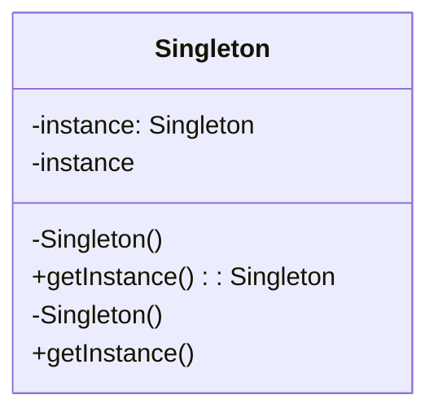

## 4.1.1 Implementing Singleton in TypeScript

The Singleton pattern is a creational design pattern that ensures a class has only one instance and provides a global point of access to it. This pattern is particularly useful when exactly one object is needed to coordinate actions across the system. In this section, we will explore how to implement the Singleton pattern in TypeScript, leveraging its class features, access modifiers, and static properties.

### Understanding the Singleton Pattern

Before diving into the implementation, let's briefly discuss the core concepts of the Singleton pattern:

- **Single Instance**: The Singleton pattern restricts the instantiation of a class to a single object.
- **Global Access**: It provides a global point of access to the instance, allowing it to be shared across different parts of the application.
- **Controlled Instantiation**: The class itself controls the instantiation process, ensuring that no other instances can be created.

### Step-by-Step Guide to Implementing Singleton in TypeScript

Let's break down the implementation of a Singleton class in TypeScript step by step.

#### Step 1: Declare a Class with a Private Constructor

The first step in implementing a Singleton is to declare a class with a private constructor. This prevents other classes from instantiating the class directly.

```typescript
class Singleton {
  private static instance: Singleton;

  // Private constructor to prevent direct instantiation
  private constructor() {
    console.log("Singleton instance created.");
  }
}
```

**Explanation**: By making the constructor private, we ensure that the class cannot be instantiated from outside. This is a key feature of the Singleton pattern.

#### Step 2: Create a Static Method to Control Access to the Singleton Instance

Next, we need a static method that controls access to the Singleton instance. This method will create the instance if it doesn't exist and return the existing instance if it does.

```typescript
class Singleton {
  private static instance: Singleton;

  private constructor() {
    console.log("Singleton instance created.");
  }

  // Static method to get the Singleton instance
  public static getInstance(): Singleton {
    if (!Singleton.instance) {
      Singleton.instance = new Singleton();
    }
    return Singleton.instance;
  }
}
```

**Explanation**: The `getInstance` method checks if an instance already exists. If not, it creates one. This ensures that only one instance of the class is created.

#### Step 3: Use Access Modifiers to Control Visibility

TypeScript provides `private`, `protected`, and `public` access modifiers to control the visibility of class members. In our Singleton implementation, we use `private` for the constructor and the instance variable to restrict access.

- **Private**: The `private` modifier restricts access to the class itself.
- **Protected**: The `protected` modifier allows access within the class and its subclasses.
- **Public**: The `public` modifier allows access from anywhere.

In the Singleton pattern, the constructor and instance variable are typically `private` to prevent external instantiation and modification.

#### Step 4: Utilize Static Properties and Methods

Static properties and methods belong to the class itself rather than any instance. In our Singleton implementation, the `instance` variable and `getInstance` method are static, allowing them to be accessed without creating an instance of the class.

```typescript
class Singleton {
  private static instance: Singleton;

  private constructor() {
    console.log("Singleton instance created.");
  }

  public static getInstance(): Singleton {
    if (!Singleton.instance) {
      Singleton.instance = new Singleton();
    }
    return Singleton.instance;
  }
}

// Usage
const singleton1 = Singleton.getInstance();
const singleton2 = Singleton.getInstance();

console.log(singleton1 === singleton2); // Output: true
```

**Explanation**: The `getInstance` method is static, meaning it can be called on the class itself. This is crucial for controlling access to the Singleton instance.

### Nuances of Singleton Implementation in TypeScript

#### Module Scopes and Singleton Instances

In TypeScript, modules can affect Singleton instances. When a Singleton class is exported from a module, each import of that module will share the same instance. This is because modules are cached upon first import, ensuring that the Singleton pattern holds across different parts of the application.

#### Thread Safety Concerns

While JavaScript is single-threaded, environments like Node.js can simulate concurrency, leading to potential thread safety issues. To address this, you might consider using locks or other synchronization mechanisms if your Singleton is accessed in a concurrent context.

### Visualizing the Singleton Pattern

To better understand the Singleton pattern, let's visualize the process of instantiation and access control using a class diagram.



**Diagram Explanation**: The class diagram shows the Singleton class with a private instance variable and constructor, and a public static method `getInstance` to control access to the instance.

### Try It Yourself

To reinforce your understanding, try modifying the Singleton implementation:

- **Add a method** to the Singleton class that performs a simple operation, such as incrementing a counter.
- **Test the Singleton** by calling this method from different parts of your application and verifying that the state is shared.

### References and Links

For further reading on the Singleton pattern and TypeScript, consider exploring these resources:

- [MDN Web Docs on Classes](https://developer.mozilla.org/en-US/docs/Web/JavaScript/Reference/Classes)
- [TypeScript Handbook on Classes](https://www.typescriptlang.org/docs/handbook/classes.html)

### Knowledge Check

Before we conclude, let's pose some questions to test your understanding:

- What is the purpose of a private constructor in a Singleton class?
- How do static methods and properties contribute to the Singleton pattern?
- Why is it important to consider thread safety in environments like Node.js?

### Embrace the Journey

Remember, mastering design patterns like Singleton is just the beginning. As you progress, you'll find opportunities to apply these patterns in more complex scenarios. Keep experimenting, stay curious, and enjoy the journey!

## Quiz Time!



### What is the main purpose of the Singleton pattern?

- [x] To ensure a class has only one instance and provide a global point of access to it.
- [ ] To create multiple instances of a class.
- [ ] To allow a class to inherit from multiple classes.
- [ ] To encapsulate a request as an object.

> **Explanation:** The Singleton pattern ensures that a class has only one instance and provides a global point of access to it.

### How does a private constructor help in implementing a Singleton?

- [x] It prevents other classes from instantiating the Singleton class directly.
- [ ] It allows multiple instances of the class.
- [ ] It makes the class accessible from anywhere.
- [ ] It enables inheritance from the class.

> **Explanation:** A private constructor prevents other classes from instantiating the Singleton class directly, ensuring only one instance is created.

### What is the role of the `getInstance` method in a Singleton class?

- [x] To control access to the Singleton instance and create it if it doesn't exist.
- [ ] To allow direct instantiation of the class.
- [ ] To provide access to all class members.
- [ ] To destroy the Singleton instance.

> **Explanation:** The `getInstance` method controls access to the Singleton instance, creating it if it doesn't exist.

### Why are static properties used in Singleton implementation?

- [x] They belong to the class itself and can be accessed without creating an instance.
- [ ] They allow multiple instances of the class.
- [ ] They enable inheritance from the class.
- [ ] They make the class immutable.

> **Explanation:** Static properties belong to the class itself and can be accessed without creating an instance, which is crucial for Singleton implementation.

### How do modules affect Singleton instances in TypeScript?

- [x] Modules are cached upon first import, ensuring the Singleton pattern holds across different parts of the application.
- [ ] Modules create a new instance every time they are imported.
- [ ] Modules prevent the use of Singleton pattern.
- [ ] Modules have no effect on Singleton instances.

> **Explanation:** In TypeScript, modules are cached upon first import, ensuring that the Singleton pattern holds across different parts of the application.

### Is thread safety a concern in JavaScript environments like Node.js?

- [x] Yes, because Node.js can simulate concurrency, leading to potential thread safety issues.
- [ ] No, because JavaScript is single-threaded.
- [ ] Yes, because JavaScript is inherently multi-threaded.
- [ ] No, because Node.js handles concurrency automatically.

> **Explanation:** While JavaScript is single-threaded, environments like Node.js can simulate concurrency, leading to potential thread safety issues.

### What access modifier is typically used for the constructor in a Singleton class?

- [x] Private
- [ ] Public
- [ ] Protected
- [ ] Default

> **Explanation:** The constructor in a Singleton class is typically private to prevent external instantiation.

### What is the benefit of using a static method in a Singleton class?

- [x] It allows access to the Singleton instance without creating an instance of the class.
- [ ] It enables inheritance from the class.
- [ ] It allows multiple instances of the class.
- [ ] It makes the class immutable.

> **Explanation:** A static method allows access to the Singleton instance without creating an instance of the class.

### Can a Singleton class have more than one instance?

- [ ] True
- [x] False

> **Explanation:** By definition, a Singleton class is designed to have only one instance.

### What is a potential drawback of the Singleton pattern?

- [x] It can make unit testing difficult due to its global state.
- [ ] It allows multiple instances of the class.
- [ ] It requires inheritance from multiple classes.
- [ ] It encapsulates a request as an object.

> **Explanation:** A potential drawback of the Singleton pattern is that it can make unit testing difficult due to its global state.


