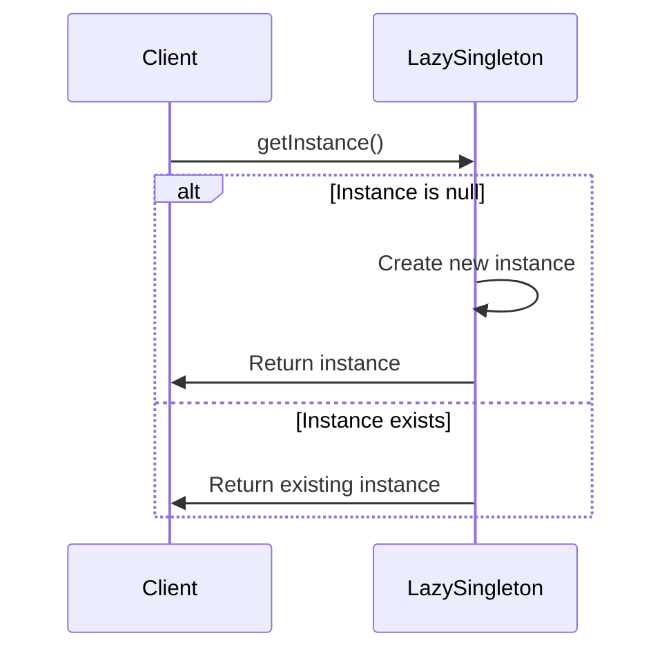

## 4.1.2 Lazy Initialization Singleton

In the realm of software design patterns, the Singleton Pattern is a well-known approach used to ensure that a class has only one instance and provides a global point of access to it. However, in some cases, creating this instance at the start of the application might not be efficient, especially if the instance is resource-intensive and not immediately needed. This is where the concept of **Lazy Initialization** comes into play.

### Understanding Lazy Initialization

**Lazy Initialization** is a design pattern that defers the creation of an object until it is needed. This approach can significantly improve performance and resource management, especially in scenarios where the initialization of an object is costly in terms of time or memory.

#### Benefits of Lazy Initialization

- **Resource Efficiency**: By delaying the creation of an object, we conserve resources, which is particularly beneficial in environments with limited resources.
- **Performance Optimization**: It reduces the application's startup time since the object is created only when requested.
- **Flexibility**: Allows for more flexible and dynamic resource allocation.

### Implementing Lazy Initialization in a Singleton

To implement a Lazy Initialization Singleton in TypeScript, we need to modify the basic Singleton pattern to ensure that the instance is created only when it is first accessed. Let's explore how to achieve this with a practical example.

#### TypeScript Code Example

Below is a TypeScript implementation of a Lazy Initialization Singleton:

```typescript
class LazySingleton {
  // Private static variable to hold the single instance
  private static instance: LazySingleton | null = null;

  // Private constructor to prevent direct instantiation
  private constructor() {
    console.log("LazySingleton instance created!");
  }

  // Public static method to provide access to the instance
  public static getInstance(): LazySingleton {
    // Check if an instance already exists
    if (this.instance === null) {
      // If not, create a new instance
      this.instance = new LazySingleton();
    }
    return this.instance;
  }

  // Example method to demonstrate functionality
  public showMessage(): void {
    console.log("Hello from LazySingleton!");
  }
}

// Usage
const singleton1 = LazySingleton.getInstance();
singleton1.showMessage();

const singleton2 = LazySingleton.getInstance();
singleton2.showMessage();

// Check if both instances are the same
console.log(singleton1 === singleton2); // Output: true
```

#### Explanation of the Code

- **Private Static Instance**: We declare a private static variable `instance` to hold the single instance of the class. It is initialized to `null` to indicate that no instance exists initially.
- **Private Constructor**: The constructor is private to prevent direct instantiation from outside the class.
- **Public Static Method**: The `getInstance` method checks if the `instance` is `null`. If it is, a new instance is created and assigned to `instance`. This ensures that the instance is created only when it is first needed.
- **Method Demonstration**: The `showMessage` method is a simple demonstration of the Singleton's functionality.

### Ensuring Efficient Lazy Initialization

While lazy initialization is beneficial, it is crucial to ensure that it does not introduce inefficiencies or complexities. Here are some considerations and best practices:

#### Thread Safety

In multi-threaded environments, lazy initialization can lead to race conditions where multiple threads might create multiple instances. To handle this, we can use synchronization mechanisms like locks. However, TypeScript does not natively support threading, so this is more of a concern in languages like Java or C#. In TypeScript, we can use other strategies like double-checked locking if needed.

#### Avoiding Complexity

Lazy initialization should not complicate the code unnecessarily. The logic for checking and creating the instance should be straightforward and encapsulated within the `getInstance` method.

#### Performance Considerations

While lazy initialization can improve performance by deferring object creation, it can also introduce a slight overhead due to the condition checks. However, this overhead is generally negligible compared to the benefits in resource-intensive scenarios.

### Scenarios for Using Lazy Initialization Singleton

Lazy initialization is particularly advantageous in scenarios where:

- **Resource-Intensive Setup**: The Singleton involves complex setup or initialization that consumes significant resources.
- **Delayed Usage**: The Singleton is not immediately needed at application startup, allowing for deferred creation.
- **Conditional Initialization**: The Singleton's creation depends on certain conditions or configurations that are not known at startup.

### Best Practices for Lazy Instantiation in TypeScript

- **Encapsulation**: Keep the lazy initialization logic encapsulated within the Singleton class to maintain a clean and maintainable codebase.
- **Documentation**: Clearly document the lazy initialization behavior to ensure that other developers understand the deferred creation logic.
- **Testing**: Thoroughly test the Singleton to ensure that it behaves correctly and efficiently under different scenarios.

### Visualizing Lazy Initialization Singleton

To better understand the Lazy Initialization Singleton, let's visualize the process using a sequence diagram.



**Diagram Description**: The sequence diagram illustrates the lazy initialization process. When the client requests the instance via `getInstance()`, the Singleton checks if the instance is `null`. If it is, a new instance is created; otherwise, the existing instance is returned.

### Try It Yourself

To deepen your understanding, try modifying the code example:

- **Add Logging**: Introduce logging to track when the instance is created.
- **Simulate Delayed Usage**: Add a delay before the first call to `getInstance()` to simulate a scenario where the Singleton is not immediately needed.
- **Experiment with Methods**: Add more methods to the Singleton class and observe how they interact with the lazy initialization.

### Knowledge Check

Before we conclude, let's reinforce what we've learned:

- **What is lazy initialization, and why is it beneficial?**
- **How does the Lazy Initialization Singleton differ from a basic Singleton?**
- **What are some potential issues with lazy initialization, and how can they be addressed?**

### Conclusion

The Lazy Initialization Singleton is a powerful pattern that optimizes resource usage by deferring object creation until necessary. By understanding and implementing this pattern in TypeScript, we can enhance the efficiency and performance of our applications, particularly in resource-intensive scenarios. Remember, this is just the beginning. As you progress, you'll build more complex and interactive applications. Keep experimenting, stay curious, and enjoy the journey!

## Quiz Time!



### What is the primary benefit of lazy initialization in a Singleton pattern?

- [x] It conserves resources by delaying object creation until needed.
- [ ] It allows multiple instances of the Singleton.
- [ ] It simplifies the code structure.
- [ ] It ensures thread safety.

> **Explanation:** Lazy initialization conserves resources by delaying the creation of the Singleton instance until it is first needed, optimizing performance.

### In the provided TypeScript example, what is the purpose of the `getInstance` method?

- [x] To provide controlled access to the Singleton instance.
- [ ] To create a new instance every time it's called.
- [ ] To destroy the existing instance.
- [ ] To modify the Singleton instance.

> **Explanation:** The `getInstance` method checks if an instance already exists and creates one if it doesn't, ensuring controlled access to the Singleton.

### Why is the constructor of the LazySingleton class private?

- [x] To prevent direct instantiation from outside the class.
- [ ] To allow subclassing.
- [ ] To enable multiple instances.
- [ ] To improve performance.

> **Explanation:** The constructor is private to prevent direct instantiation, ensuring that the Singleton pattern is maintained.

### What potential issue can arise in multi-threaded environments with lazy initialization?

- [x] Race conditions leading to multiple instances.
- [ ] Increased memory usage.
- [ ] Slower performance.
- [ ] Simplified code structure.

> **Explanation:** In multi-threaded environments, race conditions can occur where multiple threads create multiple instances simultaneously.

### Which of the following scenarios is NOT ideal for using lazy initialization?

- [ ] Resource-intensive setup.
- [ ] Delayed usage.
- [ ] Conditional initialization.
- [x] Immediate and frequent access.

> **Explanation:** Lazy initialization is not ideal for scenarios where the Singleton is accessed immediately and frequently, as it may introduce unnecessary overhead.

### How can we ensure thread safety in lazy initialization?

- [x] By using synchronization mechanisms like locks.
- [ ] By creating multiple instances.
- [ ] By avoiding the use of static methods.
- [ ] By making the constructor public.

> **Explanation:** Synchronization mechanisms like locks can ensure thread safety by preventing race conditions during instance creation.

### What is a potential downside of lazy initialization?

- [x] Slight overhead due to condition checks.
- [ ] Increased memory usage.
- [ ] Reduced flexibility.
- [ ] Complicated code structure.

> **Explanation:** Lazy initialization can introduce a slight overhead due to the condition checks required to determine if an instance already exists.

### In the context of lazy initialization, what does "deferred creation" mean?

- [x] Creating an object only when it is first needed.
- [ ] Creating multiple objects at once.
- [ ] Destroying objects when they are no longer needed.
- [ ] Creating objects during application startup.

> **Explanation:** Deferred creation means that the object is created only when it is first needed, rather than at application startup.

### Which TypeScript feature is crucial for implementing a Singleton pattern?

- [x] Private constructor.
- [ ] Public fields.
- [ ] Static methods.
- [ ] Interfaces.

> **Explanation:** A private constructor is crucial for implementing a Singleton pattern as it prevents direct instantiation from outside the class.

### True or False: Lazy initialization is always the best choice for implementing a Singleton.

- [ ] True
- [x] False

> **Explanation:** False. Lazy initialization is beneficial in certain scenarios, but not always the best choice, especially if the Singleton is accessed immediately and frequently.


