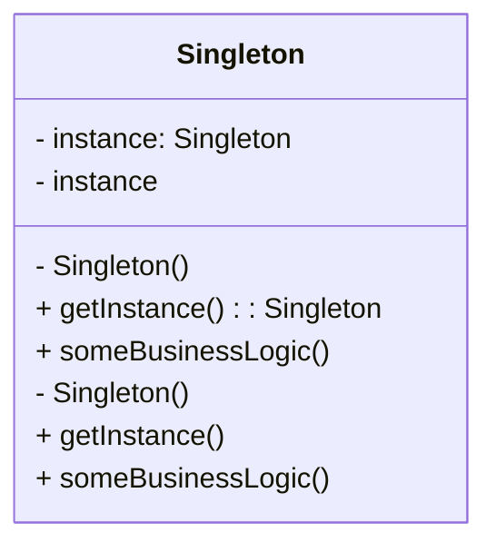

## 4.1 Singleton Pattern

The Singleton Pattern is a well-known creational design pattern that ensures a class has only one instance while providing a global point of access to that instance. This pattern is particularly useful in scenarios where a single instance of a class is required to coordinate actions across a system or manage shared resources. In this section, we will delve into the intricacies of the Singleton Pattern, its implementation in TypeScript, and best practices to mitigate potential issues.

### Understanding the Singleton Pattern

#### Intent of the Singleton Pattern

The Singleton Pattern is designed to solve a specific problem: ensuring that a class has only one instance and providing a global access point to it. This is particularly useful in scenarios where:

- **Resource Management**: You need to control access to shared resources such as configuration settings, connection pools, or logging mechanisms.
- **Coordination**: A single point of coordination is required across different parts of an application, such as managing a global state or handling a centralized event bus.

#### Key Features of the Singleton Pattern

1. **Single Instance**: The pattern restricts the instantiation of a class to a single object. This is achieved by making the constructor private and providing a static method that returns the instance.

2. **Global Access Point**: It provides a global point of access to the instance, typically through a static method or property.

### Implementing the Singleton Pattern in TypeScript

Let's explore how to implement the Singleton Pattern in TypeScript. We'll start with a basic implementation and then discuss more advanced techniques and best practices.

#### Basic Singleton Implementation

```typescript
class Singleton {
  private static instance: Singleton;

  // Private constructor prevents instantiation from outside the class
  private constructor() {}

  // Static method to provide a global access point to the instance
  public static getInstance(): Singleton {
    if (!Singleton.instance) {
      Singleton.instance = new Singleton();
    }
    return Singleton.instance;
  }

  public someBusinessLogic() {
    // Business logic here
    console.log("Executing some business logic.");
  }
}

// Usage
const singleton1 = Singleton.getInstance();
const singleton2 = Singleton.getInstance();

console.log(singleton1 === singleton2); // true
```

**Explanation**: In this example, the `Singleton` class has a private static property `instance` that holds the single instance of the class. The constructor is private, preventing direct instantiation. The `getInstance` method checks if an instance already exists; if not, it creates one. This ensures that only one instance is created and reused.

#### Lazy Initialization

Lazy initialization is a technique where the instance is created only when it is needed. This can be beneficial in scenarios where the singleton is resource-intensive to create.

```typescript
class LazySingleton {
  private static instance: LazySingleton;

  private constructor() {}

  public static getInstance(): LazySingleton {
    if (!LazySingleton.instance) {
      console.log("Creating new instance.");
      LazySingleton.instance = new LazySingleton();
    }
    return LazySingleton.instance;
  }

  public someBusinessLogic() {
    console.log("Executing some business logic.");
  }
}

// Usage
const lazySingleton1 = LazySingleton.getInstance();
const lazySingleton2 = LazySingleton.getInstance();

console.log(lazySingleton1 === lazySingleton2); // true
```

**Explanation**: The `getInstance` method checks if the `instance` is `undefined` before creating a new instance. This ensures that the singleton is created only when it is first accessed.

### Addressing Criticisms and Pitfalls

While the Singleton Pattern is widely used, it is not without its criticisms and potential pitfalls. Let's explore some common issues and how to address them.

#### Global State and Testing Challenges

One of the main criticisms of the Singleton Pattern is that it introduces global state, which can make unit testing challenging. Global state can lead to tests that are difficult to isolate and can cause side effects between tests.

**Solution**: To mitigate this issue, consider using dependency injection to provide the singleton instance to classes that need it. This allows for easier mocking and testing.

```typescript
class SingletonService {
  private static instance: SingletonService;

  private constructor() {}

  public static getInstance(): SingletonService {
    if (!SingletonService.instance) {
      SingletonService.instance = new SingletonService();
    }
    return SingletonService.instance;
  }

  public someServiceMethod() {
    console.log("Service method executed.");
  }
}

// Example of dependency injection
class Client {
  constructor(private singletonService: SingletonService) {}

  public execute() {
    this.singletonService.someServiceMethod();
  }
}

// Usage
const singletonService = SingletonService.getInstance();
const client = new Client(singletonService);
client.execute();
```

**Explanation**: By injecting the singleton instance into the `Client` class, we can easily replace it with a mock during testing.

#### Thread Safety

In multi-threaded environments, ensuring that the singleton instance is created only once can be challenging. While JavaScript is single-threaded, server-side environments like Node.js may introduce concurrency concerns.

**Solution**: Use locks or other synchronization mechanisms to ensure thread safety. However, in most TypeScript applications, this is not a primary concern due to the single-threaded nature of JavaScript.

### Best Practices for Singleton Implementation

1. **Lazy Initialization**: Use lazy initialization to create the singleton instance only when needed. This can improve performance and resource utilization.

2. **Dependency Injection**: Use dependency injection to provide the singleton instance to classes that need it. This improves testability and reduces coupling.

3. **Avoid Overuse**: Use the Singleton Pattern judiciously. Overuse can lead to tightly coupled code and global state management issues.

4. **Consider Alternatives**: Evaluate whether the Singleton Pattern is the best solution for your problem. In some cases, other patterns like the Factory Method or Dependency Injection may be more appropriate.

### Visualizing the Singleton Pattern

To better understand the Singleton Pattern, let's visualize the process of instance creation and access.



**Diagram Explanation**: The diagram illustrates the `Singleton` class with a private static `instance` property and a private constructor. The `getInstance` method provides a global access point to the single instance, ensuring that only one instance is created.

### Try It Yourself

To solidify your understanding of the Singleton Pattern, try modifying the code examples:

- **Experiment with Lazy Initialization**: Modify the `LazySingleton` class to include additional logging or resource-intensive operations during instance creation. Observe how lazy initialization impacts performance.

- **Implement Dependency Injection**: Refactor the `Client` class to use a mock singleton instance during testing. This will help you understand the benefits of dependency injection in improving testability.

- **Explore Alternatives**: Consider implementing a similar functionality using a different design pattern, such as the Factory Method, and compare the benefits and drawbacks.

### Knowledge Check

Before we conclude, let's review some key concepts:

- **What is the primary purpose of the Singleton Pattern?**
- **How does lazy initialization benefit the Singleton Pattern?**
- **What are some common criticisms of the Singleton Pattern, and how can they be addressed?**

### Conclusion

The Singleton Pattern is a powerful tool in the software engineer's toolkit, providing a way to ensure a class has only one instance and a global access point to it. While it offers significant benefits in terms of resource management and coordination, it is important to be aware of its potential pitfalls and to implement it judiciously. By following best practices and considering alternatives, you can effectively leverage the Singleton Pattern in your TypeScript applications.

## Quiz Time!



### What is the primary purpose of the Singleton Pattern?

- [x] To ensure a class has only one instance and provide a global access point to it.
- [ ] To allow multiple instances of a class with different configurations.
- [ ] To create a family of related objects without specifying their concrete classes.
- [ ] To encapsulate a request as an object, allowing parameterization.

> **Explanation:** The Singleton Pattern is designed to ensure a class has only one instance and provides a global access point to it.

### How does lazy initialization benefit the Singleton Pattern?

- [x] It creates the instance only when it is needed, improving performance.
- [ ] It allows multiple instances to be created simultaneously.
- [ ] It provides a way to encapsulate object creation.
- [ ] It ensures thread safety in multi-threaded environments.

> **Explanation:** Lazy initialization creates the singleton instance only when it is first accessed, which can improve performance and resource utilization.

### What is a common criticism of the Singleton Pattern?

- [x] It introduces global state, making unit testing challenging.
- [ ] It allows multiple instances of a class to be created.
- [ ] It requires extensive use of inheritance.
- [ ] It is difficult to implement in TypeScript.

> **Explanation:** The Singleton Pattern introduces global state, which can make unit testing challenging due to potential side effects.

### How can dependency injection improve the testability of a Singleton?

- [x] By allowing the singleton instance to be replaced with a mock during testing.
- [ ] By ensuring that only one instance of the singleton is created.
- [ ] By providing a global access point to the singleton instance.
- [ ] By making the singleton instance immutable.

> **Explanation:** Dependency injection allows the singleton instance to be replaced with a mock during testing, improving testability.

### Why is it important to avoid overusing the Singleton Pattern?

- [x] Overuse can lead to tightly coupled code and global state management issues.
- [ ] It can result in multiple instances of a class being created.
- [ ] It makes it difficult to encapsulate object creation.
- [ ] It requires extensive use of inheritance.

> **Explanation:** Overusing the Singleton Pattern can lead to tightly coupled code and global state management issues, making the codebase harder to maintain.

### What is the benefit of using a private constructor in a Singleton class?

- [x] It prevents direct instantiation of the class from outside.
- [ ] It allows multiple instances to be created.
- [ ] It provides a global access point to the instance.
- [ ] It ensures the class is immutable.

> **Explanation:** A private constructor prevents direct instantiation of the class from outside, ensuring that only one instance is created through the static method.

### How does the Singleton Pattern provide a global access point?

- [x] Through a static method or property that returns the single instance.
- [ ] By allowing multiple instances to be created.
- [ ] By using inheritance to share the instance.
- [ ] By encapsulating object creation.

> **Explanation:** The Singleton Pattern provides a global access point through a static method or property that returns the single instance.

### What is a potential issue with thread safety in the Singleton Pattern?

- [x] Ensuring the singleton instance is created only once in multi-threaded environments.
- [ ] Allowing multiple instances to be created simultaneously.
- [ ] Providing a global access point to the instance.
- [ ] Making the singleton instance immutable.

> **Explanation:** In multi-threaded environments, ensuring the singleton instance is created only once can be challenging, although this is less of a concern in JavaScript due to its single-threaded nature.

### What is the role of the `getInstance` method in a Singleton class?

- [x] To provide a global access point to the single instance.
- [ ] To allow direct instantiation of the class.
- [ ] To create multiple instances of the class.
- [ ] To encapsulate object creation.

> **Explanation:** The `getInstance` method provides a global access point to the single instance, ensuring that only one instance is created and reused.

### True or False: The Singleton Pattern is always the best solution for managing shared resources.

- [ ] True
- [x] False

> **Explanation:** The Singleton Pattern is not always the best solution for managing shared resources. It should be used judiciously, and alternatives like dependency injection or other design patterns may be more appropriate in certain scenarios.


