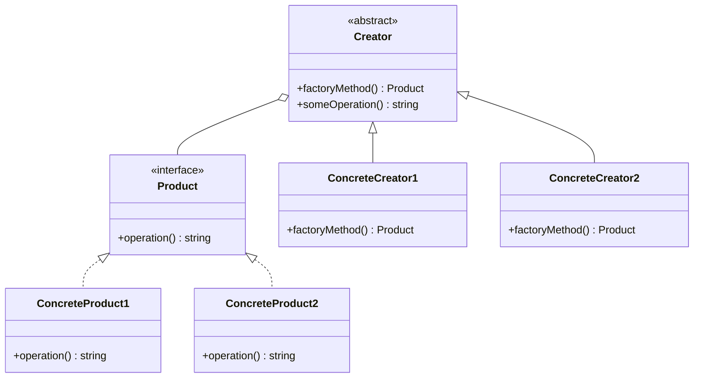

## 4.2.1 Implementing Factory Method in TypeScript

The Factory Method Pattern is a cornerstone of object-oriented design, providing a way to delegate the instantiation of objects to subclasses. This pattern is particularly useful when a class cannot anticipate the class of objects it must create. In this section, we will explore how to implement the Factory Method Pattern in TypeScript, leveraging its robust type system and object-oriented features.

### Understanding the Factory Method Pattern

The Factory Method Pattern defines an interface for creating an object but allows subclasses to alter the type of objects that will be created. It promotes loose coupling by reducing the dependency of a class on the concrete classes it needs to instantiate.

#### Key Components of the Factory Method Pattern

1. **Product Interface or Abstract Class**: Defines the interface for objects the factory method creates.
2. **ConcreteProduct Classes**: Implement the `Product` interface or extend the abstract class.
3. **Creator Abstract Class**: Declares the factory method, which returns an object of type `Product`.
4. **ConcreteCreator Classes**: Override the factory method to return an instance of a `ConcreteProduct`.

### Implementing the Factory Method Pattern in TypeScript

Let's delve into a step-by-step implementation of the Factory Method Pattern using TypeScript.

#### Step 1: Defining the Product Interface

First, we define a `Product` interface. This interface will be implemented by all products created by the factory method.

```typescript
// Define the Product interface
interface Product {
  operation(): string;
}
```

#### Step 2: Creating ConcreteProduct Classes

Next, we create concrete classes that implement the `Product` interface. These classes represent the different types of products that can be created.

```typescript
// ConcreteProduct1 class implementing the Product interface
class ConcreteProduct1 implements Product {
  public operation(): string {
    return 'Result of ConcreteProduct1';
  }
}

// ConcreteProduct2 class implementing the Product interface
class ConcreteProduct2 implements Product {
  public operation(): string {
    return 'Result of ConcreteProduct2';
  }
}
```

#### Step 3: Defining the Creator Abstract Class

The `Creator` class declares the factory method that returns an object of type `Product`. Subclasses will provide the implementation for this method.

```typescript
// Define the Creator abstract class
abstract class Creator {
  // The factory method
  public abstract factoryMethod(): Product;

  // An operation that uses the Product
  public someOperation(): string {
    // Call the factory method to create a Product
    const product = this.factoryMethod();
    // Use the Product
    return `Creator: The same creator's code has just worked with ${product.operation()}`;
  }
}
```

#### Step 4: Implementing ConcreteCreator Classes

Concrete creators override the factory method to return an instance of a concrete product.

```typescript
// ConcreteCreator1 class
class ConcreteCreator1 extends Creator {
  public factoryMethod(): Product {
    return new ConcreteProduct1();
  }
}

// ConcreteCreator2 class
class ConcreteCreator2 extends Creator {
  public factoryMethod(): Product {
    return new ConcreteProduct2();
  }
}
```

#### Step 5: Using the Factory Method Pattern

Now that we have our classes set up, let's see how we can use them.

```typescript
// Client code
function clientCode(creator: Creator) {
  console.log('Client: I\'m not aware of the creator\'s class, but it still works.');
  console.log(creator.someOperation());
}

// Using ConcreteCreator1
console.log('App: Launched with ConcreteCreator1.');
clientCode(new ConcreteCreator1());

// Using ConcreteCreator2
console.log('App: Launched with ConcreteCreator2.');
clientCode(new ConcreteCreator2());
```

### How TypeScript Facilitates the Factory Method Pattern

TypeScript's support for interfaces and abstract classes makes it an excellent language for implementing the Factory Method Pattern. Interfaces allow us to define a contract for products, ensuring that all concrete products adhere to the same structure. Abstract classes provide a way to define common behavior for creators while allowing subclasses to specify the details of product creation.

#### Using Generics for Flexibility

Generics can be employed to make the factory method more flexible by allowing it to work with various types of products. This can be particularly useful when the factory method needs to handle multiple product types without being tightly coupled to any specific one.

```typescript
// Generic Creator class
abstract class GenericCreator<T extends Product> {
  public abstract factoryMethod(): T;

  public someOperation(): string {
    const product = this.factoryMethod();
    return `Creator: The same creator's code has just worked with ${product.operation()}`;
  }
}

// Generic ConcreteCreator
class GenericConcreteCreator1 extends GenericCreator<ConcreteProduct1> {
  public factoryMethod(): ConcreteProduct1 {
    return new ConcreteProduct1();
  }
}
```

### Best Practices for Implementing the Factory Method Pattern in TypeScript

1. **Use Interfaces for Products**: Define a clear contract for products using interfaces to ensure consistency across different product types.
2. **Leverage Abstract Classes for Creators**: Use abstract classes to define common behavior for creators while allowing subclasses to implement specific product creation logic.
3. **Employ Generics for Flexibility**: Use generics to make your factory methods more flexible and reusable across different product types.
4. **Organize Code for Maintainability**: Keep your code organized by grouping related classes and interfaces together. This makes it easier to manage and extend your codebase.

### Visualizing the Factory Method Pattern

To better understand the relationships between the components of the Factory Method Pattern, let's visualize it using a class diagram.



### Try It Yourself

Now that we've walked through the implementation of the Factory Method Pattern, it's time to experiment with the code. Try the following modifications:

1. **Add a New Product Type**: Create a new `ConcreteProduct3` class and a corresponding `ConcreteCreator3` class. Implement the necessary methods and test it with the client code.
2. **Use Generics**: Modify the existing implementation to use generics for the `Creator` and `ConcreteCreator` classes. Observe how this affects the flexibility of your code.
3. **Refactor the Client Code**: Simplify the client code by using a loop to iterate over an array of creators and call `someOperation()` on each.

### Knowledge Check

Before we conclude, let's reinforce our understanding of the Factory Method Pattern with a few questions:

- What is the primary purpose of the Factory Method Pattern?
- How does TypeScript's type system enhance the implementation of this pattern?
- What are the benefits of using generics in the Factory Method Pattern?
- How can the Factory Method Pattern improve code maintainability?

### Conclusion

The Factory Method Pattern is a powerful tool in the software engineer's arsenal, enabling the creation of flexible and scalable code. By leveraging TypeScript's interfaces, abstract classes, and generics, we can implement this pattern effectively, ensuring our applications are well-structured and easy to maintain. Remember, this is just the beginning. As you continue to explore design patterns, you'll discover new ways to enhance your codebase and tackle complex challenges. Keep experimenting, stay curious, and enjoy the journey!

## Quiz Time!



### What is the primary purpose of the Factory Method Pattern?

- [x] To define an interface for creating objects, allowing subclasses to alter the type of objects that will be created.
- [ ] To provide a single instance of a class globally.
- [ ] To compose objects into tree structures to represent part-whole hierarchies.
- [ ] To attach additional responsibilities to an object dynamically.

> **Explanation:** The Factory Method Pattern defines an interface for creating an object, but allows subclasses to alter the type of objects that will be created, promoting flexibility and scalability.

### How does TypeScript's type system enhance the implementation of the Factory Method Pattern?

- [x] By providing interfaces and abstract classes to define contracts and common behavior.
- [ ] By allowing dynamic typing, which makes the code more flexible.
- [ ] By enforcing immutability in all objects.
- [ ] By automatically generating factory methods.

> **Explanation:** TypeScript's type system enhances the implementation of the Factory Method Pattern by providing interfaces and abstract classes, which help define clear contracts and common behavior for products and creators.

### What are the benefits of using generics in the Factory Method Pattern?

- [x] They allow the factory method to work with various types of products without being tightly coupled to any specific one.
- [ ] They make the code more readable by reducing the need for type annotations.
- [ ] They enforce strict type checking at runtime.
- [ ] They automatically optimize the code for performance.

> **Explanation:** Generics allow the factory method to work with various types of products without being tightly coupled to any specific one, enhancing flexibility and reusability.

### How can the Factory Method Pattern improve code maintainability?

- [x] By promoting loose coupling and reducing dependencies on concrete classes.
- [ ] By increasing the complexity of the codebase.
- [ ] By requiring more boilerplate code.
- [ ] By making it harder to add new product types.

> **Explanation:** The Factory Method Pattern improves code maintainability by promoting loose coupling and reducing dependencies on concrete classes, making it easier to extend and modify the codebase.

### Which of the following is a key component of the Factory Method Pattern?

- [x] Product Interface
- [ ] Singleton Instance
- [ ] Composite Structure
- [ ] Decorator Class

> **Explanation:** The Product Interface is a key component of the Factory Method Pattern, as it defines the interface for objects the factory method creates.

### What role does the Creator class play in the Factory Method Pattern?

- [x] It declares the factory method that returns an object of type Product.
- [ ] It implements the concrete products.
- [ ] It provides a global access point for a single instance.
- [ ] It composes objects into tree structures.

> **Explanation:** The Creator class declares the factory method that returns an object of type Product, allowing subclasses to specify the details of product creation.

### Why is it beneficial to use abstract classes for creators in the Factory Method Pattern?

- [x] To define common behavior for creators while allowing subclasses to implement specific product creation logic.
- [ ] To enforce strict immutability in all products.
- [ ] To automatically generate product instances.
- [ ] To simplify the client code by reducing the need for type annotations.

> **Explanation:** Using abstract classes for creators allows us to define common behavior for creators while allowing subclasses to implement specific product creation logic, promoting code reuse and flexibility.

### How can you make the Factory Method Pattern more flexible using TypeScript?

- [x] By using generics to allow the factory method to work with various types of products.
- [ ] By using dynamic typing to reduce type constraints.
- [ ] By enforcing strict immutability in all products.
- [ ] By automatically generating product instances.

> **Explanation:** Using generics in TypeScript allows the factory method to work with various types of products, making the pattern more flexible and reusable.

### What is the benefit of organizing code for maintainability when implementing the Factory Method Pattern?

- [x] It makes it easier to manage and extend the codebase.
- [ ] It increases the complexity of the codebase.
- [ ] It requires more boilerplate code.
- [ ] It makes it harder to add new product types.

> **Explanation:** Organizing code for maintainability makes it easier to manage and extend the codebase, ensuring that the implementation remains scalable and adaptable to future changes.

### True or False: The Factory Method Pattern can only be used for creating objects of a single type.

- [ ] True
- [x] False

> **Explanation:** False. The Factory Method Pattern can be used to create objects of various types, as it allows subclasses to alter the type of objects that will be created.


