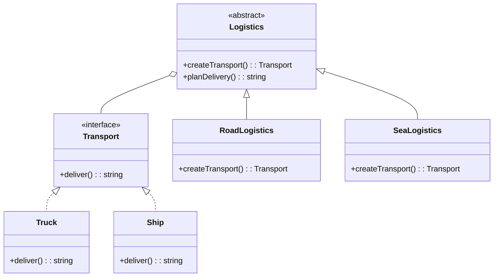

## 4.2.2 Using Interfaces and Abstract Classes

In this section, we delve into the use of interfaces and abstract classes within the Factory Method Pattern in TypeScript. This pattern is one of the creational design patterns that provides an interface for creating objects in a superclass, but allows subclasses to alter the type of objects that will be created. By leveraging TypeScript's interfaces and abstract classes, we can define contracts and promote extensibility, ensuring that our code is both flexible and maintainable.

### Understanding Interfaces and Abstract Classes

Before we explore their roles in the Factory Method Pattern, let's briefly review what interfaces and abstract classes are in TypeScript.

#### Interfaces

Interfaces in TypeScript are used to define the shape of an object. They specify what properties and methods an object should have, but they do not provide any implementation. Interfaces are a powerful way to enforce a contract on a class or an object, ensuring that it adheres to a specific structure.

```typescript
interface Product {
    name: string;
    price: number;
    getDescription(): string;
}
```

In the example above, any object that implements the `Product` interface must have a `name` and `price` property, as well as a `getDescription` method.

#### Abstract Classes

Abstract classes, on the other hand, can provide both a contract and some implementation. They are similar to interfaces but can include method implementations and fields. An abstract class cannot be instantiated directly and is meant to be subclassed.

```typescript
abstract class Creator {
    abstract factoryMethod(): Product;

    someOperation(): string {
        const product = this.factoryMethod();
        return `Creator: The same creator's code has just worked with ${product.getDescription()}`;
    }
}
```

In this example, the `Creator` class has an abstract method `factoryMethod` that must be implemented by any subclass. It also has a concrete method `someOperation` that uses the product created by the factory method.

### Using Interfaces in the Factory Method Pattern

In the Factory Method Pattern, interfaces are typically used to define the `Product` types. This allows different products to be created by the factory method, while adhering to a common interface.

#### Defining Product Interfaces

Let's define a simple product interface for a logistics application:

```typescript
interface Transport {
    deliver(): string;
}
```

This interface defines a single method `deliver`, which must be implemented by any class that represents a type of transport.

#### Implementing Product Classes

Now, let's create some classes that implement this interface:

```typescript
class Truck implements Transport {
    deliver(): string {
        return 'Delivering by land in a truck';
    }
}

class Ship implements Transport {
    deliver(): string {
        return 'Delivering by sea in a ship';
    }
}
```

Both `Truck` and `Ship` implement the `Transport` interface, providing their own implementation of the `deliver` method.

### Using Abstract Classes in the Factory Method Pattern

Abstract classes are often used for the `Creator` in the Factory Method Pattern. They define the factory method and may provide some default implementations.

#### Defining the Creator Abstract Class

Let's define an abstract creator class for our logistics application:

```typescript
abstract class Logistics {
    abstract createTransport(): Transport;

    planDelivery(): string {
        const transport = this.createTransport();
        return `Planning delivery: ${transport.deliver()}`;
    }
}
```

The `Logistics` class has an abstract method `createTransport` that must be implemented by subclasses. It also has a concrete method `planDelivery` that uses the transport created by the factory method.

#### Implementing Creator Subclasses

Now, let's create some subclasses that implement the factory method:

```typescript
class RoadLogistics extends Logistics {
    createTransport(): Transport {
        return new Truck();
    }
}

class SeaLogistics extends Logistics {
    createTransport(): Transport {
        return new Ship();
    }
}
```

`RoadLogistics` and `SeaLogistics` provide their own implementation of the `createTransport` method, returning the appropriate transport type.

### Benefits of Using Interfaces and Abstract Classes

Using interfaces and abstract classes in the Factory Method Pattern offers several benefits:

1. **Flexibility**: By defining interfaces for products, we can easily add new product types without modifying existing code. This makes our codebase more flexible and easier to extend.

2. **Enforcing Design Contracts**: Interfaces and abstract classes enforce a contract on the classes that implement or extend them. This ensures that all products and creators adhere to a specific structure, making the code more predictable and easier to understand.

3. **Code Reusability**: Abstract classes can provide default implementations for some methods, reducing code duplication and promoting reuse.

4. **Separation of Concerns**: By separating the product creation logic from the product usage logic, we adhere to the Single Responsibility Principle, making our code easier to maintain.

### Choosing Between Interfaces and Abstract Classes

When deciding whether to use an interface or an abstract class, consider the following:

- **Use Interfaces When**: You want to define a contract that multiple classes can implement. Interfaces are ideal when you need to ensure that different classes adhere to a specific structure but do not share any implementation.

- **Use Abstract Classes When**: You want to define a contract and provide some default implementation. Abstract classes are useful when you have common functionality that can be shared among subclasses.

### TypeScript-Specific Considerations

In TypeScript, there are some specific considerations to keep in mind when working with interfaces and abstract classes:

- **Instantiation**: Abstract classes cannot be instantiated directly. They are meant to be subclassed, and the subclass must implement any abstract methods.

- **Multiple Inheritance**: TypeScript does not support multiple inheritance, but a class can implement multiple interfaces. This allows for greater flexibility when defining contracts.

- **Type Safety**: TypeScript's type system ensures that any class implementing an interface or extending an abstract class adheres to the defined contract, providing compile-time type safety.

### Try It Yourself

To solidify your understanding, try modifying the code examples above:

1. **Add a New Transport Type**: Implement a new class `Plane` that represents air transport and implements the `Transport` interface. Update the `Logistics` subclasses to use this new transport type.

2. **Extend the Logistics Class**: Add a new method to the `Logistics` class that calculates the cost of delivery based on the transport type. Provide default implementations in the subclasses.

3. **Experiment with Interfaces**: Create a new interface `Vehicle` with properties like `speed` and `capacity`. Implement this interface in the `Truck` and `Ship` classes.

### Visualizing the Factory Method Pattern

To better understand the relationships between interfaces, abstract classes, and concrete classes in the Factory Method Pattern, let's visualize it using a class diagram.



**Diagram Description**: This class diagram illustrates the Factory Method Pattern with `Transport` as an interface, `Truck` and `Ship` as concrete implementations, and `Logistics` as an abstract class with `RoadLogistics` and `SeaLogistics` as concrete subclasses.

### Knowledge Check

To reinforce your understanding, consider the following questions:

- What are the key differences between interfaces and abstract classes in TypeScript?
- How do interfaces and abstract classes promote flexibility and maintainability in the Factory Method Pattern?
- When would you choose to use an interface over an abstract class, and vice versa?

### Summary

In this section, we've explored how interfaces and abstract classes are used within the Factory Method Pattern in TypeScript. By defining contracts and promoting extensibility, these constructs help us create flexible, maintainable, and reusable code. Remember, the choice between interfaces and abstract classes depends on your specific use case and the level of implementation detail you wish to provide.

As you continue your journey in mastering design patterns in TypeScript, keep experimenting and exploring new ways to apply these concepts in your projects. The more you practice, the more intuitive these patterns will become, enabling you to write more efficient and effective code.

## Quiz Time!



### What is the primary purpose of using interfaces in TypeScript?

- [x] To define a contract that classes must adhere to
- [ ] To provide default implementations for methods
- [ ] To allow multiple inheritance
- [ ] To define private members

> **Explanation:** Interfaces in TypeScript are used to define a contract that classes must adhere to, specifying the methods and properties they must implement.

### What is a key feature of abstract classes in TypeScript?

- [x] They can provide default implementations for some methods
- [ ] They can be instantiated directly
- [ ] They allow multiple inheritance
- [ ] They cannot have any methods

> **Explanation:** Abstract classes can provide default implementations for some methods, but they cannot be instantiated directly.

### When should you use an interface over an abstract class?

- [x] When you want to define a contract without providing any implementation
- [ ] When you want to provide default method implementations
- [ ] When you need to inherit from multiple classes
- [ ] When you want to define private members

> **Explanation:** Use an interface when you want to define a contract without providing any implementation, allowing multiple classes to implement the interface.

### What is the Factory Method Pattern primarily used for?

- [x] Creating objects without specifying the exact class of object that will be created
- [ ] Defining a one-to-many dependency between objects
- [ ] Allowing incompatible interfaces to work together
- [ ] Providing a simplified interface to a complex subsystem

> **Explanation:** The Factory Method Pattern is used for creating objects without specifying the exact class of object that will be created, allowing subclasses to alter the type of objects that will be created.

### What is a benefit of using abstract classes in the Factory Method Pattern?

- [x] They can provide default implementations for methods used by subclasses
- [ ] They allow multiple inheritance
- [ ] They can be instantiated directly
- [ ] They enforce a strict contract without any implementation

> **Explanation:** Abstract classes can provide default implementations for methods used by subclasses, promoting code reuse and reducing duplication.

### Which of the following is true about interfaces in TypeScript?

- [x] They cannot provide any implementation
- [ ] They can have private members
- [ ] They can be instantiated directly
- [ ] They allow multiple inheritance

> **Explanation:** Interfaces cannot provide any implementation; they only define a contract that classes must adhere to.

### How does TypeScript ensure type safety with interfaces and abstract classes?

- [x] By enforcing that classes adhere to the defined contract at compile-time
- [ ] By allowing runtime checks for method implementations
- [ ] By providing default implementations for all methods
- [ ] By allowing multiple inheritance

> **Explanation:** TypeScript ensures type safety by enforcing that classes adhere to the defined contract at compile-time, providing compile-time type checking.

### What is a scenario where you might choose an abstract class over an interface?

- [x] When you want to provide some default method implementations
- [ ] When you need to define a contract without any implementation
- [ ] When you need to inherit from multiple classes
- [ ] When you want to define private members

> **Explanation:** Choose an abstract class when you want to provide some default method implementations that can be shared among subclasses.

### Can a class implement multiple interfaces in TypeScript?

- [x] True
- [ ] False

> **Explanation:** In TypeScript, a class can implement multiple interfaces, allowing it to adhere to multiple contracts.

### Can an abstract class in TypeScript have both abstract and concrete methods?

- [x] True
- [ ] False

> **Explanation:** An abstract class in TypeScript can have both abstract and concrete methods, allowing it to provide some implementation while requiring subclasses to implement specific methods.


