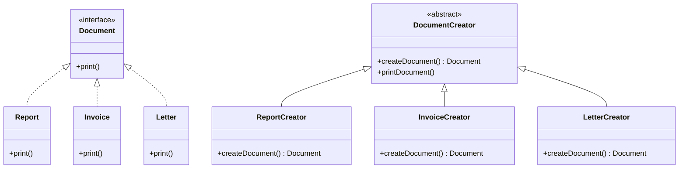

## 4.2.3 Extending Factories

In the realm of software design, the Factory Method Pattern is a creational pattern that provides an interface for creating objects in a superclass but allows subclasses to alter the type of objects that will be created. This pattern is particularly powerful when combined with the Open/Closed Principle, which states that software entities should be open for extension but closed for modification. In this section, we will delve into how to extend the Factory Method Pattern in TypeScript to accommodate new product types without modifying existing code, thereby adhering to the Open/Closed Principle.

### Understanding the Open/Closed Principle

The Open/Closed Principle is one of the five SOLID principles of object-oriented design, which are essential for creating robust and maintainable software. This principle emphasizes that a class should be easily extendable to incorporate new behavior without altering its existing code. By adhering to this principle, we can ensure that our software is flexible and adaptable to change, which is crucial in today's fast-paced development environments.

In the context of the Factory Method Pattern, the Open/Closed Principle allows us to add new product types by creating new subclasses, rather than modifying existing classes. This approach not only enhances the scalability and maintainability of our code but also minimizes the risk of introducing bugs into a well-tested codebase.

### Extending the Factory Method Pattern

To illustrate the extension of the Factory Method Pattern, let's consider a scenario where we have a simple application that creates different types of documents. Initially, our application supports two types of documents: `Report` and `Invoice`. We will demonstrate how to extend this application to support a new document type, `Letter`, without modifying the existing code.

#### Initial Implementation

First, let's review the initial implementation of the Factory Method Pattern with `Report` and `Invoice` as our product types.

```typescript
// Product interface
interface Document {
    print(): void;
}

// ConcreteProduct: Report
class Report implements Document {
    print(): void {
        console.log("Printing a report...");
    }
}

// ConcreteProduct: Invoice
class Invoice implements Document {
    print(): void {
        console.log("Printing an invoice...");
    }
}

// Creator abstract class
abstract class DocumentCreator {
    abstract createDocument(): Document;

    printDocument(): void {
        const document = this.createDocument();
        document.print();
    }
}

// ConcreteCreator: ReportCreator
class ReportCreator extends DocumentCreator {
    createDocument(): Document {
        return new Report();
    }
}

// ConcreteCreator: InvoiceCreator
class InvoiceCreator extends DocumentCreator {
    createDocument(): Document {
        return new Invoice();
    }
}

// Client code
function clientCode(creator: DocumentCreator) {
    creator.printDocument();
}

clientCode(new ReportCreator());  // Output: Printing a report...
clientCode(new InvoiceCreator()); // Output: Printing an invoice...
```

In this implementation, we have a `Document` interface that defines a `print` method. The `Report` and `Invoice` classes implement this interface. The `DocumentCreator` abstract class declares the factory method `createDocument`, which returns a `Document`. The `ReportCreator` and `InvoiceCreator` classes extend `DocumentCreator` and implement the `createDocument` method to return instances of `Report` and `Invoice`, respectively.

#### Adding a New Product Type

Now, let's extend this implementation to support a new document type, `Letter`, by adding a new `ConcreteProduct` and `ConcreteCreator` class.

```typescript
// ConcreteProduct: Letter
class Letter implements Document {
    print(): void {
        console.log("Printing a letter...");
    }
}

// ConcreteCreator: LetterCreator
class LetterCreator extends DocumentCreator {
    createDocument(): Document {
        return new Letter();
    }
}

// Client code
clientCode(new LetterCreator()); // Output: Printing a letter...
```

By adding the `Letter` class and the `LetterCreator` class, we have successfully extended our application to support a new document type without modifying any existing code. This demonstrates the power of the Open/Closed Principle in action.

### Integrating New Classes Seamlessly

The seamless integration of new classes into the existing factory hierarchy is a testament to the flexibility and scalability of the Factory Method Pattern. By adhering to the Open/Closed Principle, we can ensure that our codebase remains stable and maintainable, even as we introduce new functionality.

#### Role of Polymorphism

Polymorphism plays a crucial role in the extensibility of the Factory Method Pattern. By defining a common interface (`Document`) for all product types, we can treat all documents interchangeably, regardless of their specific type. This allows us to write client code that is agnostic to the specific type of document being created, further enhancing the flexibility of our application.

### Considerations for Keeping the Factory Hierarchy Organized

As the number of product types and corresponding creators grows, it is essential to keep the factory hierarchy organized to maintain clarity and ease of maintenance. Here are some considerations to keep in mind:

1. **Consistent Naming Conventions**: Use consistent naming conventions for product and creator classes to make it easy to identify related classes.

2. **Modularization**: Organize product and creator classes into separate modules or packages based on their functionality or domain. This helps in managing dependencies and improves code readability.

3. **Documentation**: Provide clear documentation for each product and creator class, including their purpose and usage. This is especially important in large codebases where multiple developers may be working on the same project.

4. **Testing**: Ensure that each new product type and its corresponding creator are thoroughly tested to verify that they integrate seamlessly with the existing codebase.

### Supporting Scalability and Maintainability

The extensibility of the Factory Method Pattern supports scalability and maintainability in large applications by allowing new functionality to be added with minimal impact on existing code. This is particularly beneficial in scenarios where the application needs to support a wide variety of product types, such as in content management systems, e-commerce platforms, and document processing applications.

By following the Open/Closed Principle and leveraging the power of polymorphism, we can build applications that are both flexible and robust, capable of adapting to changing requirements and evolving business needs.

### Visualizing the Factory Method Pattern

To better understand the structure and relationships within the Factory Method Pattern, let's visualize the class hierarchy using a class diagram.



This diagram illustrates the relationships between the `Document` interface, its concrete implementations (`Report`, `Invoice`, `Letter`), and the `DocumentCreator` abstract class along with its concrete subclasses (`ReportCreator`, `InvoiceCreator`, `LetterCreator`). The arrows indicate inheritance and implementation relationships, highlighting how new product types can be seamlessly integrated into the existing hierarchy.

### Try It Yourself

To deepen your understanding of extending factories, try modifying the code examples provided above. Here are some suggestions:

- **Add a New Document Type**: Create a new document type, such as `Memo`, and implement a corresponding `MemoCreator` class. Ensure that the new classes integrate seamlessly with the existing code.

- **Experiment with Polymorphism**: Modify the client code to handle a collection of `DocumentCreator` instances, and iterate over them to print different types of documents. Observe how polymorphism allows for flexible and interchangeable use of different document types.

- **Refactor the Code**: Consider refactoring the code to improve modularity and organization. For example, separate the product and creator classes into different modules or files.

### Knowledge Check

Before moving on, let's review some key takeaways from this section:

- The Open/Closed Principle is essential for creating flexible and maintainable software, allowing for easy extension without modification.
- The Factory Method Pattern can be extended by adding new product types and corresponding creator classes, adhering to the Open/Closed Principle.
- Polymorphism enables the interchangeable use of different product types, enhancing the flexibility of the application.
- Keeping the factory hierarchy organized is crucial for maintaining clarity and ease of maintenance as the application grows.

### Embrace the Journey

Remember, this is just the beginning. As you continue to explore design patterns and their applications in TypeScript, you'll build more complex and scalable applications. Keep experimenting, stay curious, and enjoy the journey!

## Quiz Time!



### What principle allows software entities to be open for extension but closed for modification?

- [x] Open/Closed Principle
- [ ] Single Responsibility Principle
- [ ] Dependency Inversion Principle
- [ ] Interface Segregation Principle

> **Explanation:** The Open/Closed Principle states that software entities should be open for extension but closed for modification, allowing new functionality to be added without altering existing code.

### In the Factory Method Pattern, how do we add a new product type without modifying existing code?

- [x] By creating new ConcreteProduct and ConcreteCreator classes
- [ ] By modifying the existing ConcreteProduct classes
- [ ] By changing the interface of the Product
- [ ] By altering the existing Creator class

> **Explanation:** To add a new product type, we create new ConcreteProduct and ConcreteCreator classes, adhering to the Open/Closed Principle.

### What role does polymorphism play in the Factory Method Pattern?

- [x] It allows different product types to be used interchangeably
- [ ] It enforces a single implementation for all products
- [ ] It restricts the creation of new product types
- [ ] It eliminates the need for interfaces

> **Explanation:** Polymorphism allows different product types to be used interchangeably, enabling flexible and dynamic behavior in the application.

### Why is it important to keep the factory hierarchy organized?

- [x] To maintain clarity and ease of maintenance
- [ ] To increase the complexity of the codebase
- [ ] To ensure all classes are in a single file
- [ ] To prevent the addition of new product types

> **Explanation:** Keeping the factory hierarchy organized helps maintain clarity and ease of maintenance, especially as the application grows.

### What is a key benefit of adhering to the Open/Closed Principle in the Factory Method Pattern?

- [x] It enhances scalability and maintainability
- [ ] It simplifies the code by removing all interfaces
- [ ] It allows for direct modification of existing classes
- [ ] It eliminates the need for testing

> **Explanation:** Adhering to the Open/Closed Principle enhances scalability and maintainability by allowing new functionality to be added without modifying existing code.

### How can we ensure that new product types integrate seamlessly with existing code?

- [x] By implementing a common interface for all product types
- [ ] By using global variables for product instances
- [ ] By hardcoding product types in the client code
- [ ] By avoiding the use of abstract classes

> **Explanation:** Implementing a common interface for all product types ensures that new types integrate seamlessly with existing code.

### What is a potential challenge when extending the Factory Method Pattern?

- [x] Keeping the factory hierarchy organized
- [ ] Limiting the number of product types
- [ ] Ensuring all products are identical
- [ ] Avoiding the use of interfaces

> **Explanation:** A potential challenge is keeping the factory hierarchy organized as the number of product types and creators grows.

### What is the purpose of the `createDocument` method in the Factory Method Pattern?

- [x] To define the factory method for creating product instances
- [ ] To print the document directly
- [ ] To modify existing product types
- [ ] To delete product instances

> **Explanation:** The `createDocument` method defines the factory method for creating product instances, allowing subclasses to specify the type of product created.

### How does the Factory Method Pattern support scalability?

- [x] By allowing new product types to be added without modifying existing code
- [ ] By enforcing a single product type for all creators
- [ ] By restricting the number of creators
- [ ] By eliminating the need for interfaces

> **Explanation:** The Factory Method Pattern supports scalability by allowing new product types to be added without modifying existing code, adhering to the Open/Closed Principle.

### True or False: The Factory Method Pattern requires modifying existing code to add new product types.

- [ ] True
- [x] False

> **Explanation:** False. The Factory Method Pattern allows new product types to be added by creating new classes, without modifying existing code, adhering to the Open/Closed Principle.


