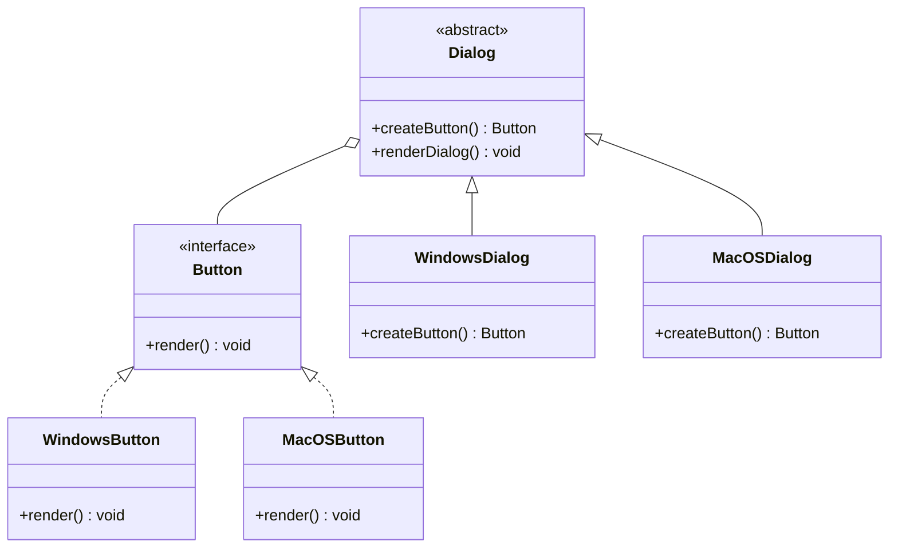

## 4.2.4 Use Cases and Examples

In this section, we delve into the practical applications of the Factory Method Pattern in TypeScript. This pattern is a cornerstone in object-oriented design, providing a way to encapsulate the instantiation of objects, thus enhancing flexibility and scalability in software systems. Let's explore several real-world scenarios where the Factory Method Pattern proves invaluable.

### GUI Frameworks: Creating Platform-Specific UI Components

Graphical User Interface (GUI) frameworks often need to support multiple platforms, each with its unique set of UI components. The Factory Method Pattern allows developers to create platform-specific components without altering the core framework logic.

#### Problem

Consider a GUI framework that needs to render buttons differently on Windows, macOS, and Linux. Hardcoding these differences would lead to a tangled mess of conditional logic, making the codebase difficult to maintain and extend.

#### Solution

The Factory Method Pattern provides a way to define an interface for creating an object, but allows subclasses to alter the type of objects that will be created. This pattern is particularly useful for GUI frameworks, where the creation of UI components can vary significantly between platforms.

```typescript
// Define the Button interface
interface Button {
  render(): void;
}

// Implement WindowsButton
class WindowsButton implements Button {
  render(): void {
    console.log("Rendering a button in Windows style.");
  }
}

// Implement MacOSButton
class MacOSButton implements Button {
  render(): void {
    console.log("Rendering a button in macOS style.");
  }
}

// Define the Dialog abstract class
abstract class Dialog {
  abstract createButton(): Button;

  renderDialog(): void {
    const button = this.createButton();
    button.render();
  }
}

// Implement WindowsDialog
class WindowsDialog extends Dialog {
  createButton(): Button {
    return new WindowsButton();
  }
}

// Implement MacOSDialog
class MacOSDialog extends Dialog {
  createButton(): Button {
    return new MacOSButton();
  }
}

// Client code
function clientCode(dialog: Dialog) {
  dialog.renderDialog();
}

const windowsDialog = new WindowsDialog();
clientCode(windowsDialog);

const macDialog = new MacOSDialog();
clientCode(macDialog);
```

In this example, the `Dialog` class defines a factory method `createButton()`, which is overridden by subclasses `WindowsDialog` and `MacOSDialog` to return platform-specific button instances. This approach decouples the client code from the concrete classes, allowing easy addition of new platforms.

### Parsing Libraries: Creating Various Types of Parsers

Parsing libraries often need to handle different data formats, such as JSON, XML, or CSV. The Factory Method Pattern can be employed to create parsers dynamically based on the input format.

#### Problem

A parsing library that directly instantiates parsers for each format would become rigid and challenging to extend as new formats are introduced.

#### Solution

By using the Factory Method Pattern, we can define a common interface for parsers and create specific parser instances as needed.

```typescript
// Define the Parser interface
interface Parser {
  parse(data: string): any;
}

// Implement JSONParser
class JSONParser implements Parser {
  parse(data: string): any {
    return JSON.parse(data);
  }
}

// Implement XMLParser
class XMLParser implements Parser {
  parse(data: string): any {
    // Assume a simple XML parsing logic
    console.log("Parsing XML data.");
    return {};
  }
}

// Define the ParserFactory abstract class
abstract class ParserFactory {
  abstract createParser(): Parser;
}

// Implement JSONParserFactory
class JSONParserFactory extends ParserFactory {
  createParser(): Parser {
    return new JSONParser();
  }
}

// Implement XMLParserFactory
class XMLParserFactory extends ParserFactory {
  createParser(): Parser {
    return new XMLParser();
  }
}

// Client code
function parseData(factory: ParserFactory, data: string) {
  const parser = factory.createParser();
  return parser.parse(data);
}

const jsonData = '{"name": "John"}';
const jsonParserFactory = new JSONParserFactory();
console.log(parseData(jsonParserFactory, jsonData));

const xmlData = "<name>John</name>";
const xmlParserFactory = new XMLParserFactory();
console.log(parseData(xmlParserFactory, xmlData));
```

Here, `ParserFactory` defines a method `createParser()` that is implemented by `JSONParserFactory` and `XMLParserFactory`. This allows the client code to remain agnostic of the specific parser being used, facilitating easy integration of new parsers.

### Connection Managers: Providing Different Types of Network Connections

In network programming, applications often need to manage various types of connections, such as HTTP, FTP, or WebSocket. The Factory Method Pattern can be used to create connection objects based on the required protocol.

#### Problem

A connection manager that directly instantiates connection objects for each protocol would be tightly coupled to the specific connection types, making it difficult to adapt to new protocols.

#### Solution

The Factory Method Pattern allows the connection manager to create connection objects dynamically, based on the protocol type.

```typescript
// Define the Connection interface
interface Connection {
  connect(): void;
}

// Implement HTTPConnection
class HTTPConnection implements Connection {
  connect(): void {
    console.log("Connecting via HTTP.");
  }
}

// Implement FTPConnection
class FTPConnection implements Connection {
  connect(): void {
    console.log("Connecting via FTP.");
  }
}

// Define the ConnectionFactory abstract class
abstract class ConnectionFactory {
  abstract createConnection(): Connection;
}

// Implement HTTPConnectionFactory
class HTTPConnectionFactory extends ConnectionFactory {
  createConnection(): Connection {
    return new HTTPConnection();
  }
}

// Implement FTPConnectionFactory
class FTPConnectionFactory extends ConnectionFactory {
  createConnection(): Connection {
    return new FTPConnection();
  }
}

// Client code
function establishConnection(factory: ConnectionFactory) {
  const connection = factory.createConnection();
  connection.connect();
}

const httpFactory = new HTTPConnectionFactory();
establishConnection(httpFactory);

const ftpFactory = new FTPConnectionFactory();
establishConnection(ftpFactory);
```

In this scenario, `ConnectionFactory` defines the method `createConnection()`, which is implemented by `HTTPConnectionFactory` and `FTPConnectionFactory`. This setup allows the connection manager to support new protocols without altering existing code.

### Testing and Mock Objects

The Factory Method Pattern also aids in testing by allowing the creation of mock objects. By defining a factory method, we can easily substitute real objects with mock objects in test scenarios.

#### Problem

Testing components that depend on complex objects can be challenging, especially when those objects have dependencies or side effects.

#### Solution

The Factory Method Pattern allows us to create mock objects that can be used in place of real objects during testing.

```typescript
// Define the Service interface
interface Service {
  performAction(): string;
}

// Implement RealService
class RealService implements Service {
  performAction(): string {
    return "Real service action performed.";
  }
}

// Implement MockService for testing
class MockService implements Service {
  performAction(): string {
    return "Mock service action performed.";
  }
}

// Define the ServiceFactory abstract class
abstract class ServiceFactory {
  abstract createService(): Service;
}

// Implement RealServiceFactory
class RealServiceFactory extends ServiceFactory {
  createService(): Service {
    return new RealService();
  }
}

// Implement MockServiceFactory for testing
class MockServiceFactory extends ServiceFactory {
  createService(): Service {
    return new MockService();
  }
}

// Client code
function executeService(factory: ServiceFactory) {
  const service = factory.createService();
  console.log(service.performAction());
}

// Test with RealService
const realFactory = new RealServiceFactory();
executeService(realFactory);

// Test with MockService
const mockFactory = new MockServiceFactory();
executeService(mockFactory);
```

In this example, `ServiceFactory` allows us to switch between `RealService` and `MockService` easily, facilitating testing without altering the client code.

### Visualizing the Factory Method Pattern

To better understand the Factory Method Pattern, let's visualize the relationships between the classes and interfaces involved.



This diagram illustrates how the `Dialog` class uses the `Button` interface to define a factory method, which is implemented by `WindowsDialog` and `MacOSDialog` to create platform-specific buttons.

### Try It Yourself

To deepen your understanding of the Factory Method Pattern, try modifying the examples above:

1. **Add a New Platform**: Extend the GUI framework example to support a new platform, such as Linux. Implement the necessary classes and update the client code to render a Linux-style button.

2. **Introduce a New Parser**: In the parsing library example, add support for a new data format, such as YAML. Implement the `YAMLParser` and `YAMLParserFactory` classes.

3. **Experiment with Mock Objects**: Create additional mock objects for testing different scenarios in the service example. Consider how these mock objects can simulate various conditions and behaviors.

### Knowledge Check

Before moving on, let's reinforce what we've learned:

- The Factory Method Pattern provides a way to create objects without specifying the exact class of object that will be created.
- This pattern is particularly useful when a class cannot anticipate the class of objects it must create.
- It promotes loose coupling by reducing the dependency on concrete classes.
- The pattern enhances testability by allowing the substitution of real objects with mock objects.

### References and Links

For further reading and exploration, consider the following resources:

- [MDN Web Docs: Design Patterns](https://developer.mozilla.org/en-US/docs/Web/JavaScript/Guide/Design_Patterns)
- [Refactoring Guru: Factory Method](https://refactoring.guru/design-patterns/factory-method)
- [TypeScript Handbook](https://www.typescriptlang.org/docs/handbook/intro.html)

### Embrace the Journey

Remember, mastering design patterns is a journey. As you continue to explore and apply these patterns, you'll find new ways to enhance your code's flexibility and maintainability. Keep experimenting, stay curious, and enjoy the process!

## Quiz Time!



### Which of the following is a key benefit of using the Factory Method Pattern?

- [x] It provides a way to encapsulate object creation.
- [ ] It simplifies the implementation of singleton objects.
- [ ] It eliminates the need for interfaces.
- [ ] It automatically optimizes code performance.

> **Explanation:** The Factory Method Pattern encapsulates object creation, allowing subclasses to decide which class to instantiate.

### In the GUI framework example, what is the role of the `Dialog` class?

- [x] It defines a factory method for creating buttons.
- [ ] It directly creates platform-specific buttons.
- [ ] It handles user input events.
- [ ] It manages the layout of UI components.

> **Explanation:** The `Dialog` class defines a factory method that is implemented by subclasses to create platform-specific buttons.

### How does the Factory Method Pattern aid in testing?

- [x] By allowing the creation of mock objects.
- [ ] By reducing the number of test cases needed.
- [ ] By automatically generating test data.
- [ ] By eliminating the need for unit tests.

> **Explanation:** The Factory Method Pattern allows the creation of mock objects, which can be used in place of real objects during testing.

### What is a common use case for the Factory Method Pattern in network programming?

- [x] Creating different types of network connections.
- [ ] Managing user authentication.
- [ ] Handling data encryption.
- [ ] Optimizing network bandwidth.

> **Explanation:** The Factory Method Pattern is commonly used to create different types of network connections based on the protocol.

### Which of the following is NOT a benefit of the Factory Method Pattern?

- [ ] It promotes loose coupling.
- [ ] It enhances testability.
- [ ] It supports the Open/Closed Principle.
- [x] It simplifies the implementation of complex algorithms.

> **Explanation:** The Factory Method Pattern focuses on object creation and does not simplify complex algorithms.

### In the parsing library example, what does the `ParserFactory` class define?

- [x] A method for creating parser objects.
- [ ] A method for parsing data.
- [ ] A method for validating input.
- [ ] A method for formatting output.

> **Explanation:** The `ParserFactory` class defines a method for creating parser objects, which is implemented by specific parser factories.

### What is a key characteristic of the Factory Method Pattern?

- [x] It allows subclasses to alter the type of objects created.
- [ ] It requires the use of abstract classes.
- [ ] It mandates the use of interfaces.
- [ ] It eliminates the need for inheritance.

> **Explanation:** The Factory Method Pattern allows subclasses to alter the type of objects created, providing flexibility in object creation.

### How can the Factory Method Pattern improve code maintainability?

- [x] By reducing dependencies on concrete classes.
- [ ] By eliminating the need for comments.
- [ ] By automatically generating documentation.
- [ ] By simplifying the code structure.

> **Explanation:** The Factory Method Pattern improves maintainability by reducing dependencies on concrete classes, making it easier to extend and modify the code.

### Which diagram best represents the relationships in the Factory Method Pattern?

- [x] Class diagram showing interfaces and subclasses.
- [ ] Sequence diagram showing method calls.
- [ ] Flowchart showing decision points.
- [ ] State diagram showing state transitions.

> **Explanation:** A class diagram showing interfaces and subclasses best represents the relationships in the Factory Method Pattern.

### True or False: The Factory Method Pattern can be used to create singleton objects.

- [ ] True
- [x] False

> **Explanation:** The Factory Method Pattern is not specifically used for creating singleton objects; it focuses on creating objects without specifying the exact class.


