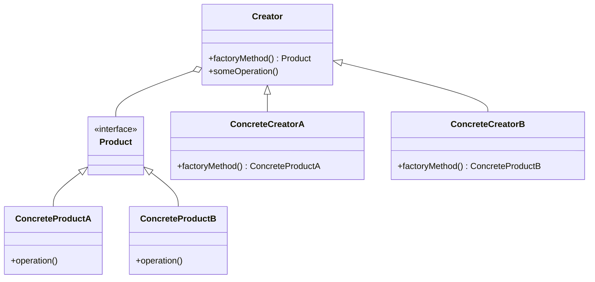
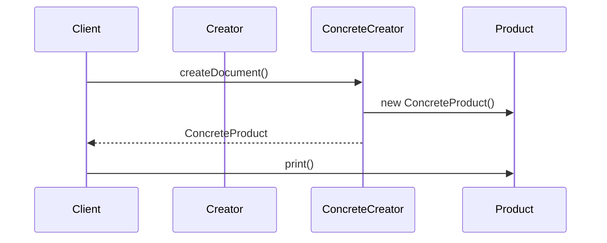

## 4.2 Factory Method Pattern

The Factory Method Pattern is a creational design pattern that provides an interface for creating objects in a superclass, but allows subclasses to alter the type of objects that will be created. This pattern is particularly useful when a class cannot anticipate the class of objects it must create or when a class wants its subclasses to specify the objects it creates.

### Understanding the Factory Method Pattern

#### Intent and Purpose

The primary intent of the Factory Method Pattern is to define an interface for creating an object, but let subclasses decide which class to instantiate. This pattern lets a class defer instantiation to subclasses, promoting flexibility and scalability in object-oriented design.

#### Problem Solved

In many scenarios, applications require flexibility in object creation. Hardcoding the instantiation of specific classes can lead to a rigid design that is difficult to extend or maintain. The Factory Method Pattern addresses this by allowing the creation logic to be encapsulated in a method, which can be overridden by subclasses to create specific types of objects. This approach adheres to the Open/Closed Principle, allowing the system to be open for extension but closed for modification.

### Participants in the Factory Method Pattern

The Factory Method Pattern involves several key participants:

1. **Product**: This is an interface or abstract class that defines the structure of the objects the factory method creates.
2. **ConcreteProduct**: These are the implementations of the Product interface. Each ConcreteProduct corresponds to a specific type of object that the factory method can produce.
3. **Creator**: This is an abstract class that declares the factory method, which returns an object of type Product. The Creator may also define a default implementation of the factory method that returns a default ConcreteProduct.
4. **ConcreteCreator**: These are subclasses of the Creator that override the factory method to return an instance of a ConcreteProduct.

### UML Class Diagram

To better understand the relationships between these participants, let's visualize them using a UML class diagram:



### How the Pattern Promotes Loose Coupling

The Factory Method Pattern promotes loose coupling by separating the code that creates objects from the code that uses them. This separation allows for flexibility in changing the types of objects created without affecting the client code. By adhering to the Open/Closed Principle, the pattern ensures that new product types can be introduced without modifying existing code, thus enhancing maintainability and scalability.

### Implementing the Factory Method Pattern in TypeScript

Let's explore how to implement the Factory Method Pattern in TypeScript with a practical example. We'll create a simple application that generates different types of documents.

#### Step 1: Define the Product Interface

First, we define the `Document` interface, which represents the Product in our pattern.

```typescript
// Document.ts
export interface Document {
    print(): void;
}
```

#### Step 2: Implement Concrete Products

Next, we implement two ConcreteProducts: `PDFDocument` and `WordDocument`.

```typescript
// PDFDocument.ts
import { Document } from './Document';

export class PDFDocument implements Document {
    print(): void {
        console.log('Printing PDF document...');
    }
}

// WordDocument.ts
import { Document } from './Document';

export class WordDocument implements Document {
    print(): void {
        console.log('Printing Word document...');
    }
}
```

#### Step 3: Create the Creator Abstract Class

Now, we define the `DocumentCreator` abstract class, which declares the factory method.

```typescript
// DocumentCreator.ts
import { Document } from './Document';

export abstract class DocumentCreator {
    abstract createDocument(): Document;

    someOperation(): void {
        const document = this.createDocument();
        document.print();
    }
}
```

#### Step 4: Implement Concrete Creators

Finally, we implement the ConcreteCreators: `PDFDocumentCreator` and `WordDocumentCreator`.

```typescript
// PDFDocumentCreator.ts
import { DocumentCreator } from './DocumentCreator';
import { PDFDocument } from './PDFDocument';

export class PDFDocumentCreator extends DocumentCreator {
    createDocument(): PDFDocument {
        return new PDFDocument();
    }
}

// WordDocumentCreator.ts
import { DocumentCreator } from './DocumentCreator';
import { WordDocument } from './WordDocument';

export class WordDocumentCreator extends DocumentCreator {
    createDocument(): WordDocument {
        return new WordDocument();
    }
}
```

#### Step 5: Using the Factory Method Pattern

Now, let's see how we can use these classes in our application.

```typescript
// Main.ts
import { PDFDocumentCreator } from './PDFDocumentCreator';
import { WordDocumentCreator } from './WordDocumentCreator';

function main() {
    const pdfCreator = new PDFDocumentCreator();
    pdfCreator.someOperation(); // Output: Printing PDF document...

    const wordCreator = new WordDocumentCreator();
    wordCreator.someOperation(); // Output: Printing Word document...
}

main();
```

### Try It Yourself

Experiment with the code by adding a new document type, such as `ExcelDocument`, and a corresponding `ExcelDocumentCreator`. Observe how the Factory Method Pattern allows you to extend the system without modifying existing code.

### Visualizing the Factory Method Pattern in Action

To further illustrate how the Factory Method Pattern works, let's visualize the process flow using a sequence diagram:



### Key Benefits of the Factory Method Pattern

- **Flexibility**: The pattern allows for flexibility in the types of objects created, enabling easy extension and modification of product types.
- **Loose Coupling**: By decoupling the creation of objects from their usage, the pattern promotes loose coupling and enhances maintainability.
- **Adherence to the Open/Closed Principle**: The pattern allows for the addition of new product types without modifying existing code, adhering to the Open/Closed Principle.

### Knowledge Check

- **What is the primary intent of the Factory Method Pattern?**
- **How does the Factory Method Pattern promote loose coupling?**
- **What are the key participants in the Factory Method Pattern?**

### Summary

The Factory Method Pattern is a powerful tool in the software engineer's toolkit, providing a flexible and scalable approach to object creation. By understanding and implementing this pattern, you can enhance the maintainability and scalability of your TypeScript applications.

### Further Reading

For more information on the Factory Method Pattern, consider exploring the following resources:

- [Design Patterns: Elements of Reusable Object-Oriented Software](https://en.wikipedia.org/wiki/Design_Patterns)
- [MDN Web Docs on Object-Oriented Programming](https://developer.mozilla.org/en-US/docs/Learn/JavaScript/Objects/Object-oriented_JS)

## Quiz Time!



### What is the primary intent of the Factory Method Pattern?

- [x] To define an interface for creating an object, but let subclasses decide which class to instantiate.
- [ ] To create a single instance of a class.
- [ ] To provide a simplified interface to a complex subsystem.
- [ ] To compose objects into tree structures to represent part-whole hierarchies.

> **Explanation:** The Factory Method Pattern's primary intent is to define an interface for creating an object, but let subclasses decide which class to instantiate.

### How does the Factory Method Pattern promote loose coupling?

- [x] By separating the code that creates objects from the code that uses them.
- [ ] By ensuring a class has only one instance.
- [ ] By providing a simplified interface to a complex subsystem.
- [ ] By composing objects into tree structures.

> **Explanation:** The Factory Method Pattern promotes loose coupling by separating the code that creates objects from the code that uses them, allowing for flexibility in changing the types of objects created without affecting the client code.

### Which participant in the Factory Method Pattern declares the factory method?

- [x] Creator
- [ ] ConcreteProduct
- [ ] Product
- [ ] ConcreteCreator

> **Explanation:** The Creator is the participant that declares the factory method in the Factory Method Pattern.

### What is the role of the ConcreteCreator in the Factory Method Pattern?

- [x] To override the factory method to return an instance of a ConcreteProduct.
- [ ] To define the structure of the objects the factory method creates.
- [ ] To provide a simplified interface to a complex subsystem.
- [ ] To ensure a class has only one instance.

> **Explanation:** The ConcreteCreator's role is to override the factory method to return an instance of a ConcreteProduct.

### What principle does the Factory Method Pattern adhere to?

- [x] Open/Closed Principle
- [ ] Single Responsibility Principle
- [ ] Interface Segregation Principle
- [ ] Dependency Inversion Principle

> **Explanation:** The Factory Method Pattern adheres to the Open/Closed Principle by allowing the system to be open for extension but closed for modification.

### What is the main advantage of using the Factory Method Pattern?

- [x] It allows for flexibility in the types of objects created.
- [ ] It ensures a class has only one instance.
- [ ] It provides a simplified interface to a complex subsystem.
- [ ] It composes objects into tree structures.

> **Explanation:** The main advantage of using the Factory Method Pattern is that it allows for flexibility in the types of objects created, enabling easy extension and modification of product types.

### In the Factory Method Pattern, what is the role of the Product participant?

- [x] To define the structure of the objects the factory method creates.
- [ ] To override the factory method to return an instance of a ConcreteProduct.
- [ ] To provide a simplified interface to a complex subsystem.
- [ ] To ensure a class has only one instance.

> **Explanation:** The Product participant's role is to define the structure of the objects the factory method creates.

### What is the purpose of the ConcreteProduct in the Factory Method Pattern?

- [x] To implement the Product interface.
- [ ] To declare the factory method.
- [ ] To provide a simplified interface to a complex subsystem.
- [ ] To ensure a class has only one instance.

> **Explanation:** The purpose of the ConcreteProduct is to implement the Product interface, providing specific implementations of the objects created by the factory method.

### True or False: The Factory Method Pattern allows for the addition of new product types without modifying existing code.

- [x] True
- [ ] False

> **Explanation:** True. The Factory Method Pattern allows for the addition of new product types without modifying existing code, adhering to the Open/Closed Principle.

### Which of the following is NOT a participant in the Factory Method Pattern?

- [ ] Product
- [ ] ConcreteProduct
- [ ] Creator
- [x] Singleton

> **Explanation:** Singleton is not a participant in the Factory Method Pattern. The participants are Product, ConcreteProduct, Creator, and ConcreteCreator.



Remember, this is just the beginning. As you progress, you'll build more complex and interactive applications. Keep experimenting, stay curious, and enjoy the journey!
