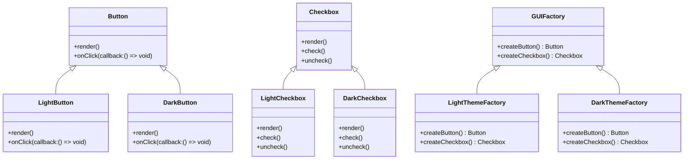

## 4.3.1 Implementing Abstract Factory in TypeScript

The Abstract Factory Pattern is a creational design pattern that provides an interface for creating families of related or dependent objects without specifying their concrete classes. This pattern is particularly useful when a system needs to be independent of how its objects are created, composed, and represented. In this section, we'll explore how to implement the Abstract Factory Pattern in TypeScript, leveraging its powerful features like interfaces and classes.

### Understanding the Abstract Factory Pattern

Before diving into the implementation, let's briefly understand the core concepts of the Abstract Factory Pattern:

- **Abstract Products**: Define interfaces or abstract classes for each type of product that can be created.
- **Concrete Products**: Implement the abstract product interfaces or extend the abstract classes to create specific product variants.
- **Abstract Factory**: An interface with methods for creating each type of product.
- **Concrete Factories**: Implement the Abstract Factory interface to produce a family of related products.
- **Client**: Uses the factories to create objects but remains independent of the concrete classes.

### Step-by-Step Implementation in TypeScript

Let's walk through the implementation of the Abstract Factory Pattern in TypeScript with a practical example. We'll create a simple GUI toolkit that supports different themes (e.g., Light and Dark). Each theme will have its own set of UI components like buttons and checkboxes.

#### Step 1: Define Abstract Product Interfaces

First, define interfaces for the abstract products. These interfaces will declare the methods that all product variants must implement.

```typescript
// Abstract product interface for Buttons
interface Button {
    render(): void;
    onClick(callback: () => void): void;
}

// Abstract product interface for Checkboxes
interface Checkbox {
    render(): void;
    check(): void;
    uncheck(): void;
}
```

#### Step 2: Create Concrete Product Classes

Next, implement concrete product classes for each theme. These classes will implement the abstract product interfaces.

```typescript
// Concrete product class for Light Button
class LightButton implements Button {
    render(): void {
        console.log("Rendering a light-themed button.");
    }

    onClick(callback: () => void): void {
        console.log("Light button clicked.");
        callback();
    }
}

// Concrete product class for Dark Button
class DarkButton implements Button {
    render(): void {
        console.log("Rendering a dark-themed button.");
    }

    onClick(callback: () => void): void {
        console.log("Dark button clicked.");
        callback();
    }
}

// Concrete product class for Light Checkbox
class LightCheckbox implements Checkbox {
    render(): void {
        console.log("Rendering a light-themed checkbox.");
    }

    check(): void {
        console.log("Light checkbox checked.");
    }

    uncheck(): void {
        console.log("Light checkbox unchecked.");
    }
}

// Concrete product class for Dark Checkbox
class DarkCheckbox implements Checkbox {
    render(): void {
        console.log("Rendering a dark-themed checkbox.");
    }

    check(): void {
        console.log("Dark checkbox checked.");
    }

    uncheck(): void {
        console.log("Dark checkbox unchecked.");
    }
}
```

#### Step 3: Define the Abstract Factory Interface

Create an interface for the Abstract Factory. This interface will declare methods for creating each type of product.

```typescript
// Abstract factory interface
interface GUIFactory {
    createButton(): Button;
    createCheckbox(): Checkbox;
}
```

#### Step 4: Implement Concrete Factory Classes

Implement concrete factory classes for each theme. These classes will produce the appropriate product variants.

```typescript
// Concrete factory class for Light theme
class LightThemeFactory implements GUIFactory {
    createButton(): Button {
        return new LightButton();
    }

    createCheckbox(): Checkbox {
        return new LightCheckbox();
    }
}

// Concrete factory class for Dark theme
class DarkThemeFactory implements GUIFactory {
    createButton(): Button {
        return new DarkButton();
    }

    createCheckbox(): Checkbox {
        return new DarkCheckbox();
    }
}
```

#### Step 5: Use Dependency Injection to Provide the Appropriate Factory

To keep the client code independent of the concrete classes, use dependency injection to provide the appropriate factory.

```typescript
// Client code
class Application {
    private button: Button;
    private checkbox: Checkbox;

    constructor(factory: GUIFactory) {
        this.button = factory.createButton();
        this.checkbox = factory.createCheckbox();
    }

    render(): void {
        this.button.render();
        this.checkbox.render();
    }
}

// Usage
const lightFactory: GUIFactory = new LightThemeFactory();
const darkFactory: GUIFactory = new DarkThemeFactory();

const lightApp = new Application(lightFactory);
lightApp.render();

const darkApp = new Application(darkFactory);
darkApp.render();
```

### Leveraging TypeScript Features

TypeScript's features such as interfaces, classes, and access modifiers play a crucial role in implementing the Abstract Factory Pattern:

- **Interfaces**: Define contracts for the products and factories, ensuring consistency across different implementations.
- **Classes**: Implement concrete products and factories, encapsulating the logic specific to each variant.
- **Access Modifiers**: Control the visibility of class members, enforcing encapsulation and hiding implementation details.

### Keeping Client Code Independent

One of the primary goals of the Abstract Factory Pattern is to keep client code independent of concrete classes. By relying on interfaces and abstract classes, we ensure that the client interacts only with the abstract layer, making it easy to switch between different product families without modifying the client code.

### Visualizing the Abstract Factory Pattern

To better understand the relationships between the components of the Abstract Factory Pattern, let's visualize it using a class diagram.



### Try It Yourself

Experiment with the code examples by adding new product types or themes. For instance, create a "HighContrast" theme with its own set of buttons and checkboxes. This exercise will help reinforce your understanding of the Abstract Factory Pattern and its flexibility in accommodating new product families.

### Key Takeaways

- **Abstract Factory Pattern**: Provides an interface for creating families of related objects without specifying their concrete classes.
- **TypeScript Features**: Leverage interfaces, classes, and access modifiers to implement the pattern.
- **Dependency Injection**: Use dependency injection to provide the appropriate factory, keeping client code independent of concrete classes.
- **Flexibility**: Easily extend the system with new product families by adding new concrete factories and products.

### Further Reading

For more information on the Abstract Factory Pattern and its applications, consider exploring the following resources:

- [Design Patterns: Elements of Reusable Object-Oriented Software](https://en.wikipedia.org/wiki/Design_Patterns) by Erich Gamma, Richard Helm, Ralph Johnson, and John Vlissides.
- [TypeScript Handbook](https://www.typescriptlang.org/docs/handbook/intro.html) for a deeper understanding of TypeScript features.

### Embrace the Journey

Remember, mastering design patterns is a journey. As you continue to explore and implement different patterns, you'll gain a deeper understanding of how to create scalable, maintainable, and flexible software systems. Keep experimenting, stay curious, and enjoy the journey!

## Quiz Time!



### What is the primary purpose of the Abstract Factory Pattern?

- [x] To provide an interface for creating families of related objects without specifying their concrete classes.
- [ ] To create a single instance of a class.
- [ ] To define a one-to-many dependency between objects.
- [ ] To encapsulate a request as an object.

> **Explanation:** The Abstract Factory Pattern provides an interface for creating families of related objects without specifying their concrete classes, allowing for flexibility and independence from concrete implementations.

### Which TypeScript feature is crucial for defining contracts in the Abstract Factory Pattern?

- [x] Interfaces
- [ ] Generics
- [ ] Decorators
- [ ] Mixins

> **Explanation:** Interfaces are crucial in TypeScript for defining contracts that ensure consistency across different implementations in the Abstract Factory Pattern.

### How does the Abstract Factory Pattern help in keeping client code independent?

- [x] By using interfaces and abstract classes to interact with the abstract layer instead of concrete classes.
- [ ] By using global variables to manage dependencies.
- [ ] By hardcoding the product creation logic in the client.
- [ ] By using inheritance to create product families.

> **Explanation:** The Abstract Factory Pattern uses interfaces and abstract classes to keep client code independent of concrete classes, allowing for easy switching between product families.

### What role do concrete factories play in the Abstract Factory Pattern?

- [x] They implement the Abstract Factory interface to produce a family of related products.
- [ ] They define the abstract product interfaces.
- [ ] They manage the lifecycle of the products.
- [ ] They encapsulate the logic for rendering UI components.

> **Explanation:** Concrete factories implement the Abstract Factory interface to produce a family of related products, providing specific implementations for each product type.

### In the provided example, what method is used to render a button?

- [x] render()
- [ ] onClick()
- [ ] check()
- [ ] uncheck()

> **Explanation:** The `render()` method is used to render a button in the provided example, as defined in the Button interface and implemented in the concrete product classes.

### What is the benefit of using dependency injection in the Abstract Factory Pattern?

- [x] It allows the client to be independent of concrete factories and products.
- [ ] It simplifies the implementation of concrete products.
- [ ] It reduces the number of classes needed.
- [ ] It ensures that only one instance of a product is created.

> **Explanation:** Dependency injection allows the client to be independent of concrete factories and products, promoting flexibility and ease of maintenance.

### Which of the following is NOT a component of the Abstract Factory Pattern?

- [x] Singleton
- [ ] Abstract Product
- [ ] Concrete Factory
- [ ] Abstract Factory

> **Explanation:** Singleton is not a component of the Abstract Factory Pattern. The pattern consists of Abstract Products, Concrete Products, Abstract Factory, and Concrete Factory.

### How can new product families be added in the Abstract Factory Pattern?

- [x] By creating new concrete factories and products.
- [ ] By modifying existing concrete factories.
- [ ] By adding new methods to the Abstract Factory interface.
- [ ] By changing the client code.

> **Explanation:** New product families can be added by creating new concrete factories and products, without modifying existing code, thus adhering to the open/closed principle.

### What does the `createButton()` method in the Abstract Factory interface return?

- [x] Button
- [ ] Checkbox
- [ ] GUIFactory
- [ ] Application

> **Explanation:** The `createButton()` method in the Abstract Factory interface returns an instance of the Button interface, as per the contract defined by the pattern.

### True or False: The Abstract Factory Pattern can be used to create a single instance of a class.

- [ ] True
- [x] False

> **Explanation:** False. The Abstract Factory Pattern is used to create families of related objects, not to create a single instance of a class. That is the purpose of the Singleton Pattern.


