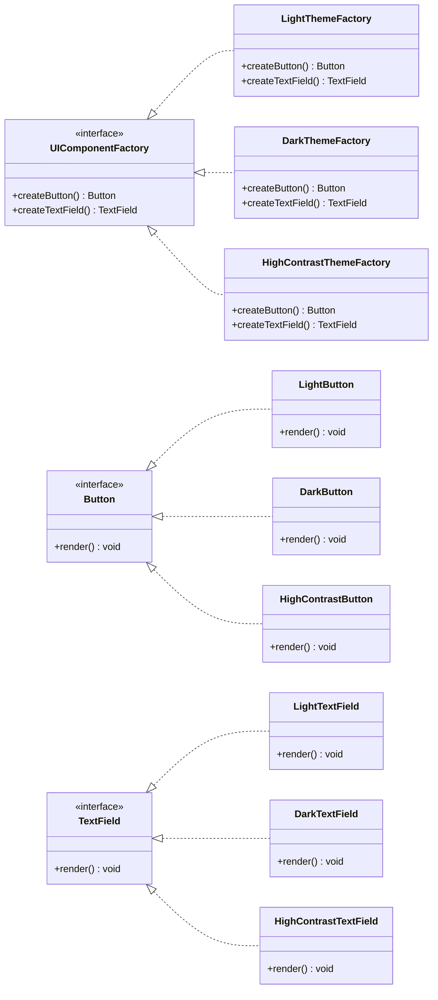

## 4.3.2 Managing Multiple Product Families

In the realm of software design, the Abstract Factory Pattern stands out as a robust solution for managing multiple product families. This pattern is particularly useful when dealing with scenarios that require interchangeable families of products, ensuring that products within a family are compatible with each other. In this section, we will delve into the intricacies of managing multiple product families using the Abstract Factory Pattern in TypeScript, providing detailed examples and addressing potential challenges.

### Understanding Product Families

Before we dive into the Abstract Factory Pattern, let's clarify what we mean by "product families." A product family is a group of related products that are designed to work together seamlessly. For instance, consider a UI toolkit that offers different themes. Each theme represents a product family, consisting of various UI components like buttons, text fields, and dialogs that share a consistent look and feel.

#### Scenarios Involving Multiple Product Families

1. **UI Themes**: Different themes in a UI toolkit, such as light and dark modes, where each theme provides a consistent set of UI components.
2. **Database Providers**: Supporting multiple database systems (e.g., SQL, NoSQL) where each provider offers a set of operations tailored to its database type.
3. **Operating Systems**: Software that needs to run on different operating systems, each with its own set of APIs and services.

### The Role of the Abstract Factory Pattern

The Abstract Factory Pattern provides an interface for creating families of related or dependent objects without specifying their concrete classes. This pattern is particularly beneficial when a system needs to be independent of how its objects are created, composed, and represented.

#### Key Concepts

- **Abstract Factory**: Declares an interface for operations that create abstract product objects.
- **Concrete Factory**: Implements the operations to create concrete product objects.
- **Abstract Product**: Declares an interface for a type of product object.
- **Concrete Product**: Implements the abstract product interface.

### Implementing the Abstract Factory Pattern in TypeScript

Let's explore how to implement the Abstract Factory Pattern in TypeScript with a focus on managing multiple product families.

#### Step 1: Define Abstract Products

First, we define interfaces for the abstract products. These interfaces will ensure that all concrete products adhere to a common contract.

```typescript
// Abstract product interfaces
interface Button {
    render(): void;
}

interface TextField {
    render(): void;
}
```

#### Step 2: Create Concrete Products

Next, we implement concrete products for each product family. Each product family will have its own set of concrete products.

```typescript
// Concrete products for the Light theme
class LightButton implements Button {
    render(): void {
        console.log('Rendering a light-themed button');
    }
}

class LightTextField implements TextField {
    render(): void {
        console.log('Rendering a light-themed text field');
    }
}

// Concrete products for the Dark theme
class DarkButton implements Button {
    render(): void {
        console.log('Rendering a dark-themed button');
    }
}

class DarkTextField implements TextField {
    render(): void {
        console.log('Rendering a dark-themed text field');
    }
}
```

#### Step 3: Define the Abstract Factory

The abstract factory interface declares methods for creating each type of product.

```typescript
// Abstract factory interface
interface UIComponentFactory {
    createButton(): Button;
    createTextField(): TextField;
}
```

#### Step 4: Implement Concrete Factories

Concrete factories implement the abstract factory interface to create products of a specific family.

```typescript
// Concrete factory for the Light theme
class LightThemeFactory implements UIComponentFactory {
    createButton(): Button {
        return new LightButton();
    }

    createTextField(): TextField {
        return new LightTextField();
    }
}

// Concrete factory for the Dark theme
class DarkThemeFactory implements UIComponentFactory {
    createButton(): Button {
        return new DarkButton();
    }

    createTextField(): TextField {
        return new DarkTextField();
    }
}
```

#### Step 5: Client Code

The client code works with factories and products through abstract interfaces. This allows the client to switch between different product families without changing its code.

```typescript
// Client code
function renderUI(factory: UIComponentFactory) {
    const button = factory.createButton();
    const textField = factory.createTextField();

    button.render();
    textField.render();
}

// Using the Light theme
const lightFactory = new LightThemeFactory();
renderUI(lightFactory);

// Using the Dark theme
const darkFactory = new DarkThemeFactory();
renderUI(darkFactory);
```

### Adding New Product Families

One of the significant advantages of the Abstract Factory Pattern is its extensibility. Adding a new product family involves creating a new concrete factory and corresponding concrete products without modifying existing factories or client code.

#### Example: Adding a High Contrast Theme

To add a new "High Contrast" theme, we simply create new concrete product classes and a new concrete factory.

```typescript
// Concrete products for the High Contrast theme
class HighContrastButton implements Button {
    render(): void {
        console.log('Rendering a high-contrast button');
    }
}

class HighContrastTextField implements TextField {
    render(): void {
        console.log('Rendering a high-contrast text field');
    }
}

// Concrete factory for the High Contrast theme
class HighContrastThemeFactory implements UIComponentFactory {
    createButton(): Button {
        return new HighContrastButton();
    }

    createTextField(): TextField {
        return new HighContrastTextField();
    }
}

// Using the High Contrast theme
const highContrastFactory = new HighContrastThemeFactory();
renderUI(highContrastFactory);
```

### Ensuring Compatibility and Consistency

The Abstract Factory Pattern enforces consistency by ensuring that products within a family are compatible. This is achieved by having each concrete factory produce a set of products that are designed to work together.

#### Example: Ensuring Consistent UI Themes

In our UI toolkit example, each theme (product family) provides a consistent look and feel across all UI components. This consistency is maintained because the concrete factory for each theme produces components that are designed to work together.

### Challenges and Mitigation Strategies

While the Abstract Factory Pattern offers numerous benefits, managing multiple product families can present challenges:

1. **Complexity**: As the number of product families grows, the number of concrete factories and products increases, leading to more complex codebases.
   - **Mitigation**: Use design tools and documentation to keep track of product families and their relationships.

2. **Scalability**: Adding new product families can lead to a proliferation of classes.
   - **Mitigation**: Consider using code generation tools to automate the creation of new product families.

3. **Testing**: Ensuring that all product families are tested thoroughly can be challenging.
   - **Mitigation**: Implement automated tests that cover all product families and their interactions.

### Visualizing the Abstract Factory Pattern

To better understand the relationships between factories and products, let's visualize the Abstract Factory Pattern using a class diagram.



This diagram illustrates how the abstract factory interface relates to concrete factories and how abstract products relate to concrete products.

### Try It Yourself

Now that we've explored the Abstract Factory Pattern, try modifying the code examples to add a new product type, such as a `Checkbox`, to each theme. This exercise will help reinforce your understanding of how the pattern manages multiple product families.

### Knowledge Check

To ensure you've grasped the key concepts, consider the following questions:

- How does the Abstract Factory Pattern ensure compatibility among products within a family?
- What are the benefits of using the Abstract Factory Pattern when managing multiple product families?
- How can you add a new product family without modifying existing client code?

### Conclusion

The Abstract Factory Pattern is a powerful tool for managing multiple product families in TypeScript applications. By providing a consistent interface for creating related products, it ensures compatibility and consistency across product families. While there are challenges in managing multiple product families, the pattern's extensibility and flexibility make it an invaluable asset in software design.

Remember, mastering design patterns like the Abstract Factory Pattern is a journey. As you continue to explore and experiment with these patterns, you'll develop a deeper understanding of how to create scalable and maintainable software systems.

## Quiz Time!



### What is a product family in the context of the Abstract Factory Pattern?

- [x] A group of related products designed to work together
- [ ] A single product with multiple variations
- [ ] A collection of unrelated products
- [ ] A set of products that are incompatible with each other

> **Explanation:** A product family consists of related products that are designed to work together seamlessly, ensuring compatibility and consistency.

### How does the Abstract Factory Pattern ensure compatibility among products within a family?

- [x] By having each concrete factory produce a set of products designed to work together
- [ ] By using a single class for all products
- [ ] By enforcing strict type checking
- [ ] By using global variables to manage product states

> **Explanation:** Each concrete factory in the Abstract Factory Pattern produces a set of products that are designed to be compatible with each other.

### What is the primary advantage of using the Abstract Factory Pattern?

- [x] It allows for the creation of interchangeable product families without modifying client code
- [ ] It simplifies the code by reducing the number of classes
- [ ] It eliminates the need for interfaces
- [ ] It allows for dynamic creation of classes at runtime

> **Explanation:** The Abstract Factory Pattern enables the creation of interchangeable product families, allowing the client to switch between them without code changes.

### What is required to add a new product family using the Abstract Factory Pattern?

- [x] Create a new concrete factory and corresponding concrete products
- [ ] Modify existing factories
- [ ] Change the client code
- [ ] Use reflection to dynamically generate products

> **Explanation:** Adding a new product family involves creating a new concrete factory and corresponding products, without modifying existing factories or client code.

### What challenge might arise when managing multiple product families?

- [x] Increased complexity and class proliferation
- [ ] Difficulty in defining interfaces
- [ ] Lack of type safety
- [ ] Inability to create new products

> **Explanation:** As the number of product families grows, the number of classes increases, leading to more complex codebases.

### How can the complexity of managing multiple product families be mitigated?

- [x] Use design tools and documentation to track product families
- [ ] Avoid using interfaces
- [ ] Use global variables to manage product states
- [ ] Limit the number of product families to two

> **Explanation:** Design tools and documentation can help manage the complexity by keeping track of product families and their relationships.

### What is a potential benefit of using code generation tools in the Abstract Factory Pattern?

- [x] Automating the creation of new product families
- [ ] Reducing the need for testing
- [ ] Eliminating the need for interfaces
- [ ] Allowing for dynamic class creation at runtime

> **Explanation:** Code generation tools can automate the creation of new product families, reducing manual effort and potential errors.

### What is the role of the abstract factory interface?

- [x] To declare methods for creating each type of product
- [ ] To implement the concrete product classes
- [ ] To manage the state of all products
- [ ] To dynamically generate product families at runtime

> **Explanation:** The abstract factory interface declares methods for creating each type of product, ensuring a consistent interface for all factories.

### How does the Abstract Factory Pattern contribute to scalability?

- [x] By allowing new product families to be added without modifying existing code
- [ ] By reducing the number of classes required
- [ ] By eliminating the need for interfaces
- [ ] By using global variables to manage product states

> **Explanation:** The pattern's extensibility allows new product families to be added seamlessly, contributing to scalability.

### True or False: The Abstract Factory Pattern eliminates the need for testing product families.

- [ ] True
- [x] False

> **Explanation:** While the Abstract Factory Pattern provides a structured approach to managing product families, thorough testing is still necessary to ensure compatibility and functionality.


