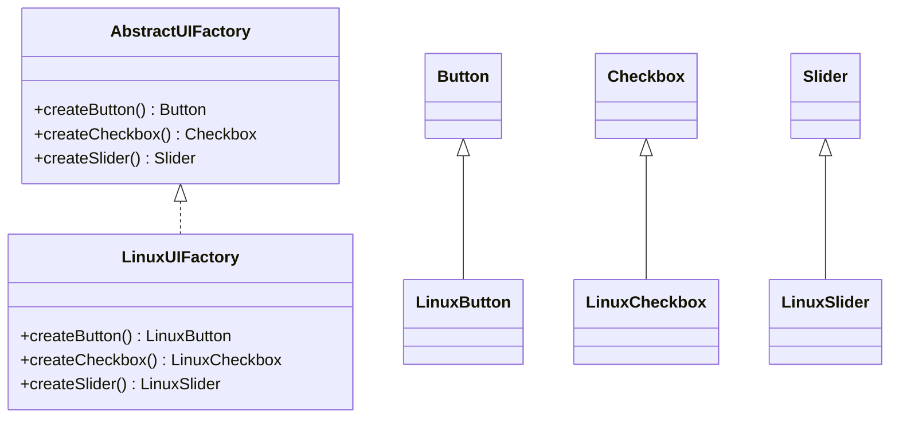

## 4.3.3 Extensibility in Abstract Factories

In the realm of software design patterns, the Abstract Factory Pattern stands out for its ability to create families of related objects without specifying their concrete classes. This pattern is particularly powerful when it comes to extensibility, allowing developers to introduce new product families or types with minimal disruption to existing code. In this section, we'll delve into how the Abstract Factory Pattern facilitates extensibility, ensuring adherence to the Open/Closed Principle, which states that software entities should be open for extension but closed for modification.

### Adding a New Product Family

When we talk about adding a new product family within the Abstract Factory Pattern, we're referring to the introduction of a new set of related products that can be created by a factory. This process involves defining new `ConcreteFactory` and `ConcreteProduct` classes, ensuring they implement the existing interfaces.

#### Step-by-Step Process

1. **Define New Product Interfaces**: Start by defining interfaces for the new product family. These interfaces will dictate the contract that all concrete products must adhere to.

2. **Implement Concrete Products**: Create classes that implement the new product interfaces. These classes represent the concrete products within the new family.

3. **Create a New Concrete Factory**: Develop a new factory class that implements the `AbstractFactory` interface. This factory will be responsible for creating instances of the new product family.

4. **Integrate with Existing System**: Ensure that the new factory and products integrate seamlessly with the existing system by adhering to the established interfaces.

#### Example

Let's consider a scenario where we have an existing system that creates UI components for Windows and MacOS. We want to introduce a new product family for Linux.

```typescript
// Step 1: Define new product interfaces
interface LinuxButton {
    click(): void;
}

interface LinuxCheckbox {
    toggle(): void;
}

// Step 2: Implement concrete products
class LinuxButtonImpl implements LinuxButton {
    click(): void {
        console.log("Linux Button Clicked!");
    }
}

class LinuxCheckboxImpl implements LinuxCheckbox {
    toggle(): void {
        console.log("Linux Checkbox Toggled!");
    }
}

// Step 3: Create a new concrete factory
class LinuxUIFactory implements AbstractUIFactory {
    createButton(): LinuxButton {
        return new LinuxButtonImpl();
    }

    createCheckbox(): LinuxCheckbox {
        return new LinuxCheckboxImpl();
    }
}

// Step 4: Integrate with existing system
interface AbstractUIFactory {
    createButton(): LinuxButton;
    createCheckbox(): LinuxCheckbox;
}
```

### Adding New Product Types

Adding new product types involves introducing new methods in the `AbstractFactory` interface. This can affect existing factories and products, but with careful planning, the impact can be minimized.

#### Strategies for Minimizing Impact

1. **Default Implementations**: Provide default implementations for new methods in the `AbstractFactory` interface. This ensures that existing factories are not immediately affected by the addition of new methods.

2. **Abstract Methods**: Use abstract methods to enforce the implementation of new product types in all concrete factories. This approach requires updating all existing factories but ensures consistency.

3. **Versioning**: Introduce versioning in your factories, allowing older versions to remain unchanged while new versions incorporate the new product types.

#### Example

Continuing with our UI components example, let's add a new product type: `Slider`.

```typescript
// Extend the AbstractFactory interface
interface AbstractUIFactory {
    createButton(): Button;
    createCheckbox(): Checkbox;
    createSlider(): Slider; // New product type
}

// Implement the new product type
interface Slider {
    slide(): void;
}

class LinuxSliderImpl implements Slider {
    slide(): void {
        console.log("Linux Slider Sliding!");
    }
}

// Update the concrete factory
class LinuxUIFactory implements AbstractUIFactory {
    createButton(): LinuxButton {
        return new LinuxButtonImpl();
    }

    createCheckbox(): LinuxCheckbox {
        return new LinuxCheckboxImpl();
    }

    createSlider(): Slider {
        return new LinuxSliderImpl();
    }
}
```

### Extending Factories: Implications for the Codebase

Extending factories by adding new product families or types has several implications for the codebase:

1. **Adherence to the Open/Closed Principle**: By using interfaces and abstract classes, the Abstract Factory Pattern allows for extensions without modifying existing code, adhering to the Open/Closed Principle.

2. **Increased Flexibility**: New product families or types can be added with minimal disruption, increasing the flexibility of the codebase.

3. **Potential for Code Duplication**: Without careful planning, extending factories can lead to code duplication. It's important to refactor common logic into shared components.

4. **Testing and Maintenance**: New product families or types require additional testing and maintenance. Automated tests can help ensure that new additions do not introduce bugs.

### Visualizing the Abstract Factory Pattern

To better understand the relationships between the various components of the Abstract Factory Pattern, let's visualize the pattern using a class diagram.



### Try It Yourself

To solidify your understanding of the Abstract Factory Pattern's extensibility, try modifying the code examples provided:

- **Add a New Product Family**: Introduce a new product family for a different operating system, such as Android.
- **Add a New Product Type**: Implement a new product type, like `RadioButton`, across all existing product families.

### Knowledge Check

- **Question**: What are the benefits of using default implementations when adding new product types?
- **Challenge**: Refactor the existing code to minimize duplication when adding new product families.

### Embrace the Journey

Remember, the journey of mastering design patterns is ongoing. As you continue to explore and implement the Abstract Factory Pattern, you'll gain deeper insights into its flexibility and power. Keep experimenting, stay curious, and enjoy the process of creating scalable and maintainable software.

## Quiz Time!



### What is the primary benefit of using the Abstract Factory Pattern?

- [x] It allows for the creation of families of related objects without specifying their concrete classes.
- [ ] It simplifies the creation of a single object.
- [ ] It reduces the need for interfaces.
- [ ] It eliminates the need for concrete classes.

> **Explanation:** The Abstract Factory Pattern is designed to create families of related objects without specifying their concrete classes, promoting extensibility and adherence to the Open/Closed Principle.

### How can you add a new product family in the Abstract Factory Pattern?

- [x] By defining new `ConcreteFactory` and `ConcreteProduct` classes that implement existing interfaces.
- [ ] By modifying existing concrete classes.
- [ ] By removing existing product families.
- [ ] By using global variables.

> **Explanation:** Adding a new product family involves defining new `ConcreteFactory` and `ConcreteProduct` classes that adhere to the established interfaces, ensuring seamless integration.

### What is a strategy to minimize the impact of adding new product types?

- [x] Provide default implementations for new methods in the `AbstractFactory` interface.
- [ ] Remove existing product types.
- [ ] Use global variables to manage new types.
- [ ] Avoid using interfaces.

> **Explanation:** Providing default implementations for new methods in the `AbstractFactory` interface helps minimize the impact on existing factories by ensuring backward compatibility.

### What principle does the Abstract Factory Pattern adhere to?

- [x] Open/Closed Principle
- [ ] Single Responsibility Principle
- [ ] Liskov Substitution Principle
- [ ] Interface Segregation Principle

> **Explanation:** The Abstract Factory Pattern adheres to the Open/Closed Principle, allowing software entities to be open for extension but closed for modification.

### What is a potential downside of extending factories?

- [x] Potential for code duplication
- [ ] Reduced flexibility
- [ ] Increased complexity
- [ ] Decreased maintainability

> **Explanation:** Without careful planning, extending factories can lead to code duplication. It's important to refactor common logic into shared components to avoid this issue.

### How can you visualize the relationships in the Abstract Factory Pattern?

- [x] Using a class diagram
- [ ] Using a flowchart
- [ ] Using a sequence diagram
- [ ] Using a pie chart

> **Explanation:** A class diagram is an effective way to visualize the relationships between the various components of the Abstract Factory Pattern, such as interfaces and concrete classes.

### What is a benefit of adding new product families?

- [x] Increased flexibility
- [ ] Decreased testing requirements
- [ ] Reduced code complexity
- [ ] Elimination of interfaces

> **Explanation:** Adding new product families increases the flexibility of the codebase, allowing for the seamless introduction of new features and products.

### What is a key takeaway from the Abstract Factory Pattern?

- [x] It promotes extensibility and adherence to the Open/Closed Principle.
- [ ] It simplifies the creation of a single object.
- [ ] It eliminates the need for concrete classes.
- [ ] It reduces the need for interfaces.

> **Explanation:** The Abstract Factory Pattern promotes extensibility and adherence to the Open/Closed Principle, allowing for the seamless addition of new product families and types.

### What should you do to solidify your understanding of the Abstract Factory Pattern?

- [x] Try modifying the code examples provided.
- [ ] Avoid experimenting with the code.
- [ ] Focus only on theoretical concepts.
- [ ] Ignore the pattern's extensibility features.

> **Explanation:** To solidify your understanding, it's important to experiment with the code examples provided, such as adding new product families or types.

### True or False: The Abstract Factory Pattern eliminates the need for interfaces.

- [ ] True
- [x] False

> **Explanation:** False. The Abstract Factory Pattern relies on interfaces to define the contracts for product families and types, ensuring extensibility and adherence to design principles.


