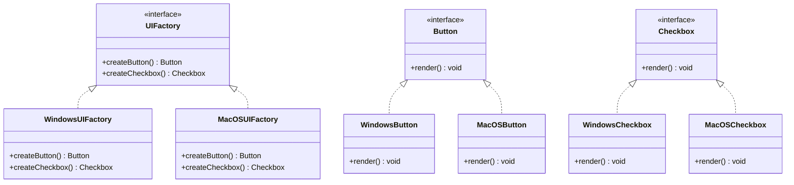

## 4.3.4 Use Cases and Examples

The Abstract Factory Pattern is a powerful creational design pattern that provides an interface for creating families of related or dependent objects without specifying their concrete classes. This pattern is particularly useful in scenarios where a system must be independent of how its objects are created, composed, and represented. In this section, we will explore practical use cases where the Abstract Factory Pattern shines, including cross-platform UI libraries, data access layers, and game development. We will also discuss the trade-offs involved in using this pattern and provide code examples in TypeScript to illustrate its application.

### Cross-Platform UI Libraries

#### Problem Context

In the realm of cross-platform development, creating user interfaces that work seamlessly across different operating systems is a common challenge. Each platform may have its own set of UI components, behaviors, and aesthetics. For instance, a button on Windows might look and behave differently from a button on macOS or Linux.

#### How Abstract Factory Solves the Problem

The Abstract Factory Pattern allows developers to encapsulate the creation of platform-specific UI components within a factory interface. This way, the client code can create UI components without knowing the specifics of the platform. The pattern ensures that the UI components created are consistent with the platform's look and feel.

```typescript
// Abstract Factory Interface
interface UIFactory {
    createButton(): Button;
    createCheckbox(): Checkbox;
}

// Concrete Factory for Windows
class WindowsUIFactory implements UIFactory {
    createButton(): Button {
        return new WindowsButton();
    }
    createCheckbox(): Checkbox {
        return new WindowsCheckbox();
    }
}

// Concrete Factory for macOS
class MacOSUIFactory implements UIFactory {
    createButton(): Button {
        return new MacOSButton();
    }
    createCheckbox(): Checkbox {
        return new MacOSCheckbox();
    }
}

// Abstract Product Interfaces
interface Button {
    render(): void;
}

interface Checkbox {
    render(): void;
}

// Concrete Products for Windows
class WindowsButton implements Button {
    render(): void {
        console.log('Rendering a Windows button.');
    }
}

class WindowsCheckbox implements Checkbox {
    render(): void {
        console.log('Rendering a Windows checkbox.');
    }
}

// Concrete Products for macOS
class MacOSButton implements Button {
    render(): void {
        console.log('Rendering a macOS button.');
    }
}

class MacOSCheckbox implements Checkbox {
    render(): void {
        console.log('Rendering a macOS checkbox.');
    }
}

// Client Code
function renderUI(factory: UIFactory) {
    const button = factory.createButton();
    const checkbox = factory.createCheckbox();
    button.render();
    checkbox.render();
}

// Usage
const windowsFactory = new WindowsUIFactory();
renderUI(windowsFactory);

const macFactory = new MacOSUIFactory();
renderUI(macFactory);
```

In this example, the `UIFactory` interface defines methods for creating UI components. Concrete factories like `WindowsUIFactory` and `MacOSUIFactory` implement these methods to produce platform-specific components. The client code uses the factory interface to create and render UI components without being tied to any specific platform.

#### Trade-offs

- **Increased Complexity**: Introducing the Abstract Factory Pattern can increase the complexity of the codebase, as it requires creating multiple classes and interfaces.
- **Cost of Adding New Product Types**: Adding new product types requires changes to all factory classes, which can be cumbersome in large systems.

### Data Access Layers

#### Problem Context

In applications that need to support multiple database systems, such as MySQL, PostgreSQL, or MongoDB, abstracting the data access layer is crucial. Each database system has its own API and query language, making it challenging to switch between them or support multiple systems simultaneously.

#### How Abstract Factory Solves the Problem

The Abstract Factory Pattern can be used to create a data access layer that is independent of the underlying database system. By defining a factory interface for creating database connections and queries, the application can switch between different databases without modifying the client code.

```typescript
// Abstract Factory Interface
interface DatabaseFactory {
    createConnection(): Connection;
    createQuery(): Query;
}

// Concrete Factory for MySQL
class MySQLFactory implements DatabaseFactory {
    createConnection(): Connection {
        return new MySQLConnection();
    }
    createQuery(): Query {
        return new MySQLQuery();
    }
}

// Concrete Factory for PostgreSQL
class PostgreSQLFactory implements DatabaseFactory {
    createConnection(): Connection {
        return new PostgreSQLConnection();
    }
    createQuery(): Query {
        return new PostgreSQLQuery();
    }
}

// Abstract Product Interfaces
interface Connection {
    connect(): void;
}

interface Query {
    execute(): void;
}

// Concrete Products for MySQL
class MySQLConnection implements Connection {
    connect(): void {
        console.log('Connecting to MySQL database.');
    }
}

class MySQLQuery implements Query {
    execute(): void {
        console.log('Executing MySQL query.');
    }
}

// Concrete Products for PostgreSQL
class PostgreSQLConnection implements Connection {
    connect(): void {
        console.log('Connecting to PostgreSQL database.');
    }
}

class PostgreSQLQuery implements Query {
    execute(): void {
        console.log('Executing PostgreSQL query.');
    }
}

// Client Code
function performDatabaseOperations(factory: DatabaseFactory) {
    const connection = factory.createConnection();
    const query = factory.createQuery();
    connection.connect();
    query.execute();
}

// Usage
const mySQLFactory = new MySQLFactory();
performDatabaseOperations(mySQLFactory);

const postgreSQLFactory = new PostgreSQLFactory();
performDatabaseOperations(postgreSQLFactory);
```

In this example, the `DatabaseFactory` interface defines methods for creating database connections and queries. Concrete factories like `MySQLFactory` and `PostgreSQLFactory` implement these methods to produce database-specific components. The client code uses the factory interface to perform database operations without being tied to any specific database system.

#### Trade-offs

- **Increased Complexity**: Similar to the UI example, the Abstract Factory Pattern introduces additional complexity by requiring multiple classes and interfaces.
- **Maintenance Overhead**: Supporting multiple database systems can increase the maintenance overhead, as changes to the database schema or API may require updates to all factory classes.

### Game Development

#### Problem Context

In game development, creating different sets of game objects based on the game level or theme is a common requirement. For example, a game might have different types of enemies, obstacles, and power-ups for each level or theme.

#### How Abstract Factory Solves the Problem

The Abstract Factory Pattern can be used to encapsulate the creation of game objects within a factory interface. This allows the game to switch between different sets of game objects without modifying the client code.

```typescript
// Abstract Factory Interface
interface GameObjectFactory {
    createEnemy(): Enemy;
    createObstacle(): Obstacle;
    createPowerUp(): PowerUp;
}

// Concrete Factory for Space Theme
class SpaceThemeFactory implements GameObjectFactory {
    createEnemy(): Enemy {
        return new Alien();
    }
    createObstacle(): Obstacle {
        return new Asteroid();
    }
    createPowerUp(): PowerUp {
        return new SpaceFuel();
    }
}

// Concrete Factory for Medieval Theme
class MedievalThemeFactory implements GameObjectFactory {
    createEnemy(): Enemy {
        return new Dragon();
    }
    createObstacle(): Obstacle {
        return new CastleWall();
    }
    createPowerUp(): PowerUp {
        return new MagicPotion();
    }
}

// Abstract Product Interfaces
interface Enemy {
    attack(): void;
}

interface Obstacle {
    block(): void;
}

interface PowerUp {
    use(): void;
}

// Concrete Products for Space Theme
class Alien implements Enemy {
    attack(): void {
        console.log('Alien attacks with laser beams.');
    }
}

class Asteroid implements Obstacle {
    block(): void {
        console.log('Asteroid blocks the path.');
    }
}

class SpaceFuel implements PowerUp {
    use(): void {
        console.log('Space fuel boosts the spaceship.');
    }
}

// Concrete Products for Medieval Theme
class Dragon implements Enemy {
    attack(): void {
        console.log('Dragon breathes fire.');
    }
}

class CastleWall implements Obstacle {
    block(): void {
        console.log('Castle wall blocks the path.');
    }
}

class MagicPotion implements PowerUp {
    use(): void {
        console.log('Magic potion restores health.');
    }
}

// Client Code
function setupGame(factory: GameObjectFactory) {
    const enemy = factory.createEnemy();
    const obstacle = factory.createObstacle();
    const powerUp = factory.createPowerUp();
    enemy.attack();
    obstacle.block();
    powerUp.use();
}

// Usage
const spaceFactory = new SpaceThemeFactory();
setupGame(spaceFactory);

const medievalFactory = new MedievalThemeFactory();
setupGame(medievalFactory);
```

In this example, the `GameObjectFactory` interface defines methods for creating game objects. Concrete factories like `SpaceThemeFactory` and `MedievalThemeFactory` implement these methods to produce theme-specific game objects. The client code uses the factory interface to set up the game without being tied to any specific theme.

#### Trade-offs

- **Increased Complexity**: The Abstract Factory Pattern can increase the complexity of the game code, as it requires creating multiple classes and interfaces for each theme.
- **Difficulty in Adding New Themes**: Adding new themes requires changes to all factory classes, which can be cumbersome in large games.

### Considerations for Using the Abstract Factory Pattern

When considering the Abstract Factory Pattern, it's important to weigh the benefits against the trade-offs. This pattern is ideal when:

- You need to create families of related or dependent objects that must be used together.
- You want to ensure consistency among objects created by different factories.
- You need to switch between different sets of objects at runtime.

However, the Abstract Factory Pattern can introduce additional complexity and maintenance overhead. It's important to evaluate whether the benefits of using this pattern outweigh the costs in your specific use case.

### Try It Yourself

To deepen your understanding of the Abstract Factory Pattern, try modifying the code examples provided:

- **Experiment with New Platforms or Themes**: Add a new platform to the UI library example or a new theme to the game development example. Observe how the Abstract Factory Pattern facilitates these changes.
- **Extend Product Families**: Add new product types to the data access layer example, such as a `Transaction` class. Implement these changes across all factory classes.
- **Refactor Existing Code**: If you have a project that could benefit from the Abstract Factory Pattern, refactor it to use this pattern. Pay attention to how it affects the code's structure and maintainability.

### Visualizing the Abstract Factory Pattern

To better understand the relationships between the components of the Abstract Factory Pattern, let's visualize it using a class diagram:



This diagram illustrates the structure of the Abstract Factory Pattern, showing how the `UIFactory` interface is implemented by concrete factories like `WindowsUIFactory` and `MacOSUIFactory`. Each factory creates platform-specific products, such as `WindowsButton` and `MacOSButton`, which implement the `Button` interface.

### Summary

The Abstract Factory Pattern is a versatile design pattern that provides a way to encapsulate the creation of families of related objects. It is particularly useful in scenarios where a system must be independent of how its objects are created, composed, and represented. By using this pattern, developers can create flexible and consistent systems that can easily switch between different sets of objects.

Remember, this is just the beginning. As you progress, you'll build more complex and interactive systems using the Abstract Factory Pattern. Keep experimenting, stay curious, and enjoy the journey!

## Quiz Time!



### What is the primary purpose of the Abstract Factory Pattern?

- [x] To provide an interface for creating families of related or dependent objects without specifying their concrete classes.
- [ ] To create a single instance of a class.
- [ ] To allow an object to alter its behavior when its internal state changes.
- [ ] To define a one-to-many dependency between objects.

> **Explanation:** The Abstract Factory Pattern provides an interface for creating families of related or dependent objects without specifying their concrete classes.

### In the context of cross-platform UI libraries, what does the Abstract Factory Pattern help achieve?

- [x] Consistency in UI component creation across different platforms.
- [ ] A single UI component for all platforms.
- [ ] Direct manipulation of platform-specific UI components.
- [ ] Elimination of all platform-specific code.

> **Explanation:** The Abstract Factory Pattern helps achieve consistency in UI component creation across different platforms by encapsulating platform-specific details within factory classes.

### What is a trade-off of using the Abstract Factory Pattern?

- [x] Increased complexity due to multiple classes and interfaces.
- [ ] Decreased flexibility in object creation.
- [ ] Reduced consistency among created objects.
- [ ] Difficulty in switching between different sets of objects.

> **Explanation:** A trade-off of using the Abstract Factory Pattern is increased complexity due to the need for multiple classes and interfaces.

### How does the Abstract Factory Pattern benefit data access layers?

- [x] It abstracts the creation of database-specific components, allowing easy switching between databases.
- [ ] It eliminates the need for database connections.
- [ ] It provides a single query language for all databases.
- [ ] It simplifies database schema management.

> **Explanation:** The Abstract Factory Pattern benefits data access layers by abstracting the creation of database-specific components, allowing easy switching between databases.

### In game development, what problem does the Abstract Factory Pattern address?

- [x] Creating different sets of game objects based on the game level or theme.
- [ ] Generating random game levels.
- [ ] Ensuring all game objects are identical.
- [ ] Simplifying game object physics calculations.

> **Explanation:** In game development, the Abstract Factory Pattern addresses the problem of creating different sets of game objects based on the game level or theme.

### Which of the following is a benefit of using the Abstract Factory Pattern?

- [x] Ensures consistency among objects created by different factories.
- [ ] Reduces the number of classes needed in the system.
- [ ] Guarantees a single instance of each object.
- [ ] Simplifies the client code by exposing all implementation details.

> **Explanation:** A benefit of using the Abstract Factory Pattern is that it ensures consistency among objects created by different factories.

### What is a potential downside of adding new product types in the Abstract Factory Pattern?

- [x] It requires changes to all factory classes.
- [ ] It automatically updates all existing product types.
- [ ] It simplifies the creation of new products.
- [ ] It eliminates the need for concrete product classes.

> **Explanation:** A potential downside of adding new product types in the Abstract Factory Pattern is that it requires changes to all factory classes.

### How can the Abstract Factory Pattern facilitate theme switching in a game?

- [x] By encapsulating the creation of theme-specific game objects within factory classes.
- [ ] By storing all themes in a single class.
- [ ] By using a single set of game objects for all themes.
- [ ] By eliminating the need for theme-specific logic.

> **Explanation:** The Abstract Factory Pattern facilitates theme switching in a game by encapsulating the creation of theme-specific game objects within factory classes.

### What is the role of the client code in the Abstract Factory Pattern?

- [x] To use the factory interface to create and use objects without knowing their concrete classes.
- [ ] To directly instantiate concrete product classes.
- [ ] To manage the lifecycle of all created objects.
- [ ] To define the interfaces for the factories and products.

> **Explanation:** The role of the client code in the Abstract Factory Pattern is to use the factory interface to create and use objects without knowing their concrete classes.

### True or False: The Abstract Factory Pattern is only useful for creating UI components.

- [ ] True
- [x] False

> **Explanation:** False. The Abstract Factory Pattern is not limited to creating UI components; it can be used in various scenarios, such as data access layers and game development, where families of related objects need to be created.


