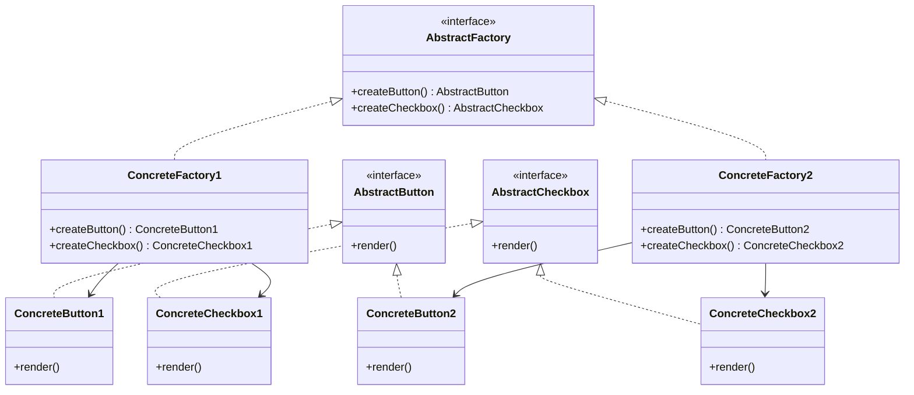
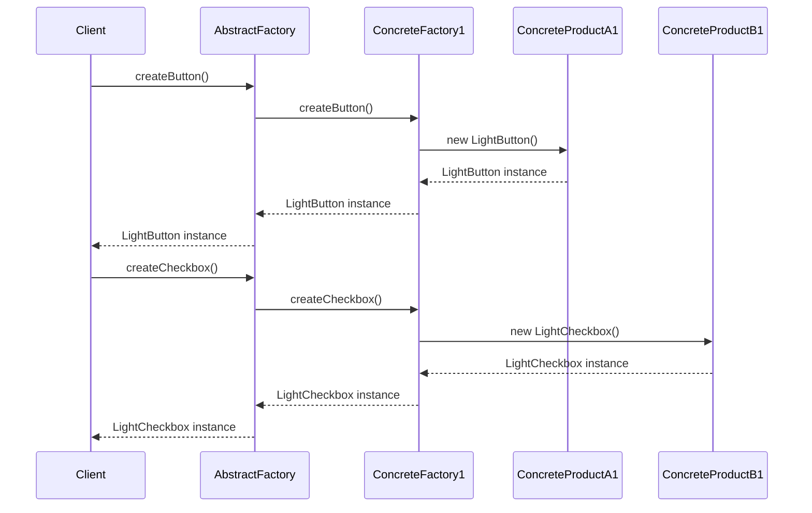

## 4.3 Abstract Factory Pattern

The Abstract Factory Pattern is a creational design pattern that provides an interface for creating families of related or dependent objects without specifying their concrete classes. This pattern is particularly useful in scenarios where a system must be independent of how its objects are created, composed, and represented. Let's delve into the intricacies of this pattern and explore how it can be effectively implemented in TypeScript.

### Understanding the Abstract Factory Pattern

The Abstract Factory Pattern is designed to solve the problem of creating related objects that must be used together, ensuring that the system remains flexible and scalable. By abstracting the creation process, the pattern allows for the easy interchangeability of product families, promoting consistency and adherence to the Open/Closed Principle, which states that software entities should be open for extension but closed for modification.

#### Problem Statement

Consider a scenario where you are developing a user interface library that supports multiple themes, such as light and dark modes. Each theme requires a consistent set of UI components, like buttons, text fields, and checkboxes. The challenge is to create these components in a way that allows for easy switching between themes without altering the client code.

### Key Participants in the Abstract Factory Pattern

The Abstract Factory Pattern involves several key participants, each playing a crucial role in the pattern's structure:

- **AbstractFactory**: An interface with methods for creating abstract products. It declares a set of methods for creating each of the abstract products.

- **ConcreteFactory**: Implements the creation methods for specific product families. Each factory corresponds to a specific variant of products.

- **AbstractProduct**: Interfaces or abstract classes for products. These define the operations that all concrete products must implement.

- **ConcreteProduct**: Specific implementations of products. Each product variant is implemented as a separate class.

- **Client**: Uses only the interfaces declared by `AbstractFactory` and `AbstractProduct`. It is decoupled from the concrete classes and relies on the factory to create the products.

### Diagrammatic Representation

To better understand the relationships between these participants, let's visualize the Abstract Factory Pattern using a class diagram:



### Implementing the Abstract Factory Pattern in TypeScript

Let's implement the Abstract Factory Pattern in TypeScript by creating a UI component library that supports different themes.

#### Step 1: Define Abstract Products

First, we define the abstract products, which are the interfaces for the UI components.

```typescript
// AbstractProductA
interface Button {
    render(): void;
}

// AbstractProductB
interface Checkbox {
    render(): void;
}
```

#### Step 2: Create Concrete Products

Next, we implement the concrete products for each theme.

```typescript
// ConcreteProductA1
class LightButton implements Button {
    render(): void {
        console.log("Rendering a light-themed button.");
    }
}

// ConcreteProductA2
class DarkButton implements Button {
    render(): void {
        console.log("Rendering a dark-themed button.");
    }
}

// ConcreteProductB1
class LightCheckbox implements Checkbox {
    render(): void {
        console.log("Rendering a light-themed checkbox.");
    }
}

// ConcreteProductB2
class DarkCheckbox implements Checkbox {
    render(): void {
        console.log("Rendering a dark-themed checkbox.");
    }
}
```

#### Step 3: Define the Abstract Factory

We then define the abstract factory interface, which declares methods for creating each of the abstract products.

```typescript
interface UIComponentFactory {
    createButton(): Button;
    createCheckbox(): Checkbox;
}
```

#### Step 4: Implement Concrete Factories

Now, we implement the concrete factories for each theme.

```typescript
// ConcreteFactory1
class LightThemeFactory implements UIComponentFactory {
    createButton(): Button {
        return new LightButton();
    }

    createCheckbox(): Checkbox {
        return new LightCheckbox();
    }
}

// ConcreteFactory2
class DarkThemeFactory implements UIComponentFactory {
    createButton(): Button {
        return new DarkButton();
    }

    createCheckbox(): Checkbox {
        return new DarkCheckbox();
    }
}
```

#### Step 5: Implement the Client

Finally, we implement the client, which uses the abstract factory to create the products.

```typescript
class Application {
    private button: Button;
    private checkbox: Checkbox;

    constructor(factory: UIComponentFactory) {
        this.button = factory.createButton();
        this.checkbox = factory.createCheckbox();
    }

    renderUI(): void {
        this.button.render();
        this.checkbox.render();
    }
}

// Usage
const lightFactory = new LightThemeFactory();
const darkFactory = new DarkThemeFactory();

const lightApp = new Application(lightFactory);
lightApp.renderUI();

const darkApp = new Application(darkFactory);
darkApp.renderUI();
```

### Promoting Consistency and Supporting the Open/Closed Principle

The Abstract Factory Pattern promotes consistency among products by ensuring that related objects are created together. This is particularly important in scenarios where the products must work seamlessly with each other, such as in UI libraries or document processing systems.

Moreover, the pattern supports the Open/Closed Principle by allowing new product families to be added without modifying existing code. This is achieved by introducing new concrete factories and products, which can be seamlessly integrated into the system.

### Try It Yourself

To deepen your understanding of the Abstract Factory Pattern, try modifying the code examples to add a new theme, such as a "High Contrast" theme. Implement the necessary concrete products and factory, and update the client code to use the new theme.

### Visualizing the Abstract Factory Pattern in Action

Let's visualize the process of creating UI components using the Abstract Factory Pattern with a sequence diagram:



### Knowledge Check

- **Question**: What is the primary benefit of using the Abstract Factory Pattern?
  - **Answer**: It provides an interface for creating families of related objects without specifying their concrete classes, promoting consistency and flexibility.

- **Question**: How does the Abstract Factory Pattern support the Open/Closed Principle?
  - **Answer**: By allowing new product families to be added without modifying existing code, adhering to the principle of being open for extension but closed for modification.

### Embrace the Journey

Remember, mastering design patterns like the Abstract Factory Pattern is a journey. As you continue to explore and experiment with these patterns, you'll gain deeper insights into creating flexible, scalable, and maintainable software systems. Keep experimenting, stay curious, and enjoy the journey!

## Quiz Time!



### What is the main purpose of the Abstract Factory Pattern?

- [x] To provide an interface for creating families of related objects without specifying their concrete classes.
- [ ] To create a single instance of a class.
- [ ] To allow objects to change their behavior when their internal state changes.
- [ ] To encapsulate a request as an object.

> **Explanation:** The Abstract Factory Pattern is designed to provide an interface for creating families of related or dependent objects without specifying their concrete classes.

### Which participant in the Abstract Factory Pattern is responsible for implementing the creation methods for specific product families?

- [ ] AbstractFactory
- [x] ConcreteFactory
- [ ] AbstractProduct
- [ ] Client

> **Explanation:** The ConcreteFactory implements the creation methods for specific product families.

### How does the Abstract Factory Pattern promote consistency among products?

- [x] By ensuring that related objects are created together.
- [ ] By using a single instance of a class.
- [ ] By allowing objects to change their behavior.
- [ ] By encapsulating a request as an object.

> **Explanation:** The Abstract Factory Pattern promotes consistency by ensuring that related objects are created together, which is particularly important in scenarios where the products must work seamlessly with each other.

### What is the role of the Client in the Abstract Factory Pattern?

- [x] To use only the interfaces declared by AbstractFactory and AbstractProduct.
- [ ] To implement the creation methods for specific product families.
- [ ] To define the operations that all concrete products must implement.
- [ ] To encapsulate a request as an object.

> **Explanation:** The Client in the Abstract Factory Pattern uses only the interfaces declared by AbstractFactory and AbstractProduct, ensuring it is decoupled from the concrete classes.

### Which principle does the Abstract Factory Pattern support by allowing new product families to be added without modifying existing code?

- [x] Open/Closed Principle
- [ ] Single Responsibility Principle
- [ ] Liskov Substitution Principle
- [ ] Interface Segregation Principle

> **Explanation:** The Abstract Factory Pattern supports the Open/Closed Principle by allowing new product families to be added without modifying existing code, adhering to the principle of being open for extension but closed for modification.

### In the Abstract Factory Pattern, what is the relationship between AbstractFactory and ConcreteFactory?

- [x] AbstractFactory is an interface, and ConcreteFactory implements it.
- [ ] ConcreteFactory is an interface, and AbstractFactory implements it.
- [ ] Both are interfaces.
- [ ] Both are concrete classes.

> **Explanation:** In the Abstract Factory Pattern, AbstractFactory is an interface, and ConcreteFactory implements it to provide specific product creation methods.

### What is the benefit of using interfaces or abstract classes for products in the Abstract Factory Pattern?

- [x] They define the operations that all concrete products must implement.
- [ ] They provide a single instance of a class.
- [ ] They allow objects to change their behavior.
- [ ] They encapsulate a request as an object.

> **Explanation:** Using interfaces or abstract classes for products in the Abstract Factory Pattern defines the operations that all concrete products must implement, ensuring consistency and flexibility.

### Which of the following is NOT a participant in the Abstract Factory Pattern?

- [ ] AbstractFactory
- [ ] ConcreteFactory
- [ ] AbstractProduct
- [x] Singleton

> **Explanation:** Singleton is not a participant in the Abstract Factory Pattern. The pattern involves AbstractFactory, ConcreteFactory, AbstractProduct, ConcreteProduct, and Client.

### How does the Abstract Factory Pattern ensure that a system is independent of how its objects are created?

- [x] By providing an interface for creating families of related objects without specifying their concrete classes.
- [ ] By using a single instance of a class.
- [ ] By allowing objects to change their behavior.
- [ ] By encapsulating a request as an object.

> **Explanation:** The Abstract Factory Pattern ensures that a system is independent of how its objects are created by providing an interface for creating families of related objects without specifying their concrete classes.

### True or False: The Abstract Factory Pattern can be used to create a single instance of a class.

- [ ] True
- [x] False

> **Explanation:** False. The Abstract Factory Pattern is not intended for creating a single instance of a class. It is designed to provide an interface for creating families of related objects.


